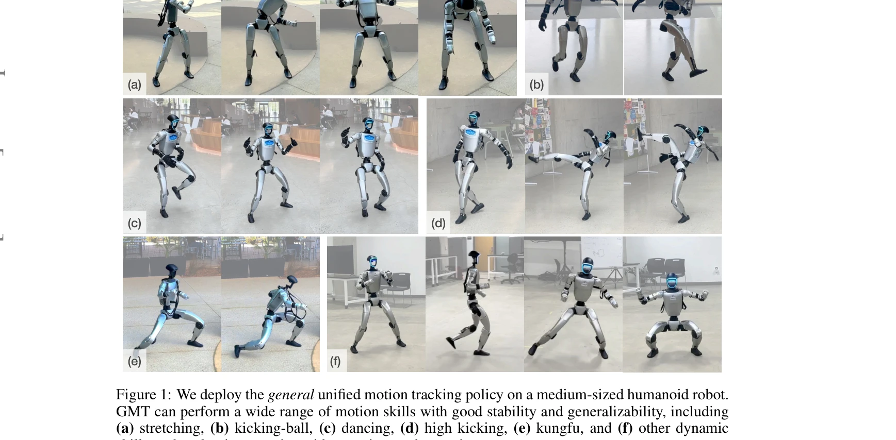

# GMT: General Motion Tracking for Humanoid Whole-Body Control

> **저자**: Zixuan Chen, Mazeyu Ji, Xuxin Cheng, Xuanbin Peng, Xue Bin Peng, Xiaolong Wang | **날짜**: 2025-06-17 | **URL**: [https://arxiv.org/abs/2506.14770](https://arxiv.org/abs/2506.14770)

---

## Essence

*Figure 3: An overview of GMT. Here gt denotes the motion target frame, ot denotes proprioceptive*

GMT는 Adaptive Sampling과 Motion Mixture-of-Experts 아키텍처를 결합하여 휴머노이드 로봇이 다양한 전신 동작을 단일 통합 정책으로 추적할 수 있도록 하는 프레임워크이다.

## Motivation

- **Known**: 기존 연구들은 부분 관측성, 하드웨어 제약, 불균형 데이터 분포 등을 개별적으로 해결했으나, 통합된 일반 전신 동작 추적 컨트롤러는 개발되지 못했다.
- **Gap**: 기존 방법들은 제한된 데이터셋, 복잡한 동작 학습의 어려움, 모델 표현력 부족 등으로 인해 diverse하고 high-fidelity한 전신 동작 추적을 달성하지 못했다.
- **Why**: 휴머노이드 로봇이 다양한 인간 유사 동작을 수행할 수 있도록 하는 것은 일반 목적의 휴머노이드 로봇 개발을 위한 핵심 기초이다.
- **Approach**: GMT는 teacher-student 프레임워크 위에 Adaptive Sampling으로 불균형 데이터를 해결하고 Motion MoE 아키텍처로 모델 표현력을 향상시킨다. 또한 동작 입력 설계와 데이터 큐레이션을 통해 부분 관측성과 하드웨어 제약을 동시에 처리한다.

## Achievement

*Figure 1: We deploy the general unified motion tracking policy on a medium-sized humanoid robot.*

- **Diverse motion repertoire**: 단일 통합 정책으로 stretching, kicking, dancing, high kicking, kung fu, boxing, running 등 다양한 기본 및 복잡한 동작 수행
- **State-of-the-art performance**: AMASS 데이터셋(8925개 필터링된 클립)을 활용한 광범위한 동작에서 최고 성능 달성
- **Real-world deployment**: 중형 휴머노이드 로봇에서 안정적이고 일반화 가능한 실제 배포 성공
- **Comprehensive comparison**: ExBody2, HumanPlus, OmniH2O 등 기존 방법 대비 단일 정책, 전신 제어, 다양성 측면에서 우수성 입증

## How

*Figure 3: An overview of GMT. Here gt denotes the motion target frame, ot denotes proprioceptive*

- **Adaptive Sampling**: 훈련 중 easy 및 difficult 동작을 자동으로 균형있게 샘플링하여 불균형한 mocap 데이터 분포 문제 해결
- **Motion Mixture-of-Experts (MoE)**: gating network를 통해 동작 매니폴드의 다양한 영역에 대한 전문화 달성 및 모델 표현력 증대
- **Teacher-Student framework**: PPO로 privileged information을 활용한 teacher policy 훈련 후 DAgger를 통해 student policy를 행동 복제로 훈련
- **Motion input design**: 동작 target frame을 CNN으로 인코딩하여 시간적 의존성 및 복잡한 동작 구분 능력 향상
- **Dataset curation**: AMASS 데이터셋에서 로봇이 실행 불가능한 동작(back-flip, rolling 등)을 필터링하고 토크 제약을 고려한 속도 조정

## Originality

- **Adaptive Sampling의 혁신성**: 단순 random clipping 대신 추적 오류를 기반으로 동적으로 샘플링 난이도를 조정하는 방식은 new 접근
- **Motion MoE 통합**: 기존 MoE 개념을 동작 추적 문제에 맞게 설계하여 각 전문가가 특정 동작 타입에 특화되도록 구성
- **포괄적인 문제 해결**: 부분 관측성, 하드웨어 제약, 데이터 불균형, 모델 표현력을 통합적으로 다루는 framework 제시
- **대규모 실제 로봇 실험**: 시뮬레이션뿐 아니라 실제 중형 휴머노이드에서 광범위한 동작의 성능 검증

## Limitation & Further Study

- **부분 관측성의 근본적 한계**: teacher-student 프레임워크를 사용하지만 여전히 실제 배포 시 관측 오류가 누적될 가능성
- **하드웨어 특이성**: 특정 로봇 플랫폼에서 훈련된 정책의 다른 humanoid 로봇으로의 일반화 정도 미명시
- **동작 데이터셋 의존성**: 8925개의 필터링된 클립이 여전히 특정 동작 카테고리에 편향되어 있을 가능성
- **추론 복잡도**: Motion MoE 아키텍처의 계산 비용 및 실시간 제어에서의 latency 미분석
- **후속 연구 방향**: (1) 더 작은 로봇 플랫폼으로의 확장성 검증, (2) 손과 발가락 같은 세밀한 제어 통합, (3) sim-to-real transfer에서의 domain randomization 강화

## Evaluation

- Novelty: 4/5
- Technical Soundness: 4/5
- Significance: 4/5
- Clarity: 4/5
- Overall: 4/5

**총평**: GMT는 Adaptive Sampling과 Motion MoE를 통해 휴머노이드 로봇의 일반 전신 동작 추적의 근본적인 문제들을 효과적으로 해결하며, 실제 로봇 배포를 통해 기술의 실용성을 입증한 우수한 연구이다.

## Related Papers

- 🔄 다른 접근: [[papers/1456_HOVER_Versatile_Neural_Whole-Body_Controller_for_Humanoid_Ro/review]] — 두 논문 모두 통합된 전신 제어기를 제안하지만 GMT는 Mixture-of-Experts를, HOVER는 policy distillation을 사용하는 차이가 있다.
- 🔗 후속 연구: [[papers/1414_General_Humanoid_Whole-Body_Control_via_Pretraining_and_Fast/review]] — GMT의 Adaptive Sampling과 Motion MoE는 General Humanoid Whole-Body Control의 일반적 제어 패러다임을 구체적으로 구현한다.
- 🏛 기반 연구: [[papers/1365_EGM_Efficiently_Learning_General_Motion_Tracking_Policy_for/review]] — GMT의 기본 motion tracking 개념과 방법론은 EGM의 general motion tracking policy에서 영감을 받았다.
- 🧪 응용 사례: [[papers/1249_A_Unified_and_General_Humanoid_Whole-Body_Controller_for_Ver/review]] — GMT의 전신 동작 추적에서 통합 제어기의 보행과 조작 통합 기능이 적용된다
- 🏛 기반 연구: [[papers/1254_AdaMimic_Towards_Adaptable_Humanoid_Control_via_Adaptive_Mot/review]] — whole-body motion tracking의 기본 프레임워크를 제공하는 기반 연구다
- 🏛 기반 연구: [[papers/1265_AMO_Adaptive_Motion_Optimization_for_Hyper-Dexterous_Humanoi/review]] — 전신 모션 추적과 제어의 일반화 가능한 네트워크 설계 기반을 제공한다
- 🔄 다른 접근: [[papers/1456_HOVER_Versatile_Neural_Whole-Body_Controller_for_Humanoid_Ro/review]] — 두 논문 모두 통합 제어기를 제안하지만, HOVER는 policy distillation을, GMT는 Mixture-of-Experts를 사용한다.
- 🔗 후속 연구: [[papers/1509_KungfuBot_Physics-Based_Humanoid_Whole-Body_Control_for_Lear/review]] — KungfuBot의 고속 동작 모방은 GMT의 adaptive motion tracking을 극한 동작 영역으로 확장한다.
- 🔄 다른 접근: [[papers/1510_KungfuBot2_Learning_Versatile_Motion_Skills_for_Humanoid_Who/review]] — GMT와 동일하게 휴머노이드 전신 제어를 위한 일반화된 모션 트래킹 시스템을 제안하지만 OMoE 아키텍처로 차별화됨
- 🔗 후속 연구: [[papers/1415_General_Motion_Tracking_for_Humanoid_Whole-Body_Control/review]] — GMT의 전신 제어 방법론이 GMR의 동작 리타게팅 기술을 실제 휴머노이드 전신 동작 추적으로 확장한 구현체이다
- 🏛 기반 연구: [[papers/1396_FastTD3_Simple_Fast_and_Capable_Reinforcement_Learning_for_H/review]] — GMT의 general motion tracking이 FastTD3에서 달성하고자 하는 whole-body control의 이론적 기반
