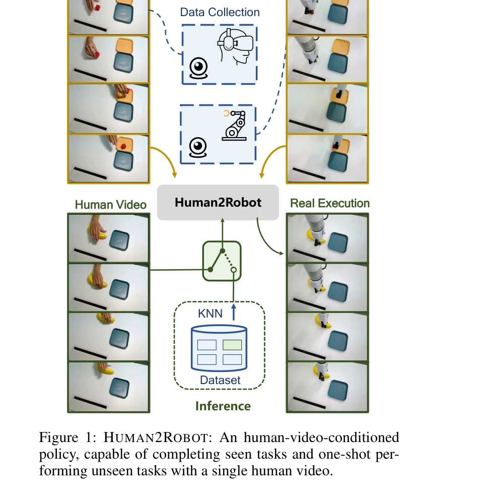
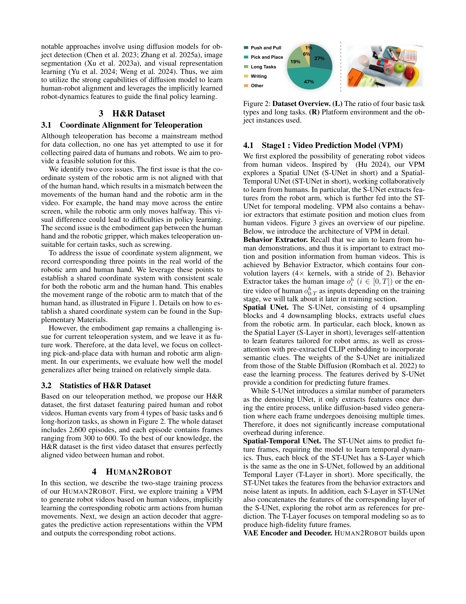
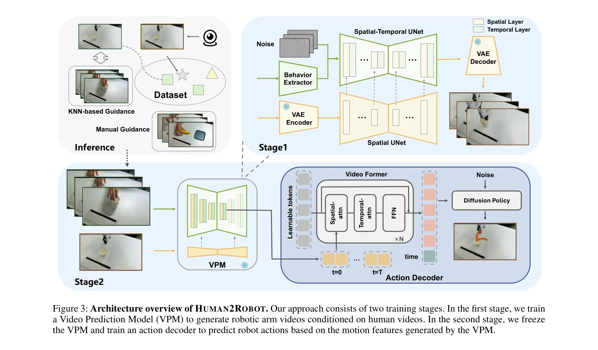

# Human2Robot: Learning Robot Actions from Paired Human-Robot Videos

> **저자**: Sicheng Xie, Haidong Cao, Zejia Weng, Zhen Xing, Haoran Chen, Shiwei Shen, Jiaqi Leng, Zuxuan Wu, Yu-Gang Jiang | **날짜**: 2025-02-23 | **URL**: [https://arxiv.org/abs/2502.16587](https://arxiv.org/abs/2502.16587)

---

## Essence

*Figure 1: HUMAN2ROBOT: An human-video-conditioned*

VR 원격조종으로 수집한 정밀하게 정렬된 인간-로봇 비디오 쌍 데이터셋 H&R과 이를 활용한 Human2Robot 프레임워크를 제시하여, Video Prediction Model을 통해 인간 동작으로부터 로봇 동작을 프레임 수준에서 학습하고 미학습 태스크에 일반화한다.

## Motivation

- **Known**: 기존 인간-로봇 학습 방법들은 대략적으로 정렬된 비디오 쌍에 의존하여 태스크 수준의 전역 특징만 학습하고, self-supervised 또는 contrastive learning을 사용하여 전체 비디오를 고정 길이 임베딩으로 압축한다.
- **Gap**: 프레임 수준의 세밀한 정렬 데이터 부족과 이를 활용할 수 없는 방법론 간의 악순환으로 인해, 복잡한 조작과 미학습 태스크 일반화에 필수적인 프레임 레벨 역학(frame-level dynamics)을 학습하지 못한다.
- **Why**: 로봇이 인간 시연을 통해 학습한 후 훈련 중 보지 못한 새로운 태스크를 수행할 수 있게 하려면, 어떻게 행동을 수행하는지에 대한 세밀한 시간적 역학을 이해해야 한다.
- **Approach**: VR 원격조종 시스템을 활용하여 인간 손과 로봇 팔의 좌표계를 정렬하는 방식으로 2,600 에피소드의 완벽하게 동기화된 H&R 데이터셋을 수집하고, 조건부 video generation 문제로 fine-grained human-robot alignment를 다루는 Human2Robot 프레임워크를 제안한다.

## Achievement

*Figure 2: Dataset Overview. (L) The ratio of four basic task*

- **H&R 데이터셋**: 4가지 기본 태스크와 6가지 장시간 태스크에 걸쳐 정밀하게 동기화된 인간 손과 로봇 팔의 비디오 쌍 2,600 에피소드 수집
- **Human2Robot 프레임워크**: Stable Diffusion 기반 Video Prediction Model과 decoupled action decoder를 활용한 2단계 학습 프로세스로 미학습 포지션, 객체, 태스크 카테고리에 대한 일반화 달성
- **일반화 성능**: 보인 태스크에서 높은 성능뿐 아니라 새로운 객체 위치, 외형, 배경, 심지어 완전히 새로운 태스크 유형에 대한 일괏(one-shot) 일반화 시연
- **KNN 기반 추론**: 인간 비디오 입력 없이도 학습된 태스크를 수행할 수 있는 KNN+Human2Robot 방법으로 확장성과 유연성 향상

## How

*Figure 3: Architecture overview of HUMAN2ROBOT. Our approach consists of two training stages. In the first stage, we tra*

- VR 원격조종 시스템의 좌표계 정렬을 통해 인간과 로봇의 3D 움직임 범위를 일치시키는 정밀한 데이터 수집
- Spatial UNet을 이용한 특징 추출과 behavior extractor로 동작 및 위치 인코딩
- Spatial-temporal UNet 아키텍처로 동작과 시간 역학을 명시적으로 모델링하여 리치한 잠재 표현(latent representation) 생성
- Video Prediction Model 학습 후 해당 예측 표현에 조건화된 action decoder 학습으로 효과적인 human-robot alignment 실현
- KNN을 활용하여 테스트 시간에 인간 비디오 없이도 학습된 태스크 수행 가능하도록 구성

## Originality

- VR 원격조종을 데이터 수집이 아닌 완벽하게 정렬된 인간-로봇 쌍 비디오 캡처에 최초로 활용
- Conditional video generation을 human-robot alignment 문제의 핵심 솔루션으로 제시하여 프레임 레벨 동역학 학습 가능하게 함
- Diffusion model 기반 Video Prediction Model을 로봇 동역학 학습의 중간 표현 학습 단계로 도입
- 미학습 태스크 일반화와 인간 비디오 없는 추론을 모두 지원하는 통합 프레임워크 설계

## Limitation & Further Study

- Embodiment gap(인간 손과 로봇 그리퍼의 신체적 차이)으로 인해 나선형 조임 등 특정 태스크는 수집 불가능 - 향후 작업으로 미루어짐
- 평가가 정해진 4가지 기본 태스크와 6가지 장시간 태스크에 제한되어 더 다양한 태스크에 대한 성능은 불명
- Video Prediction Model의 계산 비용과 실제 로봇 제어 환경에서의 지연시간에 대한 논의 부재
- 타 최신 방법들(예: 최근의 end-to-end diffusion policy)과의 정량적 비교 결과 제시 필요
- 데이터 효율성 및 적은 데이터 영역에서의 성능에 대한 분석 누락

## Evaluation

- Novelty: 4/5
- Technical Soundness: 3/5
- Significance: 4/5
- Clarity: 4/5
- Overall: 4/5

**총평**: VR 원격조종을 통한 정밀한 데이터 수집과 conditional video generation 패러다임의 결합으로 인간-로봇 학습의 근본적 한계를 해결한 영향력 있는 연구이다. 다만 embodiment gap 문제의 미해결과 평가 범위의 제한이 실제 적용성을 다소 제약한다.

## Related Papers

- 🔄 다른 접근: [[papers/1372_EgoMimic_Scaling_Imitation_Learning_via_Egocentric_Video/review]] — 둘 다 인간 시연 데이터를 활용하지만 Human2Robot은 paired video에, EgoMimic은 egocentric single view에 중점을 둡니다.
- 🏛 기반 연구: [[papers/1522_RDT-1B_a_Diffusion_Foundation_Model_for_Bimanual_Manipulatio/review]] — massive human video learning의 기반 방법론을 human-robot paired data에 특화하여 적용한 구체적 구현입니다.
- 🔗 후속 연구: [[papers/1566_Masquerade_Learning_from_In-the-wild_Human_Videos_using_Data/review]] — Masquerade의 in-the-wild human video 학습을 human-robot paired setting으로 확장하여 더 정밀한 correspondence learning을 제공합니다.
- 🔗 후속 연구: [[papers/1633_X-VLA_Soft-Prompted_Transformer_as_Scalable_Cross-Embodiment/review]] — Human2Robot의 cross-embodiment 학습을 soft prompt 기법으로 더욱 효율적이고 확장 가능하게 발전시켰다
- 🧪 응용 사례: [[papers/1606_Vision-Language_Foundation_Models_as_Effective_Robot_Imitato/review]] — Human2Robot과 함께 인간-로봇 행동 전이에서 vision-language 모델의 활용 방안을 보완적으로 제시한다
- 🔗 후속 연구: [[papers/1357_Dexterous_Manipulation_through_Imitation_Learning_A_Survey/review]] — Human-robot 데이터 쌍을 활용한 robot action 학습이 dexterous manipulation의 imitation learning 연구로 확장된다.
- 🏛 기반 연구: [[papers/1404_From_Experts_to_a_Generalist_Toward_General_Whole-Body_Contr/review]] — General motion tracking for humanoid이 BumbleBee의 whole-body control 달성에 필요한 기술적 기반을 제공한다.
- 🔄 다른 접근: [[papers/1460_Human-Humanoid_Robots_Cross-Embodiment_Behavior-Skill_Transf/review]] — 둘 다 human-robot transfer이지만 Cross-Embodiment는 UDH 기반 adversarial learning에, Human2Robot은 paired video learning에 중점을 둡니다.
