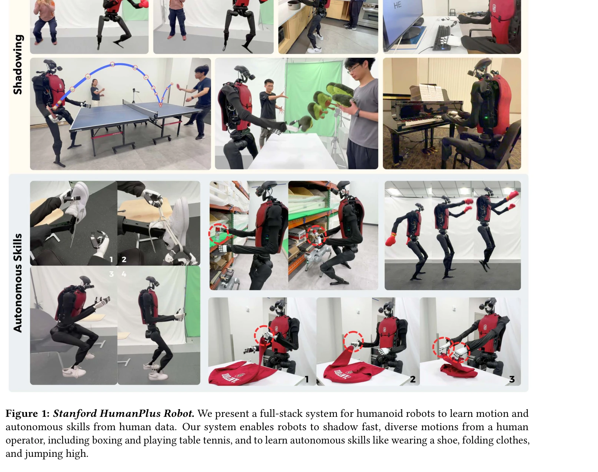
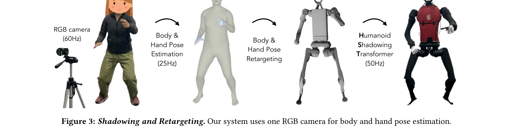

# HumanPlus: Humanoid Shadowing and Imitation from Humans

> **저자**: Zipeng Fu, Qingqing Zhao, Qi Wu, Gordon Wetzstein, Chelsea Finn | **날짜**: 2024-06-15 | **URL**: [https://arxiv.org/abs/2406.10454](https://arxiv.org/abs/2406.10454)

---

## Essence

*Figure 1: Stanford HumanPlus Robot. We present a full-stack system for humanoid robots to learn motion and*

휴머노이드 로봇이 인간의 모션 데이터와 RGB 카메라만으로 실시간 shadowing 및 자율 skill 학습을 수행하는 풀스택 시스템을 제시한다.

## Motivation

- **Known**: 휴머노이드 로봇은 인간과 유사한 형태로 인해 대규모 인간 데이터 활용이 가능하며, RL을 통한 저수준 정책 학습과 sim-to-real 전환이 다족 로봇에서 성공한 바 있다.
- **Gap**: 휴머노이드의 높은 차원의 제어 복잡성, 인간과의 형태학적 차이, 그리고 egocentric vision에서의 자율 skill 학습을 위한 데이터 파이프라인이 부재하다.
- **Why**: 일반목적 휴머노이드 로봇 개발을 위해서는 복잡한 조작 및 이동 skill을 효율적으로 학습하는 방법이 필수적이며, 이는 로봇의 실용화와 확장성을 결정한다.
- **Approach**: AMASS 데이터셋 기반의 Humanoid Shadowing Transformer로 저수준 정책을 학습하고, 이를 통해 RGB 카메라만으로 인간 모션을 실시간 추적한 후, 수집된 데이터로 Humanoid Imitation Transformer를 사용해 vision 기반 skill policy를 학습한다.

## Achievement

*Figure 1: Stanford HumanPlus Robot. We present a full-stack system for humanoid robots to learn motion and*

- **Shadowing 시스템**: 단일 RGB 카메라로 인간의 신체 및 손 모션을 실시간으로 33-DoF 휴머노이드에 전달하는 저비용 teleoperation 시스템 구현
- **Task-agnostic 저수준 정책**: 40시간 인간 모션 데이터(AMASS)로 훈련된 Humanoid Shadowing Transformer가 zero-shot으로 실제 환경에 전환
- **효율적 학습**: 최대 40가지 시연으로 신발 신기-일어서기-보행, 창고 물체 언로드, 옷 접기, 타이핑 등의 tasks를 60-100% 성공률로 자율 완수
- **통합 파이프라인**: shadowing을 통한 데이터 수집과 behavior cloning을 결합하여 현실 환경에서 복합 manipulation 및 locomotion skill 습득

## How

*Figure 3: Shadowing and Retargeting. Our system uses one RGB camera for body and hand pose estimation.*

- AMASS 데이터셋의 인간 pose를 휴머노이드 pose로 retarget한 후 transformer 기반 decoder-only 아키텍처로 저수준 정책 학습
- 실시간 body & hand pose estimation 알고리즘(58Hz)으로 인간 모션을 감지하고 retargeting을 통해 Humanoid Shadowing Transformer 입력으로 변환
- Shadowing 중 binocular RGB 카메라로 egocentric vision 데이터 수집
- 수집 데이터로 supervised behavior cloning 수행하여 이미지 피처 공간에서의 forward dynamics 예측을 통해 정규화되는 Humanoid Imitation Transformer 훈련

## Originality

- 단순 RGB 카메라만으로 전신 teleoperation을 가능하게 하여 기존의 고가의 mocap, exoskeleton, VR 장치 의존성 제거
- 대규모 인간 모션 데이터(AMASS)를 활용한 task-agnostic 저수준 정책으로 다양한 skill에 대응 가능한 범용성 확보
- Forward dynamics 예측을 imitation learning에 통합하여 egocentric vision 기반 고차원 제어의 overfitting 문제 해결
- shadowing과 behavior cloning의 통합 파이프eline으로 현실 환경에서의 효율적 데이터 수집 및 skill 학습 실현

## Limitation & Further Study

- 40가지 시연만으로 학습되므로 더 복잡하거나 정밀한 조작 task의 일반화 능력 미검증
- 33-DoF 휴머노이드의 특정 하드웨어 설정에 최적화된 것으로, 다른 형태의 휴머노이드로의 전환 가능성 불명확
- Pose retargeting 과정에서 발생하는 휴머노이드-인간 형태 차이를 완전히 극복하지 못할 가능성
- 후속 연구: 다중 시점 RGB 카메라 활용, 더 정교한 hand manipulation을 위한 tactile feedback 통합, 다양한 휴머노이드 플랫폼으로의 확장성 검증 필요

## Evaluation

- Novelty: 4/5
- Technical Soundness: 3/5
- Significance: 4/5
- Clarity: 4/5
- Overall: 4/5

**총평**: 이 논문은 RGB 카메라 기반 실시간 shadowing과 효율적 imitation learning을 통합하여 휴머노이드 로봇의 자율 skill 습득을 실현한 실질적 기여를 보여준다. 기존 고가 teleoperation 시스템 대체와 대규모 인간 데이터 활용이라는 측면에서 휴머노이드 개발의 새로운 방향을 제시한다.

## Related Papers

- 🏛 기반 연구: [[papers/1370_EgoHumanoid_Unlocking_In-the-Wild_Loco-Manipulation_with_Rob/review]] — HumanPlus의 RGB 카메라 기반 실시간 shadowing과 자율 학습 시스템은 EgoHumanoid의 로봇 없는 인간 시연 활용 프레임워크의 기술적 기반을 제공합니다.
- 🔄 다른 접근: [[papers/1417_Generalizable_Humanoid_Manipulation_with_3D_Diffusion_Polici/review]] — HumanPlus의 RGB 카메라만을 활용한 단순한 센서 구성과 3D LiDAR 플랫폼 기반의 복합 센서 시스템은 휴머노이드 인지를 위한 서로 다른 접근법입니다.
- 🏛 기반 연구: [[papers/1314_Commanding_Humanoid_by_Free-form_Language_A_Large_Language_A/review]] — HumanPlus의 인간-로봇 모방 학습 방법론이 Humanoid-LLA의 물리적으로 실행 가능한 동작 생성에 기반 기술을 제공한다
- 🔗 후속 연구: [[papers/1342_DexUMI_Using_Human_Hand_as_the_Universal_Manipulation_Interf/review]] — UniDex의 범용적 손 조작 프레임워크는 HumanPlus의 RGB 카메라 기반 실시간 학습 시스템과 결합하여 더욱 포괄적인 humanoid 제어가 가능합니다.
- 🔗 후속 연구: [[papers/1370_EgoHumanoid_Unlocking_In-the-Wild_Loco-Manipulation_with_Rob/review]] — EgoHumanoid의 robot-free egocentric 시연 수집 방식은 HumanPlus의 RGB 카메라 기반 실시간 shadowing 시스템과 결합하여 더욱 효과적인 데이터 수집이 가능합니다.
- 🔄 다른 접근: [[papers/1417_Generalizable_Humanoid_Manipulation_with_3D_Diffusion_Polici/review]] — 3D LiDAR 기반 플랫폼과 3D Diffusion Policy를 사용한 일반화 가능한 조작과 HumanPlus의 RGB 카메라만을 활용한 접근법은 센서 모달리티 측면에서 대조적인 방법론입니다.
- ⚖️ 반론/비판: [[papers/1484_HumanPlus_Humanoid_Shadowing_and_Imitation_from_Humans/review]] — 동일한 HumanPlus 시스템이지만 다른 관점이나 개선사항을 제시할 수 있다
- 🔗 후속 연구: [[papers/1407_FRoM-W1_Towards_General_Humanoid_Whole-Body_Control_with_Lan/review]] — HumanPlus의 인간 모방 학습이 FRoM-W1의 휴머노이드 제어 프레임워크를 실제 인간 데이터로부터 학습하는 방향으로 확장한다
- 🔗 후속 연구: [[papers/1599_Opening_the_Sim-to-Real_Door_for_Humanoid_Pixel-to-Action_Po/review]] — HumanPlus의 인간 shadowing 방법론을 door opening과 같은 specific task로 확장한 연구
