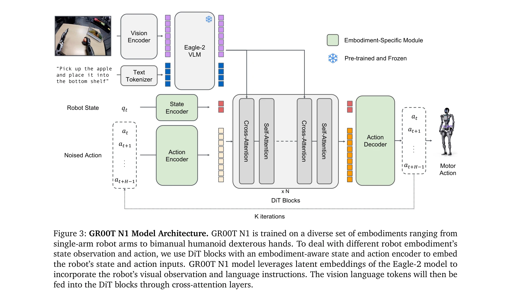

# GR00T N1: An Open Foundation Model for Generalist Humanoid Robots

> **저자**:  | **날짜**: 2026-03-31 | **URL**: [https://arxiv.org/abs/2503.14734](https://arxiv.org/abs/2503.14734)

---

## Essence

*Figure 2: GR00T N1 Model Overview. Our model is a Vision-Language-Action (VLA) model that adopts a*

GR00T N1은 Vision-Language-Action (VLA) 모델로서 VLM 기반 추론 모듈(System 2)과 Diffusion Transformer 기반 행동 생성 모듈(System 1)을 결합한 이중 시스템 아키텍처를 갖춘 휴머노이드 로봇용 오픈 파운데이션 모델이다. 웹 데이터, 인간 영상, 합성 데이터, 실제 로봇 궤적으로 구성된 데이터 피라미드를 통해 학습하여 단일 가중치로 다양한 로봇 구현체의 조작 행동을 생성한다.

## Motivation

- **Known**: 최근 humanoid 로봇 하드웨어의 발전과 foundation model의 성공이 로봇 자율성 개발의 가능성을 보여주었다. 그러나 robot foundation model 학습을 위한 대규모 일관된 데이터셋이 부족하며, 서로 다른 로봇 구현체들 간의 데이터 호환성 문제(data islands)가 존재한다.
- **Gap**: 기존의 cross-embodied learning 접근법도 로봇 구현체의 다양성으로 인해 일관된 데이터셋 구성에 어려움이 있다. 다양한 출처의 action-less 데이터를 효과적으로 활용하고 여러 로봇 구현체를 단일 모델로 통합하는 방법론이 부족하다.
- **Why**: 일반 목적 로봇의 개발을 위해서는 대규모의 다양한 데이터로 학습된 generalist 모델이 필수적이며, 이는 실제 환경의 변수성을 견디고 새로운 작업의 빠른 학습을 가능하게 한다. 오픈 파운데이션 모델의 공개는 로봇 학습 커뮤니티의 진전을 가속화할 수 있다.
- **Approach**: data pyramid 구조를 통해 웹 데이터/인간 영상 → 합성 데이터 → 실제 로봇 데이터로 계층화하고, action-less 데이터에 대해 latent-action codebook과 inverse dynamics model을 활용한 pseudo-action 추론으로 일관된 데이터셋을 구성한다. System 2 (Eagle-2 VLM)와 System 1 (DiT flow-matching)을 end-to-end로 함께 학습하여 추론과 행동 생성을 통합한다.

## Achievement

*Figure 1: Data Pyramid for Robot Foundation Model*

- **이중 시스템 VLA 아키텍처**: Vision-Language Model 기반 추론 모듈과 Diffusion Transformer 기반 행동 생성 모듈을 긴밀하게 결합하여 실시간 폐루프 제어(120Hz) 가능
- **다중 구현체 지원**: 단일 모델 가중치로 single-arm, bimanual, humanoid 로봇의 조작 행동 생성 가능
- **시뮬레이션 성능**: 표준 벤치마크(simulation)에서 state-of-the-art imitation learning 기준을 초과
- **실제 로봇 검증**: Fourier GR-1 humanoid 로봇에서 언어 조건부 양팔 조작 작업 성공 및 높은 데이터 효율성 달성
- **오픈 소스 공개**: 모델 체크포인트(GR00T-N1-2B), 학습 데이터, 시뮬레이션 벤치마크를 공개하여 커뮤니티 접근성 제공

## How

*Figure 3: GR00T N1 Model Architecture. GR00T N1 is trained on a diverse set of embodiments ranging from*

- Data pyramid 구조: 웹 데이터/인간 영상(대량) → 합성 데이터(중간) → 실제 로봇 데이터(소량, 구체적) 계층화
- Latent-action codebook 학습으로 action-less 데이터(인간 영상)로부터 action 정보 추출
- Inverse dynamics model (IDM) 활용으로 pseudo-action 자동 생성
- Embodiment-specific encoder/decoder로 다양한 로봇의 상이한 state/action 차원 처리
- Eagle-2 Vision-Language Model 기반 VLM backbone에서 image/text 토큰 생성
- Flow-matching을 통한 Diffusion Transformer 학습으로 iterative denoising 기반 action 생성
- Cross-attention 메커니즘으로 VLM 출력 토큰과 robot state/action 토큰의 상호작용
- End-to-end 함께 학습(co-training)으로 System 1과 System 2 간 조율 최적화

## Originality

- **이중 시스템 구조의 신경과학적 영감**: Kahneman의 System 1/2 이론을 로봇 제어에 적용한 구성적 아키텍처
- **데이터 피라미드 전략**: 이질적 데이터 소스를 단순한 혼합이 아닌 체계적 계층 구조로 통합
- **Action 추론 기법**: latent-action codebook과 IDM을 결합한 action-less 데이터 활용 방법
- **Embodiment-aware 설계**: 다양한 로봇 구현체의 가변 차원을 처리하는 encoder/decoder 구조
- **대규모 오픈 소스 공개**: 학습 데이터, 모델 체크포인트, 벤치마크를 공동체에 제공하는 접근

## Limitation & Further Study

- 실제 로봇 실험이 Fourier GR-1에만 제한되어 다양한 humanoid 플랫폼에 대한 일반화 검증 부족
- Action-less 데이터 처리 과정에서 inverse dynamics model 품질이 최종 성능에 미치는 영향 분석 부족
- 시뮬레이션 성능과 실제 로봇 성능의 간극에 대한 상세 분석 및 sim-to-real transfer 전략 미흡
- Data pyramid 계층별 기여도 분석이 제한적으로, 각 계층의 최적 비중에 대한 명확한 가이드라인 부재
- 계산 효율성: 2.2B 파라미터 모델이 L40 GPU에서 63.9ms 지연으로 실시간성에 제약 가능
- **후속 연구 방향**: (1) 다양한 humanoid 로봇 플랫폼에서의 추가 실험, (2) domain gap 감소를 위한 강화 학습 적용, (3) 경량화 및 edge deployment 방안, (4) 복잡한 다단계 작업에 대한 성능 평가

## Evaluation

- Novelty: 4/5
- Technical Soundness: 4/5
- Significance: 4/5
- Clarity: 4/5
- Overall: 4/5

**총평**: GR00T N1은 이중 시스템 아키텍처와 data pyramid 전략을 통해 다양한 로봇 구현체를 통합하는 혁신적인 파운데이션 모델이며, 오픈 소스 공개를 통해 로봇 학습 커뮤니티에 실질적인 기여를 한다. 다만 실제 로봇 검증의 범위 확대와 sim-to-real transfer 메커니즘의 심화가 필요하다.

## Related Papers

- 🔄 다른 접근: [[papers/1421_Helix_A_Vision-Language-Action_Model_for_Generalist_Humanoid/review]] — 같은 GR00T N1이지만 서로 다른 aspect(open foundation vs generalist control)에 초점을 맞춘 다른 버전입니다.
- ⚖️ 반론/비판: [[papers/1510_OpenVLA_An_Open-Source_Vision-Language-Action_Model/review]] — proprietary vs open-source foundation model approach의 대조적 관점을 제시하여 각각의 장단점을 비교할 수 있습니다.
- 🏛 기반 연구: [[papers/1599_Unified_Vision-Language-Action_Model/review]] — unified VLA model의 기본 구조와 training paradigm을 humanoid에 특화하여 구현한 구체적 사례입니다.
- 🔄 다른 접근: [[papers/1421_Helix_A_Vision-Language-Action_Model_for_Generalist_Humanoid/review]] — 같은 GR00T N1 모델이지만 Helix는 generalist control에, 다른 버전은 open foundation model에 초점을 맞춘 변형입니다.
- 🔄 다른 접근: [[papers/1412_GR00T_N1_An_Open_Foundation_Model_for_Generalist_Humanoid_Ro/review]] — 동일한 GR00T N1 모델이지만 다른 논문에서 다루는 접근이나 응용 관점의 차이를 보여준다.
