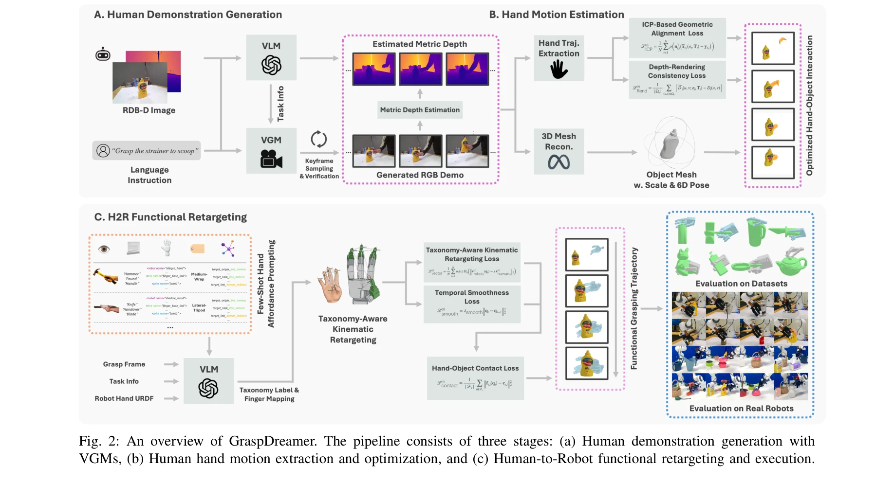
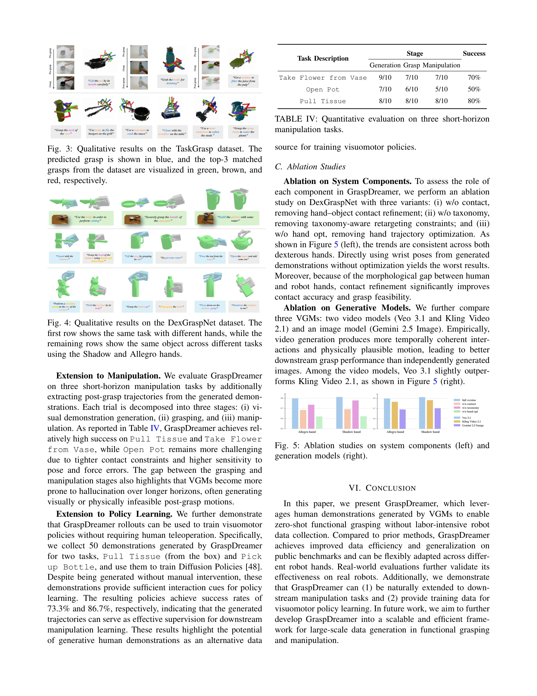

# GraspDreamer: 생성형 인간 시연 기반 기능적 파지 모방 학습

> **저자**:  | **날짜**: 2026-04-08 | **URL**: [https://arxiv.org/abs/2604.07517](https://arxiv.org/abs/2604.07517)

---

## Essence

*Fig. 2: An overview of GraspDreamer. The pipeline consists of three stages: (a) Human demonstration generation with*

Visual Generative Model(VGM)으로 합성한 인간 시연 영상을 통해 실제 데이터 수집 없이 로봇의 기능적 파지를 학습하는 GraspDreamer 프레임워크를 제안한다. VLM 기반 작업 정보 추출, 손 궤적 최적화, 인간-로봇 기능적 재타겟팅의 3단계 파이프라인으로 구성된다.

## Motivation

- **Known**: 기존 기능적 파지 학습은 시뮬레이션 기반 데이터 합성 또는 대규모 인간 시연 데이터 수집에 의존하고 있다. Foundation model을 활용한 최근 방법들도 여전히 sim2real gap 극복을 위해 상당한 규모의 실제 데이터를 필요로 한다.
- **Gap**: 인터넷 규모의 데이터로 사전학습된 VGM이 인간 상호작용의 일반화된 선행지식을 암묵적으로 인코딩하고 있음에도 불구하고, 이를 로봇 파지에 직접 활용하는 방법이 부재하다. 또한 기존 연구들이 특정 로봇 손에만 제한되어 다양한 구현체(embodiment)로의 일반화가 미흡하다.
- **Why**: 기능적 파지는 물체를 단순 들어올리는 것을 넘어 실제 사용 의도에 맞게 파지해야 하므로 일상의 다양한 환경과 물체에 대한 일반화 능력이 필수적이다. 대규모 데이터 수집 없이 효율적으로 학습할 수 있다면 로봇 시스템의 실용성과 확장성이 크게 향상된다.
- **Approach**: VLM을 통해 자연언어 지시로부터 작업, 물체, 부분 정보를 명시적으로 추출한 후, 이를 VGM(Veo 등)에 입력하여 인간 시연 RGB-D 영상을 생성한다. 생성된 영상에서 손 궤적을 추출 및 최적화한 뒤, VLM 기반 손 affordance 추론, taxonomy 인식 kinematic retargeting, 손-물체 접촉 정제를 통해 다양한 로봇 손으로 재타겟팅한다.

## Achievement

*Fig. 3: Qualitative results on the TaskGrasp dataset. The*

- **데이터 효율성**: 실제 functional grasping 데이터 수집 없이 VGM 합성 시연만으로 zero-shot 기능적 파지 성능 달성
- **우수한 일반화 성능**: TaskGrasp(parallel-jaw gripper)와 DexGraspNet(Allegro, Shadow hand) 공개 벤치마크에서 기존 방법 대비 높은 성능과 일반화 능력 입증
- **다중 구현체 지원**: 단일 통합 프레임워크로 다양한 로봇 손에 대한 인간-로봇 기능적 재타겟팅 가능
- **실제 로봇 검증**: Allegro hand와 parallel-jaw gripper의 실제 로봇 평가를 통해 방법론의 실효성 확인
- **확장성**: 다운스트림 조작 작업으로의 자연스러운 확장과 visuomotor policy 학습을 위한 데이터 생성 메커니즘으로도 활용 가능

## How

*Fig. 2: An overview of GraspDreamer. The pipeline consists of three stages: (a) Human demonstration generation with*

- **작업 관련 정보 추출**: VLM에 RGB-D 관찰과 언어 지시를 입력하여 task label T, 관련 물체 O, 부분 분해 P를 순차적으로 추출하여 모호성 제거
- **인간 시연 생성**: VGM(Veo)에 'A human hand grasps the P of O to T' 형식의 프롬프트를 입력하여 RGB-D 영상 시퀀스 생성, VLM 검증을 통한 폐루프 과정으로 hallucination 완화", '**깊이 예측 및 스케일 보정**: Video-Depth-Anything(VDA) 모델로 각 프레임의 metric depth 예측, 단일 이미지 깊이의 스케일 모호성을 인체 크기 정보로 정규화
- **손 궤적 최적화**: 생성된 영상에서 추출한 손 궤적을 시간적 일관성과 물리적 타당성을 고려하여 최적화
- **VLM 기반 손 affordance 추론**: affordance 영역과 기능적 접촉 정보를 VLM으로 추론하여 기능 의도 반영
- **Taxonomy 인식 Kinematic Retargeting**: 인간과 로봇 손의 위상학적 차이를 고려한 체계적 kinematic 재타겟팅으로 물리적 실행 가능성 보장
- **손-물체 접촉 정제**: 최종 파지 구성 생성 시 손-물체 접촉 제약을 추가 정제하여 안정성 향상

## Originality

- **VGM 활용의 혁신적 접근**: 기존의 simulation-first 또는 human-first 데이터 수집 패러다임을 벗어나 internet-scale pre-trained VGM을 인간 시연의 무한 소스로 활용하는 새로운 관점
- **인간 시연을 통합 중간 표현으로 활용**: 로봇 중심(robot-centric) 비디오 생성 대신 인간 중심(human-centric) 시연을 생성함으로써 다양한 로봇 구현체로의 유연한 재타겟팅 가능
- **기능성 중심의 통합 파이프라인**: VLM 기반 affordance 추론, taxonomy 인식 재타겟팅, 접촉 정제를 통합하여 기능적 의도를 명시적으로 보존하는 구조
- **폐루프 검증 메커니즘**: 생성된 시연의 consistency를 VLM으로 검증하는 폐루프 과정으로 생성 품질 보장
- **Zero-shot 기능적 파지**: 실제 기능적 파지 데이터 학습 없이 합성 인간 시연만으로 다중 벤치마크에서 경쟁력 있는 성능 달성

## Limitation & Further Study

- **VGM 생성 품질 의존성**: 합성 인간 시연의 품질이 VGM의 성능에 크게 의존하며, 희귀하거나 특수한 파지 패턴에 대해서는 생성 실패 가능성
- **깊이 예측의 스케일 모호성**: monocular depth estimation의 절대 스케일 모호성을 인체 크기 정보로만 보정하므로 특수한 환경(극단적 원거리, 비표준 물체)에서 오차 누적 가능
- **단순화된 손 모델**: kinematic retargeting에서 hand taxonomy의 단순화로 인한 세밀한 손가락 관절 운동의 손실
- **작업 명시도 요구**: 자연언어 지시가 작업 의도를 충분히 명시해야 하며, 암묵적인 기능적 의도는 포착 어려움
- **접촉 정제의 제한**: 손-물체 접촉 정제가 기하학적 제약에만 기반하므로 미끄러짐, 변형 등 동역학적 요소 미반영
- **후속 연구 방향**: (1) 더 강력한 video generation model 활용으로 생성 품질 향상, (2) 동역학 기반 접촉 최적화 통합, (3) 사용자 피드백을 통한 반복적 시연 개선 메커니즘 개발, (4) 다중모달 입력(촉각, 힘 정보) 통합

## Evaluation

- Novelty: 4/5
- Technical Soundness: 3/5
- Significance: 4/5
- Clarity: 4/5
- Overall: 4/5

**총평**: GraspDreamer는 internet-scale pre-trained VGM을 기능적 파지 학습의 혁신적 데이터 소스로 활용하여 대규모 수집 없는 zero-shot 학습을 달성한 원창적 연구이다. 강력한 실험 검증과 실제 로봇 평가를 바탕으로 로봇 파지의 데이터 효율성 문제에 실질적인 해결책을 제시하는 높은 가치의 작업이다.

## Related Papers

- 🏛 기반 연구: [[papers/1413_GraspVLA_a_Grasping_Foundation_Model_Pre-trained_on_Billion-/review]] — GraspVLA의 합성 데이터 기반 학습이 GraspDreamer의 생성형 시연 활용에 기초가 된다.
- 🔗 후속 연구: [[papers/1354_Dex1B_Learning_with_1B_Demonstrations_for_Dexterous_Manipula/review]] — Dex1B의 대규모 시연 데이터가 GraspDreamer의 합성 영상 생성을 보완한다.
- 🔄 다른 접근: [[papers/1476_Humanoid_World_Models_Open_World_Foundation_Models_for_Human/review]] — MimicPlay도 인간 시연 영상을 통한 장기 모방 학습을 다룬다.
- 🔗 후속 연구: [[papers/1413_GraspVLA_a_Grasping_Foundation_Model_Pre-trained_on_Billion-/review]] — GraspDreamer의 기능적 파지 학습이 GraspVLA의 합성 데이터 기반 학습을 보완한다.
- 🏛 기반 연구: [[papers/1354_Dex1B_Learning_with_1B_Demonstrations_for_Dexterous_Manipula/review]] — GraspDreamer의 생성형 시연 기반 학습이 Dex1B의 시연 데이터 생성 방법론과 연결된다.
