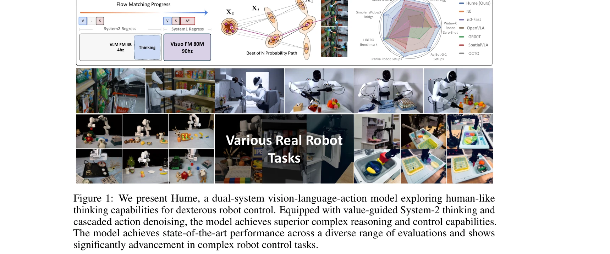
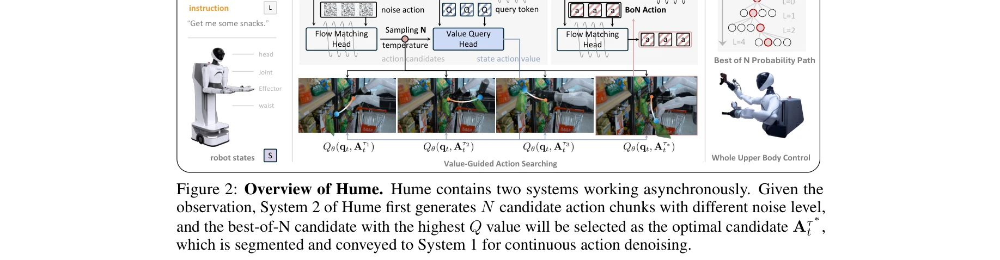

# Hume: Introducing System-2 Thinking in Visual-Language-Action Model

> **저자**: Haoming Song, Delin Qu, Yuanqi Yao, Qizhi Chen, Qi Lv, Yiwen Tang, Modi Shi, Guanghui Ren, Maoqing Yao, Bin Zhao, Dong Wang, Xuelong Li | **날짜**: 2025-05-27 | **URL**: [https://arxiv.org/abs/2505.21432](https://arxiv.org/abs/2505.21432)

---

## Essence

*Figure 1: We present Hume, a dual-system vision-language-action model exploring human-like*

Hume는 Vision-Language-Action 모델에 System-2 slow thinking을 도입한 dual-system 로봇 정책으로, value-guided 반복 샘플링과 cascaded action denoising을 통해 복잡한 로봇 제어 성능을 향상시킨다.

## Motivation

- **Known**: LLM에서 Chain-of-Thought와 같은 System-2 thinking이 성공했으며, dual-system VLA 아키텍처들이 효율성을 개선했다. 그러나 로봇 제어에서 효과적인 System-2 thinking의 적용은 미흡하다.
- **Gap**: 기존 dual-system 로봇 정책들은 System 2가 실질적인 thinking과 reasoning을 수행하지 못하며, 로봇 액션의 의미론적 모호성으로 인해 text 기반 CoT를 직접 적용하기 어렵다. 또한 System-2의 'slowness'와 로봇 제어의 'fastness' 요구 사이의 균형 문제가 남아있다.
- **Why**: 복잡한 로봇 작업은 깊은 deliberative thinking을 요구하며, 이는 로봇의 일반화 능력과 dexterous control 성능을 크게 향상시킬 수 있다.
- **Approach**: System 2는 flow matching denoising head와 novel value-query head를 갖춘 VLM 기반 모듈로, state-action value를 추정하여 여러 action 후보 중 최적을 선택한다. System 1은 가벼운 visuomotor policy로 System 2의 선택을 받아 real-time cascaded action denoising을 수행한다.

## Achievement

*Figure 1: We present Hume, a dual-system vision-language-action model exploring human-like*

- **LIBERO 벤치마크 성능 향상**: π0 대비 +4.4% success rate 달성
- **Simpler 벤치마크 성능 향상**: +25.9% improvement 달성
- **실세계 로봇 배포 성능**: +12.9% improvement로 21개 실제 로봇 설정에서 우수한 성능 입증
- **다양한 환경 강건성**: viewpoint, texture, lighting, layout 변화 및 unseen objects/environments에서 우수한 성능
- **효율적인 real-time 제어**: System 2는 4Hz, System 1은 90Hz로 비동기 작동하면서도 성능 유지

## How

*Figure 2: Overview of Hume. Hume contains two systems working asynchronously. Given the*

- System 2는 VLM backbone에 flow matching denoising head로 long-horizon action chunk 예측
- Novel value-query head를 통해 예측된 action chunk의 state-action value 추정
- Value-guided thinking: 여러 action 후보를 반복 샘플링하고 state-action value로 최적 action 선택
- System 1은 System 2의 선택된 action chunk 중 짧은 segment를 받아 현재 visual observation과 robot state를 포함하여 cascaded diffusion denoising 수행
- 배포 시: System 2가 저주파(4Hz)에서 value-guided thinking 실행, System 1이 비동기적으로 고주파(90Hz)에서 fluid action 생성
- Multi-stage training strategy로 System 1과 System 2를 단계적으로 학습

## Originality

- 로봇 제어에서 System-2 slow thinking을 처음으로 체계적으로 도입하여 value estimation 기반의 action selection 메커니즘 제안
- 로봇 액션의 semantic 모호성을 우회하고 value-guided repeat sampling으로 실질적인 thinking 구현
- Cascaded action denoising으로 low-frequency System 2와 high-frequency System 1의 효과적인 비동기 통합 달성
- Flow matching과 value-query head의 조합으로 differentiable한 System-2 thinking 최적화 가능하게 설계

## Limitation & Further Study

- Value-query head의 학습 안정성과 state-action value 추정 정확도에 대한 분석 부족
- System 2의 4Hz 주기와 System 1의 90Hz 주기 간 시간 동기화 메커니즘이 상세히 설명되지 않음
- Cascaded action denoising의 계산 복잡도 및 inference 오버헤드에 대한 분석 미흡
- Value-guided thinking의 '반복 샘플링 횟수' 선택 기준이 명확하지 않음", 'Humanoid 로봇 등 특정 embodiment에 대한 적응성 검증 부족
- 후속 연구: value estimation 정확도 개선, 더 효율적인 비동기 통합 메커니즘 개발, 다양한 embodiment에 대한 일반화 강화

## Evaluation

- Novelty: 4/5
- Technical Soundness: 3/5
- Significance: 4/5
- Clarity: 4/5
- Overall: 4/5

**총평**: 본 논문은 로봇 제어에 System-2 slow thinking을 처음으로 적용하여 중요한 conceptual contribution을 제시하며, value-guided thinking과 cascaded action denoising의 novel 조합으로 실질적인 성능 향상을 달성했다. 다만 기술적 세부사항과 design choice의 정당화가 더 보강될 필요가 있다.

## Related Papers

- 🔄 다른 접근: [[papers/1414_Ground_Slow_Move_Fast_A_Dual-System_Foundation_Model_for_Gen/review]] — 둘 다 dual-system 구조이지만 Hume은 manipulation에, DualVLN은 navigation에 특화된 System-2 thinking을 구현합니다.
- 🏛 기반 연구: [[papers/1584_ThinkAct_Vision-Language-Action_Reasoning_via_Reinforced_Vis/review]] — ThinkAct의 vision-language-action reasoning 체인이 Hume의 System-2 slow thinking 구현에 이론적 기반을 제공합니다.
- 🔗 후속 연구: [[papers/1542_RoboMonkey_Scaling_Test-Time_Sampling_and_Verification_for_V/review]] — RoboMonkey의 test-time sampling과 verification을 System-2 thinking에 통합하여 더 robust한 policy를 구현합니다.
- 🔄 다른 접근: [[papers/1414_Ground_Slow_Move_Fast_A_Dual-System_Foundation_Model_for_Gen/review]] — 둘 다 dual-system 아키텍처로 System-1과 System-2를 분리하지만 DualVLN은 navigation에, Hume은 manipulation에 특화된 접근방식을 제시합니다.
- 🔗 후속 연구: [[papers/1528_Reflective_Planning_Vision-Language_Models_for_Multi-Stage_L/review]] — System-2 thinking을 Reflective Planning의 test-time computation 프레임워크에 통합하여 추론 능력을 강화할 수 있다
- 🔄 다른 접근: [[papers/1584_ThinkAct_Vision-Language-Action_Reasoning_via_Reinforced_Vis/review]] — 비전-언어-액션 모델의 시스템-2 사고와 시각 잠재 계획이 각각 다른 방식으로 고수준 추론을 구현한다.
- 🏛 기반 연구: [[papers/1618_VLA-Reasoner_Empowering_Vision-Language-Action_Models_with_R/review]] — Hume의 System-2 thinking이 VLA-Reasoner의 test-time 추론 강화 아이디어의 인지과학적 기반을 제공한다
- 🔗 후속 연구: [[papers/1380_Embodied-R1_Reinforced_Embodied_Reasoning_for_General_Roboti/review]] — System-2 thinking을 VLA에 도입한 Hume이 Embodied-R1의 reinforced reasoning을 더욱 체계적으로 확장한다.
