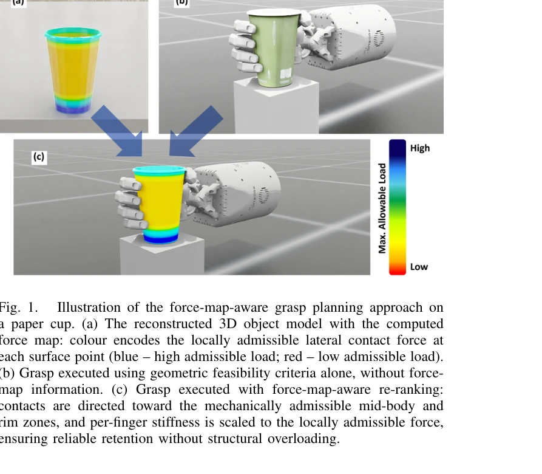

# GraspSense: 언어 기반 인지와 힘 맵을 활용한 손재주 로봇 파지 계획

> **저자**:  | **날짜**: 2026-04-07 | **URL**: [https://arxiv.org/abs/2604.05697](https://arxiv.org/abs/2604.05697)

---

## Essence

*Fig. 1.*

다섯 손가락 로봇 손을 위한 파지 계획 시스템으로, 물체의 국소적 기계적 성질을 인코딩한 force map을 구성하여 기하학적으로 동등한 파지 후보 중 구조적으로 안전한 접촉 영역을 선택하고, 임피던스 제어로 손가락별 강성을 조절하여 안전한 파지를 실행한다.

## Motivation

- **Known**: 다중 손가락 로봇 손의 파지 계획은 기하학적 안정성, 도달 가능성, 충돌 회피 등의 기준으로 평가되며, 임피던스 제어는 순응적 힘 제어를 제공한다. 그러나 기존 방법들은 물체 표면을 기계적으로 균질한 것으로 취급한다.
- **Gap**: 기하학적으로 동등한 파지라도 접촉 위치의 국소적 기계적 성질에 따라 물체 손상 위험이 크게 달라지며, 기존 grasp planner들은 이를 고려하지 않는다. 파지 선택과 힘 제어를 구조적 특성과 결합한 통합 시스템이 없다.
- **Why**: 종이컵, 플라스틱, 유리 등 취약한 물체를 다루는 휴머노이드 로봇 시스템에서 파지 실패와 물체 손상을 방지하려면 국소적 구조적 안정성을 명시적으로 고려한 파지 전략이 필수적이다.
- **Approach**: 자연언어 명령을 Qwen으로 파싱하여 목표 물체와 상호작용 모드를 추출하고, SAM3D로 3D 모델을 재구성한 후, 물리 기반 기하 분석으로 각 표면 위치의 최대 허용 측방 접촉력을 인코딩한 force map을 계산한다. 이를 바탕으로 grasp 후보를 재순위화하고, 임피던스 제어로 각 손가락의 강성을 국소적 허용력에 맞춘다.

## Achievement

*Fig. 1.*

- **Force map 구성 모듈**: 재구성된 3D 물체 모델에서 국소 벽 두께의 물리 기반 기하 근사를 통해 표면 영역별 기계적으로 안전한 접촉력 상한을 제공하는 spatially distributed force map을 생성
- **물리 기반 파지 선택 기준**: 기하학적 동등성 하에서 force-map-aware 재순위화를 통해 국소적으로 기계적으로 허용되는 접촉 영역을 우선하는 선택 알고리즘
- **임피던스 기반 파지 실행 전략**: 각 접촉점의 국소적 허용력에 따라 손가락별 강성을 조절하여 물체 구조 손상을 방지하면서 안정적 파지를 유지
- **전체 파이프라인 통합**: 자연언어 명령부터 파지 실행까지 Isaac Sim에서 구현하며, 종이컵, 플라스틱컵, 유리잔 등 세 가지 재료의 컵 형태 물체에서 검증

## How

*Fig. 2.*

- 자연언어 처리: Qwen LLM으로 operator command에서 목표 물체(O), 동작 유형(a), 상호작용 모드(λ)를 추출
- 객체 인식 및 3D 재구성: YOLO-World로 개방형 어휘 감지, SAM으로 픽셀 단위 분할, SAM3D로 3D 모델 재구성, USD 형식으로 변환
- Force map 구성: 재구성된 모델의 국소 벽 두께를 기하 근사로 추정하고, 물리 기반 구조 해석(FEA 유사)으로 각 표면점의 최대 허용 측방력 계산
- Grasp 후보 생성 및 필터링: 기하학적 타당성(stability, reachability, collision avoidance) 기준으로 초기 필터링, 작업 목표 일관성으로 검증
- Force-map-aware 재순위화: 기하학적으로 동등한 grasp들을 force map 기준으로 재순위화하여 구조적으로 강한 영역의 접촉을 선호
- 임피던스 제어 기반 파지 실행: 각 손가락의 임피던스 제어 강성을 국소적 허용력으로 스케일링하여 spatially non-uniform 파지 전략 구현

## Originality

- Force map을 grasp planning과 grip execution의 일급 요소(first-class element)로 도입하여, 기하학적 파지 계획 문제를 물리 기반 결합 최적화 문제로 재정의
- 구조 분석(local wall thickness 기반 기하 근사)과 grasp ranking을 명시적으로 통합하여, 기계적 균질성 가정을 제거한 최초의 다중 손가락 파지 시스템
- 자연언어 이해(Qwen)에서 파지 실행까지 물체의 구조적 특성을 추적하는 end-to-end 파이프라인 설계
- 국소적 허용력을 기반으로 한 spatially non-uniform impedance control 전략으로, 기존의 generic compliance parameter 대신 물체 특화 강성 조절

## Limitation & Further Study

- Force map 구성이 국소 벽 두께의 기하 근사에 의존하므로, 복잡한 내부 구조나 이질적 재료 분포를 정확히 모델링하기 어려울 수 있음
- 평가가 컵 형태의 단순한 물체에 한정되었으므로, 복잡한 형상(손잡이, 굴곡부)을 가진 일상용품으로의 일반화 성능 미검증
- Qwen 파싱의 강건성과 out-of-distribution 명령어에 대한 오류 처리 방안이 제시되지 않음
- 실물 로봇 팔과 손의 역운동학, 충돌 회피 경로 계획, 센서 노이즈 등 실제 시스템 구현 시 고려할 요소 부재
- 후속 연구: (1) FEA 기반 정밀 구조 분석으로 force map 정확도 향상, (2) 일상용품 데이터셋 수집 및 실물 검증, (3) 실시간 힘/토크 센서 피드백 통합, (4) 학습 기반 force map 예측 모델 개발

## Evaluation

- Novelty: 4/5
- Technical Soundness: 3/5
- Significance: 4/5
- Clarity: 4/5
- Overall: 4/5

**총평**: 이 연구는 다중 손가락 로봇 파지의 기하학적 계획을 물리 기반 구조 분석과 처음으로 통합하여, 취약한 물체의 안전한 조작이라는 실질적 문제를 해결한다. 자연언어부터 파지 실행까지의 완전한 파이프라인은 신규성이 높지만, 단순한 컵 형태 물체에만 검증되었으므로 복잡한 형상으로의 확장 성능과 실물 로봇 구현 가능성 시연이 필요하다.

## Related Papers

- 🧪 응용 사례: [[papers/1338_DexterCap_An_Affordable_and_Automated_System_for_Capturing_D/review]] — 정밀한 손가락 동작 캡처가 dexterous grasping 계획에 직접 활용된다
- 🔄 다른 접근: [[papers/1556_Lightning_Grasp_High_Performance_Procedural_Grasp_Synthesis/review]] — 로봇 grasping을 다른 procedural synthesis 방법으로 접근한다
- 🔗 후속 연구: [[papers/1355_DexGarmentLab_Dexterous_Garment_Manipulation_Environment_wit/review]] — force-aware grasping을 복잡한 조작 환경으로 확장한 응용이다
- 🧪 응용 사례: [[papers/1338_DexterCap_An_Affordable_and_Automated_System_for_Capturing_D/review]] — 정밀한 손가락 움직임 캡처가 로봇 파지 제어에 직접 활용된다
- 🏛 기반 연구: [[papers/1543_RoboPoint_A_Vision-Language_Model_for_Spatial_Affordance_Pre/review]] — GraspSense의 언어 기반 인지와 힘 맵이 RoboPoint의 언어 지시 기반 행동 지점 예측의 기초 방법론을 제공한다.
