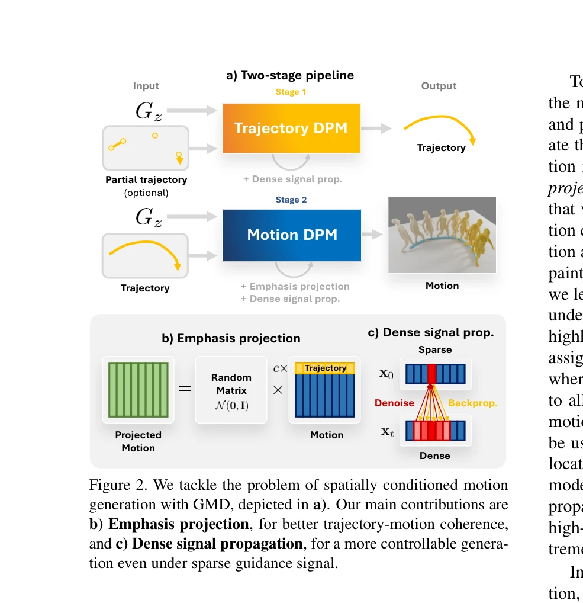
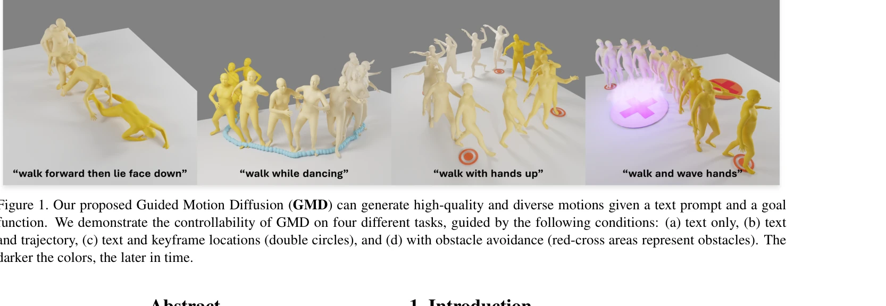

# Guided Motion Diffusion for Controllable Human Motion Synthesis

> **저자**: Korrawe Karunratanakul, Konpat Preechakul, Supasorn Suwajanakorn, Siyu Tang | **날짜**: 2023-05-21 | **URL**: [https://arxiv.org/abs/2305.12577](https://arxiv.org/abs/2305.12577)

---

## Essence

*Figure 2. We tackle the problem of spatially conditioned motion*

Guided Motion Diffusion (GMD)는 diffusion model을 사용하여 텍스트 조건과 공간 제약(궤적, 키프레임, 장애물 회피)을 모두 만족하는 인간 모션을 생성하는 방법이다. Emphasis projection과 Dense signal propagation 기법을 도입하여 공간 정보와 로컬 포즈 사이의 일관성을 향상시킨다.

## Motivation

- **Known**: Denoising diffusion model은 텍스트 기반 인간 모션 합성에서 우수한 성능을 보였으며, Classifier-free guidance를 통해 텍스트 조건부 생성이 가능하다. 그러나 궤적이나 장애물 같은 공간 제약을 통합하는 것은 여전히 미해결 문제이다.
- **Gap**: 기존 diffusion 기반 모션 생성 모델은 로컬 포즈에 과도하게 초점을 맞춰 글로벌 방향 정보가 스파스하며, 키프레임 같은 스파스한 공간 가이던스를 효과적으로 반영하지 못한다.
- **Why**: 현실적인 3D 환경에서의 인간 모션 생성을 위해서는 의미론적 정보(텍스트)와 공간 정보(궤적, 장애물)를 모두 고려해야 하며, 이는 게임, VR, 캐릭터 애니메이션 등의 응용분야에서 필수적이다.
- **Approach**: Motion representation을 조작하는 Emphasis projection으로 공간 정보의 중요도를 높이고, RL의 신용 배정 문제에서 영감을 받아 스파스 가이던스를 Dense signal propagation으로 확산시킴으로써 효과적인 공간 조건부 모션 생성을 달성한다.

## Achievement

*Figure 1. Our proposed Guided Motion Diffusion (GMD) can generate high-quality and diverse motions given a text prompt a*

- **Emphasis projection**: 모션 표현 벡터에서 글로벌 방향 정보의 상대적 중요도를 증가시켜 공간 가이던스와 로컬 포즈 간 일관성을 강화하는 일반적인 표현 조작 기법
- **Dense signal propagation**: Denoiser를 역전파하여 스파스한 공간 가이던스 신호를 주변 프레임으로 확산시키는 조건화 방법으로, 추가 모델 학습 없이 스파스 가이던스 극복
- **다중 공간 제약 지원**: 궤적 조건, 키프레임 위치 지정, 장애물 회피 등 다양한 공간 제약 조건을 단일 모델로 처리 가능
- **텍스트-공간 결합 생성**: 텍스트 기반 모션 생성에서 기존 SOTA 방법을 뛰어넘으면서 공간 제약 제어 기능 추가

## How

*Figure 2. We tackle the problem of spatially conditioned motion*

- Two-stage pipeline: 먼저 Trajectory DPM으로 조건부 궤적을 생성하거나 입력받은 후, Motion DPM에서 텍스트 조건과 궤적을 모두 만족하는 모션 생성
- Emphasis projection: 모션 representation에서 글로벌 방향 정보(4차원)와 로컬 포즈(259차원)의 불균형을 조정하는 행렬 곱셈을 통한 가중치 조정
- Imputation formulation: 기존 inpainting 기법을 projected space에서 작동하도록 확장하여 공간 가이던스 적용
- Dense signal propagation: 스파스한 가이던스 신호(예: 특정 키프레임)에 대해 denoiser의 역전파를 수행하여 밀집된 신호로 변환, 생성 과정 전체에 걸쳐 가이던스 강화
- U-Net 기반 아키텍처: 텍스트 임베딩과 공간 가이던스를 통합하여 처리하는 조건부 denoising model

## Originality

- 공간 제약을 명시적으로 다루지 않던 diffusion 기반 모션 생성에 처음으로 체계적인 공간 조건화 방법 제시
- Motion representation의 내부 구조(글로벌 vs 로컬 정보)를 분석하고 이를 해결하기 위한 Emphasis projection 제안으로 표현 학습 관점의 새로운 인사이트 제공
- RL의 신용 배정 개념을 diffusion model의 스파스 가이던스 문제에 창의적으로 적용한 Dense signal propagation 기법
- 추가 모델 학습 없이 기존 denoiser를 활용한 가이던스 신호 확산 방식으로 실용성과 효율성 동시 달성

## Limitation & Further Study

- Trajectory DPM을 별도로 학습해야 하므로 궤적 기반 모션 생성 시 두 단계 파이프라인 필요 (end-to-end 통합 구조 미부족)
- Dense signal propagation에서 denoiser 역전파 과정의 계산 비용이 증가하여 실시간 응용에 한계 가능성
- 극도로 복잡한 다중 공간 제약(여러 상충하는 궤적, 심각한 장애물 밀집)의 경우 생성 품질 저하 시나리오 미상세 분석
- **후속 연구**: End-to-end 통합 모델 구조 개발, 계산 효율성 개선, 복수 제약 간 충돌 해결 메커니즘 강화, 실시간 인터랙티브 모션 편집 도구화

## Evaluation

- Novelty: 4/5
- Technical Soundness: 3/5
- Significance: 4/5
- Clarity: 4/5
- Overall: 4/5

**총평**: 본 논문은 diffusion 기반 모션 생성에 공간 제약을 효과적으로 통합하는 첫 체계적 접근으로, Emphasis projection과 Dense signal propagation 기법을 통해 원리적이고 실용적인 솔루션을 제시한다. 다양한 실험과 명확한 동기 부여로 텍스트-모션 생성 분야에 중요한 기여를 한다.

## Related Papers

- 🔄 다른 접근: [[papers/1592_OmniControl_Control_Any_Joint_at_Any_Time_for_Human_Motion_G/review]] — 둘 다 diffusion 기반 텍스트 조건부 인간 모션 생성을 다루지만 1431은 공간 제약 처리에, 1592는 관절별 시간별 제어에 특화됨
- 🔗 후속 연구: [[papers/1507_Kimodo_Scaling_Controllable_Human_Motion_Generation/review]] — 1431의 guided motion diffusion 개념을 대규모 데이터셋으로 확장하여 더 일반화된 제어 가능한 모션 생성을 실현함
- 🏛 기반 연구: [[papers/1281_Being-H0_Vision-Language-Action_Pretraining_from_Large-Scale/review]] — Vision-Language-Action 사전훈련이 텍스트 조건부 모션 생성의 이론적 기반을 제공함
- 🔗 후속 연구: [[papers/1507_Kimodo_Scaling_Controllable_Human_Motion_Generation/review]] — Kimodo가 GMD의 제어 가능한 diffusion 기반 모션 생성을 700시간 대규모 데이터로 확장하여 스케일링함
- 🔄 다른 접근: [[papers/1592_OmniControl_Control_Any_Joint_at_Any_Time_for_Human_Motion_G/review]] — 둘 다 diffusion 기반 text-conditioned 모션 생성을 다루지만 1592는 임의 관절 제어에, 1431은 공간 제약 처리에 특화됨
- 🔗 후속 연구: [[papers/1611_PhysDiff_Physics-Guided_Human_Motion_Diffusion_Model/review]] — guided motion diffusion의 제어 가능한 생성 방법이 PhysDiff의 physics-guided 접근법을 확장한다
