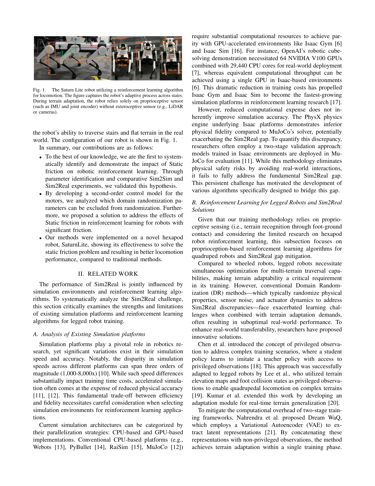
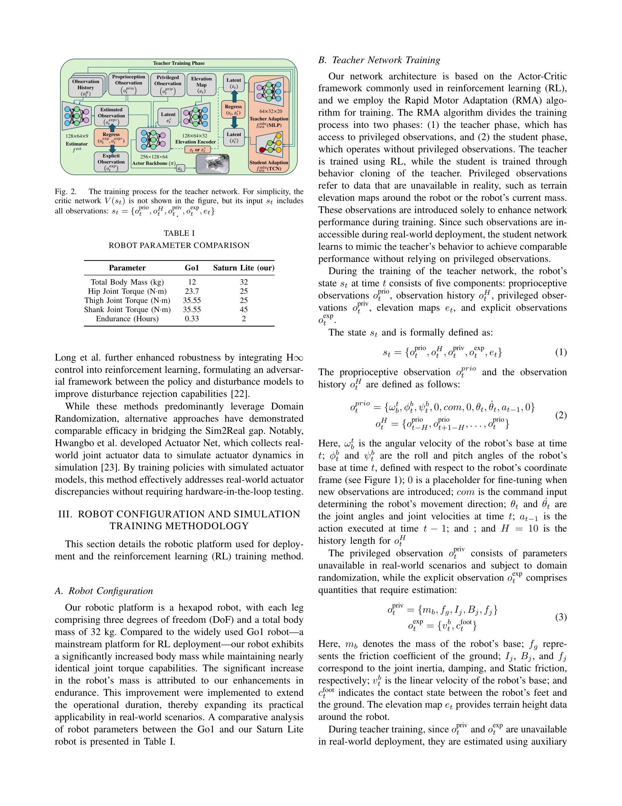

# Impact of Static Friction on Sim2Real in Robotic Reinforcement Learning

> **저자**: Xiaoyi Hu, Qiao Sun, Bailin He, Haojie Liu, Xueyi Zhang, Chunpeng lu, Jiangwei Zhong | **날짜**: 2025-03-03 | **URL**: [https://arxiv.org/abs/2503.01255](https://arxiv.org/abs/2503.01255)

---

## Essence

*Fig. 1.*

정적 마찰이 로봇 강화학습의 Sim2Real 성능에 미치는 영향을 체계적으로 분석하고, Static friction-aware domain randomization을 제안하여 복잡한 지형에서의 로봇 적응 능력을 향상시킨다.

## Motivation

- **Known**: Domain randomization은 로봇 강화학습의 Sim2Real 갭을 줄이는 표준적인 방법이며, 회전자 관성, 점성 마찰, Kp, Kd 등의 매개변수를 무작위화한다. 그러나 과도한 무작위화는 학습 난이도를 증가시킨다.
- **Gap**: 기존 domain randomization 방법들은 static friction을 매개변수 공간에서 제외하고 있으며, static friction이 Sim2Real 성능에 미치는 영향에 대한 체계적인 분석이 부족하다. 이로 인해 마찰이 높은 실제 로봇에서 성능 저하가 발생한다.
- **Why**: 로봇 관절의 정적 마찰은 실제 환경에서 중요한 물리적 특성이지만 시뮬레이션에서 간과되어 왔으며, 이를 정확히 모델링하면 계단 같은 복잡한 지형에서의 로봇 적응 능력을 크게 개선할 수 있다.
- **Approach**: 제어 이론적 관절 모델 개발과 체계적인 매개변수 식별을 통해 로봇 관절의 마찰-토크 비율을 분석하고, 이를 기반으로 Static friction-aware domain randomization을 구현하여 학습 복잡도를 줄이는 방법을 제안한다.

## Achievement

*Fig. 1.*

- **Static friction의 영향 규명**: 매개변수 식별 및 비교 실험을 통해 robotic reinforcement learning에서 static friction의 영향을 처음으로 체계적으로 입증
- **제어 모델 기반 분석**: 2차 제어 모델을 개발하여 domain randomization에서 제외 가능한 매개변수를 분석
- **실제 로봇 구현**: Saturn Lite 육각형 로봇에서 방법을 적용하여 기존 방식 대비 우수한 적응 능력과 계단 통과 성능 달성

## How

*Fig. 2.*

- Control-theoretic joint model을 개발하여 모터 동역학 분석
- Systematic parameter identification을 통해 실제 로봇 관절의 friction-torque ratio 측정
- Conventional domain randomization, Actuator Net, Static friction-aware domain randomization 3가지 방법 비교
- Rapid Motor Adaptation (RMA) 알고리즘 적용으로 실시간 적응 학습 구현
- Sim2Sim 및 Sim2Real 실험을 통해 각 방법의 성능 검증
- Saturn Lite 로봇의 tripod gait를 활용한 자율적 지형 적응을 위한 새로운 보상 함수 설계

## Originality

- **첫 번째 체계적 분석**: Static friction의 Sim2Real 영향을 처음으로 정량적으로 분석하고 입증
- **제어 이론 기반 접근**: 강화학습 문제를 제어 이론으로 분석하여 domain randomization 매개변수 선택의 근거 제공
- **실제 로봇 실험**: 육각형 로봇 Saturn Lite에서 실제 Sim2Real 성능을 검증한 실무 중심의 연구
- **학습 복잡도 감소**: Static friction 모델링으로 인한 학습 난이도 증가를 완화하는 간단한 솔루션 제안

## Limitation & Further Study

- Saturn Lite 로봇에 특화된 분석으로, 다른 로봇 플랫폼에서의 일반화 가능성이 미검증
- Static friction 외 다른 물리적 특성(air resistance, contact dynamics 등)의 영향에 대한 분석 부재
- Proprioceptive sensing만 사용하여 시각 정보가 필요한 복잡한 환경으로의 확장 제한
- Isaac Gym 등 고속 시뮬레이터의 물리 정확도 한계에 대한 심화 분석 필요
- 후속연구: 다양한 로봇 플랫폼에 대한 static friction 모델 일반화, 다중 물리 특성 결합 효과 분석, 실시간 friction 식별 방법 개발

## Evaluation

- Novelty: 4/5
- Technical Soundness: 3/5
- Significance: 4/5
- Clarity: 4/5
- Overall: 4/5

**총평**: 본 논문은 로봇 강화학습의 Sim2Real 갭에서 그간 간과되었던 static friction의 중요성을 체계적으로 규명하고 실제 로봇에서 효과를 입증한 의미 있는 연구이다. 제어 이론과 강화학습의 통합 접근과 실무 중심의 검증이 강점이나, 다양한 로봇 플랫폼으로의 일반화는 향후 과제이다.

## Related Papers

- 🏛 기반 연구: [[papers/1580_MOSAIC_Bridging_the_Sim-to-Real_Gap_in_Generalist_Humanoid_M/review]] — Static friction-aware domain randomization은 MOSAIC의 sim-to-real gap 해결 방법론과 밀접한 관련이 있다.
- 🔗 후속 연구: [[papers/1449_Learned_Perceptive_Forward_Dynamics_Model_for_Safe_and_Platf/review]] — 정적 마찰 분석은 복잡한 야외 지형에서의 perceptive navigation 성능 향상에 직접적으로 기여한다.
- 🔄 다른 접근: [[papers/1317_Contrastive_Representation_Learning_for_Robust_Sim-to-Real_T/review]] — 두 논문 모두 sim-to-real transfer를 다루지만, 하나는 정적 마찰에, 다른 하나는 contrastive representation learning에 초점을 둔다.
- 🏛 기반 연구: [[papers/1449_Learned_Perceptive_Forward_Dynamics_Model_for_Safe_and_Platf/review]] — 복잡한 야외 지형 탐색에서 정적 마찰 특성 이해는 perceptive navigation의 안전성과 성능 향상에 필수적이다.
- 🏛 기반 연구: [[papers/1520_Learning_Bipedal_Locomotion_on_Gear-Driven_Humanoid_Robot_Us/review]] — 정적 마찰이 Sim2Real 전이에 미치는 영향 분석이 고기어비 액추에이터 환경에서의 실제 전이 문제 해결에 직접적으로 도움됨
