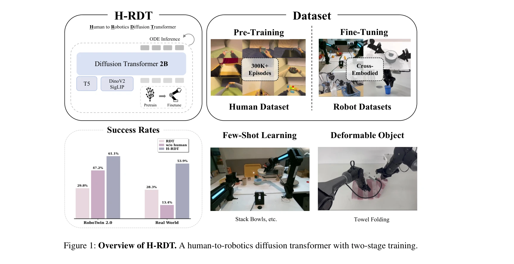
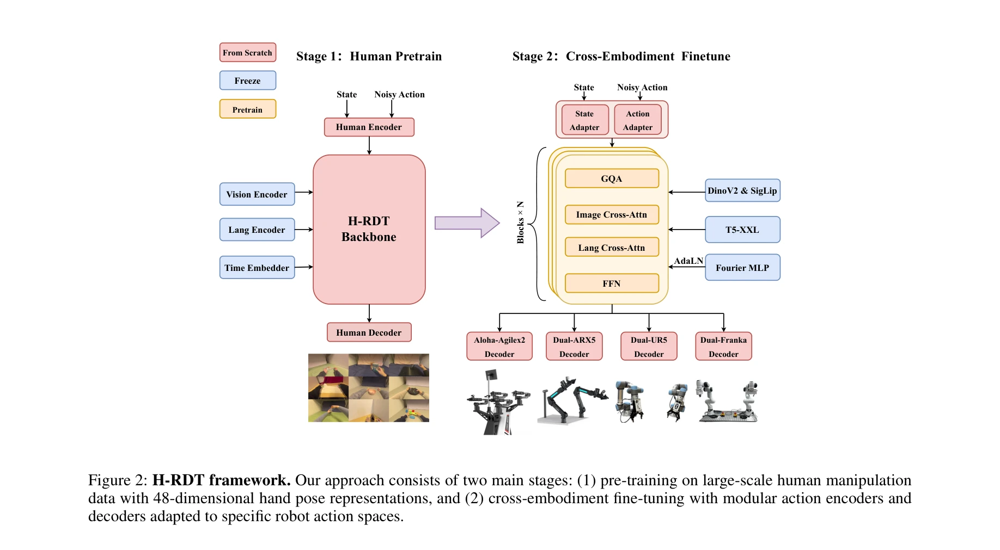

# H-RDT: Human Manipulation Enhanced Bimanual Robotic Manipulation

> **저자**: Hongzhe Bi, Lingxuan Wu, Tianwei Lin, Hengkai Tan, Zhizhong Su, Hang Su, Jun Zhu | **날짜**: 2025-07-31 | **URL**: [https://arxiv.org/abs/2507.23523](https://arxiv.org/abs/2507.23523)

---

## Essence

*Figure 1: Overview of H-RDT. A human-to-robotics diffusion transformer with two-stage training.*

H-RDT는 대규모 egocentric 인간 조작 데이터로 사전학습한 후 로봇별 데이터로 미세조정하는 두 단계 학습 패러다임을 통해 이족 로봇 조작 능력을 향상시키는 diffusion transformer 기반 접근법이다.

## Motivation

- **Known**: 로봇 조작 학습은 텔레오퍼레이션 기반 데이터 수집의 고비용 문제에 직면하고 있으며, 최근 VLA 모델들(RT-2, RDT, π0)은 cross-embodiment 로봇 데이터셋으로 사전학습하고 있다.
- **Gap**: 기존 cross-embodiment 로봇 학습은 다양한 로봇 형태로 인한 통일된 학습의 어려움과 로봇 데이터의 제한된 규모라는 근본적 한계가 있으며, 대규모의 annotated human manipulation 데이터의 잠재력을 체계적으로 활용하지 못하고 있다.
- **Why**: EgoDex(829시간, 338k 에피소드)와 같은 대규모 egocentric 인간 조작 데이터는 자연스러운 조작 전략과 객체 affordance를 담고 있어 로봇 정책 학습을 위한 강력한 귀납적 편향을 제공할 수 있으며, 이를 통해 데이터 희소성 문제를 해결할 수 있다.
- **Approach**: 통합된 인간 embodiment에서 학습한 조작 지식을 modular action encoder/decoder를 통해 diverse 로봇 플랫폼으로 이전하는 구조를 설계하고, flow matching 기반 diffusion transformer 아키텍처(2B 파라미터)를 사용하여 복잡한 action 분포를 모델링한다.

## Achievement

*Figure 3: Cross-embodiment multi-task performance on*

- **데이터 효율성**: 시뮬레이션에서 scratch 학습 대비 13.9%, 실제 로봇 실험에서 40.5% 성능 향상을 달성하며 state-of-the-art 방법인 π0, RDT를 초과 달성
- **범용성**: single-task, multitask, few-shot learning, robustness 평가를 포함한 광범위한 평가에서 일관된 개선 입증
- **cross-embodiment 일반화**: modular 설계를 통해 인간 데이터의 단일 embodiment 사전학습으로부터 diverse 로봇 플랫폼(이족 팔)으로의 효과적인 지식 이전 달성
- **실제 응용**: towel folding, stack bowls 등 deformable object 조작 태스크에서 실제 로봇 환경에서의 성능 검증

## How

*Figure 2: H-RDT framework. Our approach consists of two main stages: (1) pre-training on large-scale human manipulation*

- **사전학습 단계**: EgoDex의 338k 에피소드(829시간) egocentric 인간 조작 비디오와 3D hand pose 주석을 사용하여 diffusion transformer 모델 학습
- **modular action 설계**: 인간의 unified embodiment으로부터 diverse 로봇 embodiment으로의 지식 이전을 위해 embodiment별 action encoder와 decoder 설계
- **flow matching 훈련**: 전통적 diffusion 대비 개선된 안정성과 효율성을 제공하는 flow matching 기반 훈련 패러다임 적용
- **cross-embodiment 미세조정**: 로봇별 데이터로 미세조정 시 사전학습된 표현을 보존하면서 로봇별 action 공간에 적응
- **multimodal 입력 처리**: vision(DinoV2, SigLIP), language(T5), proprioceptive state를 통합하여 조건부 sequence generation 수행

## Originality

- 인간 조작 데이터의 단일 embodiment 학습으로부터 diverse 로봇 embodiment으로의 체계적인 cross-embodiment 이전 메커니즘을 처음 제시
- EgoDex의 대규모 데이터(338k)를 활용한 최초의 로봇 조작 학습 연구(기존 EgoMimic 2k, HAT 27k 대비)
- modular action encoder/decoder를 통해 인간-로봇 embodiment 차이(end effector 종류, forward kinematics 등)를 효과적으로 처리
- flow matching 기반 diffusion transformer를 로봇 조작에 적용하여 기존 diffusion policy 대비 안정성과 효율성 개선

## Limitation & Further Study

- Human-to-robot embodiment 변환 과정에서 손의 섬세한 움직임이 로봇의 제한된 자유도로 완전히 표현되지 않을 수 있는 정보 손실 가능성
- 실제 로봇 실험이 bimanual 팔 조작에 제한되어 있어 다양한 로봇 형태(humanoid, quadruped 등)에 대한 일반화 검증 부족
- EgoDex 데이터의 편향(주로 tabletop 조작)이 out-of-distribution 태스크에서의 성능에 미치는 영향 미분석
- **후속 연구**: 더 다양한 로봇 embodiment(humanoid, gripper 유형)에 대한 cross-embodiment 이전 검증, 인간 데이터와 로봇 데이터 간의 domain gap을 더욱 체계적으로 분석하는 이론적 프레임워크 개발

## Evaluation

- Novelty: 4/5
- Technical Soundness: 3/5
- Significance: 4/5
- Clarity: 4/5
- Overall: 4/5

**총평**: H-RDT는 대규모 egocentric 인간 조작 데이터를 로봇 학습에 체계적으로 활용하는 혁신적 접근법으로, modular architecture와 flow matching 기반 훈련을 통해 데이터 효율성과 cross-embodiment 일반화 모두에서 significant 개선을 달성했으며, 실제 로봇 환경에서의 검증과 40.5% 성능 향상으로 그 실용성을 입증했다.

## Related Papers

- 🏛 기반 연구: [[papers/1522_RDT-1B_a_Diffusion_Foundation_Model_for_Bimanual_Manipulatio/review]] — massive human video learning의 기본 방법론을 bimanual manipulation에 특화하여 적용한 구체적 구현 사례입니다.
- 🔗 후속 연구: [[papers/1450_Learning_Fine-Grained_Bimanual_Manipulation_with_Low-Cost_Ha/review]] — 저비용 하드웨어 기반 bimanual learning을 대규모 human data로 확장하여 성능을 크게 향상시킨 발전된 형태입니다.
- 🏛 기반 연구: [[papers/1363_Diffusion_Transformer_Policy/review]] — Diffusion Transformer Policy의 기본 구조를 human-enhanced bimanual manipulation에 적용한 구체적 사례입니다.
- 🏛 기반 연구: [[papers/1450_Learning_Fine-Grained_Bimanual_Manipulation_with_Low-Cost_Ha/review]] — 저비용 하드웨어 기반의 기본적인 bimanual learning이 대규모 human data enhancement의 출발점이 됩니다.
- 🧪 응용 사례: [[papers/1289_3D_FlowMatch_Actor_Unified_3D_Policy_for_Single-_and_Dual-Ar/review]] — H-RDT의 bimanual manipulation 프레임워크가 3DFA의 단일팔+양팔 통합 정책을 실제 dexterous 조작에 적용하는 구체적 사례를 제공한다.
