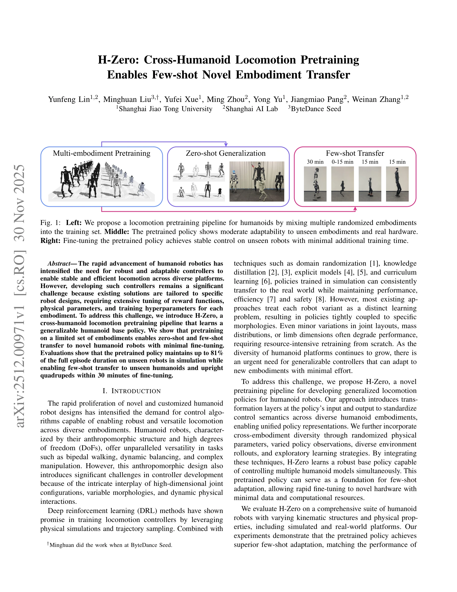

# H-Zero: Cross-Humanoid Locomotion Pretraining Enables Few-shot Novel Embodiment Transfer

> **저자**: Yunfeng Lin, Minghuan Liu, Yufei Xue, Ming Zhou, Yong Yu, Jiangmiao Pang, Weinan Zhang | **날짜**: 2025-11-30 | **URL**: [https://arxiv.org/abs/2512.00971](https://arxiv.org/abs/2512.00971)

---

## Essence

*Fig. 1: Left: We propose a locomotion pretraining pipeline for humanoids by mixing multiple randomized embodiments*

H-Zero는 여러 humanoid 로봇 embodiment으로 사전학습한 범용 이동 정책을 통해 새로운 humanoid 로봇에 대한 zero-shot 및 few-shot 전이를 가능하게 하는 cross-embodiment locomotion pretraining 파이프라인이다.

## Motivation

- **Known**: Deep reinforcement learning과 domain randomization을 이용한 로봇 이동 제어가 개발되었으며, GNN과 transformer 기반 방법들이 cross-embodiment 학습을 시도했다. 그러나 대부분의 방법은 특정 morphology에 맞춤형이거나 높은 계산 비용을 요구한다.
- **Gap**: 기존 humanoid 제어 방법들은 각 로봇 설계에 맞게 조정된 reward function과 hyperparameter가 필요하며, embodiment 변화에 따라 광범위한 재훈련이 필요하다. 실제 하드웨어에 적용 가능한 범용 humanoid 정책은 부족하다.
- **Why**: Humanoid 로봇의 다양화와 맞춤형 설계 증가로 인해, 최소한의 조정으로 새로운 embodiment에 적응 가능한 범용 제어기가 필수적이다. 이는 로봇 개발 비용과 시간을 대폭 단축할 수 있다.
- **Approach**: H-Zero는 unified control semantics를 도입하여 다양한 embodiment 간 입출력을 표준화하고, 물리 파라미터 randomization과 embodiment-wise exploration을 통해 범용 정책을 학습한다. 사전학습된 정책은 새로운 로봇에 대해 몇십 분의 fine-tuning으로 빠르게 적응한다.

## Achievement

*Fig. 1: Left: We propose a locomotion pretraining pipeline for humanoids by mixing multiple randomized embodiments*

- **Unified control interface**: 상태 변환을 통해 diverse humanoid embodiment들 간 정책의 입출력을 표준화하여 일관된 제어 가능
- **Cross-embodiment pretraining**: 물리 randomization과 다양한 training strategy를 통해 범용 이동 정책 학습
- **Zero-shot and few-shot transfer**: 사전학습된 정책이 미보유 로봇에서 81% 에피소드 지속 시간 유지, 30분 fine-tuning으로 새로운 humanoid와 quadruped 제어 달성
- **Sim-to-real transfer**: 시뮬레이션에서 학습한 정책이 실제 하드웨어에서도 일관되게 작동

## How

*Fig. 2: Method overview. a) The policy is pretrained by learning on a diverse set of humanoid embodiments through*

- POMDP 상태 공간 확장: S = Q × E로 정의하여 embodiment 파라미터를 명시적으로 포함
- Bidirectional transformation: qenv = M · qphy 및 kinematic alignment (s ⊙(qphy − b))를 통해 물리 관절 공간과 통일된 환경 공간 간 매핑
- Embodiment descriptor: 다양한 morphology의 embodiment 정보를 정책에 제공하여 적응성 증강
- Multi-robot simulation: 여러 humanoid 모델을 동시에 훈련하며 embodiment-wise exploration과 gradient update 적용
- Physical parameter randomization: 질량, 길이, 관성 등 다양한 물리 속성으로 domain randomization 수행
- Few-shot adaptation: 사전학습된 정책을 새로운 로봇에 대해 최소 에포크 동안 fine-tune

## Originality

- Hardware-agnostic joint state space와 kinematic alignment을 결합한 새로운 unified control semantics 제안
- Embodiment-wise exploration과 gradient update를 통합한 training strategy로 cross-embodiment 학습 안정화
- Embodiment descriptor를 정책 입력에 통합하여 morphology 적응성 명시적 강화
- 실제 humanoid 하드웨어를 포함한 comprehensive evaluation으로 sim-to-real 가능성 입증

## Limitation & Further Study

- Embodiment 범위: 사전학습에 사용된 embodiment 분포 외의 매우 다른 morphology로의 전이 성능 미검토
- Real robot 실험: 제한된 수의 물리 로봇 플랫폼에서만 검증되어 광범위한 hardware diversity에 대한 확장성 불명확
- Fine-tuning 데이터: 30분 fine-tuning 시 필요한 최소 데이터 양 및 환경 조건 분석 부재
- Theoretical analysis: 왜 unified control semantics가 범용성을 달성하는지에 대한 이론적 근거 제시 부족
- 후속연구: (1) 더 다양한 embodiment에 대한 일반화 경계 분석, (2) zero-shot transfer 성능 개선 방법, (3) quadruped 외 다른 형태의 로봇으로의 확장

## Evaluation

- Novelty: 4/5
- Technical Soundness: 3/5
- Significance: 4/5
- Clarity: 4/5
- Overall: 4/5

**총평**: H-Zero는 humanoid 로봇 제어의 현실적 문제를 해결하는 실용적이고 창의적인 방법으로, unified control semantics와 체계적인 cross-embodiment training이 강점이다. 종합적인 평가와 실제 hardware 적용을 통해 scalable humanoid control의 가능성을 입증했으나, 더 극단적인 morphology 변화와 이론적 분석이 추가되면 impact를 확대할 수 있다.

## Related Papers

- 🔗 후속 연구: [[papers/1349_Distillation-PPO_A_Novel_Two-Stage_Reinforcement_Learning_Fr/review]] — H-Zero의 cross-embodiment locomotion pretraining은 D-PPO의 teacher-student 학습 구조를 여러 휴머노이드 플랫폼으로 확장하여 범용성을 크게 향상시킵니다.
- 🏛 기반 연구: [[papers/1436_HAIC_Humanoid_Agile_Object_Interaction_Control_via_Dynamics-/review]] — H-Zero의 cross-humanoid pretraining 기술은 HAIC가 서로 다른 휴머노이드에서 동역학 인식 world model을 효과적으로 전이하기 위한 핵심 기반 기술입니다.
- 🏛 기반 연구: [[papers/1349_Distillation-PPO_A_Novel_Two-Stage_Reinforcement_Learning_Fr/review]] — Distillation-PPO의 teacher-student 학습 프레임워크는 H-Zero의 cross-embodiment pretraining에서 서로 다른 휴머노이드 간 지식 전이를 위한 핵심 방법론입니다.
- 🏛 기반 연구: [[papers/1572_Sim-to-Real_Reinforcement_Learning_for_Vision-Based_Dexterou/review]] — 인간 플레이 비디오로 ICL 기반 휴머노이드 조작 학습이 차세대 토큰 예측을 통한 맥락 내 모방학습을 기반으로 한다.
- 🧪 응용 사례: [[papers/1436_HAIC_Humanoid_Agile_Object_Interaction_Control_via_Dynamics-/review]] — HAIC의 동역학 인식 제어 프레임워크는 H-Zero의 cross-embodiment pretraining 결과를 실제 물체 상호작용 작업에 적용하는 구체적인 응용 사례입니다.
- 🏛 기반 연구: [[papers/1531_Learning_Humanoid_Standing-up_Control_across_Diverse_Posture/review]] — Cross-humanoid locomotion 사전학습을 통한 few-shot 학습 능력이 다양한 자세에서의 일어서기 제어 일반화에 직접적으로 도움됨
- 🔗 후속 연구: [[papers/1580_MOSAIC_Bridging_the_Sim-to-Real_Gap_in_Generalist_Humanoid_M/review]] — 크로스 휴머노이드 사전학습이 MOSAIC의 일반화 능력을 다양한 형태의 휴머노이드로 확장할 수 있는 가능성을 보여줍니다.
