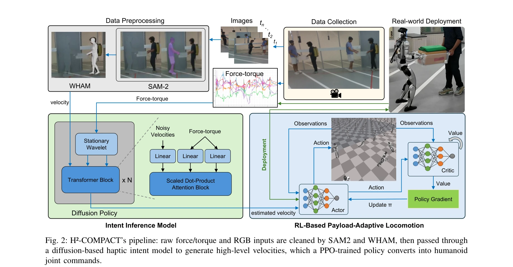

# H2-COMPACT: Human-Humanoid Co-Manipulation via Adaptive Contact Trajectory Policies

> **저자**: Geeta Chandra Raju Bethala, Hao Huang, Niraj Pudasaini, Abdullah Mohamed Ali, Shuaihang Yuan, Congcong Wen, Anthony Tzes, Yi Fang | **날짜**: 2025-05-23 | **URL**: [https://arxiv.org/abs/2505.17627](https://arxiv.org/abs/2505.17627)

---

## Essence

*Fig. 2: H²-COMPACT’s pipeline: raw force/torque and RGB inputs are cleaned by SAM2 and WHAM, then passed through*

이 논문은 계층적 정책 학습 프레임워크를 통해 휴머노이드 로봇이 촉각 신호만을 이용해 인간과 협력적으로 짐을 나르는 작업을 수행하도록 한다. 상위 계층의 behavior cloning 모델은 힘/토크 센서 신호를 전신 속도 명령으로 변환하고, 하위 계층의 reinforcement learning 정책은 이를 관절 궤적으로 매핑한다.

## Motivation

- **Known**: 휴머노이드 로봇과 강화학습을 통한 동적 보행, 고정 베이스 매니퓨레이터와 바퀴형 플랫폼 기반의 인간-로봇 협작 작업이 선행 연구로 존재한다. 그러나 전신 다리 로봇이 촉각 피드백으로 인간의 의도를 추론하며 동적으로 보행하는 통합 시스템은 부재했다.
- **Gap**: 기존 휴머노이드 연구는 시각 기반 인식에 집중했고, 촉각 피드백을 의미 있는 통신 채널이 아닌 외란으로만 취급했다. 또한 전신 다리 로봇에서 촉각 유도와 하중 적응형 보행을 결합한 연구가 미흡했다.
- **Why**: 일상적 협작 작업(짐 나르기 등)에서 인간팀과 같은 수준의 유동적 협력을 달성하려면 촉각 의도 추론과 가변 하중 안정성을 동시에 확보해야 하며, 이는 실제 로봇 배포에서 실용적 가치가 크다.
- **Approach**: 상위 계층에서는 dual ATI 센서의 6축 힘/토크를 wavelet transform과 diffusion policy 기반 Transformer로 처리하여 전신 속도 명령(vx, vy, ωz)을 생성한다. 하위 계층에서는 PPO를 이용해 가변 하중(0-3kg)과 마찰 조건 하에서 Isaac Gym에서 학습한 정책으로 관절 궤적을 생성한다.

## Achievement

*Fig. 2: H²-COMPACT’s pipeline: raw force/torque and RGB inputs are cleaned by SAM2 and WHAM, then passed through*

- **촉각-보행 통합 프레임워크**: 힘/토크 신호를 고수준 속도 명령으로 변환하는 intent inference와 저수준 관절 제어를 분리한 계층적 정책 구조 제시
- **compact haptic inference 모델**: stationary wavelet transform과 diffusion policy 기반 Transformer를 조합한 경량 모델로 최소한의 센서 데이터만 사용
- **vision-only preprocessing pipeline**: motion-capture 없이 SAM2와 WHAM만으로 RGB 영상에서 3D 인간 자세 및 속도 추출
- **sim-to-real 검증**: Isaac Gym 시뮬레이션에서 학습한 정책을 Unitree G1 실제 로봇에 배포하여 인간-인간 기준선 수준의 성능 달성

## How

*Fig. 2: H²-COMPACT’s pipeline: raw force/torque and RGB inputs are cleaned by SAM2 and WHAM, then passed through*

- Intent inference: T개의 과거 F/T 샘플을 multi-resolution stationary wavelet transform으로 인코딩
- Intent inference: 인코딩된 신호를 block-wise cross-attention Transformer와 diffusion policy를 통해 처리하여 H개 미래 프레임의 속도 예측
- Intent inference: 추론 시점에는 DDIM sampling을 사용한 deterministic 샘플링
- Locomotion policy: PPO를 이용해 Unitree G1의 전신 관절을 제어하도록 학습
- Environment randomization: Isaac Gym에서 payload(0-3kg)와 friction conditions을 randomize하여 학습
- Validation: MuJoCo 시뮬레이션과 실제 하드웨어에서 성능 검증
- 평가 지표: completion time, trajectory deviation, velocity synchrony, follower-force

## Originality

- 촉각 신호 기반 intent inference와 load-adaptive humanoid locomotion의 최초 결합
- Diffusion policy와 wavelet transform을 활용한 novel한 F/T 신호 처리 파이프라인
- Motion-capture 없는 vision-only 전처리를 통한 확장성 있는 데이터 수집 방식
- 계층적 정책 분리를 통한 intent inference와 locomotion control의 명확한 모듈화

## Limitation & Further Study

- 평가가 단일 로봇 플랫폼(Unitree G1)에 제한됨 - 다른 휴머노이드에 대한 일반화 능력 미검증
- 최대 하중 3kg 범위 내에서만 학습/검증 - 더 무거운 짐에 대한 성능 미지수
- 실제 환경에서의 추가 교란(바닥 불규칙성, 동적 장애물 등)에 대한 강건성 미검토
- diffusion policy의 계산 복잡도와 실시간 성능(latency)에 대한 분석 부재
- 후속 연구: 다중 로봇 플랫폼 확장, 더 높은 하중과 복잡한 환경 조건 포함, 적응형 impedance control 추가

## Evaluation

- Novelty: 4/5
- Technical Soundness: 3/5
- Significance: 4/5
- Clarity: 4/5
- Overall: 4/5

**총평**: 이 논문은 인간-휴머노이드 협작에 촉각 기반 intent inference와 load-adaptive 보행 제어를 효과적으로 통합한 최초의 체계적 연구이며, vision-only 전처리와 실제 로봇 검증을 통해 실용성을 입증했다. 다만 단일 플랫폼 평가와 제한된 하중 범위가 일반화 능력에 대한 의문을 남긴다.

## Related Papers

- 🔄 다른 접근: [[papers/1435_HAFO_A_Force-Adaptive_Control_Framework_for_Humanoid_Robots/review]] — 두 논문 모두 계층적 강화학습을 사용하지만 H2-COMPACT는 협력적 조작에, HAFO는 강한 외력 환경에서의 전신 제어에 초점을 둔다.
- 🏛 기반 연구: [[papers/1524_Learning_Human-Humanoid_Coordination_for_Collaborative_Objec/review]] — Human-humanoid collaboration의 기본 원리와 촉각 기반 상호작용은 contact-rich manipulation에서 중요한 기반이 된다.
- 🔗 후속 연구: [[papers/1451_HiWET_Hierarchical_World-Frame_End-Effector_Tracking_for_Lon/review]] — H2-COMPACT의 계층적 정책 구조는 HiWET의 world-frame end-effector tracking을 협력적 조작 환경으로 확장한다.
- 🔗 후속 연구: [[papers/1423_GentleHumanoid_Learning_Upper-body_Compliance_for_Contact-ri/review]] — GentleHumanoid의 상체 compliance와 H2-COMPACT의 인간-휴머노이드 협업을 결합하면 더욱 자연스러운 공동 작업이 가능하다.
- 🔄 다른 접근: [[papers/1435_HAFO_A_Force-Adaptive_Control_Framework_for_Humanoid_Robots/review]] — 두 논문 모두 계층적 RL을 사용하지만 HAFO는 강한 외력 환경에, H2-COMPACT는 인간과의 협력에 특화되어 있다.
- 🏛 기반 연구: [[papers/1451_HiWET_Hierarchical_World-Frame_End-Effector_Tracking_for_Lon/review]] — HiWET의 world-frame end-effector tracking은 H2-COMPACT의 협력적 조작에서 정확한 접촉 궤적 생성에 필요한 기술이다.
- 🔗 후속 연구: [[papers/1524_Learning_Human-Humanoid_Coordination_for_Collaborative_Objec/review]] — H2-COMPACT의 인간-휴머노이드 협업 프레임워크를 물체 운반이라는 구체적인 task에 적용하여 발전시킨 specialized 버전임
