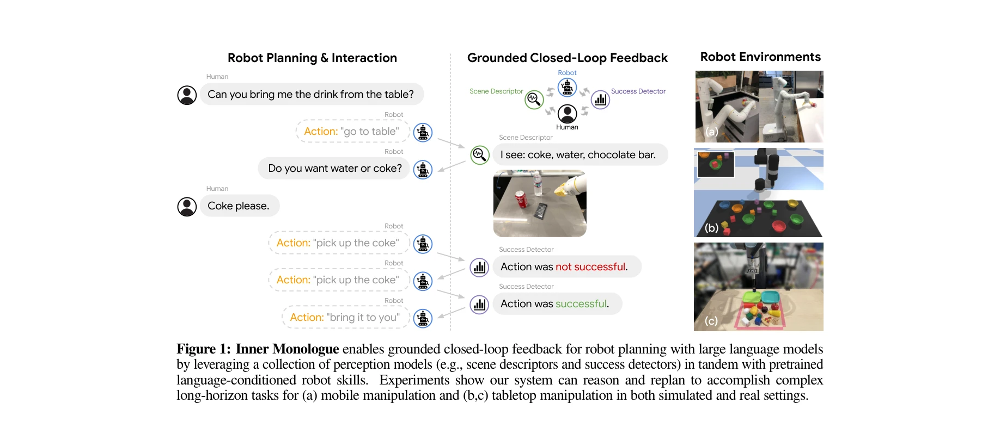
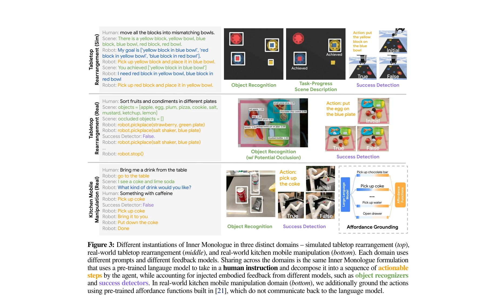
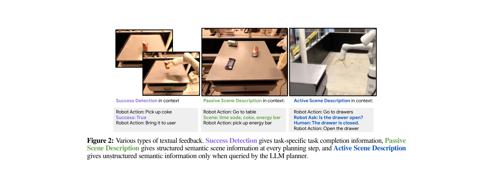

# Inner Monologue: Embodied Reasoning through Planning with Language Models

> **저자**: Wenlong Huang, Fei Xia, Ted Xiao, Harris Chan, Jacky Liang, Pete Florence, Andy Zeng, Jonathan Tompson, Igor Mordatch, Yevgen Chebotar, Pierre Sermanet, Noah Brown, Tomas Jackson, Linda Luu, Sergey Levine, Karol Hausman, Brian Ichter | **날짜**: 2022-07-12 | **URL**: [https://arxiv.org/abs/2207.05608](https://arxiv.org/abs/2207.05608)

---

## Essence

*Figure 1: Inner Monologue enables grounded closed-loop feedback for robot planning with large language models*

LLM을 로봇 제어에 활용할 때, 환경 피드백을 자연어로 주입하여 LLM이 '내적 독백(inner monologue)'을 형성하게 함으로써 폐루프 계획 및 추론을 가능하게 한다. 추가 학습 없이 프롬프팅만으로 복잡한 장기 조작 작업을 수행할 수 있음을 보여준다.

## Motivation

- **Known**: 최근 LLM의 추론 능력을 로봇 계획에 활용하는 연구들이 진행되었으며, 자연어가 다양한 기초 모델 간의 통합 인터페이스로 기능할 수 있음이 알려져 있다.
- **Gap**: 기존 LLM 기반 로봇 계획 연구들(예: SayCan)은 각 행동이 성공적으로 실행된다고 가정하여, 동적 환경에서의 중간 실패나 재계획을 제대로 처리하지 못한다. 환경 피드백을 자연어로 통합하여 폐루프 계획을 수행하는 연구가 부족하다.
- **Why**: 로봇이 복잡하고 장기적인 작업을 수행하려면 단순한 계획 생성뿐 아니라 실시간 환경 변화에 대응하고 실패로부터 회복할 수 있어야 하며, 이는 로봇 자동화의 실용성과 강건성 향상에 필수적이다.
- **Approach**: LLM의 프롬프트에 성공 감지, 장면 설명, 인간 상호작용 등 다양한 자연어 피드백을 동적으로 주입하여, LLM이 이전 행동의 결과를 반영해 다음 행동을 선택하도록 유도한다. 사전학습된 LLM과 로봇 스킬 라이브러리를 few-shot prompting으로 조합한다.

## Achievement

*Figure 3: Different instantiations of Inner Monologue in three distinct domains – simulated tabletop rearrangement (top)*

- **폐루프 피드백의 효과 입증**: 세 가지 도메인(시뮬레이션 탁상 정리, 실제 탁상 정리, 실제 주방 이동 조작)에서 자연어 피드백이 고수준 지시 완료율을 유의미하게 향상시킴
- **확장된 창발 능력**: 추가 학습 없이 새로운 지시 적응, 자기 제안 목표 설정, 상호작용적 장면 이해, 다국어 상호작용 등 예상 밖의 능력이 나타남
- **강건성 향상**: 확률적 실패에 대한 효율적 재시도, 체계적 불가능성 하에서의 재계획, 모호한 쿼리에 대한 인간 피드백 요청이 동적 환경에서 성능 개선
- **적응형 계획**: 실패 원인 분석(그림 4)에 따라 다양한 대응 전략(재시도, 재계획, 질문)을 자동으로 선택

## How

*Figure 2: Various types of textual feedback. Success Detection gives task-specific task completion information, Passive*

- **다중 피드백 소스 통합**: Success Detector(작업 특정 성공 감지), Scene Descriptor(객체/상태 인식), Human Feedback(명확화 및 지도)을 자연어로 변환하여 프롬프트에 추가
- **Inner Monologue 프롬프트 구조**: 고수준 지시, 현재까지의 행동 이력, 최신 환경 피드백을 순차적으로 LLM 프롬프트에 포함시켜 다음 행동 예측
- **사전학습 요소 활용**: frozen LLM(GPT-3 등), 사전학습된 vision-language 모델(CLIP 등), 미리 학습된 로봇 조작 스킬 라이브러리를 조합
- **Few-shot prompting**: 추가 미세조정 없이 몇 가지 예제로 작업 형식을 지정하여 LLM이 새로운 환경과 작업에 일반화
- **피드백 기반 액션 선택**: LLM이 가능한 다음 행동들을 생성하고, 현재 상태 피드백을 고려해 실행 가능한 액션 선택

## Originality

- **피드백-인식 폐루프 계획**: 기존의 open-loop LLM 계획에서 벗어나 환경 피드백을 자연어로 인코딩하여 폐루프 계획을 구현한 점이 새로움
- **'내적 독백' 은유의 구체화**: 인간의 사고 과정을 로봇 계획에 적용하는 개념적 틀을 제시하고, 이를 LLM 프롬프팅으로 실현", '**다양한 피드백 소스의 통합**: 성공 감지, 시각적 장면 이해, 인간 상호작용을 단일 자연어 인터페이스로 통합
- **추가 학습 불필요**: 기존 기초 모델을 그대로 사용하여 새로운 환경과 작업에 즉시 적용 가능한 실용성

## Limitation & Further Study

- **피드백 제공의 의존성**: 환경 피드백(scene description, success detection)의 품질에 크게 의존하며, 부정확한 피드백이 계획을 악화시킬 수 있음
- **확장성 문제**: 복잡한 환경에서 정확한 scene description이나 success detection을 생성하기 어려울 수 있으며, 이를 위해 많은 perception 모델이 필요
- **LLM의 일반화 한계**: 학습 데이터에 없는 극단적 상황이나 창의적 해결책이 필요한 작업에서는 LLM의 성능 한계 존재
- **비용과 응답 속도**: LLM 호출의 지연과 비용이 실시간 로봇 제어에 제약이 될 수 있음
- **후속 연구 방향**: (1) 더 경량의 언어 모델로 확장 가능성 탐색, (2) 피드백 품질 향상을 위한 자동 perception 모델 개선, (3) 계획-실행 루프의 지연 감소 기술 개발, (4) 로봇 실패로부터의 학습 메커니즘 추가

## Evaluation

- Novelty: 4/5
- Technical Soundness: 3/5
- Significance: 4/5
- Clarity: 4/5
- Overall: 4/5

**총평**: 본 논문은 LLM 기반 로봇 계획에 폐루프 피드백을 자연어로 통합하는 창의적이고 실용적인 접근을 제시하며, 추가 학습 없이도 복잡한 실제 작업을 수행 가능함을 다수의 실험으로 입증했다. 다만 perception 피드백의 품질 의존성과 LLM의 고비용·지연 문제가 추후 개선 과제이다.

## Related Papers

- 🔗 후속 연구: [[papers/1459_LLM-State_Open_World_State_Representation_for_Long-horizon_T/review]] — LLM의 내적 독백을 통한 추론 방식을 장기 작업 계획에서 상태 표현과 결합하여 더욱 강화할 수 있습니다.
- 🔄 다른 접근: [[papers/1460_LLM3Large_Language_Model-based_Task_and_Motion_Planning_with/review]] — 두 논문 모두 LLM을 사용한 작업 계획을 다루지만, 하나는 언어 피드백 기반이고 다른 하나는 모션 계획 실패 추론에 집중합니다.
- 🏛 기반 연구: [[papers/1547_Robotic_Control_via_Embodied_Chain-of-Thought_Reasoning/review]] — 체인 오브 쏘트 추론 방식이 로봇 제어에서 내적 독백과 유사한 단계별 추론 구조를 제공합니다.
- 🔗 후속 연구: [[papers/1585_ThinkBot_Embodied_Instruction_Following_with_Thought_Chain_R/review]] — 내적 독백의 추론 체인을 더욱 체계화하여 구체적인 사고 과정을 시각화한 발전된 형태입니다.
- 🔗 후속 연구: [[papers/1422_Hi_Robot_Open-Ended_Instruction_Following_with_Hierarchical/review]] — Inner Monologue의 언어 기반 계획이 Hi Robot의 실시간 피드백 처리를 발전시킨다.
- 🏛 기반 연구: [[papers/1459_LLM-State_Open_World_State_Representation_for_Long-horizon_T/review]] — LLM의 내적 독백을 통한 추론이 장기 작업에서 상태 표현과 결합될 때 더욱 효과적인 계획 수립이 가능합니다.
- 🔗 후속 연구: [[papers/1585_ThinkBot_Embodied_Instruction_Following_with_Thought_Chain_R/review]] — ThinkBot의 instruction following이 Inner Monologue의 계획-실행 프레임워크와 결합되어 더 견고한 embodied reasoning 시스템을 구성할 수 있음
