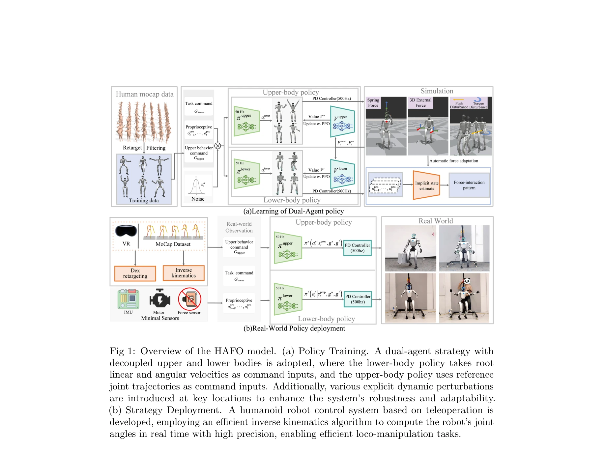
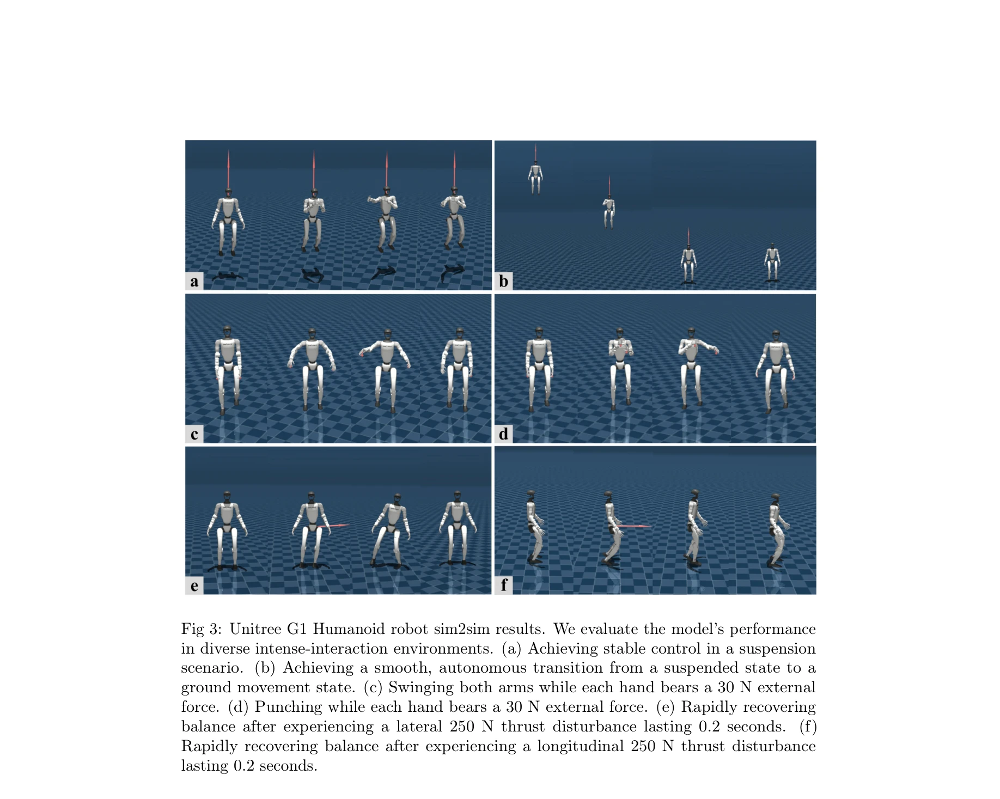

# HAFO: A Force-Adaptive Control Framework for Humanoid Robots in Intense Interaction Environments

> **저자**: Chenhui Dong, Haozhe Xu, Wenhao Feng, Zhipeng Wang, Yanmin Zhou, Yifei Zhao, Bin He | **날짜**: 2026-01-29 | **DOI**: [10.48550/arXiv.2511.20275](https://doi.org/10.48550/arXiv.2511.20275)

---

## Essence

*Fig 1: Overview of the HAFO model. (a) Policy Training. A dual-agent strategy with*

HAFO는 dual-agent RL 프레임워크를 통해 humanoid robot의 lower body 로커모션과 upper body 조작을 동시에 최적화하여 강한 외력 상호작용 환경에서 견고하고 정밀한 전신 제어를 달성한다.

## Motivation

- **Known**: RL 기반 humanoid robot 제어는 로커모션과 가벼운 물체 조작에서 성과를 보였으나, 강한 외력 상호작용 환경에서 견고하고 정밀한 제어는 여전히 도전과제이다.
- **Gap**: 기존 RL 방법들은 외부 접촉 역학을 명시적으로 모델링하지 않아 강한 충돌이나 물리적 접촉 상황에서 불안정성을 보이며, 특히 고공 작업이나 중부하 조작 등 강한 외력 환경에 적응하기 어렵다.
- **Why**: Humanoid robot의 안정적이고 정밀한 제어는 고공 작업, 중부하 조작, 로프 현수 등 현실적인 응용 환경에서 안전성과 작업 성능을 확보하는 데 중요하다.
- **Approach**: Spring-damper 시스템으로 외부 장력 교란을 명시적으로 모델링하고, constrained residual action space를 활용한 dual-agent RL 훈련을 통해 lower body의 견고한 로커모션과 upper body의 정밀한 조작을 협력적으로 최적화한다.

## Achievement

*Fig 3: Unitree G1 Humanoid robot sim2sim results. We evaluate the model’s performance*

- **Dual-agent RL 프레임워크**: Lower body와 upper body를 분리하여 상충되는 제어 목표를 동시에 최적화하고, constrained residual action space로 훈련 안정성과 샘플 효율을 향상시켰다.
- **명시적 외력 모델링**: Spring-damper 동역학 모델로 외부 장력을 모델화하고 curriculum learning으로 점진적 적응을 구현하여 자동으로 ground locomotion과 aerial suspension 모드 전환을 생성한다.
- **광범위한 작업 환경 대응**: 단일 dual-agent 정책으로 중부하, 추력 교란, 로프 현수 조건 등 다양한 강한 외력 상호작용 환경에서 안정적인 제어를 달성한다.
- **고공 작업 최초 적용**: Humanoid robot 로커모션 제어 전략 중 최초로 로프 현수 상태에서 안정적 작동과 안전한 시작을 달성하여 고공 환경 응용의 예비 탐색을 수행한다.

## How

*Fig 2: Spring-damper model and performance analysis. (a) Spring-damper model schematic*

- Dual-agent 구조: Lower-body 에이전트는 robust locomotion 전략, upper-body 에이전트는 precise manipulation 전략을 독립적으로 학습하며 adversarial training으로 협력을 유도한다.
- Constrained residual action space: Upper body 제어를 reference trajectory에 상대적인 residual 형태로 제한하여 training stability와 샘플 효율을 향상시킨다.
- Spring-damper 동역학 모델: 외부 장력을 로봇 body의 특정 위치에 작용하는 등가 spring-damper 힘으로 변환하고, virtual spring 파라미터 조작으로 fine-grained force control을 구현한다.
- Curriculum learning 전략: 훈련 중 spring-damper 강도를 점진적으로 증가시키고 힘의 작용점을 무작위화하여 다양한 외력 교란에 대한 일반화를 체계적으로 향상시킨다.
- Mode-switching 자동화: RL 정책이 환경 피드백을 활용하여 ground locomotion과 aerial suspension 간의 mode switching을 자동으로 생성하며, 명시적 state machine이나 사전정의된 switching logic 없이 작동한다.
- Real robot 검증: Unitree G1에서 시뮬레이션 검증 후 full-sized humanoid robot Unitree H1-2로 확장하여 robustness와 scalability를 입증한다.

## Originality

- **Dual-agent RL의 효과적 적용**: Lower-body와 upper-body의 상충되는 제어 목표를 분리하여 coordinated whole-body control을 달성한 점에서 기존 single-agent 또는 lower-RL-upper-IK 패러다임과 차별화된다.
- **명시적 외력 동역학 모델링**: Spring-damper 시스템으로 추상적 외력을 구체적인 역학 요소로 모델화하고 curriculum learning과 결합하여 동적 외력 적응을 자동으로 학습하게 한 점이 창신적이다.
- **자동 mode-switching**: RL 정책이 명시적 switching logic 없이 환경 피드백만으로 ground locomotion과 aerial suspension 간 자동 전환을 생성한 점은 기존 사전정의 기반 방법들과 구별된다.
- **고공 작업 환경의 최초 적용**: Humanoid robot의 로프 현수 제어는 선행 연구에서 미다룬 영역으로, 현실적 고공 작업 응용을 위한 예비 탐색을 수행한 점이 독창적이다.

## Limitation & Further Study

- **외력 모델 단순화**: Spring-damper 모델은 선형 동역학을 가정하며, 비선형 접촉 역학이나 복잡한 환경 상호작용을 완전히 포함하지 못할 수 있다.
- **로프 현수 시나리오 제한**: 고공 작업 실험은 제한된 환경에서 수행되었으며, 다양한 로프 구성, 동적 스윙 등 복잡한 현수 조건으로의 확장 필요성이 있다.
- **Real-world 일반화 검증 부족**: 시뮬레이션에서 현실 로봇으로의 sim-to-real transfer 성공률, 환경 편차에 대한 정량적 robustness 분석이 더 필요하다.
- **계산 복잡도 및 실시간성**: Dual-agent 훈련과 실행의 계산 요구사항, 실시간 제어 성능(latency, 제어 주기)에 대한 분석이 부족하다.
- **후속 연구 방향**: (1) 비선형 접촉 동역학을 포함한 더 정교한 외력 모델 개발, (2) 다양한 로프 특성과 동적 현수 조건으로의 확장, (3) 실제 고공 작업 환경에서의 장기 안정성 검증, (4) 다중 외력 소스 및 복잡한 상호작용 환경으로의 확장.

## Evaluation

- Novelty: 4/5
- Technical Soundness: 3/5
- Significance: 4/5
- Clarity: 4/5
- Overall: 4/5

**총평**: HAFO는 dual-agent RL과 명시적 spring-damper 외력 모델링을 결합하여 humanoid robot의 강한 외력 상호작용 제어에 새로운 접근을 제시하며, 특히 고공 작업 환경에서의 최초 안정적 제어 달성은 실용적 가치가 높다. 다만 real-world 환경 검증과 복잡한 접촉 동역학 모델링 확장이 추가 필요하다.

## Related Papers

- 🔄 다른 접근: [[papers/1434_H2-COMPACT_Human-Humanoid_Co-Manipulation_via_Adaptive_Conta/review]] — 두 논문 모두 계층적 RL을 사용하지만 HAFO는 강한 외력 환경에, H2-COMPACT는 인간과의 협력에 특화되어 있다.
- 🔗 후속 연구: [[papers/1392_FALCON_Learning_Force-Adaptive_Humanoid_Loco-Manipulation/review]] — HAFO의 dual-agent framework는 FALCON의 force-adaptive control을 더욱 강한 외력 상호작용 환경으로 확장한다.
- 🏛 기반 연구: [[papers/1508_Kinematics-Aware_Multi-Policy_Reinforcement_Learning_for_For/review]] — HAFO의 force-capable manipulation은 산업용 고하중 작업을 위한 kinematics-aware 정책 학습의 기반이 된다.
- 🔄 다른 접근: [[papers/1393_FAME_Force-Adaptive_RL_for_Expanding_the_Manipulation_Envelo/review]] — 둘 다 외부 힘 적응을 다루지만 FAME은 조작 중 균형 교란에, HAFO는 일반적 force-adaptive 제어에 집중한다.
- 🧪 응용 사례: [[papers/1566_Scaling_Up_and_Distilling_Down_Language-Guided_Robot_Skill_A/review]] — Instruct2Act의 멀티모달 명령 매핑 방법론을 언어 가이드 로봇 스킬 획득에 적용하여 실제 로봇 환경에서의 명령 이해 능력을 향상시킬 수 있다.
- 🔗 후속 연구: [[papers/1553_RoBridge_A_Hierarchical_Architecture_Bridging_Cognition_and/review]] — Instruct2Act의 multi-modal instruction mapping이 RoBridge의 VLM과 강화학습 통합을 더 광범위한 지시 처리로 확장한다.
- 🏛 기반 연구: [[papers/1452_HMC_Learning_Heterogeneous_Meta-Control_for_Contact-Rich_Loc/review]] — HAFO의 force-adaptive 제어 개념이 HMC의 multi-modal 제어 프레임워크의 기반이 된다
- 🔄 다른 접근: [[papers/1434_H2-COMPACT_Human-Humanoid_Co-Manipulation_via_Adaptive_Conta/review]] — 두 논문 모두 계층적 강화학습을 사용하지만 H2-COMPACT는 협력적 조작에, HAFO는 강한 외력 환경에서의 전신 제어에 초점을 둔다.
- 🔗 후속 연구: [[papers/1508_Kinematics-Aware_Multi-Policy_Reinforcement_Learning_for_For/review]] — 산업용 고하중 작업의 kinematics-aware RL은 HAFO의 강한 외력 상호작용 제어에서 발전한다.
- 🔗 후속 연구: [[papers/1558_Load-Aware_Locomotion_Control_for_Humanoid_Robots_in_Industr/review]] — HAFO의 힘 적응 제어 프레임워크를 산업 환경에서의 물품 운반이라는 구체적인 task에 특화시켜 발전시킨 형태임
