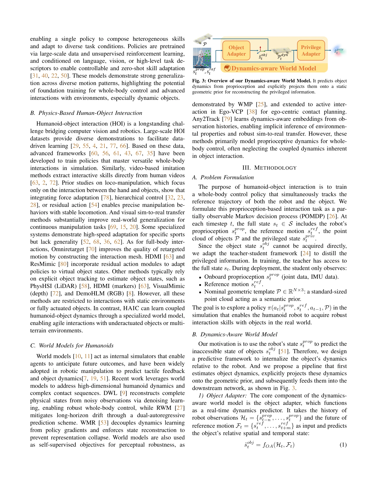
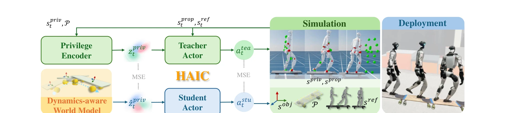

# HAIC: Humanoid Agile Object Interaction Control via Dynamics-Aware World Model

> **저자**: Dongting Li, Xingyu Chen, Qianyang Wu, Bo Chen, Sikai Wu, Hanyu Wu, Guoyao Zhang, Liang Li, Mingliang Zhou, Diyun Xiang, Jianzhu Ma, Qiang Zhang, Renjing Xu | **날짜**: 2026-02-12 | **DOI**: [10.48550/arXiv.2602.11758](https://doi.org/10.48550/arXiv.2602.11758)

---

## Essence

*Fig. 3: Overview of our Dynamics-aware World Model. It predicts object*

HAIC는 시각적 폐색과 독립적 동역학을 가진 미구동 물체(skateboard, cart 등)와의 상호작용을 위해 proprioceptive history로부터 고차 동역학(가속도)을 예측하고 이를 기하학적 prior에 투영하여 동역학 인식 world model을 구성한 humanoid robot 제어 프레임워크이다.

## Motivation

- **Known**: 기존 Human-Object Interaction 연구는 end-effector에 고정된 완전 구동 물체(fully actuated objects)의 조작에 집중하였으며, deep RL과 motion imitation을 통한 humanoid whole-body control이 발전했다.
- **Gap**: 실세계의 미구동 물체(independent dynamics, non-holonomic constraints)와의 상호작용에서 발생하는 시각 폐색과 동역학 결합력을 다루는 외부 상태 추정 없는 통합 방법이 부족하다.
- **Why**: Humanoid robot이 실제 환경에서 skateboarding, cart pushing 등 민첩한 과제를 수행하려면 vision-free 상황에서도 객체의 동역학을 예측하여 관성 교란에 주도적으로 대응할 수 있어야 한다.
- **Approach**: Dynamics-Aware World Model (DWM)을 통해 proprioceptive history에서 객체의 선형·각속도 가속도를 직접 예측하고, 이를 정적 기하학적 prior (point cloud)에 명시적으로 투영하여 dynamic occupancy map을 생성한다. Asymmetric fine-tuning으로 world model이 student policy의 탐색에 연속 적응하도록 한다.

## Achievement

*Fig. 2: HAIC excels at complex interactions, particularly with underactuated*

- **동역학 인식 world model**: 고차 가속도 추론을 명시적 기하학적 투영과 통합하여 정적 payload와 동적 미구동 물체 상태 추정을 통합
- **비대칭 적응 증류**: privileged geometric/dynamic reasoning을 센서 제한적 student policy로 전이하는 2단계 학습 파이프라인 구성
- **실제 환경 성과**: 외부 센싱 없이 humanoid에서 skateboarding 등 민첩한 미구동 물체 과제를 처음 달성, 다중 지형 box carrying 100% 성공률, 다중 물체 장기 과제 수행

## How

*Fig. 4: Framework overview. We train policies in the simulation from scratch. The framework includes a privileged teache*

- Proprioceptive history (IMU, joint state, contact forces)로부터 MLP 기반 dynamics predictor가 객체의 선형 및 각속도 가속도 예측
- 예측된 동역학 상태를 정적 geometric prior (객체 point cloud)에 명시적으로 투영하여 spatially grounded dynamic occupancy representation 구성
- RL policy (student)와 world model (teacher)의 비대칭 구조로 simulation 사전학습 후 실제 환경에서 world model을 정책 탐색에 맞춰 연속 적응
- Contact affordance와 collision boundary를 동역학 맵으로부터 infer하여 시각적 blind spot에서도 상호작용 수행
- Multiple object tracking을 위한 contact guidance strategy로 동시 다중 물체 상호작용 지원

## Originality

- Proprioceptive-centric 동역학 예측: 기존 vision-based world model과 달리 proprioception만으로 고차 가속도 추론, human proprioceptive sensing에 영감을 받은 설계
- 명시적 기하학적 투영: 예측 상태를 정적 geometric prior에 직접 투영하여 dynamic occupancy map 구성, blind spot에서의 충돌 인식 가능
- 미구동 물체 상호작용의 통합 처리: fully actuated와 underactuated 물체를 단일 프레임워크에서 다루며, 외부 상태 추정 제거
- Asymmetric fine-tuning: world model의 지속적 온라인 적응으로 distribution shift 완화, 기존 sim-to-real 방법보다 robust

## Limitation & Further Study

- 미구동 물체의 정적 geometric prior가 필요하므로, 완전히 알 수 없는 형태의 신규 물체에 대한 적응력 제한 가능
- Proprioceptive-only 추론은 rapid dynamics 변화에서 latency가 발생할 수 있으며, 매우 빠른 속도의 underactuated 물체(예: 고속 rolling) 처리 한계 가능
- 다중 물체 상호작용 시 contact guidance strategy의 확장성과 계산 복잡도에 대한 분석 부족
- 후속 연구: (1) object geometry를 online으로 학습하여 사전 정보 없이 적응, (2) visual feedback 부분적 복귀로 accelerometer latency 보완, (3) soft object나 deformable 물체로 확장

## Evaluation

- Novelty: 4/5
- Technical Soundness: 3/5
- Significance: 4/5
- Clarity: 4/5
- Overall: 4/5

**총평**: HAIC는 humanoid robot의 미구동 물체 상호작용이라는 현실적 과제를 proprioceptive dynamics 예측과 dynamic occupancy 표현으로 우아하게 해결한 혁신적 연구이며, 외부 센싱 제거와 robust real-world 성과로 실용적 가치가 높다.

## Related Papers

- 🔗 후속 연구: [[papers/1401_Flow_Matching_Imitation_Learning_for_Multi-Support_Manipulat/review]] — HAIC의 동역학 인식 world model과 고차 동역학 예측 기술은 Flow Matching 기반 multi-support manipulation에서 물체 상호작용의 정확성을 크게 향상시킬 수 있습니다.
- 🧪 응용 사례: [[papers/1433_H-Zero_Cross-Humanoid_Locomotion_Pretraining_Enables_Few-sho/review]] — HAIC의 동역학 인식 제어 프레임워크는 H-Zero의 cross-embodiment pretraining 결과를 실제 물체 상호작용 작업에 적용하는 구체적인 응용 사례입니다.
- 🧪 응용 사례: [[papers/1303_CHIP_Adaptive_Compliance_for_Humanoid_Control_through_Hindsi/review]] — 민첩한 물체 상호작용에서 적응형 compliance 제어가 동역학 인식에 적용된다
- 🧪 응용 사례: [[papers/1320_Coordinated_Humanoid_Manipulation_with_Choice_Policies/review]] — 동역학 인식 물체 상호작용에서 Choice Policy의 다중모드 행동 모델링이 적용된다
- 🧪 응용 사례: [[papers/1327_Deep_Imitation_Learning_for_Humanoid_Loco-manipulation_throu/review]] — 동역학 인식 민첩한 물체 상호작용에서 VR 시연 기반 로코-조작이 적용된다
- 🔗 후속 연구: [[papers/1605_VIMA_General_Robot_Manipulation_with_Multimodal_Prompts/review]] — InstructVLA의 멀티모달 instruction tuning 방법론을 VIMA의 텍스트-이미지 혼합 프롬프트 처리에 적용하여 더 정교한 명령 이해를 가능하게 한다.
- 🧪 응용 사례: [[papers/1401_Flow_Matching_Imitation_Learning_for_Multi-Support_Manipulat/review]] — Flow Matching 기반 모방 학습 방법론은 HAIC의 동역학 인식 world model과 결합하여 미구동 물체와의 상호작용에서 더욱 안정적인 제어를 달성할 수 있습니다.
- 🏛 기반 연구: [[papers/1433_H-Zero_Cross-Humanoid_Locomotion_Pretraining_Enables_Few-sho/review]] — H-Zero의 cross-humanoid pretraining 기술은 HAIC가 서로 다른 휴머노이드에서 동역학 인식 world model을 효과적으로 전이하기 위한 핵심 기반 기술입니다.
