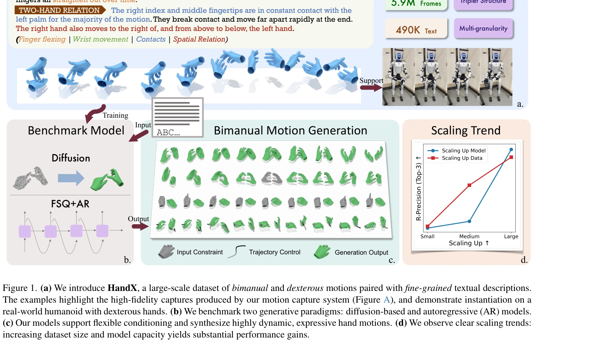

# HandX: Scaling Bimanual Motion and Interaction Generation

> **저자**:  | **날짜**: 2026-03-30 | **URL**: [https://arxiv.org/abs/2603.28766](https://arxiv.org/abs/2603.28766)

---

## Essence

*Figure 1. (a) We introduce HandX, a large-scale dataset of bimanual and dexterous motions paired with fine-grained textu*

HandX는 양손의 세밀한 손가락 동작과 상호작용을 생성하기 위한 통합 기반을 제공하며, 54.2시간의 고품질 모션 캡처 데이터와 490K개의 세밀한 텍스트 주석, 그리고 diffusion 및 autoregressive 모델 벤치마크를 포함한다.

## Motivation

- **Known**: 인간 모션 생성은 빠르게 발전했으나, 기존 전신 모션 데이터셋은 손가락 수준의 세밀한 표현이 부족하고 양손 상호작용 및 접촉 역학을 제대로 캡처하지 못한다.
- **Gap**: 기존 손 중심 데이터셋들은 객체 조작에만 초점을 맞추거나 양손 협력과 접촉 역학을 누락하고 있으며, 세밀한 텍스트 주석이 부족하거나 모션 해상도가 낮다.
- **Why**: 사실적인 손 모션 합성은 immersive media, telepresence, embodied AI, 인간-컴퓨터 상호작용 등에서 필수적이며, 이를 위해서는 고품질 데이터와 확립된 평가 프로토콜이 필수적이다.
- **Approach**: HandX는 기존 공개 데이터셋을 통합 및 필터링하여 표준화된 코퍼스를 구축하고, 양손 상호작용 전문 모션 캡처 데이터를 수집한 후, 구조화된 특징 추출과 LLM 추론을 결합한 확장 가능한 주석 전략을 제시한다.

## Achievement

*Figure 1. (a) We introduce HandX, a large-scale dataset of bimanual and dexterous motions paired with fine-grained textu*

- **대규모 고품질 데이터셋**: 54.2시간의 모션 캡처 데이터와 490K 프레임, 5.9M 프레임의 통합 데이터로 구성되며 세밀한 양손 동작과 접촉 역학을 포함
- **확장 가능한 주석 전략**: 접촉 이벤트, 손가락 flexion 등의 구조화된 특징을 추출한 후 LLM을 활용하여 의미론적으로 풍부한 설명을 자동 생성
- **벤치마크 모델**: diffusion 기반 및 autoregressive(AR) 모델 두 가지 생성 패러다임을 masked conditioning으로 학습하여 다양한 제어 모드(텍스트-모션, 모션 in-between, 키프레임 가이드) 지원
- **손 중심 평가 지표**: 상호작용 충실도를 평가하기 위한 contact 중심 메트릭 제시
- **스케일링 분석**: 모델 크기와 데이터셋 크기 증가에 따른 명확한 성능 향상 경향 입증

## How

*Figure 1. (a) We introduce HandX, a large-scale dataset of bimanual and dexterous motions paired with fine-grained textu*

- 기존 egocentric 및 human-object interaction 데이터셋을 통합하고 공통 표현으로 변환한 후 부자연스럽거나 비활동 구간 필터링
- 두 단계 주석 전략: (1) 터치, 슬라이드, 릴리스 등 구조화된 이벤트 설명자 자동 추출, (2) 이러한 이벤트와 정렬된 세밀한 설명을 LLM으로 생성
- Masked conditioning 기법을 사용하여 단일 모델이 손 반응 생성, 모션 in-betweening, 키프레임 기반 합성 등 다양한 제어 모드 지원
- Diffusion 및 autoregressive 모델의 두 생성 패러다임을 벤치마크하고 scaling behavior 분석
- 생성된 모션을 dexterous hand를 갖춘 humanoid 로봇 플랫폼에 적용하여 실제 배포 가능성 검증

## Originality

- 양손 상호작용과 세밀한 손가락 동역학에 특화된 통합 데이터 파운데이션(데이터 통합 + 신규 수집)의 구축
- LLM 추론을 활용한 구조화된 특징 기반의 확장 가능한 주석 전략으로, 수동 작업을 최소화하면서도 의미론적 풍부성 확보
- Text-to-hand motion 생성에서의 명확한 스케일링 경향 분석 및 정량화
- Contact-focused 평가 메트릭을 통한 양손 상호작용 충실도의 객관적 평가

## Limitation & Further Study

- 현재 벤치마크는 텍스트-모션 생성에 중점을 두고 있으며, 다른 조건화 모드(예: 음성-제스처)에 대한 포괄적 평가 부족
- Humanoid 로봇에서의 실제 배포는 제한적으로 시연되었으며, 다양한 로봇 플랫폼에서의 일반화 가능성은 미검증
- LLM 기반 주석의 정확성과 편향 가능성에 대한 상세 분석이 부족
- 손가락 수준의 정밀 제어와 미세한 접촉 동역학의 생성 정확도에 대한 심층 오류 분석 필요
- 후속 연구는 multimodal 조건화(예: 비디오, 음성, 신경 신호), 더 긴 시퀀스 생성, 실시간 제어, 그리고 개방형 환경에서의 일반화에 초점을 맞춰야 함

## Evaluation

- Novelty: 4/5
- Technical Soundness: 3/5
- Significance: 4/5
- Clarity: 4/5
- Overall: 4/5

**총평**: HandX는 양손 모션 생성의 중요한 갭을 메우기 위해 고품질 데이터셋, 확장 가능한 주석 전략, 그리고 포괄적 벤치마크를 제공함으로써 손 중심 생성 모델 연구의 새로운 기초를 마련한다. embodied AI와 humanoid 로봇 분야에 실질적인 가치를 제공하는 의미 있는 기여이다.

## Related Papers

- 🔗 후속 연구: [[papers/1450_Learning_Fine-Grained_Bimanual_Manipulation_with_Low-Cost_Ha/review]] — fine-grained bimanual manipulation의 기본 개념을 large-scale motion generation과 interaction modeling로 확장한 포괄적 프레임워크입니다.
- 🔄 다른 접근: [[papers/1507_Kimodo_Scaling_Controllable_Human_Motion_Generation/review]] — 둘 다 large-scale motion generation이지만 HandX는 bimanual interaction에, Kimodo는 controllable human motion에 특화됩니다.
- 🏛 기반 연구: [[papers/1485_HumanX_Toward_Agile_and_Generalizable_Humanoid_Interaction_S/review]] — HumanX의 agile humanoid interaction 기법이 HandX의 양손 상호작용 모델링에 기반 아이디어를 제공합니다.
