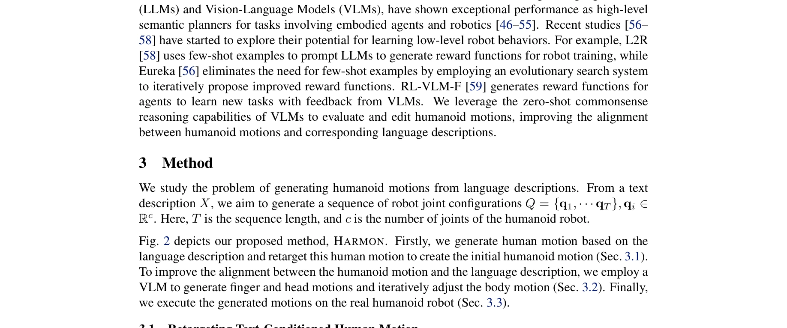
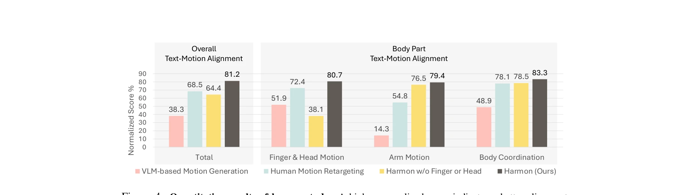

# Harmon: Whole-Body Motion Generation of Humanoid Robots from Language Descriptions

> **저자**: Zhenyu Jiang, Yuqi Xie, Jinhan Li, Ye Yuan, Yifeng Zhu, Yuke Zhu | **날짜**: 2024-10-16 | **URL**: [https://arxiv.org/abs/2410.12773](https://arxiv.org/abs/2410.12773)

---

## Essence

*Fig. 2 depicts our proposed method, HARMON. Firstly, we generate human motion based on the*

본 논문은 인간 동작 데이터셋으로부터 학습된 사전 정보와 Vision Language Model의 상식 추론 능력을 활용하여 자연언어 설명으로부터 휴머노이드 로봇의 전신 동작을 생성하는 HARMON 방법을 제안한다.

## Motivation

- **Known**: 휴머노이드 로봇은 인간 환경에 통합될 수 있는 잠재력을 가지고 있으며, 텍스트-조건부 인간 동작 생성 모델과 강화학습 기반 로봇 제어 기술이 발전하고 있다.
- **Gap**: 인간과 휴머노이드의 구조 차이로 인해 단순 동작 재타게팅만으로는 의미 손실이 발생하고, 손가락과 머리 동작이 누락되며, 자연스럽고 표현력 있는 휴머노이드 동작 생성을 위한 언어-동작 쌍 데이터셋이 부족하다.
- **Why**: 휴머노이드 로봇이 인간과의 공존과 협력을 위해서는 자연언어 이해와 인간과 유사한 행동을 보여야 하며, 이는 인간-로봇 상호작용의 안전성과 효과성을 향상시킨다.
- **Approach**: PhysDiff로 텍스트로부터 인간 동작을 생성하고 역기구학으로 휴머노이드로 재타게팅한 후, VLM을 활용하여 손가락과 머리 동작을 생성하고 팔 동작을 반복적으로 조정하여 언어 설명과의 정렬을 개선한다.

## Achievement

*Figure 4: Quantitative results of human study. A higher normalized score indicates a better alignment*

- **자연스럽고 표현력 있는 전신 동작 생성**: 인간 동작 사전 정보를 활용하여 SMPL 기반 인간 동작을 초기값으로 사용하고 VLM 기반 편집으로 의미 보존
- **손가락과 머리 동작 포함**: 원본 인간 동작 데이터셋에서 누락된 부분을 VLM의 상식 추론으로 보완하여 전신 표현성 확보
- **높은 인간평가 성능**: 테스트 케이스의 86.7%에서 기준 대비 우수한 성능을 달성
- **실제 로봇 실행 검증**: 시뮬레이션뿐 아니라 Fourier GR1 휴머노이드 로봇에서 실제 동작 실행 및 검증

## How

*Fig. 2 depicts our proposed method, HARMON. Firstly, we generate human motion based on the*

- PhysDiff diffusion model을 사용하여 텍스트 설명 X로부터 SMPL 매개변수 시퀀스 생성
- SMPL 바디 모양 매개변수 β를 최적화하여 인간과 휴머노이드의 형태 차이 최소화
- inverse kinematics를 통해 인간 관절 위치를 휴머노이드 로봇 관절 설정값으로 재타게팅
- VLM (GPT-4)에 렌더링된 동작 이미지와 동작 설명을 입력하여 손가락과 머리 동작 생성
- VLM Judge로 생성된 동작과 언어 설명의 정렬도 평가하고, VLM Motion Adjust로 팔 동작 반복 조정
- 상체와 하체 동작을 분리 제어하여 실제 로봇에서 로봇 베이스 이동과 상체 동작 독립적 실행

## Originality

- 인간 동작 사전 정보와 VLM의 상식 추론을 결합한 새로운 하이브리드 접근: 기존의 직접 LLM 기반 생성이나 순수 강화학습보다 더 자연스럽고 정렬된 동작 생성
- VLM을 동작 편집 도구로 활용: 렌더링된 동작 이미지를 입력으로 하여 동작 품질 평가와 반복적 개선을 수행하는 혁신적 활용
- 인간-휴머노이드 구조 차이 극복: 손가락/머리 동작 누락과 재타게팅 오류를 명시적으로 해결하는 체계화된 방법론
- 실제 로봇 배포 검증: 단순 시뮬레이션을 넘어 물리적 로봇에서의 실행 가능성 입증

## Limitation & Further Study

- VLM 의존성: 동작 편집이 VLM의 성능과 상식 추론 능력에 의존하므로 복잡한 동작이나 모호한 설명에서 성능 저하 가능
- 인간 데이터 품질 영향: PhysDiff 기반 인간 동작 생성이 인간 동작 데이터셋의 품질과 다양성에 제한됨
- 구조적 제약: Fourier GR1 로봇 특화 설계로 다른 휴머노이드 플랫폼으로의 일반화 검증 부재
- 동작 복잡도 한계: 테스트 세트가 제한적이며 매우 복잡하거나 미세한 동작에 대한 평가 부족
- 후속연구 방향: 더 다양한 휴머노이드 플랫폼 지원, VLM 없이도 동작 편집 가능한 자동 방법 개발, 장기 동작 시퀀스 생성

## Evaluation

- Novelty: 4/5
- Technical Soundness: 3/5
- Significance: 4/5
- Clarity: 4/5
- Overall: 4/5

**총평**: 본 논문은 인간 동작 사전 정보와 VLM의 상식 추론을 창의적으로 결합하여 자연스럽고 표현력 있는 휴머노이드 동작 생성 문제를 효과적으로 해결했으며, 실제 로봇에서의 성공적 실행과 높은 인간평가로 그 가치를 입증했다.

## Related Papers

- 🏛 기반 연구: [[papers/1343_Cosmos-Reason1_From_Physical_Common_Sense_To_Embodied_Reason/review]] — IPR-1은 Cosmos-Reason1의 물리적 추론을 위한 상호작용적 물리 추론기 기반을 제공한다
- 🔗 후속 연구: [[papers/1539_RoboFactory_Exploring_Embodied_Agent_Collaboration_with_Comp/review]] — 전신 동작 생성의 기본 원리를 농구라는 특정 스포츠 영역에서의 장기 과제 해결로 확장한다.
- 🔗 후속 연구: [[papers/1465_Humanoid_Goalkeeper_Learning_from_Position_Conditioned_Task-/review]] — Humanoid Goalkeeper의 whole-body motion은 Harmon의 언어 기반 motion generation으로 확장될 수 있다.
