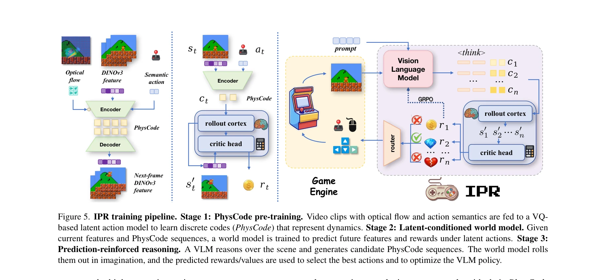
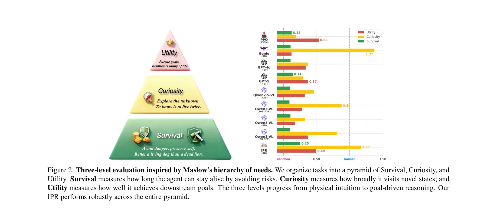

# IPR-1: Interactive Physical Reasoner

> **저자**: Mingyu Zhang, Lifeng Zhuo, Tianxi Tan, Guocan Xie, Xian Nie, Yan Li, Renjie Zhao, Zizhu He, Ziyu Wang, Jiting Cai, Yong-Lu Li | **날짜**: 2025-11-19 | **URL**: [https://arxiv.org/abs/2511.15407](https://arxiv.org/abs/2511.15407)

---

## Essence

*Figure 5. IPR training pipeline. Stage 1: PhysCode pre-training. Video clips with optical flow and action semantics are *

Interactive Physical Reasoner (IPR)는 VLM의 정책을 world model의 롤아웃으로 강화하여 상호작용을 통해 물리 추론 능력을 학습하는 에이전트이다. PhysCode라는 물리 중심 액션 코드를 도입하여 의미론적 의도와 역학을 정렬하고, 1,000+ 게임으로 사전학습되어 물리 직관부터 목표 지향 추론까지 견고한 성능을 보인다.

## Motivation

- **Known**: 기존 VLM/VLA는 추론 능력은 있지만 대화형 설정에서 선행 예측이 부족하고, world model은 물리와 인과관계보다 시각적 패턴을 모방한다. RL 기반 에이전트는 샘플 비효율성과 인터페이스 변화에 취약하다.
- **Gap**: 기존 접근법들은 물리와 인과관계라는 핵심 메커니즘보다 시각적 세부사항에 과적합되어, 다양한 환경 간 견고한 전이를 달성하지 못한다. 상호작용을 통해 공유된 물리 원리를 학습하면서도 대화형 설정에서 예측 능력을 갖춘 시스템이 부재하다.
- **Why**: 물리 추론 능력은 시각적 도메인 격차가 큰 새로운 환경으로의 전이와 적응에 필수적이며, 이는 구체화된 AI와 로봇공학 분야의 핵심 과제이다. 인간이 상호작용을 통해 물리를 학습하는 방식을 AI 에이전트에 적용하면 확장 가능하고 일반화된 추론 능력을 달성할 수 있다.
- **Approach**: IPR은 (1) PhysCode라는 물리 중심 액션 코드 공간을 통해 VLM의 정책과 world model의 예측을 정렬하고, (2) world model의 롤아웃을 통해 VLM의 정책을 점수 매기고 강화하며, (3) Latent World Model 패러다임에 기반하여 본질적인 잠재 역학만을 모델링한다.

## Achievement

*Figure 2. Three-level evaluation inspired by Maslow’s hierarchy of needs. We organize tasks into a pyramid of Survival, *

- **Game-to-Unseen (G2U) 벤치마크**: 시각적 도메인 격차가 있는 1,000+개의 이질적 게임으로 구성된 평가 벤치마크를 구축하고 기존 방법의 강점과 약점을 진단했다.
- **세 수준 평가 프레임워크**: Maslow의 위계설에 영감을 받아 Survival, Curiosity, Utility 세 수준으로 평가하여 물리 직관부터 목표 지향 추론까지 포괄적으로 측정했다.
- **IPR의 우수한 성능**: 8B 백본으로 GPT-5를 능가하는 전체 성능을 달성하고 세 수준 모두에서 견고성을 유지했다.
- **스케일링과 전이성**: 훈련 게임 수와 상호작용 단계 증가에 따라 성능이 개선되며, 미학습 게임으로의 제로샷 전이를 성공적으로 수행했다.
- **PhysCode 액션 공간**: 의미론적 의도와 시각적 역학을 융합하여 예측과 추론을 위한 공유 액션 공간을 제공했다.

## How

*Figure 5. IPR training pipeline. Stage 1: PhysCode pre-training. Video clips with optical flow and action semantics are *

- PhysCode 사전학습 단계: 비디오 클립을 통해 물리 중심 액션 코드를 학습하여 시각적 역학과 행동 의미를 정렬한다.
- VLM 정책 훈련: PhysCode 공간에서 VLM이 정책을 생성하도록 학습한다.
- World model 강화: Latent world model의 롤아웃을 사용하여 VLM 정책의 물리적 타당성을 평가하고 점수를 매긴다.
- 상호작용 경험 수집: 훈련된 IPR 에이전트가 게임 환경과 상호작용하면서 경험을 축적한다.
- 반복적 개선: 수집된 상호작용 데이터로 world model과 정책을 지속적으로 개선한다.
- 이질적 게임에 대한 일반화: 다양한 물리 구성과 시각적 스타일을 가진 1,000+ 게임에서 학습하여 일반화된 물리 추론 능력을 달성한다.

## Originality

- **Physics-centric latent action space (PhysCode)**: 기존 언어 기반 또는 시각적으로 얽힌 액션 코드와 달리, 물리 원리를 명시적으로 캡처하는 새로운 액션 표현을 도입했다.
- **World model과 VLM의 혼합 패러다임**: 예측 기반(world model), RL 기반(강화), VLM 기반(의미론) 접근의 강점을 통합하는 '혼합' 관점을 제시했다.", '**G2U 벤치마크와 삼층 평가**: 1,000+개 게임에 대한 대규모 벤치마크와 Maslow 위계에 영감을 받은 평가 프레임워크는 기존 연구에서 찾기 어려운 새로운 기준을 제시한다.
- **Interactive experience를 통한 점진적 개선**: 상호작용 경험 증가에 따른 성능 스케일링의 명확한 증거를 제시하여 상호작용 기반 학습의 가능성을 입증했다.
- **제로샷 전이**: 학습되지 않은 게임으로의 제로샷 전이 성공은 학습된 물리 원리의 진정한 일반화를 시사한다.

## Limitation & Further Study

- **게임 환경의 제한**: 실제 로봇공학 작업으로 확장하기 전 게임 환경에서의 성능만 검증되었다. 실세계의 높은 가변성과 노이즈가 있는 센서 데이터에 대한 견고성은 미검증 상태이다.
- **계산 비용**: 1,000+개 게임에 대한 사전학습과 world model 롤아웃 기반 강화는 상당한 계산 리소스를 요구하며, 이러한 비용의 명시적 분석이 부재하다.
- **PhysCode 학습의 세부사항**: PhysCode가 실제로 물리 원리를 캡처하는지 또는 시각적 상관성을 학습하는지에 대한 해석 가능성 분석이 제한적이다.
- **복잡한 인과 구조 처리**: 복잡하고 장기적인 인과 관계가 있는 환경에서의 성능이 충분히 평가되지 않았다.
- **후속 연구 방향**: 실제 로봇 작업으로의 확장 연구가 필요하며, 계산 효율성을 높이기 위한 PhysCode 학습 최적화 연구가 필요하다. 또한 학습된 표현의 해석 가능성을 향상시키기 위한 추가 분석이 요구된다.

## Evaluation

- Novelty: 4/5
- Technical Soundness: 3/5
- Significance: 4/5
- Clarity: 4/5
- Overall: 4/5

**총평**: IPR은 VLM과 world model을 물리 중심의 액션 공간으로 통합하는 혁신적 접근을 제시하며, 대규모 이질적 게임 벤치마크에서 우수한 성능과 전이 능력을 보였다. 상호작용 기반 물리 추론의 가능성을 효과적으로 입증했으나, 실제 로봇공학 환경으로의 확장 가능성과 계산 효율성에 대한 추가 검증이 필요하다.

## Related Papers

- 🔗 후속 연구: [[papers/1406_From_Motion_to_Behavior_Hierarchical_Modeling_of_Humanoid_Ge/review]] — HARMON의 자연언어 기반 휴머노이드 동작 생성이 GBC의 계층적 행동 모델링에서 언어-동작 매핑 부분의 구체적인 구현 방법을 제공한다
- 🔄 다른 접근: [[papers/1490_HYPERmotion_Learning_Hybrid_Behavior_Planning_for_Autonomous/review]] — HARMON과 HYPERmotion 모두 언어 기반 휴머노이드 제어를 다루지만, 전신 동작 생성 vs 로코-매니퓰레이션이라는 서로 다른 작업 범위를 가진다
- 🏛 기반 연구: [[papers/1455_Learning_Universal_Policies_via_Text-Guided_Video_Generation/review]] — 텍스트 가이드 비디오 생성의 범용 정책 학습 방법론이 HARMON의 언어 설명 기반 동작 생성에 멀티모달 학습의 이론적 기반을 제공한다
- 🧪 응용 사례: [[papers/1455_Learning_Universal_Policies_via_Text-Guided_Video_Generation/review]] — 텍스트 조건부 비디오 생성의 범용 정책 학습 방법론이 HARMON의 언어 기반 휴머노이드 동작 생성에 멀티모달 접근법을 적용한 구체적 사례이다
- 🏛 기반 연구: [[papers/1406_From_Motion_to_Behavior_Hierarchical_Modeling_of_Humanoid_Ge/review]] — HARMON의 자연언어 기반 동작 생성 방법론이 GBC의 LLM 기반 행동 계획 단계에 필요한 기반 기술을 제공한다
- 🔗 후속 연구: [[papers/1490_HYPERmotion_Learning_Hybrid_Behavior_Planning_for_Autonomous/review]] — HYPERmotion의 로코-매니퓰레이션이 HARMON의 전신 동작 생성을 이동과 조작이 통합된 더 복잡한 작업으로 확장한다
