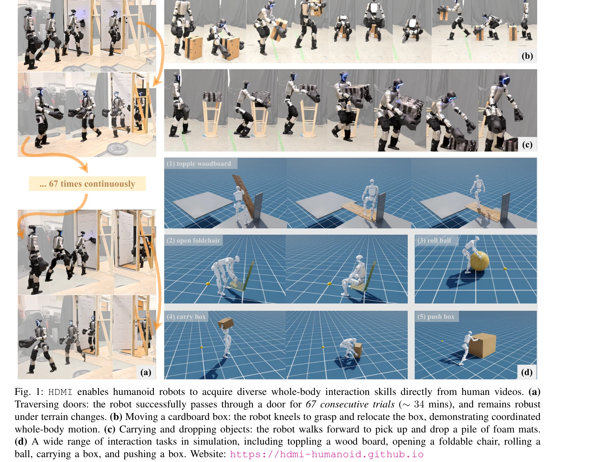

# HDMI: Learning Interactive Humanoid Whole-Body Control from Human Videos

> **저자**: Haoyang Weng, Yitang Li, Nikhil Sobanbabu, Zihan Wang, Zhengyi Luo, Tairan He, Deva Ramanan, Guanya Shi | **날짜**: 2025-09-27 | **DOI**: [10.48550/arXiv.2509.16757](https://doi.org/10.48550/arXiv.2509.16757)

---

## Essence

*Fig. 2: HDMI is a general framework for interactive skill learning. Monocular RGB videos are processed into a structured*

HDMI는 모노큘러 RGB 비디오에서 인간의 상호작용을 학습하여 휴머노이드 로봇이 물체와의 전신 상호작용 스킬을 직접 획득할 수 있는 프레임워크이다. Robot-object co-tracking을 통한 RL 정책 학습으로 시뮬레이션과 실제 로봇에서 다양한 로코-조작 작업을 수행한다.

## Motivation

- **Known**: 휴머노이드 로봇의 자유공간 보행 학습과 조작 학습은 각각 성공적으로 달성되었으나, 접촉이 많은 물체와의 전신 상호작용(HOI)은 동작 데이터 부족과 기술적 어려움으로 인해 제한적이다.
- **Gap**: 기존 휴머노이드-물체 상호작용 연구는 작업별 리워드 엔지니어링이나 고수준의 계획 모듈에 의존하여 일반성이 부족하다. 전신 상호작용을 직접 비디오에서 학습하는 일반 프레임워크가 부재하다.
- **Why**: 휴머노이드 로봇의 실제 활용을 위해 보행과 조작을 동시에 수행하는 견고한 전신 상호작용 능력이 필수적이며, 이는 로봇의 다양한 환경 적응성과 자율성을 결정한다.
- **Approach**: 인간 비디오에서 포즈 추정 및 궤적 재타겟팅으로 구조화된 참조 데이터셋을 구축하고, 통일된 물체 표현, 잔여 행동 공간, 일반화된 상호작용 리워드를 설계하여 RL 정책으로 로봇-물체 상태 공동 추적을 학습한다.

## Achievement

*Fig. 1: HDMI enables humanoid robots to acquire diverse whole-body interaction skills directly from human videos. (a)*

- **비디오 기반 학습의 일반성**: 첫 번째로 인간 비디오에서 직접 자율적 전신 휴머노이드-물체 상호작용 스킬을 학습하는 일반 프레임워크 제시
- **견고한 실제 배포**: Unitree G1에서 67회 연속 문 통과, 6개의 서로 다른 로코-조작 작업 성공
- **시뮬레이션 확장성**: 실제 로봇 외에도 시뮬레이션에서 14개 작업 학습 및 성공
- **설계 단순성**: 통일된 물체 표현, 잔여 행동 공간, 상호작용 리워드의 세 가지 핵심 설계로 복잡한 상호작용 안정화

## How

*Fig. 2: HDMI is a general framework for interactive skill learning. Monocular RGB videos are processed into a structured*

- GVHMR과 LocoMujoco를 이용한 SMPL 포즈 추정 및 재타겟팅으로 모노큘러 RGB 비디오에서 인간과 물체 궤적 추출
- 참조 상태 {s_ref_t}와 접촉점 {p_contact_t}로 구조화된 참조 동작 데이터셋 생성
- Unified object representation: 다양한 기하학 및 유형의 물체에 대응하기 위해 로컬 프레임 기준 물체 표현 설계
- Residual action space: 도전적인 포즈 탐색 시 안정성 보장
- General interaction reward: 불완전한 참조 동작에서도 견고한 접촉 유도
- DeepMimic 스타일 RL 훈련: 랜덤 초기화, 페이즈 변수 관찰, 추적 오차 기반 에피소드 종료
- PPO를 이용한 추적 리워드 및 정규화 리워드 최적화
- Zero-shot 배포: 학습된 정책을 실제 휴머노이드 로봇에 직접 적용

## Originality

- 비디오 기반 인간-물체 상호작용 데이터에서 직접 전신 휴머노이드 스킬을 학습하는 첫 일반 프레임워크
- Robot-object co-tracking 문제로 상호작용 학습을 재정의하여 작업별 리워드 엔지니어링 회피
- 통일된 물체 표현과 잔여 행동 공간으로 다양한 물체 및 접촉 양식에 대한 일반화 실현
- 대규모 시뮬레이션 및 실제 로봇 검증으로 프레임워크의 확장성 입증

## Limitation & Further Study

- 참조 궤적 추출 시 포즈 추정 정확도에 의존하므로 낮은 품질 비디오나 복잡한 자세에서 성능 저하 가능
- 현재 모노큘러 RGB 비디오만 처리하므로 깊이 정보 없이 물체-로봇 상호작용 정확도 제한
- 접촉 신호(c_t) 수동 주석이 필요하여 데이터 처리 자동화 개선 필요
- Sim-to-real gap: 시뮬레이션 환경의 물체 동역학과 실제 로봇의 제어 특성 간 차이 존재
- 후속 연구: 자동 접촉 검출, 멀티뷰 또는 깊이 기반 입력 통합, 더 복잡한 다중 물체 상호작용 확장

## Evaluation

- Novelty: 4/5
- Technical Soundness: 3/5
- Significance: 4/5
- Clarity: 4/5
- Overall: 4/5

**총평**: HDMI는 휴머노이드 로봇의 전신 상호작용 학습을 위한 실용적이고 일반화된 프레임워크로, 인간 비디오 기반 학습과 견고한 실제 배포를 통해 로봇 조작 분야의 중요한 진전을 이룬다. 다만 포즈 추정 정확도 및 sim-to-real 차이에 대한 추가 개선이 필요하다.

## Related Papers

- 🔄 다른 접근: [[papers/1484_HumanPlus_Humanoid_Shadowing_and_Imitation_from_Humans/review]] — 둘 다 인간 동작 비디오로부터 휴머노이드 제어를 학습하지만 HDMI는 물체 상호작용에, HumanPlus는 전반적 스킬에 집중한다
- 🏛 기반 연구: [[papers/1371_EgoMI_Learning_Active_Vision_and_Whole-Body_Manipulation_fro/review]] — EgoMI의 egocentric vision과 모방학습 개념이 HDMI의 인간-로봇 상호작용 학습에 기반이 된다
- 🔗 후속 연구: [[papers/1372_DROID_A_Large-Scale_In-The-Wild_Robot_Manipulation_Dataset/review]] — EgoMimic의 egocentric 데이터 활용 방식을 HDMI가 물체 상호작용에 특화하여 확장했다
- 🔗 후속 연구: [[papers/1550_Robots_Enact_Malignant_Stereotypes/review]] — LLM 제어 로봇의 jailbreaking 연구를 확장하여 실제 물리적 환경에서 발생하는 사회적 편향의 구체적 사례를 제시한다.
- 🔄 다른 접근: [[papers/1484_HumanPlus_Humanoid_Shadowing_and_Imitation_from_Humans/review]] — 둘 다 인간 비디오로부터 휴머노이드 학습을 다루지만 HumanPlus는 전반적 스킬에, HDMI는 물체 상호작용에 집중한다
