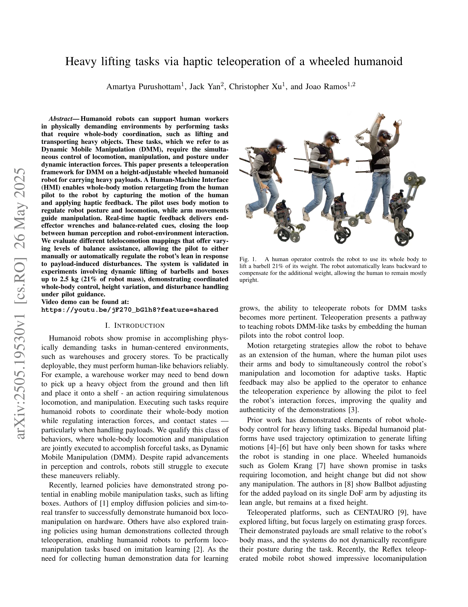
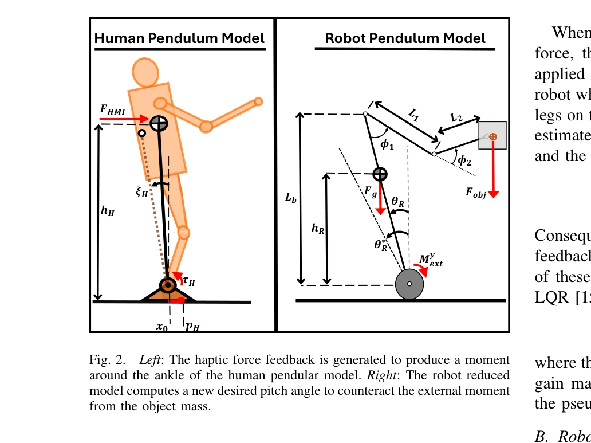

# Heavy lifting tasks via haptic teleoperation of a wheeled humanoid

> **저자**: Amartya Purushottam, Jack Yan, Christopher Yu, Joao Ramos | **날짜**: 2025-05-26 | **URL**: [https://arxiv.org/abs/2505.19530](https://arxiv.org/abs/2505.19530)

---

## Essence

*Fig. 1.*

높이 조절이 가능한 바퀴형 휴머노이드 로봇을 haptic 피드백을 갖춘 텔레오퍼레이션으로 제어하여 동적 모바일 조작(DMM) 작업, 특히 무거운 물체 들기를 수행하는 시스템을 제시한다.

## Motivation

- **Known**: 휴머노이드 로봇의 whole-body 제어 및 motion retargeting 전략이 선행 연구에서 제시되었고, 양족 로봇의 궤적 최적화 또는 바퀴형 로봇의 로콜로모션이 개별적으로 입증되었다.
- **Gap**: 기존 연구는 고정 높이에서의 들기, 작은 페이로드, 또는 payload로 인한 교란 모멘트의 미흡한 보상만 다루었으며, height retargeting, 명시적 교란 처리, 및 immersive haptic feedback을 통합한 DMM 시스템이 부재했다.
- **Why**: 실제 창고나 매장 환경에서 무거운 물체를 옮기는 작업은 동시의 로콜로모션, 매니퓰레이션, 자세 제어를 요구하므로, 이를 안정적으로 수행할 수 있는 텔레오퍼레이션 시스템은 휴머노이드 로봇의 실용적 배포에 필수적이다.
- **Approach**: human motion을 DCM dynamic similarity 기반 retargeting으로 로봇에 적용하되, height 변화 제어를 추가하고 payload로 인한 외부 모멘트를 보상하는 새로운 pitch setpoint 계산 방식을 도입한다. 또한 pilot-compensation과 robot-controller compensation 두 가지 교란 거절 전략을 비교 평가한다.

## Achievement

*Fig. 2.*

- **Height-varying locomotion retargeting**: 인간의 신체 높이 변화를 로봇의 leg height에 매핑하는 제어 전략 개발
- **Payload-induced pitch compensation**: 알려진 물체 질량에 기반하여 로봇의 desired pitch angle을 자동 계산하는 방법론 제시
- **Pitch-based locomotion control**: pilot이 DCM 오류 역학을 규제하도록 설계된 새로운 pitch-based retargeting 전략
- **Haptic feedback integration**: end-effector 힘과 balance 관련 신호를 pilot에게 실시간 전달하는 폐루프 시스템
- **Hardware validation**: 로봇 질량의 21%에 해당하는 2.5 kg 물체의 동적 들기 및 운반 성공 입증

## How

*Fig. 2.*

- Human pendulum 모델과 wheeled inverted pendulum 로봇 모델의 DCM을 동적 유사성으로 정렬
- Height 제어를 위해 human ankle과 robot wheel 사이의 거리를 계산하여 로봇의 다리 길이 설정값으로 변환
- Payload 모멘트 보상을 위해 물체의 질량과 end-effector 위치로부터 필요한 pitch 오프셋을 계산하여 desired pitch setpoint 수정
- Haptic feedback 신호는 DCM 오류와 scaled external forces로부터 생성되어 pilot의 손과 몸에 전달
- Three different telelocomotion mappings을 비교: 수동 lean 조절, 반자동 보상, 완전 자동 보상

## Originality

- Height-varying retargeting과 pitch-based locomotion control을 결합한 통합 DMM 텔레오퍼레이션 프레임워크가 처음 제시됨
- Payload-induced disturbance moment의 명시적 모델링 및 두 가지 보상 패러다임의 비교 평가
- Haptic feedback이 DCM 유사성과 external forces를 동시에 convey하는 설계 방식이 novel
- Wheeled humanoid에서 heavy lifting 중 dynamic posture adjustment를 실증적으로 입증한 첫 사례

## Limitation & Further Study

- 실험은 2.5 kg 페이로드(로봇 질량의 21%)에만 국한되었으며, 더 무거운 물체에 대한 scalability 미검증
- DCM dynamic similarity 기반 motion retargeting은 높은 인지 부하를 초래할 수 있으며, long-term 조작 효율성 평가 부재
- Payload 질량을 미리 알아야 pitch compensation이 정확하므로, 미지의 질량에 대한 적응성 미흡
- Haptic feedback의 gain γH와 γR 설정이 실험적 튜닝에 의존하며 체계적 설계 방법론 부재
- **후속 연구**: 더 무거운 페이로드 처리, online payload 추정, force/torque sensing의 개선, 다양한 task 시나리오에서의 pilot 성능 비교

## Evaluation

- Novelty: 4/5
- Technical Soundness: 3/5
- Significance: 4/5
- Clarity: 4/5
- Overall: 4/5

**총평**: 이 논문은 wheeled humanoid의 heavy lifting을 위한 포괄적인 haptic 텔레오퍼레이션 프레임워크를 처음으로 제시하며, height variation과 payload 보상을 명시적으로 다룬 점에서 DMM 분야에 의미 있는 기여를 한다. 하드웨어 검증과 명확한 기술 설명이 우수하나, 페이로드 범위와 일반화 가능성의 제한이 주요 약점이다.

## Related Papers

- 🔄 다른 접근: [[papers/1454_HOMIE_Humanoid_Loco-Manipulation_with_Isomorphic_Exoskeleton/review]] — 둘 다 외골격/haptic 기반 텔레오퍼레이션이지만 Heavy lifting은 바퀴형 플랫폼에, HOMIE는 이족보행에 초점을 둔다
- 🏛 기반 연구: [[papers/1604_OSMO_Open-Source_Tactile_Glove_for_Human-to-Robot_Skill_Tran/review]] — OSMO의 촉각 글러브 기술이 haptic teleoperation의 기반 기술로 활용된다
- 🔗 후속 연구: [[papers/1515_Phantom_Training_Robots_Without_Robots_Using_Only_Human_Vide/review]] — Learning Adaptive Neural Teleoperation의 힘 적응 개념을 무거운 물체 조작에 특화하여 적용했다
- 🔗 후속 연구: [[papers/1515_Phantom_Training_Robots_Without_Robots_Using_Only_Human_Vide/review]] — 기본적인 적응 학습을 haptic 피드백과 무거운 물체 조작으로 확장했다
- 🔄 다른 접근: [[papers/1454_HOMIE_Humanoid_Loco-Manipulation_with_Isomorphic_Exoskeleton/review]] — 둘 다 외골격 기반 텔레오퍼레이션이지만 HOMIE는 이족보행에, Heavy lifting은 바퀴형 플랫폼에 특화되어 있다
- 🔗 후속 연구: [[papers/1501_Is_imitation_learning_the_route_to_humanoid_robots/review]] — 기본적인 모방학습을 haptic 피드백과 힘 적응으로 확장했다
