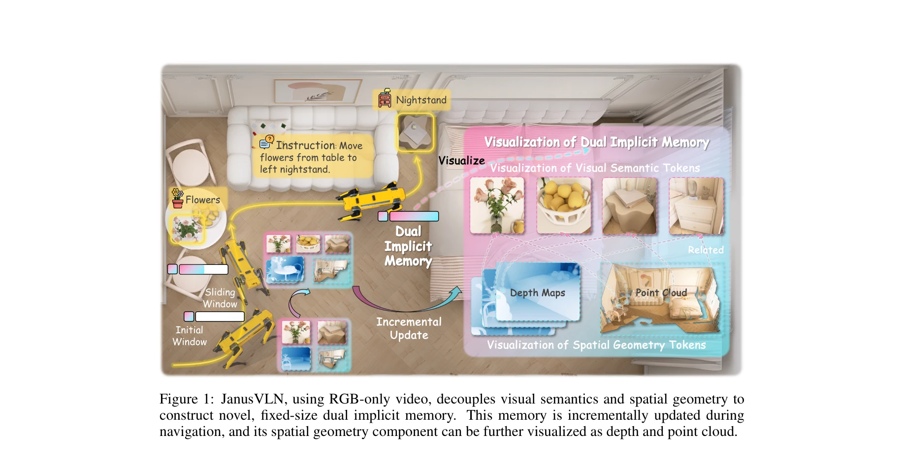
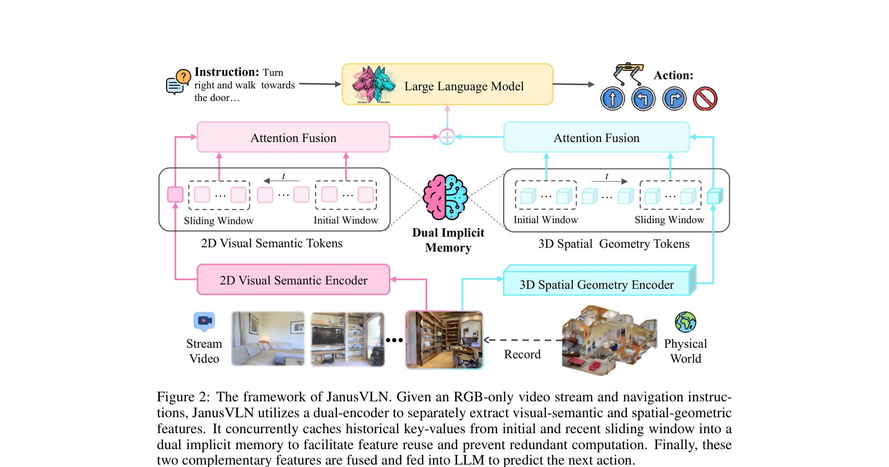

# JanusVLN: Decoupling Semantics and Spatiality with Dual Implicit Memory for Vision-Language Navigation

> **저자**: Shuang Zeng, Dekang Qi, Xinyuan Chang, Feng Xiong, Shichao Xie, Xiaolong Wu, Shiyi Liang, Mu Xu, Xing Wei, Ning Guo | **날짜**: 2025-09-26 | **URL**: [https://arxiv.org/abs/2509.22548](https://arxiv.org/abs/2509.22548)

---

## Essence

*Figure 1: JanusVLN, using RGB-only video, decouples visual semantics and spatial geometry to*

JanusVLN은 시각-언어 네비게이션에서 spatial-geometric과 visual-semantic 정보를 분리하여 dual implicit neural memory로 모델링하는 프레임워크를 제안한다. 3D 기하학적 선행 지식과 MLLM의 의미론적 이해를 결합하여 효율적이고 공간 인식적인 에이전트 네비게이션을 실현한다.

## Motivation

- **Known**: 최근 VLN 방법들은 MLLM의 강력한 의미론적 이해를 활용하고 있으며, explicit semantic memory(텍스트 인지 맵, 과거 프레임 저장)를 구축해왔다. 그러나 2D image-text 쌍으로 사전학습된 CLIP 기반 인코더는 3D 기하학적 구조와 공간 정보 이해에 부족하다.
- **Gap**: 기존 방법들은 공간 정보 손실, 계산 중복, 메모리 팽창 문제로 인해 효율적 네비게이션이 어렵고, 명시적 메모리는 궤적 길이에 따라 지수적으로 증가하여 중요 정보 추출을 방해한다. 또한 2D 시각 인코더로는 3D 기하학적 구조와 공간 관계를 적절히 포착할 수 없다.
- **Why**: 효율적이고 공간 인식적인 네비게이션을 위해서는 의미론적 이해와 기하학적 공간 인식을 동시에 처리하는 것이 필수적이다. RGB-only 입력만으로도 3D 공간 정보를 활용하면 실제 로봇 배포 시 하드웨어 의존성을 줄일 수 있다.
- **Approach**: 인간 뇌의 반구 특화(좌뇌 의미론, 우뇌 공간 인식)에 영감받아, 3D visual geometry foundation model(VGGT)로부터 spatial-geometric 정보를 추출하고, MLLM의 visual encoder로부터 visual-semantic 정보를 추출한다. 두 인코더의 key-value 캐시를 fixed-size dual implicit memory로 구성하고, initial window와 sliding window 방식으로 효율적으로 업데이트한다.

## Achievement

*Figure 1: JanusVLN, using RGB-only video, decouples visual semantics and spatial geometry to*

- **SOTA 성능 달성**: VLN-CE 벤치마크에서 20개 이상의 최근 방법을 능가하며, 다중 데이터타입 사용 방법 대비 10.5-35.5%, RGB만 사용하면서도 더 많은 훈련 데이터 사용 방법 대비 3.6-10.8% 성공률 향상
- **계산 효율성**: 초기 및 슬라이딩 윈도우 방식으로 중복 계산을 제거하고 효율적인 incremental update 실현
- **메모리 효율성**: fixed-size neural representation으로 메모리 크기가 궤적 길이에 따라 증가하지 않음
- **3D 공간 이해 향상**: RGB-only 입력에서 3D spatial cues(원근, occlusion, 기하학적 구조)를 활용하여 공간 추론 능력 강화
- **보조 데이터 불필요**: depth나 point cloud 같은 별도의 3D 데이터 없이도 3D 기하학적 정보 추출 가능

## How

*Figure 2: The framework of JanusVLN. Given an RGB-only video stream and navigation instruc-*

- 3D visual geometry foundation model(VGGT)을 통해 RGB로부터 depth와 point cloud 정보 추출
- MLLM의 visual semantic encoder와 VGGT의 spatial geometric encoder로부터 각각 key-value 캐시 추출
- dual implicit memory를 initial window와 sliding window로 구성하여 historical information을 compact하게 유지
- attention fusion mechanism으로 spatial-geometric과 visual-semantic 정보를 통합
- 매 새로운 프레임에서 과거 프레임 재계산 없이 incremental update 수행
- fixed-size neural representation으로 메모리 크기 제어

## Originality

- VLN 연구에서 처음으로 dual implicit memory 패러다임 제안 — 기존의 single explicit memory에서 근본적 전환
- 인간 뇌의 반구 특화 개념을 VLN에 적용한 생물학적으로 영감받은 아키텍처
- streaming VLN에서 spatial geometric foundation model(VGGT)의 potential을 활용하기 위해 dual-window와 attention fusion 메커니즘 구현
- RGB-only 입력에서 auxiliary 3D 데이터 없이도 3D 기하학적 정보를 implicit하게 활용하는 방법론
- KV 캐시 기반 implicit memory를 통해 계산 중복 제거와 메모리 효율성을 동시에 달성

## Limitation & Further Study

- VGGT의 3D 추정 정확도에 의존하므로, 복잡한 기하학적 구조나 극단적 조명 조건에서 성능 저하 가능성
- sliding window 크기 설정이 메모리-성능 트레이드오프에 영향을 미치는데, 최적 설정에 대한 상세 분석 부족
- 현재 single front RGB camera에만 초점을 맞추고 있어, 다중 카메라 설정에 대한 확장성 검토 필요
- real-world 로봇 환경에서의 실제 배포 실험 제한적 (시뮬레이터 중심 평가)
- 후속 연구로 visual-semantic과 spatial-geometric 정보의 더 깊은 통합 메커니즘 탐색 가능
- 추가적인 embodied AI 작업(manipulation, interaction)으로의 확장 가능성 검토 필요

## Evaluation

- Novelty: 4/5
- Technical Soundness: 4/5
- Significance: 4/5
- Clarity: 4/5
- Overall: 4/5

**총평**: JanusVLN은 VLN 분야에서 implicit dual memory 패러다임을 도입하여 의미론적 이해와 3D 공간 인식을 효과적으로 결합한 혁신적인 연구이다. RGB-only 입력으로 SOTA 성능을 달성하면서도 계산 효율성과 메모리 효율성을 모두 확보하여 향후 embodied AI 연구의 새로운 방향을 제시한다.

## Related Papers

- 🔄 다른 접근: [[papers/1470_MapNav_A_Novel_Memory_Representation_via_Annotated_Semantic/review]] — 두 논문 모두 VLN에서 메모리 표현을 다루지만, 하나는 듀얼 암시적 메모리를, 다른 하나는 의미적 맵 기반 메모리를 사용합니다.
- 🏛 기반 연구: [[papers/1487_Multimodal_Spatial_Language_Maps_for_Robot_Navigation_and_Ma/review]] — 공간 언어 맵이 시각-언어 네비게이션에서 공간-기하학적 정보와 의미론적 정보를 분리하는 기초를 제공합니다.
- 🏛 기반 연구: [[papers/1612_Visual_Language_Maps_for_Robot_Navigation/review]] — 시각 언어 맵의 기본 개념이 공간-의미 정보 분리의 이론적 토대가 됩니다.
- 🔗 후속 연구: [[papers/1607_Vision-Language_Navigation_A_Survey_and_Taxonomy/review]] — 시각-언어 네비게이션의 전반적인 분류 체계에서 듀얼 메모리 접근법의 위치를 이해할 수 있습니다.
- 🔄 다른 접근: [[papers/1470_MapNav_A_Novel_Memory_Representation_via_Annotated_Semantic/review]] — 두 논문 모두 VLN에서 메모리 표현을 다루지만, 하나는 의미적 맵 기반에, 다른 하나는 듀얼 암시적 메모리에 집중합니다.
