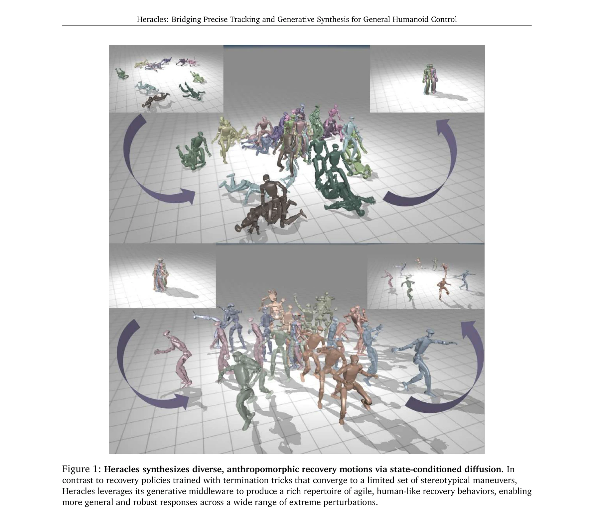
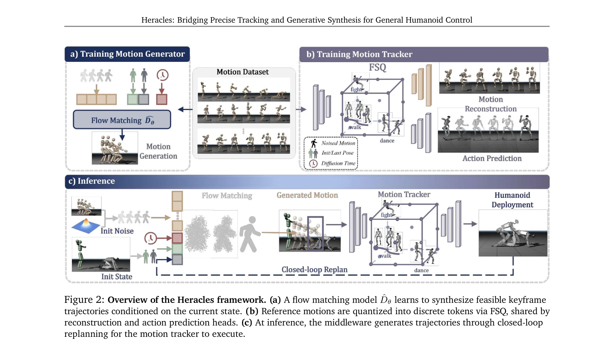

# Heracles: Bridging Precise Tracking and Generative Synthesis for General Humanoid Control

> **저자**: Zelin Tao, Zeran Su, Peiran Liu, Jingkai Sun, Wenqiang Que, Jiahao Ma, Jialin Yu, Jiahang Cao, Pihai Sun, Hao Liang, Gang Han, Wen Zhao, Zhiyuan Xu, Jian Tang, Qiang Zhang, Yijie Guo | **날짜**: 2026-03-31 | **DOI**: [10.48550/arXiv.2603.27756](https://doi.org/10.48550/arXiv.2603.27756)

---

## Essence

*Figure 1: Heracles synthesizes diverse, anthropomorphic recovery motions via state-conditioned diffusion. In*

Heracles는 state-conditioned diffusion middleware를 통해 정밀한 모션 추적과 생성형 합성을 결합하여, 일반 목적의 휴머노이드 제어에서 강건한 인간형 복구 행동을 실현한다.

## Motivation

- **Known**: Deep reinforcement learning 기반의 reference-tracking 제어기는 명목 조건에서 뛰어난 모션 모방 성능을 보이지만, 극단적인 환경 방해에서는 경직된 비인간형 실패 모드를 보인다. 순수 생성형 모델은 자연스러운 동작을 만들지만 정밀한 추적 성능을 희생한다.
- **Gap**: 정밀한 추적 능력과 생성형 적응성 사이의 균형을 동시에 달성하는 통합 제어 프레임워크가 부재하다. 기존 방식은 명시적 상태 전환이나 복잡한 하이브리드 제어를 요구한다.
- **Why**: 휴머노이드 로봇이 비구조화된 실제 환경에서 작동하려면 의도된 움직임 실행과 예측 불가능한 교란에 대한 인간 수준의 회복 능력을 동시에 갖춰야 하며, 이는 일반 목적의 로봇 제어 분야의 핵심 과제이다.
- **Approach**: high-level 모션 명령과 low-level physics tracker 사이에 state-conditioned diffusion middleware를 삽입하여, 로봇 상태에 따라 암시적으로 적응한다. 참조 명령과 상태가 정렬되면 identity map처럼 작동하고, 큰 편차 시에는 생성형 합성기로 전환된다.

## Achievement

*Figure 1: Heracles synthesizes diverse, anthropomorphic recovery motions via state-conditioned diffusion. In*

- **생성형 제어 미들웨어 패러다임**: state-conditioned diffusion을 활용하여 정밀 추적과 유연한 합성을 동시에 달성하는 새로운 제어 아키텍처를 제시
- **일반 목적 제어 향상**: underlying physics tracker와 전체 제어 프레임워크를 개선하여 고충실도 추적 특성 유지와 생성형 prior의 통합을 동시에 달성
- **강건한 인간형 복구 행동**: 물리적 휴머노이드 로봇에서 극단적 외부 방해에 대한 새로운 회복 행동 방식을 발현

## How

*Figure 2: Overview of the Heracles framework. (a) A flow matching model ^𝐷𝜃learns to synthesize feasible keyframe*

- State-conditioned diffusion model을 구축하여 로봇의 실시간 물리 상태에 기반한 조건부 학습 수행
- Identity map 메커니즘으로 참조 추적 피델리티를 보존하고, 상태 편차 감지 시 생성형 합성으로 자동 전환
- Flow matching model을 사용한 효율적인 diffusion 프로세스 구현
- Low-level physics tracker와의 통합을 통한 end-to-end 제어 파이프라인 구성
- 시뮬레이션 및 실제 로봇 실험을 통한 광범위한 검증

## Originality

- Rigid tracking과 생성형 합성의 이분법적 선택 대신 state-conditioned diffusion을 통한 연속적 적응 메커니즘 제안
- 명시적 모드 전환 없이 암시적 상태 적응을 통해 추적과 복구를 동시에 달성하는 미들웨어 접근법
- 기존 tracking-first 패러다임에서 생성형 적응성을 통합하는 새로운 제어 철학 제시

## Limitation & Further Study

- Diffusion model의 계산 복잡도로 인한 실시간 처리 오버헤드 분석 부족
- 다양한 휴머노이드 형태와 규모에 대한 일반화 가능성 검증 부재
- State-conditioned diffusion의 학습 데이터 요구량 및 샘플 효율성 분석 필요
- 극도로 높은 주파수의 물리 상호작용(high-frequency contact dynamics)에서의 성능 한계 미해결
- 후속 연구: 다양한 로봇 플랫폼으로의 확장, 더 효율적인 diffusion 알고리즘 개발, 언어 기반 고수준 의도와의 통합

## Evaluation

- Novelty: 4/5
- Technical Soundness: 3/5
- Significance: 4/5
- Clarity: 4/5
- Overall: 4/5

**총평**: Heracles는 정밀 추적과 생성형 적응을 우아하게 통합하는 혁신적인 미들웨어 아키텍처를 제안하며, 물리적 휴머노이드 로봇에서 강건한 인간형 회복 행동을 실현함으로써 일반 목적의 로봇 제어 분야에서 중요한 기여를 한다.

## Related Papers

- 🔄 다른 접근: [[papers/1561_Make_Tracking_Easy_Neural_Motion_Retargeting_for_Humanoid_Wh/review]] — 둘 다 인간-휴머노이드 모션 리타겟팅을 다루지만 1442는 state-conditioned diffusion으로, 1561은 neural 접근법으로 해결함
- 🏛 기반 연구: [[papers/1493_Implicit_Kinodynamic_Motion_Retargeting_for_Human-to-humanoi/review]] — Implicit kinodynamic motion retargeting이 정밀한 추적과 생성형 합성을 결합하는 이론적 기반을 제공함
- 🧪 응용 사례: [[papers/1354_Dex1B_Learning_with_1B_Demonstrations_for_Dexterous_Manipula/review]] — DreamControl의 전신 제어 기법이 정밀한 추적과 생성형 합성의 실제 적용 사례를 보여줌
- 🧪 응용 사례: [[papers/1508_Openfly_A_comprehensive_platform_for_aerial_vision-language/review]] — 항공 vision-language navigation이 keyframe-aware 모델과 결합하여 실제 적용 사례를 보여줌
- 🔗 후속 연구: [[papers/1493_Implicit_Kinodynamic_Motion_Retargeting_for_Human-to-humanoi/review]] — IKMR의 kinodynamic retargeting이 Heracles의 state-conditioned diffusion과 결합하여 더 강건한 모션 변환을 가능하게 함
- 🔄 다른 접근: [[papers/1503_Iterative_Closed-Loop_Motion_Synthesis_for_Scaling_the_Capab/review]] — 둘 다 반복적 폐쇄루프 접근을 사용하지만 1503은 모션 합성에, 1442는 추적-생성 결합에 특화됨
- 🏛 기반 연구: [[papers/1561_Make_Tracking_Easy_Neural_Motion_Retargeting_for_Humanoid_Wh/review]] — Heracles의 state-conditioned diffusion이 neural motion retargeting의 분포 학습 기반을 제공함
- 🔗 후속 연구: [[papers/1444_Hierarchical_Planning_and_Control_for_Box_Loco-Manipulation/review]] — 정밀한 추적과 생성적 합성을 연결하는 Heracles가 계층적 계획과 제어의 확장된 형태를 제시한다.
