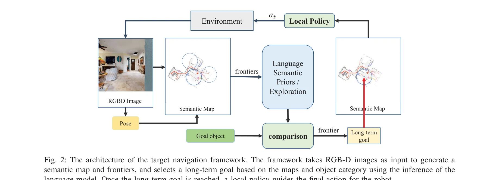
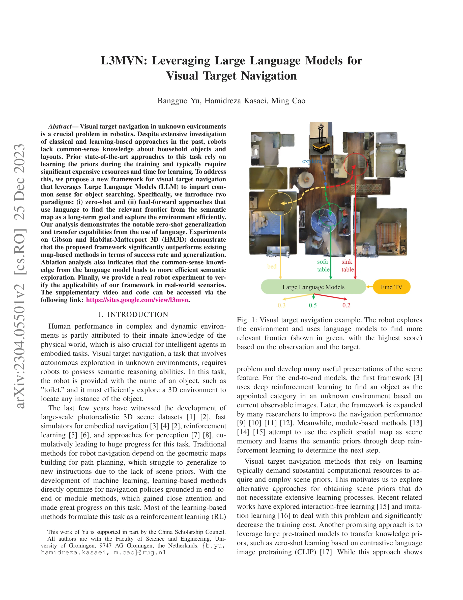

# L3MVN: Leveraging Large Language Models for Visual Target Navigation

> **저자**: Bangguo Yu, Hamidreza Kasaei, Ming Cao | **날짜**: 2023-04-11 | **URL**: [https://arxiv.org/abs/2304.05501](https://arxiv.org/abs/2304.05501)

---

## Essence

*Fig. 2: The architecture of the target navigation framework. The framework takes RGB-D images as input to generate a*

대형 언어모델(LLM)을 활용하여 의미적 맵과 프론티어 선택을 통해 미지의 환경에서 시각적 목표 항법을 수행하는 프레임워크를 제안한다. Zero-shot과 feed-forward 두 가지 패러다임으로 상식적 추론을 이용한 효율적 탐색을 달성한다.

## Motivation

- **Known**: 시각적 목표 항법(Visual Target Navigation)은 로봇 분야의 중요한 과제로, 강화학습 기반의 end-to-end 방식과 의미 맵 기반의 모듈식 방법들이 개발되어 왔다. CLIP 같은 사전학습된 모델들이 최근 로봇 항법에 활용되고 있다.
- **Gap**: 기존 학습 기반 접근법들은 훈련 중 프라이어를 학습해야 하므로 상당한 계산 자원과 시간이 필요하며, 새로운 환경으로의 일반화가 제한적이다. LLM의 상식적 지식을 항법 정책에 직접 활용한 연구가 부족하다.
- **Why**: 로봇이 가정용 물체와 공간 배치에 대한 상식적 지식을 보유하면 탐색 효율성이 크게 향상될 수 있으며, 학습 비용 감소와 새로운 환경으로의 전이 학습이 가능해진다.
- **Approach**: LLM을 이용하여 의미 맵의 프론티어를 설명하고 목표 객체와의 관련성을 평가함으로써 장기 목표를 선택한다. Zero-shot 방식과 대상별 분류기를 학습하는 feed-forward 방식 두 가지를 제시한다.

## Achievement

*Fig. 1: Visual target navigation example. The robot explores*

- **효율적 탐색 및 선택 프레임워크**: RGB-D 입력으로 의미 맵과 프론티어를 생성하고 LLM의 추론으로 장기 목표를 선택하는 통합 아키텍처 제시
- **우수한 성능 및 일반화**: Gibson과 Habitat-Matterport 3D(HM3D) 환경에서 기존 맵 기반 방법들을 성공률과 일반화 측면에서 능가
- **Zero-shot 학습 능력**: 언어를 통한 상식적 추론으로 사전학습 없이 새로운 환경 및 객체에 대응 가능
- **실제 로봇 실험 검증**: 실제 로봇 플랫폼을 통해 시뮬레이션과 현실 간의 간극을 분석하고 실용성 입증

## How

*Fig. 2: The architecture of the target navigation framework. The framework takes RGB-D images as input to generate a*

- 의미 분할(semantic segmentation) 모델을 통해 RGB-D 이미지에서 객체 인스턴스 감지 및 의미 맵 구성
- 프론티어 기반 탐색으로 미탐사 영역의 경계점들을 식별
- Zero-shot 패러다임: 각 프론티어 주변의 객체들을 자연어로 설명하고 LLM에 쿼리하여 목표 객체와의 관련성 점수 계산
- Feed-forward 패러다임: 프론티어 설명을 입력으로 하는 대상 특화 분류기(target-specific classifier)를 학습
- 선택된 프론티어를 장기 목표로 설정하고 고전 경로 계획기(local policy)로 최종 동작 결정
- Habitat 시뮬레이션 플랫폼에서 평가 및 실제 로봇에서 검증

## Originality

- LLM을 시각적 항법의 의미적 탐색 모듈에 직접 활용하는 첫 시도로, 기존의 강화학습 기반 정책 학습 대신 언어 기반 상식 추론 적용
- Zero-shot과 feed-forward 두 가지 LLM 활용 패러다임을 명확히 구분하고 비교
- 프론티어의 자연어 설명을 통한 의미적 탐색이라는 새로운 접근 방식으로 학습 비용 대폭 감소
- 실제 로봇 실험을 포함하여 시뮬레이션과 현실의 간극을 실증적으로 분석

## Limitation & Further Study

- LLM의 추론 시간으로 인한 실시간 성능 영향 미분석 — 실시간 로봇 제어 환경에서의 계산 효율성 평가 필요
- 의미 맵 생성의 정확성이 LLM의 성능에 미치는 영향 — 부정확한 의미 분할의 영향에 대한 상세 분석 필요
- 제한된 실제 로봇 실험 — 다양한 실내 환경과 로봇 플랫폼에서의 확장 검증 필요
- LLM의 언어 이해 한계 — 복잡한 공간 관계나 추상적 객체 설명에 대한 약점 분석 필요
- 후속연구: 멀티모달 LLM(vision-language model)의 직접 활용, 프론티어 선택의 계층적 의사결정, 적응형 탐색 전략 개발

## Evaluation

- Novelty: 4/5
- Technical Soundness: 3/5
- Significance: 4/5
- Clarity: 4/5
- Overall: 4/5

**총평**: LLM의 상식적 지식을 의미적 탐색에 활용하는 창의적인 접근으로 학습 비용을 크게 절감하면서도 우수한 일반화 성능을 달성했다. Zero-shot 학습 능력과 실제 로봇 실험을 통해 실용성을 입증한 의미 있는 연구이나, 실시간 성능과 다양한 환경에서의 확장성 검증이 필요하다.

## Related Papers

- 🔄 다른 접근: [[papers/1461_LM-Nav_Robotic_Navigation_with_Large_Pre-Trained_Models_of_L/review]] — 두 논문 모두 사전훈련된 언어 모델을 네비게이션에 활용하지만, 하나는 의미적 추론에, 다른 하나는 CLIP과의 조합에 집중합니다.
- 🔗 후속 연구: [[papers/1490_NavigateDiff_Visual_Predictors_are_Zero-Shot_Navigation_Assi/review]] — 시각적 목표 네비게이션에서 LLM 기반 추론을 diffusion 기반 예측과 결합하여 더욱 발전시킨 접근법입니다.
- 🏛 기반 연구: [[papers/1600_UniGoal_Towards_Universal_Zero-shot_Goal-oriented_Navigation/review]] — 제로샷 목표 지향 네비게이션의 기본 개념과 방법론이 LLM 기반 시각적 네비게이션의 토대가 됩니다.
- 🧪 응용 사례: [[papers/1505_Open-vocabulary_Queryable_Scene_Representations_for_Real_Wor/review]] — 오픈 어휘 장면 표현이 LLM 기반 의미적 추론을 실제 환경에서 구현하는 데 필요한 기술입니다.
- 🔗 후속 연구: [[papers/1319_BeliefMapNav_3D_Voxel-Based_Belief_Map_for_Zero-Shot_Object/review]] — L3MVN은 BeliefMapNav의 개념을 대규모 언어 모델을 활용한 시각적 목표 네비게이션으로 확장한다
- 🔄 다른 접근: [[papers/1461_LM-Nav_Robotic_Navigation_with_Large_Pre-Trained_Models_of_L/review]] — 두 논문 모두 사전훈련된 언어 모델을 네비게이션에 활용하지만, 접근 방식과 활용하는 모델 조합이 다릅니다.
- 🔗 후속 연구: [[papers/1490_NavigateDiff_Visual_Predictors_are_Zero-Shot_Navigation_Assi/review]] — LLM 기반 시각적 목표 네비게이션을 diffusion 네트워크와 결합하여 더욱 정교한 미래 예측 기반 네비게이션을 구현합니다.
- 🧪 응용 사례: [[papers/1600_UniGoal_Towards_Universal_Zero-shot_Goal-oriented_Navigation/review]] — UniGoal의 zero-shot goal navigation이 L3MVN의 large language model 기반 visual target navigation과 결합되어 더 강력한 목표 지향 시스템을 구성
