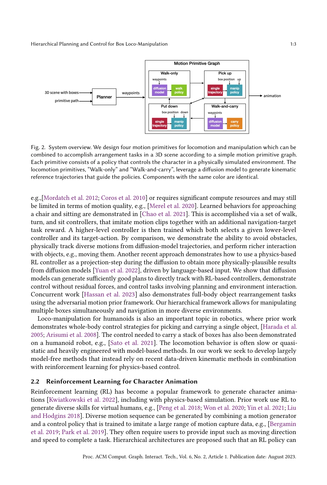

# Hierarchical Planning and Control for Box Loco-Manipulation

> **저자**: Zhaoming Xie, Jonathan Tseng, Sebastian Starke, Michiel van de Panne, C. Karen Liu | **날짜**: 2023-06-15 | **URL**: [https://arxiv.org/abs/2306.09532](https://arxiv.org/abs/2306.09532)

---

## Essence

*Fig. 1. We develop loco-manipulation skills for box-carrying physics-based characters. This is achieved via a*

physics 기반 시뮬레이션된 인간 캐릭터가 계층적 제어 구조(A* 플래너, diffusion 모델, 강화학습)를 통해 복잡한 환경에서 박스를 옮기는 loco-manipulation 작업을 수행할 수 있는 시스템을 제시한다.

## Motivation

- **Known**: 기존 연구는 locomotion과 manipulation을 분리하여 다루거나, 결합 시 물리적 상호작용이 부족하거나 과도한 계산 리소스를 요구하는 문제가 있었다.
- **Gap**: 단일 모션 클립으로부터 다양한 박스 무게, 크기, 높이에 대응하는 physics 기반 manipulation 능력을 일반화하고, 이를 계층적 구조로 locomotion과 통합하는 방법이 부족했다.
- **Why**: virtual humans의 실제 일상 작업(정렬, 정리 등) 수행 능력은 애니메이션, 로봇공학, 디지털 인간 분야에서 필수적이며, 이는 복합적인 locomotion과 manipulation 스킬의 동시 조정을 요구한다.
- **Approach**: hierarchical control architecture를 도입하여 고레벨(A* 공간 경로 계획) → 중레벨(diffusion 모델 기반 kinematic trajectory) → 저레벨(reinforcement learning physics 기반 제어)의 세 계층으로 문제를 분해하고, 각 계층이 서로 다른 추상화 수준에서 작동하도록 설계했다.

## Achievement

*Fig. 2. System overview. We design four motion primitives for locomotion and manipulation which can be*

- **Hierarchical Planning-and-Control System**: 공간 계획, kinematic 모션 생성, physics 기반 제어를 통합한 완전한 loco-manipulation 시스템 구현
- **Diffusion Model with Bidirectional Root Control**: 기존 diffusion 모델을 개선하여 waypoint 조건 만족도를 높이고 physics 기반 제어를 위한 신뢰성 있는 locomotion 궤적 생성
- **Generalization from Single Motion Clip**: 단일 박스 lift-and-place 모션 클립을 다양한 박스 무게, 크기, 높이에 대응하는 physics 기반 스킬로 일반화
- **Object-aware RL Policy**: imitation learning을 통해 다양한 박스 속성에 강건한 carry 행동 학습
- **Code and Trained Policies Release**: 재현성과 접근성 확보

## How

*Fig. 2. System overview. We design four motion primitives for locomotion and manipulation which can be*

- 고레벨: A* 알고리즘으로 pick-up과 place-down 위치 간 기본 경로 계획
- 중레벨: diffusion 모델을 사용하여 고레벨 경로 제약을 만족하는 kinematic locomotion 궤적 생성, bidirectional root representation으로 waypoint 조건 정확도 개선
- 저레벨: motion imitation 기반 deep reinforcement learning으로 kinematic 참조 모션을 추적하는 physics 기반 제어 정책 학습
- Motion Primitives: walk-only, walk-and-carry, pick, place 등 4가지 기본 모션 프리미티브를 정의하여 조합 가능하게 설계
- Object-aware Design: 박스의 물리적 속성(무게, 크기, 높이)을 정책 입력으로 포함하여 일반화 능력 향상

## Originality

- diffusion 모델을 physics 기반 character animation 계획에 처음 적용하고, bidirectional root representation을 도입하여 경로 추종 정확도 개선
- 단일 모션 클립으로부터 physics 기반 manipulation을 다양한 객체 속성으로 일반화하는 object-aware imitation learning 방법
- 계층적 구조로 공간 계획과 모터 스킬 실행을 명확히 분리하여 다양한 arrangement 작업으로의 확장성 확보
- 기존 kinematic 중심 loco-manipulation 방법과 달리 physics 기반 시뮬레이션으로 실제 물리 상호작용 구현

## Limitation & Further Study

- diffusion 모델 기반 궤적 생성이 복잡한 환경에서 최적성을 보장하지 못할 수 있음 - 더 정교한 mid-level 계획 방법 연구 필요
- 박스 pick/place 모션이 단일 클립에 의존하므로 매우 다른 형태나 배치의 객체에 대한 일반화 한계 - 다양한 모션 클립 또는 synthetic 데이터 활용 연구
- 환경 복잡도 증가 시 계산 비용 분석 부재 - 실시간성 평가 필요
- 인간 모션 데이터셋의 편향이 생성된 locomotion에 반영될 수 있음 - 다양한 데이터셋 활용 연구
- 현재 단일 캐릭터 시뮬레이션만 다룸 - 다중 에이전트 loco-manipulation 확장 가능성

## Evaluation

- Novelty: 4/5
- Technical Soundness: 4/5
- Significance: 4/5
- Clarity: 4/5
- Overall: 4/5

**총평**: 이 논문은 hierarchical 아키텍처를 통해 physics 기반 loco-manipulation을 효과적으로 해결하며, diffusion 모델의 새로운 적용, object-aware generalization, 공개된 구현으로 character animation과 robotics 분야에 실질적인 기여를 한다.

## Related Papers

- 🏛 기반 연구: [[papers/1275_ASE_Large-Scale_Reusable_Adversarial_Skill_Embeddings_for_Ph/review]] — ASE의 대규모 재사용 가능한 adversarial skill embedding이 계층적 loco-manipulation 제어의 기반이 된다.
- 🔄 다른 접근: [[papers/1330_DeepMimic_Example-Guided_Deep_Reinforcement_Learning_of_Phys/review]] — 물리 기반 캐릭터 제어에서 강화학습과 diffusion 모델이라는 서로 다른 접근 방식을 보여준다.
- 🔗 후속 연구: [[papers/1442_Heracles_Bridging_Precise_Tracking_and_Generative_Synthesis/review]] — 정밀한 추적과 생성적 합성을 연결하는 Heracles가 계층적 계획과 제어의 확장된 형태를 제시한다.
- 🧪 응용 사례: [[papers/1460_LLM3Large_Language_Model-based_Task_and_Motion_Planning_with/review]] — 계층적 계획과 제어 방법론이 LLM 기반 작업-모션 계획을 실제 로봇 시스템에 적용하는 데 필요합니다.
- 🧪 응용 사례: [[papers/1583_Text2Reward_Reward_Shaping_with_Language_Models_for_Reinforc/review]] — Language to Rewards 연구의 로봇 스킬 합성 방법론에 Text2Reward의 자동 보상 함수 생성을 적용하여 더 다양한 스킬 학습을 가능하게 한다.
- 🏛 기반 연구: [[papers/1620_VLA-RL_Towards_Masterful_and_General_Robotic_Manipulation_wi/review]] — Language to Rewards의 언어 기반 보상 설계가 VLA-RL의 robotic process reward model 개발 기반이 된다
