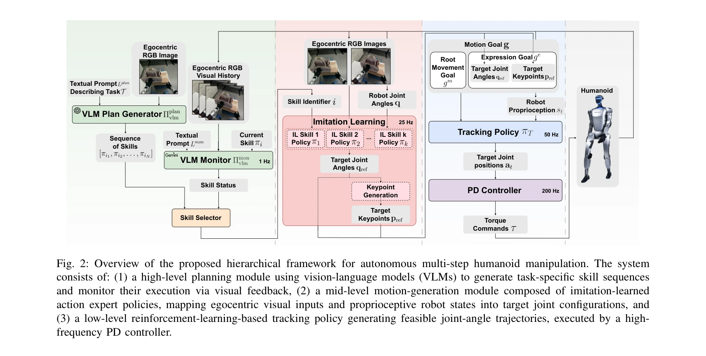
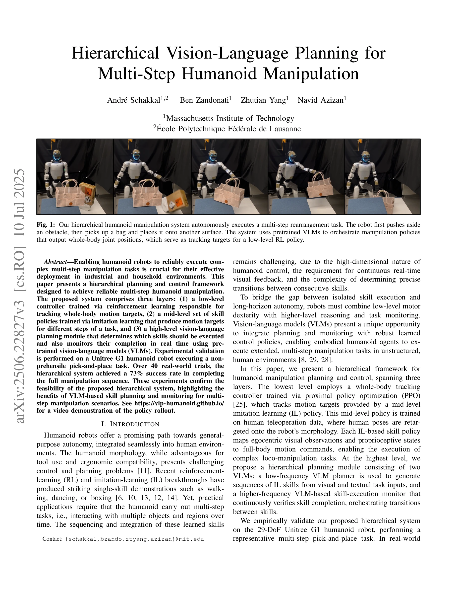

# Hierarchical Vision-Language Planning for Multi-Step Humanoid Manipulation

> **저자**: André Schakkal, Ben Zandonati, Zhutian Yang, Navid Azizan | **날짜**: 2025-06-28 | **URL**: [https://arxiv.org/abs/2506.22827](https://arxiv.org/abs/2506.22827)

---

## Essence

*Fig. 2: Overview of the proposed hierarchical framework for autonomous multi-step humanoid manipulation. The system*

휴머노이드 로봇의 다단계 조작 작업을 위해 저수준 RL 기반 추적 제어기, 중간 수준의 모방 학습 스킬 정책, 고수준 VLM 기반 계획 및 모니터링을 통합한 3계층 계층적 프레임워크를 제시하고 Unitree G1에서 73% 성공률 달성.

## Motivation

- **Known**: ExBody 및 HumanPlus 등의 선행 연구에서 RL 기반 저수준 추적 정책과 IL 기반 중간 수준 스킬 정책을 통한 2계층 휴머노이드 제어 구조가 단일 스킬 작업(춤, 들기, 권투)에서 성공을 보였음.
- **Gap**: 기존 2계층 휴머노이드 시스템은 스킬 간 전환 시 인간 개입이 필요하며, 다단계 작업의 자동 스킬 선택·순서 결정 및 실행 검증을 위한 고수준 계획 모듈이 부재함.
- **Why**: 휴머노이드 로봇이 산업 및 가정 환경에서 실질적으로 배포되려면 단일 스킬을 넘어 객체 조작, 장애물 제거 등 다단계 작업을 자율적으로 수행할 수 있어야 함.
- **Approach**: VLM 기반 계획 생성기가 텍스트·시각 입력으로부터 스킬 수열을 결정하고, VLM 기반 모니터가 시각 피드백을 통해 스킬 완료를 실시간 검증하는 고수준 계획·모니터링 층을 추가하여 3계층 프레임워크 구성.

## Achievement

*Fig. 1: Our hierarchical humanoid manipulation system autonomously executes a multi-step rearrangement task. The robot f*

- **3계층 계층적 프레임워크**: RL 기반 추적 제어기, IL 기반 스킬 정책, VLM 기반 계획·모니터링을 통합하여 자동 다단계 조작 실현
- **실제 로봇 검증**: Unitree G1 휴머노이드에서 물건 옮기기 위에 장애물 제거를 포함한 비-파지 픽-앤-플레이스 작업 40회 시도 중 73% 성공률 달성
- **VLM 기반 스킬 모니터링**: 시각 피드백을 활용한 실시간 스킬 완료 검증으로 안정적인 스킬 전환 구현

## How

*Fig. 2: Overview of the proposed hierarchical framework for autonomous multi-step humanoid manipulation. The system*

- **저수준 정책**: ExBody 아키텍처 기반 PPO 훈련 추적 컨트롤러가 근 운동 목표(기저부 속도·방향) 및 표현 목표(관절각, 키포인트)를 추적하여 관절 명령 생성
- **중간 수준 정책**: 인간 원격 조작 데이터로부터 20-40개 시연 기반 IL 훈련 스킬 정책이 자아중심 시각 및 고유감각 입력으로부터 전신 운동 명령 생성
- **고수준 계획**: VLM 계획 생성기가 작업 설명과 시각 입력으로부터 스킬 수열 생성, VLM 모니터가 현재 시각 프레임 및 스킬 설명으로부터 스킬 완료 여부 판단
- **실행 루프**: 25 Hz 스킬 정책, 50 Hz 이미지 캡처, 200 Hz PD 제어기, 1 Hz VLM 모니터로 다중 시간 스케일 실현

## Originality

- VLM을 단순 의사결정이 아닌 **실시간 스킬 완료 모니터링**으로 사용한 점이 신규로, 동적 환경에서의 오류 복구 능력 제공
- 기존 2계층 휴머노이드 제어에 **VLM 기반 고수준 계획·모니터링 층**을 추가하여 자동 다단계 작업 실현
- IL 스킬 정책과 VLM 계획을 결합하여 **구조화된 스킬 분해 및 VLM 기반 실행 검증**으로 신뢰성 향상

## Limitation & Further Study

- 73% 성공률은 상용화 수준의 안정성을 충족하지 못하며, 실패 케이스 분석 및 개선 방안 미제시
- 단일 작업(비-파지 픽-앤-플레이스)에만 검증되었으며, 다양한 조작 작업에 대한 일반화 가능성 불명확
- VLM 모니터의 오류 감지 정확도와 거짓 긍정/부정 발생 현황 미분석
- 20-40개 시연 기반 IL 훈련으로 새로운 스킬 획득 시 데이터 수집 및 훈련 비용 미검토
- **후속 연구**: (1) 더 큰 스킬 라이브러리 및 다양한 작업으로 일반화 검증, (2) VLM 모니터의 신뢰도 향상 및 오류 복구 정책 개발, (3) 시간 효율성 및 계산 비용 최적화

## Evaluation

- Novelty: 4/5
- Technical Soundness: 3/5
- Significance: 4/5
- Clarity: 4/5
- Overall: 4/5

**총평**: 휴머노이드 로봇의 자동 다단계 조작 실현을 위해 VLM 기반 고수준 계획·모니터링을 기존 2계층 제어에 통합한 실질적이고 신규한 접근으로, 실제 로봇 검증으로 실행 가능성을 입증했으나 성공률 개선과 다양한 작업으로의 일반화가 향후 과제.

## Related Papers

- 🔄 다른 접근: [[papers/1463_Humanoid_Agent_via_Embodied_Chain-of-Action_Reasoning_with_M/review]] — 둘 다 VLM 기반 휴머노이드 계획을 다루지만 Hierarchical Planning은 3계층 구조에, Humanoid-COA는 Chain-of-Action 추론에 집중한다
- 🔗 후속 연구: [[papers/1483_HumanoidVLM_Vision-Language-Guided_Impedance_Control_for_Con/review]] — HumanoidVLM의 VLM 기반 임피던스 제어를 다단계 조작 계획으로 확장했다
- 🏛 기반 연구: [[papers/1445_Hierarchical_Vision-Language_Planning_for_Multi-Step_Humanoi/review]] — 계층적 강화학습과 VLM 통합의 기본 프레임워크를 제시한다
- 🔄 다른 접근: [[papers/1463_Humanoid_Agent_via_Embodied_Chain-of-Action_Reasoning_with_M/review]] — 둘 다 VLM 기반 휴머노이드 계획이지만 Humanoid-COA는 Chain-of-Action에, Hierarchical Planning은 3계층 구조에 집중한다
- 🏛 기반 연구: [[papers/1483_HumanoidVLM_Vision-Language-Guided_Impedance_Control_for_Con/review]] — VLM 기반 작업 인식이 계층적 다단계 조작의 기반이 된다
- 🔗 후속 연구: [[papers/1528_Learning_Humanoid_End-Effector_Control_for_Open-Vocabulary_V/review]] — HERO의 대규모 비전 모델과 엔드-이펙터 제어 통합이 다단계 휴머노이드 조작을 위한 계층적 비전-언어 계획으로 확장된다.
