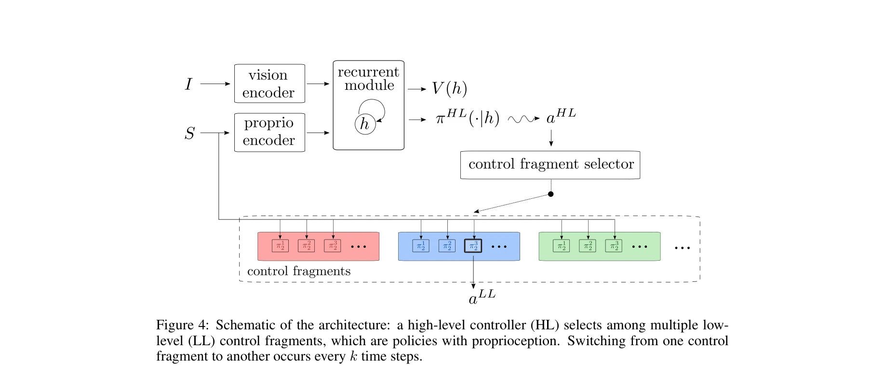
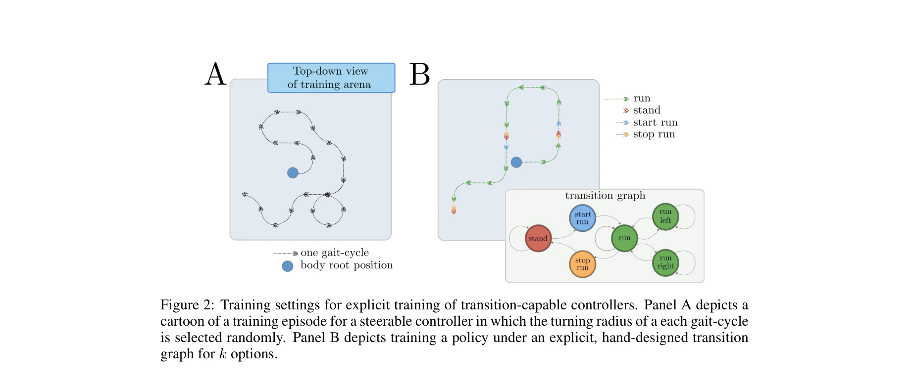
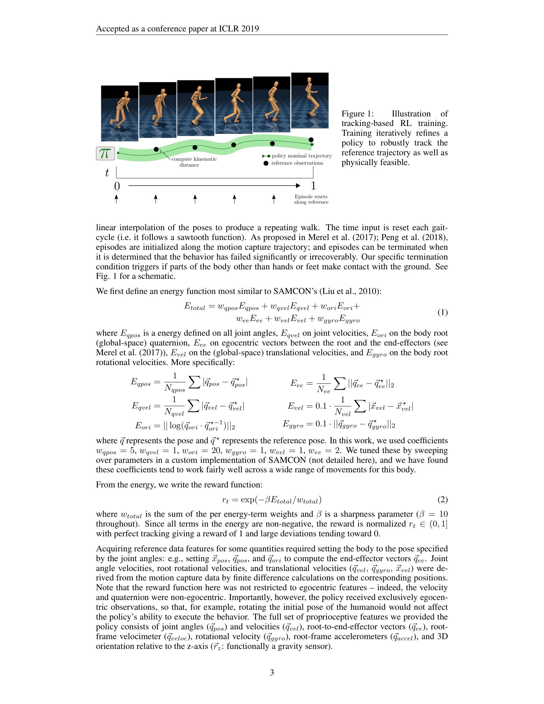

# Hierarchical visuomotor control of humanoids

> **저자**: Josh Merel, Arun Ahuja, Vu Pham, Saran Tunyasuvunakool, Siqi Liu, Dhruva Tirumala, Nicolas Heess, Greg Wayne | **날짜**: 2018-11-23 | **URL**: [https://arxiv.org/abs/1811.09656](https://arxiv.org/abs/1811.09656)

---

## Essence

*Figure 4: Schematic of the architecture: a high-level controller (HL) selects among multiple low-*

이 논문은 고자유도 휴머노이드 신체를 시각적 피드백으로 제어하기 위해 저수준의 고정된 모터 제어기와 고수준의 시각 기반 정책 선택기를 계층적으로 결합하는 아키텍처를 제시한다.

## Motivation

- **Known**: 고차원 입력과 출력을 동시에 처리하는 것이 강화학습의 주요 과제이며, 모션 캡처 데이터로부터 추출한 움직임 원시(movement primitives)나 제어 단편(control fragments)을 이용한 계층적 제어는 로봇공학과 애니메이션 분야에서 연구되어 왔다.
- **Gap**: 기존 제어 단편 기반 접근법들은 시각 입력과 통합되지 않았으며, 다수의 제어 단편을 스케일링하여 실제 비전 기반 작업을 해결한 사례가 부족하다.
- **Why**: 시각, 기억, 모터 제어를 통합하는 복합 휴머노이드 에이전트 개발은 로봇 제어의 근본적인 도전 과제이며, 신경과학의 척수 반사 및 피질-기저핵 협력 메커니즘에서 영감을 얻을 수 있다.
- **Approach**: 모션 캡처 데이터로부터 SAMCON 기반 추적 보상을 통해 시간 인덱싱 저수준 정책을 먼저 학습한 후, 자체 중심 시각과 기억을 사용하는 고수준 정책이 이들 저수준 정책을 전환하여 작업을 수행하도록 강화학습으로 훈련한다.

## Achievement

*Figure 2: Training settings for explicit training of transition-capable controllers. Panel A depicts a*

- **56 DoF 휴머노이드 제어**: 높은 자유도를 가진 시뮬레이션 휴머노이드 신체를 복잡한 시각 기반 작업을 통해 제어할 수 있음을 입증
- **계층적 아키텍처의 확장성**: 이전 연구보다 더 많은 수의 제어 단편을 효과적으로 관리할 수 있으며, 저수준 제어기 간의 전환이 부드럽게 이루어질 수 있음을 보임
- **통합 에이전트 시스템**: 비전, 메모리, 모터 제어를 통합하여 불안정한 자체 중심 RGB 카메라 입력에서도 동작하는 에이전트 개발
- **여러 인터페이싱 전략 비교**: 명시적 전환(explicit switching), 평활 전환(smooth blending) 등 다양한 저수준-고수준 제어기 통합 방식에 대한 상세 비교 분석

## How

*Figure 1:*

- **모션 캡처 기반 저수준 정책 학습**: 각 모션 캡처 클립(2-6초)에 대해 joint position, velocity, end-effector 벡터, 중력 센서 등 자체 중심 proprioceptive 관찰을 입력으로 하는 시간 인덱싱 정책을 학습
- **추적 보상 함수**: 관절 각도, 속도, 방향, 끝단 위치, 속도 등 6가지 에너지 항을 가중합으로 계산하여 exp(-βEtotal/wtotal) 형태의 보상 정의 (β=10)
- **감독 학습 사전학습**: 위치 제어 정책을 먼저 감독학습(supervised learning)으로 사전학습한 후 강화학습으로 미세조정하여 수렴 시간 단축
- **고수준 정책 학습**: 자체 중심 시각 입력과 proprioceptive 입력을 모두 사용하는 분산 actor-critic 기반 off-policy 강화학습으로 저수준 정책 선택 신호 학습
- **작업 정의**: Go-to-target, Push-object 등 sparse reward를 가진 구체적 작업에 대해 고수준 정책 학습

## Originality

- **시각-모터 통합의 실제 입증**: 제어 단편 기반 계층적 제어를 처음으로 자체 중심 비전 입력과 명시적으로 통합
- **시간 인덱싱 정책의 활용**: 모션 캡처 추적을 위해 위상 변수(phase variable) 방식의 시간 인덱싱을 적용하여 일반적인 시간 독립 정책보다 더 견고한 성능 달성
- **다중 전환 메커니즘 비교**: Cold-switching, smooth blending, learned switching 등 여러 저수준-고수준 인터페이스 방식의 체계적 비교 분석
- **대규모 제어 단편 세트**: 이전 연구보다 훨씬 많은 수의 제어 단편(모션 클립)을 효과적으로 조합

## Limitation & Further Study

- **시뮬레이션 환경에 국한**: 물리 시뮬레이션된 환경에서만 검증되었으며 실제 로봇 플랫폼으로의 시무레이션-투-리얼(sim-to-real) 전이는 다루지 않음
- **모션 캡처 데이터 의존성**: 초기 저수준 정책이 고품질 모션 캡처 데이터에 의존하므로, 새로운 행동 추가 시 추가적인 모캡 녹화 필요
- **제어 단편의 고정성**: 각 저수준 정책이 특정 모션 클립 추적에 최적화되어 있어, 새로운 작업 환경에 적응하는 유연성이 제한적
- **고수준 정책의 메모리 제약**: 에고센트릭 카메라로부터의 시각 정보 처리와 공간적 기억 구성에 대한 상세한 논의 부족
- **후속연구 방향**: 더 복잡한 비전-기반 작업으로의 확장, 현실 환경으로의 적용, 온라인 학습을 통한 제어 단편의 동적 생성

## Evaluation

- Novelty: 4/5
- Technical Soundness: 3/5
- Significance: 4/5
- Clarity: 4/5
- Overall: 4/5

**총평**: 이 논문은 복잡한 휴머노이드 제어를 위해 모션 캡처 기반의 계층적 정책 구조를 창의적으로 설계하고 시각 입력과의 통합을 실현함으로써, 시각-모터 제어 분야에 의미 있는 기여를 한다. 다만 시뮬레이션 환경에 국한된 점과 모션 캡처 데이터에 대한 의존성이 실제 응용으로의 확장을 제한한다.

## Related Papers

- 🏛 기반 연구: [[papers/1456_HOVER_Versatile_Neural_Whole-Body_Controller_for_Humanoid_Ro/review]] — 계층적 visuomotor control의 저수준/고수준 분리 개념은 HOVER의 다중 제어 모드 통합에 기반이 된다.
- 🔗 후속 연구: [[papers/1495_InEKFormer_A_Hybrid_State_Estimator_for_Humanoid_Robots/review]] — 시각 기반 제어는 InEKFormer의 하이브리드 상태 추정을 통해 더욱 정확한 시각적 피드백을 제공받을 수 있다.
- 🔄 다른 접근: [[papers/1560_LookOut_Real-World_Humanoid_Egocentric_Navigation/review]] — 두 논문 모두 시각 기반 제어를 다루지만, 하나는 일반적 visuomotor control에, 다른 하나는 egocentric navigation에 특화되어 있다.
