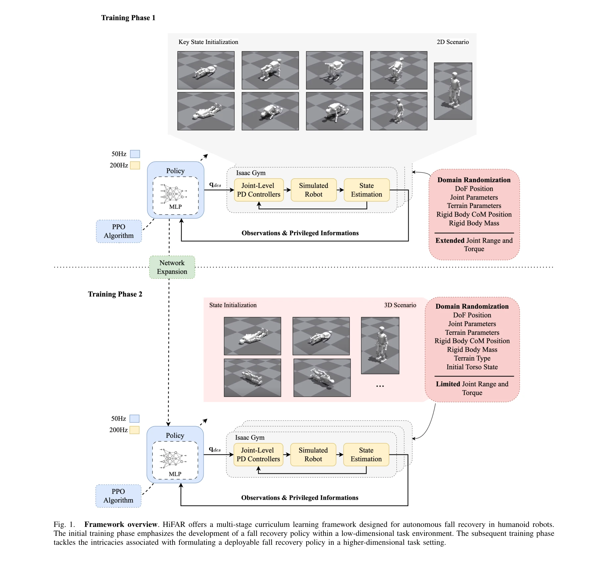

# HiFAR: Multi-Stage Curriculum Learning for High-Dynamics Humanoid Fall Recovery

> **저자**: Penghui Chen, Yushi Wang, Changsheng Luo, Wenhan Cai, Mingguo Zhao | **날짜**: 2025-02-27 | **URL**: [https://arxiv.org/abs/2502.20061](https://arxiv.org/abs/2502.20061)

---

## Essence

*Fig. 1.*

HiFAR는 다단계 curriculum learning을 통해 인형로봇의 fall recovery를 학습하는 프레임워크로, 저차원 태스크부터 시작하여 점진적으로 복잡성을 증대시키며 실제 로봇에서 높은 성공률을 달성한다.

## Motivation

- **Known**: Fall recovery는 FSM, optimization 기반 방법(MPC, WBC), 그리고 reinforcement learning 등으로 연구되어 왔으며, 최근 RL 기반 접근이 contact-rich 태스크에서 유망한 성과를 보이고 있다.
- **Gap**: 기존 RL 기반 fall recovery 방법들은 sparse reward, 복잡한 collision 시나리오, sim-to-real gap 등으로 인해 다양한 fall 상황과 외부 교란에 대한 적응성과 강건성이 부족하다.
- **Why**: 인형로봇이 동적이고 비정형 환경에서 자율적으로 fall에서 회복할 수 있는 능력은 실제 배포에 필수적이며, 빠른 회복은 다운타임 최소화와 안전성 향상을 가능하게 한다.
- **Approach**: 다단계 curriculum 프레임워크를 통해 초기 단계에서는 2D fall 시나리오의 저차원 태스크로 기본 정책을 학습하고, 두 번째 단계에서는 고차원 배포 시나리오로 확장하여 KSI와 reward shaping을 적용한다.

## Achievement

*Fig. 1.*

- **다단계 curriculum 설계**: 고차원 fall recovery 태스크를 저차원 태스크부터 점진적으로 복잡하게 증대시키는 stage division 전략 제시
- **학습 효율화**: KSI와 reward shaping을 통해 안정적인 fall recovery 정책의 수렴을 가속화하고, 보조 actuated joint를 통한 dimensionality expansion으로 다양한 fall 시나리오에 강건한 일반화 달성
- **실제 로봇 검증**: Booster T1 인형로봇에서 supine, prone, lateral falls에 대한 높은 성공률, 빠른 회복 시간, 강건성 및 일반화 능력 입증

## How

*Fig. 2.*

- Stage 1: (x, z) 평면 내 joints만 활용하여 2D fall 시나리오(supine, prone)에서 저차원 정책 학습
- Stage 2: 추가 actuated joints를 포함하여 고차원 배포 환경으로 확장하고 lateral falls 등 다양한 시나리오 포함
- KSI(Key State Initialization)를 이용한 일관된 시작점 제공으로 학습 안정화
- Reward shaping을 통한 정책 유도 및 수렴 가속화
- Booster Gym 프레임워크 기반 구현으로 sim-to-real transfer 및 다중 시뮬레이터 평가 지원

## Originality

- Fall recovery 문제에 특화된 dimensionality expansion 전략으로, 저차원에서 고차원으로의 구조화된 전이 제시
- KSI와 reward shaping의 조합을 통해 sparse reward 문제와 contact-rich 동역학의 수렴 어려움 해결
- 기존 HumanUp 등과 달리 trajectory tracking 제약이 없어 더 빠르고 적응적인 회복 가능

## Limitation & Further Study

- 논문에서는 stage 2의 구체적인 구현 및 추가 constraints에 대한 자세한 설명이 제시되지 않음
- 단일 로봇 플랫폼(Booster T1)에서만 검증되어 다양한 humanoid 설계에 대한 일반화 수준 불명확
- 외부 교란의 구체적인 형태와 강도에 대한 정량적 분석 부족
- Computational latency와 real-time 성능 요구사항에 대한 분석 필요
- 후속 연구: 더 복잡한 환경(stairs, slopes), 다양한 humanoid 플랫폼으로의 확장, sim-to-real gap의 체계적 분석

## Evaluation

- Novelty: 4/5
- Technical Soundness: 3/5
- Significance: 4/5
- Clarity: 4/5
- Overall: 4/5

**총평**: HiFAR는 curriculum learning의 구조화된 설계를 통해 실제 인형로봇의 fall recovery라는 중요한 문제를 효과적으로 해결하며, multi-stage 접근과 KSI/reward shaping의 조합으로 높은 실용성을 입증한다. 다만 기술적 깊이와 일반화 수준에서 추가 분석이 필요하다.

## Related Papers

- 🔄 다른 접근: [[papers/1523_Learning_Getting-Up_Policies_for_Real-World_Humanoid_Robots/review]] — 두 논문 모두 휴머노이드의 일어서기/회복 동작을 다루지만, HiFAR는 curriculum learning에, 다른 논문은 실제 환경 적응에 초점을 둔다.
- 🔗 후속 연구: [[papers/1505_Keep_on_Going_Learning_Robust_Humanoid_Motion_Skills_via_Sel/review]] — HiFAR의 다단계 curriculum은 SA2RT의 선택적 적대 훈련과 결합하여 더욱 강건한 fall recovery를 달성할 수 있다.
- 🏛 기반 연구: [[papers/1348_Discovering_Self-Protective_Falling_Policy_for_Humanoid_Robo/review]] — Multi-stage curriculum learning은 self-protective falling policy 발견의 체계적인 학습 방법론을 제공한다.
- 🔄 다른 접근: [[papers/1358_Dribble_Master_Learning_Agile_Humanoid_Dribbling_through_Leg/review]] — HiFAR의 multi-stage curriculum과 Dribble Master의 two-stage curriculum이 각각 다른 방식으로 복잡한 동적 기술을 단계별로 학습한다.
- 🏛 기반 연구: [[papers/1474_Humanoid_Whole-Body_Badminton_via_Multi-Stage_Reinforcement/review]] — 배드민턴의 multi-stage RL curriculum은 HiFAR의 curriculum learning 방법론에서 영감을 받는다.
- 🏛 기반 연구: [[papers/1505_Keep_on_Going_Learning_Robust_Humanoid_Motion_Skills_via_Sel/review]] — SA2RT의 선택적 적대 훈련은 HiFAR의 curriculum learning과 결합하여 더욱 강건한 동작 학습을 달성할 수 있다.
- 🔄 다른 접근: [[papers/1595_OmniXtreme_Breaking_the_Generality_Barrier_in_High-Dynamic_H/review]] — 크로스 임바디먼트 조작을 위한 잠재 행동 확산과 actuation-aware 잔여 학습이 서로 다른 일반화 접근법을 제시합니다.
