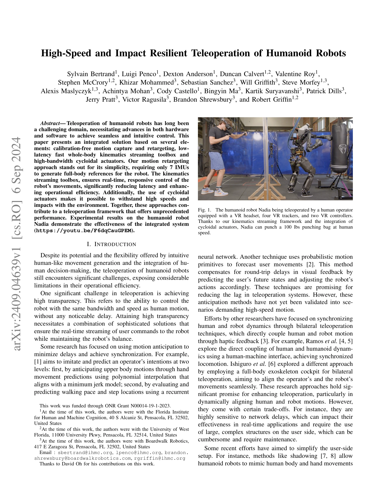
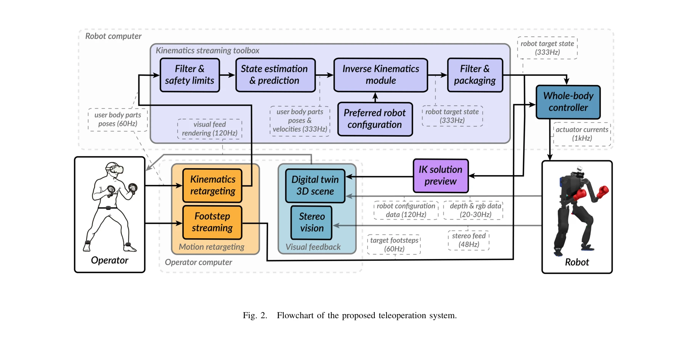

# High-Speed and Impact Resilient Teleoperation of Humanoid Robots

> **저자**: Sylvain Bertrand, Luigi Penco, Dexton Anderson, Duncan Calvert, Valentine Roy, Stephen McCrory, Khizar Mohammed, Sebastian Sanchez, Will Griffith, Steve Morfey, Alexis Maslyczyk, Achintya Mohan, Cody Castello, Bingyin Ma, Kartik Suryavanshi, Patrick Dills, Jerry Pratt, Victor Ragusila, Brandon Shrewsbury, Robert Griffin | **날짜**: 2024-09-06 | **URL**: [https://arxiv.org/abs/2409.04639](https://arxiv.org/abs/2409.04639)

---

## Essence

*Fig. 1.*

본 논문은 7개의 IMU 기반 캘리브레이션 없는 모션 레타게팅, 저지연 고속 전신 운동학 스트리밍 도구상자, 고대역폭 cycloidal actuator를 통합하여 인간형 로봇의 고속 및 충격 복원력 있는 원격 조종 시스템을 제시한다.

## Motivation

- **Known**: 인간형 로봇 원격 조종은 오랫동안 고도의 투명성(latency 없는 인간 수준의 제어)을 달성하기 위해 모션 예측, 양방향 피드백, 또는 RGB 카메라 기반 방법 등의 해결책들이 연구되어 왔다.
- **Gap**: 기존 방법들은 모션 예측은 고속 동작에서 검증되지 않았고, 양방향 피드백은 네트워크 지연에 민감하며, RGB 기반 방법은 대규모 학습 데이터가 필요한 한계가 있다.
- **Why**: 인간형 로봇의 원격 조종이 직관적이고 고속의 상호작용을 요구하는 실제 응용(재난 구조, 위험 작업 등)에서 높은 투명성과 안정성이 필수적이다.
- **Approach**: 최소한의 센서(7 IMU) 기반 실시간 모션 캡처와 스케일링 기반 레타게팅으로 사용자 입력을 획득하고, KST(Kinematics Streaming Toolbox)를 통해 필터링, 상태 예측, 역운동학 계산을 1kHz 대역폭으로 수행하며, cycloidal actuator로 고속 및 충격 내구성을 확보한다.

## Achievement

*Fig. 1.*

- **최소 센서 모션 캡처**: 7개 IMU(VR 헤드셋, 4개 tracker, 2개 컨트롤러)만으로 시작 캘리브레이션 없이 전신 참조 신호 생성
- **고속 제어 대역폭**: 60Hz 사용자 입력으로부터 1kHz 제어 대역폭 달성으로 실시간 반응성 확보
- **충격 복원력**: cycloidal actuator 통합으로 100 lbs 펀칭백을 인간 속도로 타격 가능
- **통합 시스템 검증**: Nadia 인간형 로봇의 실제 고속 동작 실험으로 시스템 효과성 입증

## How

*Fig. 2.*

- **모션 캡처 설정**: Vive Focus 3 VR 헤드셋, 2개 VR 컨트롤러, 4개 Vive Ultimate tracker(흉부, 허리, 발목)로 무선 구성
- **골반 레타게팅**: 초기 위치 기준 허리 tracker의 수직 이동을 로봇 골반 높이 비율로 스케일링(식 1-3)
- **손 레타게팅**: 흉부 tracker와 헤드셋 거리로부터 머리 길이 추정(식 4)하여 어깨 위치 계산 후, 사용자 팔 길이를 로봇 팔 길이로 스케일 변환(식 5-7)
- **KST 파이프라인**: 입력 필터링 및 안전 제한 → 상태 추정 및 예측 모듈 → inverse kinematics 계산 → 필터링 및 패킹 → 전신 컨트롤러 실행
- **시각 피드백**: 디지털 트윈 3D 장면과 stereo vision을 통한 실시간 피드백 제공
- **전신 제어**: 로봇 측 whole-body controller가 footstep streaming과 KST 명령을 받아 균형 유지하며 실행

## Originality

- **단순성과 확장성**: 복잡한 양방향 피드백이나 대규모 학습 대신 기하학적 스케일링 기반 접근으로 새로운 사용자/로봇에 대한 적응성 확보
- **통합 설계**: 모션 캡처, 운동학 스트리밍, actuator 성능을 조화롭게 통합하여 고속 동작 시나리오에서 검증된 완전한 시스템 제시
- **IMU 최소화**: 7개 IMU만으로 전신 참조를 생성하는 효율적인 레타게팅 방법은 기존 RGB 또는 full mocap 대비 간단하고 robust

## Limitation & Further Study

- **상태 추정 및 예측 세부사항 부재**: KST 내 filtering, estimation, prediction 기법의 구체적 알고리즘과 파라미터가 논문에 명시되지 않음
- **cycloidal actuator 설계 미상**: 고대역폭 cycloidal actuator의 설계 원리, 제어 방식, 성능 사양이 불충분하게 기술됨
- **로봇 안정성 검증 제한**: 고속 동작 중 로봇 균형 유지 메커니즘과 안정성 보장 조건이 자세히 다루어지지 않음
- **일반화 평가 부족**: Nadia 로봇에 대한 사례 연구만 제시되어 다른 인간형 로봇 플랫폼에의 적용 가능성이 불명확
- **네트워크 지연 영향 미분석**: 무선 통신 지연(latency)이 시스템 성능에 미치는 영향과 그 보상 방법이 다루어지지 않음
- **후속 연구 방향**: (1) 적응형 예측 모델 도입으로 개인화된 사용자 의도 학습, (2) 여러 로봇 플랫폼으로의 확대 및 이질적 actuator 호환성 연구, (3) 실제 환경에서의 네트워크 지연 및 환경 교란 내구성 평가

## Evaluation

- Novelty: 3/5
- Technical Soundness: 3/5
- Significance: 4/5
- Clarity: 3/5
- Overall: 3/5

**총평**: 본 논문은 7 IMU 기반 간단한 모션 레타게팅, 저지연 고속 운동학 스트리밍, cycloidal actuator의 통합으로 인간형 로봇 원격 조종의 실용적 솔루션을 제시하며, 실제 고속 동작 실험으로 유효성을 입증했다. 그러나 KST 알고리즘 세부사항, cycloidal actuator 설계, 안정성 보장 조건 등의 기술적 깊이가 부족하고 단일 로봇 검증에 그쳐 일반화 가능성이 제한적이다.

## Related Papers

- 🔄 다른 접근: [[papers/1526_Learning_Human-to-Humanoid_Real-Time_Whole-Body_Teleoperatio/review]] — IMU 기반 고속 텔레오퍼레이션과 RGB 카메라 기반 전신 텔레오퍼레이션이 서로 다른 센서 방식으로 동일한 휴머노이드 제어 문제를 해결한다.
- 🔗 후속 연구: [[papers/1391_ExtremControl_Low-Latency_Humanoid_Teleoperation_with_Direct/review]] — 고속 충격 복원력 텔레오퍼레이션이 직접 제어를 통한 저지연 휴머노이드 텔레오퍼레이션 ExtremControl로 확장되었다.
- 🏛 기반 연구: [[papers/1240_A_Closed-Form_Geometric_Retargeting_Solver_for_Upper_Body_Hu/review]] — IMU 기반 고속 텔레오퍼레이션의 모션 레타게팅이 폐쇄형 기하학적 상체 휴머노이드 솔버의 기반 기술을 활용한다.
- 🧪 응용 사례: [[papers/1480_Moto_Latent_Motion_Token_as_the_Bridging_Language_for_Learni/review]] — 비디오에서의 잠재 행동 사전학습이 motion token 기반 로봇 학습에 실제 적용되는 사례입니다.
- 🔄 다른 접근: [[papers/1526_Learning_Human-to-Humanoid_Real-Time_Whole-Body_Teleoperatio/review]] — 실시간 전신 텔레오퍼레이션을 위해 H2O는 RGB 카메라를, High-Speed 시스템은 IMU 기반 접근법을 사용하는 대안적 방법이다.
