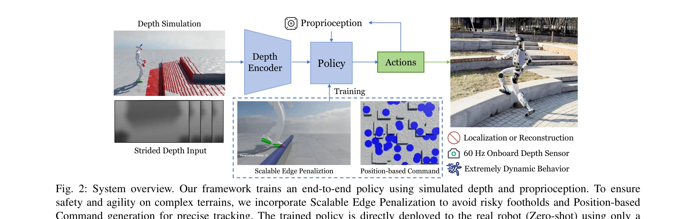
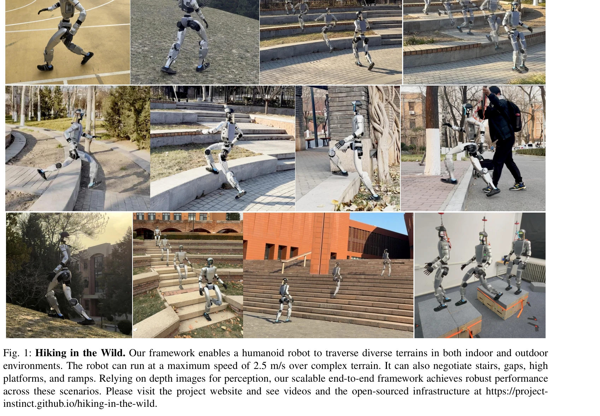

# Hiking in the Wild: A Scalable Perceptive Parkour Framework for Humanoids

> **저자**: Shaoting Zhu, Ziwen Zhuang, Mengjie Zhao, Kun-Ying Lee, Hang Zhao | **날짜**: 2026-01-12 | **DOI**: [10.48550/arXiv.2601.07718](https://doi.org/10.48550/arXiv.2601.07718)

---

## Essence

*Fig. 2: System overview. Our framework trains an end-to-end policy using simulated depth and proprioception. To ensure*

Hiking in the Wild는 깊이 카메라와 고유감각 정보를 직접 관절 동작으로 매핑하는 단일 단계 end-to-end 강화학습 프레임워크로, 외부 상태 추정 없이 humanoid 로봇이 복잡한 야외 지형을 최대 2.5 m/s 속도로 안전하게 탐색할 수 있게 한다.

## Motivation

- **Known**: Blind locomotion은 고유감각만으로 강건한 보행을 달성했지만 반응적 특성으로 인해 큰 장애물에 취약하며, LiDAR 기반 elevation map 방식은 위치 추정 드리프트와 동작 왜곡에 문제가 있고, 깊이 이미지 기반 heightmap 방식은 확장성이 제한적이다.
- **Gap**: 기존 end-to-end 접근법들은 확장성 부족, 복잡한 훈련 프로세스, 실시간 고속 의사결정 능력 부재, 그리고 reward hacking 문제를 겪고 있다.
- **Why**: Humanoid 로봇이 현실의 미지의 복잡한 야외 환경에서 안전하고 민첩하게 이동할 수 있는 능력은 재해 구조, 탐사, 일상 보조 작업 등 광범위한 실무 적용에 필수적이다.
- **Approach**: Terrain Edge Detection과 Foot Volume Points를 결합한 발판 안전 메커니즘, Flat Patch Sampling을 통한 위치 기반 속도 명령 생성, 그리고 센서 노이즈를 모델링하는 깊이 합성 모듈을 포함한 PPO 기반 단일 단계 end-to-end 강화학습 프레임워크를 제시한다.

## Achievement

*Fig. 1: Hiking in the Wild. Our framework enables a humanoid robot to traverse diverse terrains in both indoor and outdo*

- **안전성 강화**: Terrain Edge Detection과 Foot Volume Points를 통해 계단 모서리와 갭에서의 재앙적 미끄러짐 방지
- **Reward Hacking 해결**: Flat Patch Sampling 전략으로 무작위 속도 명령의 제자리 회전 문제를 제거하고 방향 준수 향상
- **Zero-shot Sim-to-Real 전이**: 외부 위치추정 시스템 없이 현실 로봇에 직접 배포 가능
- **고속 주행**: 복잡한 지형에서 최대 2.5 m/s 속도 달성
- **다양한 지형 탐색**: 계단, 경사면, 풀밭, 갭, 높은 플랫폼 등 다양한 야외 환경 성공적 통과
- **재현성과 확장성**: 코드 공개 및 최소한의 하드웨어 수정으로 실제 로봇 배포 용이

## How

*Fig. 2: System overview. Our framework trains an end-to-end policy using simulated depth and proprioception. To ensure*

- PPO 알고리즘을 사용한 단일 단계 강화학습으로 깊이 입력과 고유감각을 직접 joint action에 매핑
- Mixture-of-Experts (MoE) 아키텍처로 고차원 시각 데이터와 다양한 지형 기술의 복잡성 처리
- 60 Hz 고주파 깊이 센서 입력 처리로 극도로 동적인 행동 가능
- 센서 노이즈와 아티팩트를 모델링하는 깊이 합성(Depth Simulation) 모듈로 sim-to-real transfer 개선
- Terrain Edge Detector가 trimesh에서 자동으로 모서리 감지 및 Volume Points와의 충돌 페널티화
- Flat Patch Sampling으로 지형 메시에서 도달 가능한 평탄 영역을 네비게이션 목표로 식별하고 위치 기반 속도 명령 생성
- 훈련 중 Strided Depth Input으로 계산 효율성 향상

## Originality

- **자동 모서리 감지 메커니즘**: 임의의 trimesh 입력에 대해 확장 가능한 Terrain Edge Detection 방식으로 기존 case-by-case 가상 장애물 방식 개선
- **위치 기반 속도 명령**: Flat Patch Sampling을 통해 보장된 실행 가능한 네비게이션 목표 기반의 속도 명령 생성으로 reward hacking 근본 해결
- **고주파 깊이 처리**: 60 Hz 깊이 센서 기반의 실시간 end-to-end 정책으로 LiDAR 기반 저주파 방식 극복
- **현실적인 센서 모델링**: 훈련 단계에서의 깊이 합성이 실제 센서 노이즈를 반영하여 zero-shot transfer 달성
- **모듈화되지 않은 통합 프레임워크**: elevation map 재구성이나 명시적 궤적 계획 없이 직접 end-to-end 학습

## Limitation & Further Study

- **센서 한정성**: 60 Hz 깊이 카메라 기반이므로 매우 빠른 장애물이나 저주파 센서로의 확장성 미검토
- **지형 다양성**: 실험이 주로 자연 지형(잔디, 자갈, 계단)에 집중되어 있으며 극단적 요철 또는 동적 환경에서의 성능 미명시
- **로봇 플랫폼 일반화**: 특정 humanoid 로봇에서만 검증되었으며 다른 형태의 humanoid 또는 사족 로봇으로의 전이 가능성 불명확
- **안전 보장성**: Foot Volume Points 기반의 소프트 제약이 항상 재앙적 미끄러짐을 방지함을 이론적으로 보장하지 못함
- **후속 연구**: 야간 또는 악천후 환경에서의 깊이 센서 성능 저하 대응, 동적 장애물 회피, 그리고 더 복잡한 humanoid 형태에 대한 적응성 향상 필요

## Evaluation

- Novelty: 4/5
- Technical Soundness: 4/5
- Significance: 4/5
- Clarity: 4/5
- Overall: 4/5

**총평**: 본 논문은 자동 edge detection, flat patch sampling, 고주파 깊이 처리를 결합한 실질적인 해결책으로 humanoid 야외 탐색의 기술적 난제를 체계적으로 해결하며, zero-shot sim-to-real transfer와 코드 공개를 통해 재현성과 실용성을 크게 향상시킨 매우 가치 있는 기여이다.

## Related Papers

- 🔗 후속 연구: [[papers/1590_Toward_General-Purpose_Robots_via_Foundation_Models_A_Survey/review]] — 지각적 파쿠르 프레임워크를 omnidirectional 충돌 회피로 특화하여 발전시킨다.
- 🔗 후속 연구: [[papers/1533_Learning_Perceptive_Humanoid_Locomotion_over_Challenging_Ter/review]] — 확장 가능한 인지 파쿠르 프레임워크를 복잡한 지형 이동 학습에 적용하여 다양한 환경 적응 능력을 강화할 수 있다
- 🏛 기반 연구: [[papers/1585_Now_You_See_That_Learning_End-to-End_Humanoid_Locomotion_fro/review]] — 야생에서의 지각적 파쿠르 프레임워크가 원본 픽셀에서 지형 적응 보행의 기반을 제공한다.
- 🏛 기반 연구: [[papers/1596_One_Policy_but_Many_Worlds_A_Scalable_Unified_Policy_for_Ver/review]] — 야생 지형에서의 지각적 파쿠르가 다양한 지형 적응 통합 정책의 기반 기술을 제공한다.
