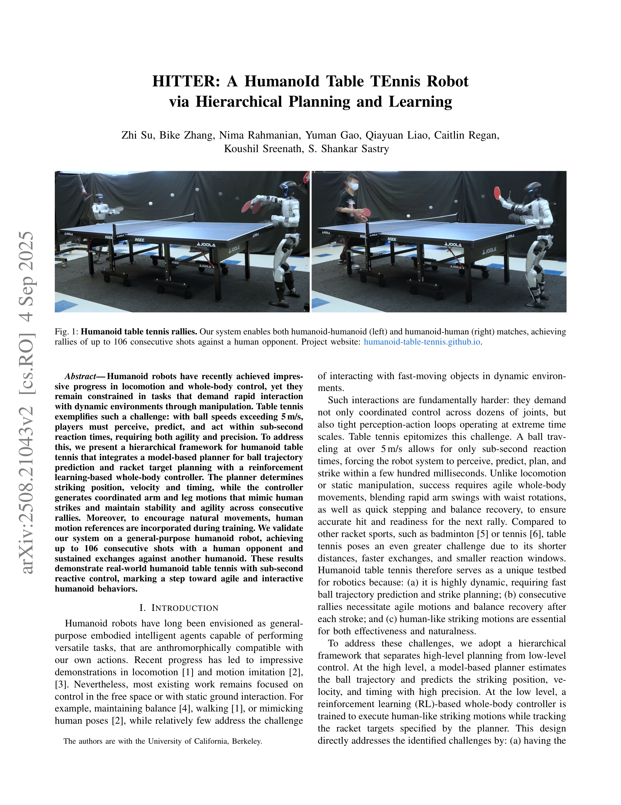

# HITTER: A HumanoId Table TEnnis Robot via Hierarchical Planning and Learning

> **저자**: Zhi Su, Bike Zhang, Nima Rahmanian, Yuman Gao, Qiayuan Liao, Caitlin Regan, Koushil Sreenath, S. Shankar Sastry | **날짜**: 2025-09-04 | **DOI**: [10.48550/arXiv.2508.21043](https://doi.org/10.48550/arXiv.2508.21043)

---

## Essence

*Fig. 2: System overview. (a) The racket is mounted on the robot’s right wrist using a 3D-printed connector, and the ball*

휴머노이드 로봇이 탁구를 하는 시스템을 제시하며, model-based planner와 reinforcement learning 기반 whole-body controller를 계층적으로 통합하여 서브초 단위 반응성으로 최대 106연속 랠리를 달성한다.

## Motivation

- **Known**: 휴머노이드 로봇은 보행 및 전신 제어에서 진전을 이루었으나, 역사적으로 동적 환경에서의 빠른 조작 작업에 제약이 있었다. 탁구는 5 m/s 이상의 볼 속도로 인해 서브초 반응 시간이 필요한 극도로 도전적인 과제이다.
- **Gap**: 기존 휴머노이드 탁구 작업은 정적 위치에서만 수행되었으며, 민첩한 보행과 통합된 전신 협조 운동으로 연속 랠리를 달성한 사례가 없었다. 자연스러운 인간 유사 움직임을 학습하면서 실시간 반응성을 유지하는 방법이 미해결 상태였다.
- **Why**: 탁구는 고속 지각, 예측, 계획, 제어가 극도로 빠르게 실행되어야 하는 벤치마크 문제로서, 이를 해결하면 로봇의 민첩성과 대화형 행동 능력의 근본적 진전을 의미한다.
- **Approach**: 계층적 프레임워크를 채택하여 model-based planner가 볼 궤적 예측 및 라켓 타겟 계획을 담당하고, RL 기반 WBC 정책이 인간 참조 동작을 학습하면서 좌표화된 팔-다리 움직임을 생성하도록 설계했다.

## Achievement

*Fig. 1: Humanoid table tennis rallies. Our system enables both humanoid-humanoid (left) and humanoid-human (right) match*

- **106연속 샷 달성**: 인간 상대방과의 실제 경기에서 최대 106연속 샷을 달성하여 지속 가능한 랠리를 증명했다.
- **계층적 통합 아키텍처**: Model-based planner와 RL 기반 WBC를 결합하여 빠른 예측과 자연스러운 움직임을 동시에 달성했다.
- **서브초 반응 제어**: 500ms 이내의 극단적으로 빠른 반응 시간으로 실시간 탁구 플레이를 구현했다.
- **인간 유사 전신 동작**: 팔 스윙, 허리 회전, 빠른 스텝핑과 밸런스 복구를 포함한 자연스러운 타격 동작을 학습했다.
- **휴머노이드-휴머노이드 경기**: 일반 목적 Unitree G1 휴머노이드에서 다른 휴머노이드와의 지속적 교환을 달성했다.

## How

*Fig. 2: System overview. (a) The racket is mounted on the robot’s right wrist using a 3D-printed connector, and the ball*

- Motion capture 시스템(OptiTrack, 360 Hz, 밀리미터 단위 정확도)으로 볼 위치 추적
- 이차 다항식 least-squares fitting을 통한 볼의 위치-속도 상태 추정 (31개 근처 측정값 사용)
- Hybrid dynamics model (식 1)을 이용한 볼 궤적 예측: 공기 항력 계수 k와 중력 고려
- Model-based planner에서 라켓 타격 위치(ˆpracket), 속도(ˆvracket), 시간(tstrike) 계산
- RL 기반 WBC 정책을 simulation에서 인간 참조 동작(2가지)을 포함하여 학습
- 학습된 정책을 50 Hz로 실제 로봇의 29개 조인트 제어에 배포
- PD 컨트롤러로 원하는 조인트 위치를 조인트 토크로 변환

## Originality

- 휴머노이드 로봇의 탁구 플레이에서 model-based planner와 RL 기반 WBC의 계층적 통합은 새로운 설계 패러다임을 제시한다.
- 인간 참조 동작을 제한적으로(2가지만) 사용하면서도 자연스러운 타격 동작을 학습하는 샘플 효율적 접근이 혁신적이다.
- 서브초 반응 시간 내에 전신 조화 운동과 밸런스 복구를 동시에 달성한 것은 이전 휴머노이드 연구와 차별화된다.
- 연속 랠리 학습 환경에서 RL 정책이 민첩성과 안정성을 함께 습득하도록 설계한 점이 기술적 기여다.

## Limitation & Further Study

- Motion capture 시스템에 의존하므로 실제 경기장이나 카메라 부재 환경에서는 적용 불가능하다.
- Spin이 충분히 작다고 가정한 hybrid dynamics model이 스핀 효과가 큰 고급 탁구 기술에는 제한적이다.
- 인간 참조 동작 2가지만 사용했으므로, 다양한 타격 스타일(백핸드, 루프 드라이브 등) 확장에는 추가 학습이 필요하다.
- Unitree G1 기반 실험이므로 다른 휴머노이드 플랫폼에의 일반화 가능성이 미검증 상태이다.
- **후속 연구**: 비전 기반 볼 추적 통합, 스핀 고려 동역학 모델 개발, 대전 상대 모델링을 통한 전략적 플레이 강화, 다양한 타격 기술 습득이 필요하다.

## Evaluation

- Novelty: 4/5
- Technical Soundness: 4/5
- Significance: 4/5
- Clarity: 4/5
- Overall: 4/5

**총평**: 휴머노이드 로봇의 탁구 플레이를 처음으로 성공시킨 이 논문은 고속 동적 상호작용 및 민첩한 전신 제어 분야의 주요 이정표를 제시한다. 계층적 아키텍처, 샘플 효율적 학습, 강력한 실제 성능 검증이 로보틱스 커뮤니티에 상당한 기여를 한다.

## Related Papers

- 🔄 다른 접근: [[papers/1474_Humanoid_Whole-Body_Badminton_via_Multi-Stage_Reinforcement/review]] — 두 논문 모두 휴머노이드의 라켓 스포츠를 다루지만, HITTER는 탁구에, 다른 논문은 배드민턴에 특화되어 있다.
- 🔗 후속 연구: [[papers/1518_Learning_Agile_Striker_Skills_for_Humanoid_Soccer_Robots_fro/review]] — HITTER의 계층적 planning과 learning은 축구와 같은 다른 스포츠 기술 학습에도 적용될 수 있는 일반적 프레임워크를 제공한다.
- 🏛 기반 연구: [[papers/1525_Learning_Human-Like_Badminton_Skills_for_Humanoid_Robots/review]] — Human-like badminton skills의 학습 방법론은 HITTER의 탁구 기술 학습에 직접적인 기반이 된다.
- 🧪 응용 사례: [[papers/1290_BiCoord_장기간_시공간_협응_양팔_조작_벤치마크/review]] — 저비용 손 추적 기반 정밀 양손 조작에서 장기간 협응 평가가 적용된다
- 🏛 기반 연구: [[papers/1548_Learning_Visuotactile_Skills_with_Two_Multifingered_Hands/review]] — visuotactile 데이터로 양손 조작을 학습하는 방법이 저비용 하드웨어로 정교한 양손 조작을 학습하는 기반이 된다.
- 🧪 응용 사례: [[papers/1604_OSMO_Open-Source_Tactile_Glove_for_Human-to-Robot_Skill_Tran/review]] — OSMO의 웨어러블 촉각 스킬 전이 기술이 저비용 하드웨어로 정교한 양손 조작 학습에서 실제 활용될 수 있다.
- 🔄 다른 접근: [[papers/1474_Humanoid_Whole-Body_Badminton_via_Multi-Stage_Reinforcement/review]] — 두 논문 모두 라켓 스포츠를 다루지만, 배드민턴과 탁구라는 서로 다른 종목에 특화되어 있다.
- 🔄 다른 접근: [[papers/1605_PACE_Physics_Augmentation_for_Coordinated_End-to-end_Reinfor/review]] — 탁구 기술 학습에서 계층적 계획과 end-to-end RL 접근법이 서로 다른 학습 아키텍처를 제시합니다.
