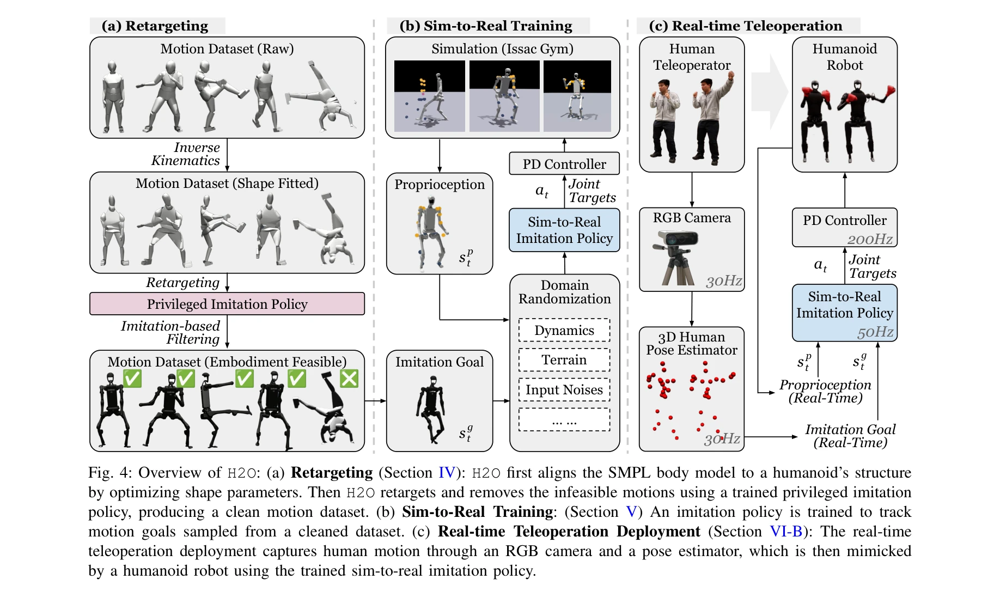
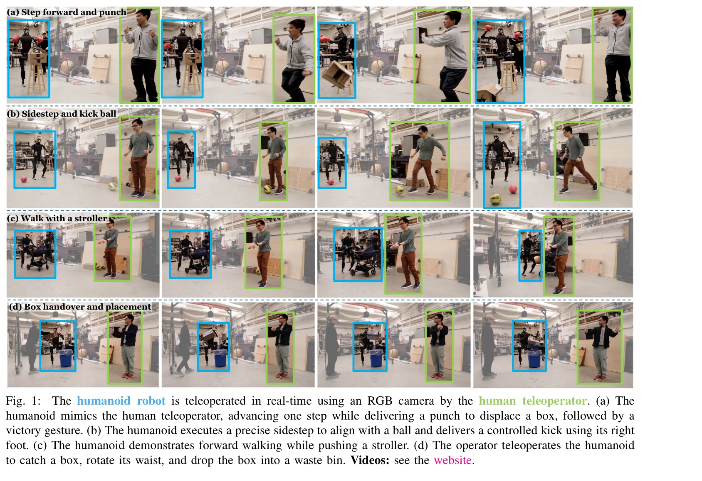

# Learning Human-to-Humanoid Real-Time Whole-Body Teleoperation

> **저자**: Tairan He, Zhengyi Luo, Wenli Xiao, Chong Zhang, Kris Kitani, Changliu Liu, Guanya Shi | **날짜**: 2024-03-07 | **URL**: [https://arxiv.org/abs/2403.04436](https://arxiv.org/abs/2403.04436)

---

## Essence

*Fig. 4: Overview of H2O: (a) Retargeting (Section IV): H2O first aligns the SMPL body model to a humanoid’s structure*

RGB 카메라만 사용하여 강화학습 기반의 실시간 휴머노이드 로봇 전신 원격조작 시스템(H2O)을 제시하며, 대규모 인간 동작 데이터셋을 휴머노이드에 맞게 변환하는 'sim-to-data' 프로세스를 제안한다.

## Motivation

- **Known**: 휴머노이드 로봇의 전신 제어는 오래된 난제이며, 기존 모델 기반 제어기나 RL 기반 접근법들이 존재하지만, 실시간 전신 원격조작의 학습 기반 구현은 아직 미해결 상태이다.
- **Gap**: 대규모 인간 동작 데이터셋을 휴머노이드 로봇에 맞는 실행 가능한 동작으로 변환하는 자동화된 방법과 실시간 추적이 가능한 RL 기반 제어기의 sim-to-real 전이 전략이 부족하다.
- **Why**: 휴머노이드 로봇의 인간형 신체 구조는 실시간 원격조작을 통해 복잡한 작업(가사 보조, 의료 지원, 구조 작업)을 수행할 가능성을 제공하며, 자율 로봇 학습을 위한 대규모 고품질 데이터 수집을 가능하게 한다.
- **Approach**: 역기구학을 통한 인간-휴머노이드 동작 변환, 특권 정보 접근이 가능한 모션 모방기를 이용한 실행 가능 동작 필터링, 광범위한 도메인 랜더마이제이션을 적용한 sim-to-real 전이를 수행한다.

## Achievement

*Fig. 1:*

- **자동화된 sim-to-data 프로세스**: SMPL 모델의 인간 동작을 역기구학으로 변환하고 특권 모션 모방기를 통해 휴머노이드에 실행 가능한 대규모 동작 데이터셋을 자동으로 생성
- **실시간 전신 추적 정책**: PPO 알고리즘으로 훈련된 단일 정책이 RGB 카메라 기반 인간 자세 추정으로부터 실시간 전신 동작(보행, 점프, 킹, 복싱 등)을 추적
- **성공적인 sim-to-real 전이**: 영상 기반 상태 표현과 광범위한 도메인 랜더마이제이션을 통해 시뮬레이션에서 실제 H1 휴머노이드 로봇으로의 제로샷 전이 달성
- **다양한 동적 동작 실행**: 걷기, 옆으로 피하기, 공 차기, 스톨러 밀기, 박싱, 손 흔들기, 물건 집기 및 배치 등 복합 전신 동작을 실시간으로 수행

## How

*Fig. 4: Overview of H2O: (a) Retargeting (Section IV): H2O first aligns the SMPL body model to a humanoid’s structure*

- SMPL 파라메트릭 인간 모델의 신체 형태와 자세를 H1 휴머노이드의 운동학 구조에 맞게 최적화
- 특권 상태(전체 MoCap 데이터)에 접근 가능한 모션 모방기를 시뮬레이션에서 훈련하여 인간 동작의 실행 가능성을 자동으로 평가
- 추적 실패 동작을 제거하여 실행 가능한 동작만으로 구성된 정제된 동작 데이터셋 생성
- RGB 카메라로부터 추출 가능한 키포인트 위치를 중심으로 상태 공간을 설계하고, MediaPipe 등의 인간 자세 추정기 활용
- PPO 알고리즘을 이용한 목표-조건부 RL 훈련으로 다양한 동작을 추적하는 단일 정책 학습
- 카메라, 자세 동역학, 신경망 등의 불확실성을 포함한 광범위한 도메인 랜더마이제이션으로 sim-to-real 갭 극복

## Originality

- RL 기반 실시간 전신 휴머노이드 원격조작의 첫 구현 및 학습 기반 접근법 도입
- 특권 정보를 활용한 'sim-to-data' 자동 필터링 프로세스로 대규모 인간 동작 데이터셋을 휴머노이드에 맞게 변환하는 새로운 파이프라인 제안", '영상만을 입력으로 하는 실시간 추적 가능한 상태 표현 설계로 외부 센서(마커, 힘 센서) 제거
- 그래픽 커뮤니티의 물리 기반 애니메이션 RL 기법을 강건한 sim-to-real 전이를 통해 실제 휴머노이드 로봇에 적용한 첫 사례

## Limitation & Further Study

- 대규모 계산 비용: sim-to-data 프로세스와 광범위한 도메인 랜더마이제이션을 위한 긴 훈련 시간 필요
- 하드웨어 의존성: H1 휴머노이드 로봇에 특화된 검증이므로, 다른 휴머노이드 플랫폼으로의 일반화 가능성 미검증
- 동작 데이터셋 한계: 원본 인간 MoCap 데이터셋의 크기와 다양성에 제한되며, 매우 극단적인 동작은 여전히 실행 불가능할 수 있음
- 실시간 자세 추정 오류: RGB 기반 자세 추정의 정확도 하한이 전체 성능에 영향을 미칠 수 있음
- 후속 연구 방향: (1) 더 경량한 정책 네트워크로 추론 속도 향상, (2) 멀티모달 센서 융합으로 추정 강건성 개선, (3) 다양한 휴머노이드 플랫폼으로의 일반화, (4) 학습 효율 개선을 위한 메타러닝 적용

## Evaluation

- Novelty: 4/5
- Technical Soundness: 3/5
- Significance: 4/5
- Clarity: 4/5
- Overall: 4/5

**총평**: 본 논문은 RL 기반 실시간 전신 휴머노이드 원격조작의 첫 성공적 구현으로, 'sim-to-data' 필터링 프로세스와 강건한 sim-to-real 전이 기법을 통해 RGB 카메라만으로 복잡한 동적 동작을 추적한다. 휴머노이드 로봇 제어의 중요한 이정표이며, 자율 로봇 학습을 위한 대규모 데이터 수집 기반을 마련하는 의미 있는 기여이다.

## Related Papers

- 🔄 다른 접근: [[papers/1498_OmniH2O_Universal_and_Dexterous_Human-to-Humanoid_Whole-Body/review]] — 둘 다 RGB 기반 휴머노이드 전신 텔레오퍼레이션이지만 H2O는 실시간 학습에, OmniH2O는 멀티모달 인터페이스에 집중한다
- 🔗 후속 연구: [[papers/1297_Bunny-VisionPro_Real-Time_Bimanual_Dexterous_Teleoperation_f/review]] — Bunny-VisionPro의 실시간 양팔 텔레오퍼레이션을 전신 제어로 확장했다
- ⚖️ 반론/비판: [[papers/1526_Learning_Human-to-Humanoid_Real-Time_Whole-Body_Teleoperatio/review]] — 동일한 H2O 시스템이지만 다른 관점이나 개선사항을 제시할 수 있다
- 🔄 다른 접근: [[papers/1498_OmniH2O_Universal_and_Dexterous_Human-to-Humanoid_Whole-Body/review]] — 둘 다 휴머노이드 전신 텔레오퍼레이션이지만 OmniH2O는 멀티모달에, H2O는 RGB 기반에 집중한다
