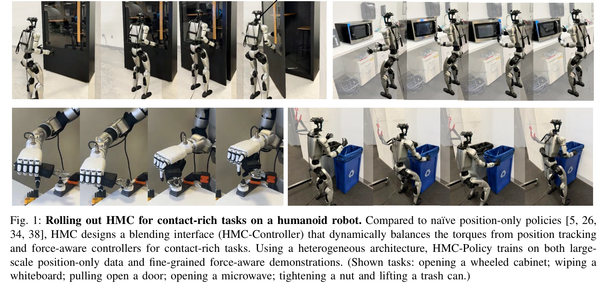

# HMC: Learning Heterogeneous Meta-Control for Contact-Rich Loco-Manipulation

> **저자**: Lai Wei, Xuanbin Peng, Ri-Zhao Qiu, Tianshu Huang, Xuxin Cheng, Xiaolong Wang | **날짜**: 2025-11-18 | **DOI**: [10.48550/arXiv.2511.14756](https://doi.org/10.48550/arXiv.2511.14756)

---

## Essence

*Fig. 2: System overview. HMC-Controller accepts inputs from either a VR-based teleoperation system or HMC-Policy*

본 논문은 위치 제어, 임피던스 제어, 하이브리드 힘-위치 제어 등 다양한 제어 모달리티를 동적으로 혼합하는 Heterogeneous Meta-Control (HMC) 프레임워크를 제안하여 접촉이 많은 로코-매니퓨레이션 작업의 강건성을 향상시킨다.

## Motivation

- **Known**: 기존 연구는 위치 기반 제어기를 주로 사용하거나 특정 규정 제어기(impedance, hybrid force-position)에만 의존했으며, 대규모 위치 기반 데이터와 소수의 힘-인식 데모 간 불균형 문제가 있다.
- **Gap**: 순수 위치 제어기는 접촉 상호작용 동역학을 무시하여 위험한 진동을 야기하고, 기존 학습 기반 방법들은 특정 제어 타입과 작은 규모의 도메인 특화 데이터에만 의존하며, 제어기 간 급격한 전환으로 토크 불연속성이 발생한다.
- **Why**: 실제 환경에서 로봇 작업(표면 닦기, 서랍 열기 등)은 다양한 접촉 동역학과 변동하는 페이로드를 요구하며, 이를 안전하고 효과적으로 처리할 수 있는 적응형 제어 시스템이 필수적이다.
- **Approach**: HMC-Controller라는 메타 제어 인터페이스를 통해 토크 공간에서 여러 제어 프로파일을 연속적으로 혼합하고, HMC-Policy에서 mixture-of-experts 스타일의 소프트 라우팅을 사용하여 대규모 위치 데이터와 세밀한 힘-인식 데모를 통합 학습한다.

## Achievement

*Fig. 1: Rolling out HMC for contact-rich tasks on a humanoid robot. Compared to na¨ıve position-only policies [5, 26,*

- **통합 저수준 제어 인터페이스**: HMC-Controller가 토크 공간에서 위치, 임피던스, 하이브리드 힘-위치 제어를 연속적으로 혼합하여 텔레오퍼레이션과 정책 배포 모두 지원
- **이질적 고수준 정책 학습**: HMC-Policy가 혼합-전문가 스타일 소프트 라우팅으로 대규모 위치 기반 데이터와 다중 전문가 데모를 통합하여 학습
- **실제 환경 성능 향상**: 인간형 로봇에서 준수적 테이블 닦기, 서랍 열기 등 도전적 작업에서 기준 대비 50% 이상의 상대적 성능 개선 달성

## How

*Fig. 2: System overview. HMC-Controller accepts inputs from either a VR-based teleoperation system or HMC-Policy*

- 순수 위치(PD), 관절 공간 임피던스, 카르테시안 공간 임피던스, 하이브리드 힘-위치 제어 등 4가지 기본 제어기 구현
- 모든 제어기에서 토크 명령 출력을 생성하고 소프트 라우팅 가중치로 가중 평균하여 최종 토크 명령 생성
- 두 단계 학습: (1) 사전학습 단계에서 대규모 위치 기반 데모로 위치 제어기 학습, (2) 미세 조정 단계에서 힘-인식 데모로 모든 전문가와 라우터 공동 학습
- 소프트 라우팅은 신경망 기반으로 현재 상태로부터 각 제어 모드의 가중치를 연속적으로 예측하여 급격한 전환 방지
- VR 기반 텔레오퍼레이션과 정책 추론 두 경로 모두에서 동일한 HMC-Controller 인터페이스 사용

## Originality

- 기존의 이산적 제어기 전환 전략 대신 토크 공간에서 연속적 혼합을 통해 제어 모달리티 평활한 전환 달성
- mixture-of-experts 기반 소프트 라우팅으로 불균형한 데이터 분포에서도 전문가 붕괴를 방지하면서 다중 모달 제어 통합
- 사전학습-미세조정 패러다임으로 공개 위치 기반 데모와 소수의 힘-인식 데모를 효과적으로 조합
- 메타 제어 개념을 로코-매니퓨레이션 시스템에 처음 적용하여 실시간 피드백 기반 제어기 선택 및 조절 구현

## Limitation & Further Study

- 평가가 단일 인간형 로봇 플랫폼에 제한되어 다양한 로봇 형태에 대한 일반화 가능성 미검증
- 힘 센서 정보의 활용이 명시적으로 설명되지 않았으며, 센서 정보 없는 환경에서의 성능 미분석
- 각 제어 모드의 활성화 기준이나 라우팅 결정 과정의 해석가능성이 제한적으로만 시각화(Fig. 5)
- 후속 연구로 멀티-로봇 플랫폼 평가, 도메인 외 일반화 성능 분석, 강화학습 기반 미세 조정 탐색 필요

## Evaluation

- Novelty: 4/5
- Technical Soundness: 3/5
- Significance: 4/5
- Clarity: 4/5
- Overall: 4/5

**총평**: 본 논문은 접촉 동역학을 고려한 강건한 로코-매니퓨레이션을 위해 다중 제어 모달리티의 연속적 혼합과 데이터 불균형 해결을 창의적으로 다루었으며, 실제 인간형 로봇에서 높은 성능 향상을 달성함으로써 실제 환경 로봇 조작의 주요 문제를 효과적으로 해결했다.

## Related Papers

- 🔄 다른 접근: [[papers/1483_HumanoidVLM_Vision-Language-Guided_Impedance_Control_for_Con/review]] — 둘 다 접촉 기반 휴머노이드 제어를 다루지만 HMC는 heterogeneous control에, HumanoidVLM은 VLM 기반 임피던스 제어에 집중한다
- 🏛 기반 연구: [[papers/1435_HAFO_A_Force-Adaptive_Control_Framework_for_Humanoid_Robots/review]] — HAFO의 force-adaptive 제어 개념이 HMC의 multi-modal 제어 프레임워크의 기반이 된다
- 🔗 후속 연구: [[papers/1515_Phantom_Training_Robots_Without_Robots_Using_Only_Human_Vide/review]] — 기존 텔레오퍼레이션의 힘 제어를 heterogeneous meta-control로 확장했다
- 🏛 기반 연구: [[papers/1515_Phantom_Training_Robots_Without_Robots_Using_Only_Human_Vide/review]] — adaptive neural control의 개념이 heterogeneous meta-control의 기반이 된다
- 🧪 응용 사례: [[papers/1632_World_Simulation_with_Video_Foundation_Models_for_Physical_A/review]] — Learning Interactive Real-World Simulators와 함께 실세계-시뮬레이션 간 상호작용하는 통합 학습 환경을 제공한다
- 🧪 응용 사례: [[papers/1604_Video_Language_Planning/review]] — Interactive Real-World Simulators 학습 연구를 VLP의 비디오 계획을 실제 로봇 환경에서 실행하는 방법론으로 활용할 수 있다.
- 🔄 다른 접근: [[papers/1483_HumanoidVLM_Vision-Language-Guided_Impedance_Control_for_Con/review]] — 둘 다 접촉 기반 휴머노이드 제어를 다루지만 HumanoidVLM은 VLM 기반에, HMC는 heterogeneous control에 집중한다
