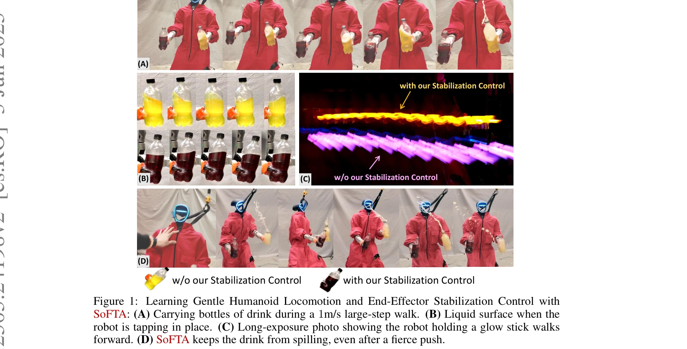

# Hold My Beer: Learning Gentle Humanoid Locomotion and End-Effector Stabilization Control

> **저자**: Yitang Li, Yuanhang Zhang, Wenli Xiao, Chaoyi Pan, Haoyang Weng, Guanqi He, Tairan He, Guanya Shi | **날짜**: 2025-05-30 | **URL**: [https://arxiv.org/abs/2505.24198](https://arxiv.org/abs/2505.24198)

---

## Essence

*Figure 1: Learning Gentle Humanoid Locomotion and End-Effector Stabilization Control with*

인간형 로봇이 액체가 가득 찬 컵을 들고 걷는 동안 안정적으로 유지할 수 있도록, 상체와 하체 제어를 서로 다른 주파수와 보상으로 분리하는 SoFTA 프레임워크를 제안한다.

## Motivation

- **Known**: 최근 인간형 로봇은 춤, 배송, 거친 지형 주행 등에서 진보를 이루었으나, 이동 중 섬세한 엔드-이펙터 제어는 여전히 미해결 문제이다. 휠 로봇이나 드론 기반 모바일 매니퓰레이션에는 모델 기반 최적화 방법이 있으나 인간형 로봇에는 적용이 어렵다.
- **Gap**: 이동(slow 동역학, 견고성 중심)과 엔드-이펙터 안정화(fast 동역학, 정밀도 중심)의 근본적인 특성 불일치로 인해 단일 에이전트 정책은 두 작업을 동시에 잘 수행하지 못한다. 기본 Unitree G1 제어기는 정지 상태에서 약 5m/s²의 엔드-이펙터 가속도를 발생시켜 인간 수준(0.5m/s² 이하)보다 10배 높다.
- **Why**: 인간형 로봇이 액체를 흘리지 않고 전달하거나 안정적인 영상을 녹화할 수 있는 능력은 실제 환경에서 인간과 상호작용하는 데 필수적이며, 이는 로봇의 실용성과 안전성을 크게 향상시킨다.
- **Approach**: SoFTA는 상체(100Hz)와 하체(50Hz)를 별도 에이전트로 분리하여 서로 다른 제어 주파수와 보상 함수를 적용한다. 이러한 시간적·목표 공간 분리를 통해 정책 간섭을 완화하고 조화로운 전신 행동을 가능하게 한다.

## Achievement

*Figure 1: Learning Gentle Humanoid Locomotion and End-Effector Stabilization Control with*

- **엔드-이펙터 가속도 감소**: 기준선 대비 2-5배 감소로 인간 수준의 안정성(약 2m/s² 이하) 달성
- **실제 로봇 배포**: Unitree G1 및 Booster T1 인간형 로봇에서 액체 운반, 안정적인 1인칭 영상 녹화 등의 작업 수행
- **외란 거부**: 강한 푸시(push)에도 엔드-이펙터 안정성 유지
- **주파수 설계의 효과성**: 실험을 통해 제안된 주파수 분리가 안정적인 엔드-이펙터 제어를 효과적으로 달성함을 입증

## How

*Figure 2: Overview of the SoFTA framework: The framework employs two distinct agents that*

- 상체(14 DoF): 엔드-이펙터 위치 추적, 엔드-이펙터 안정화를 목표로 100Hz에서 동작
- 하체(13 DoF): 보행 추적, 기저부 속도 추적을 목표로 50Hz에서 동작
- 보상 함수: 선형/각속도 가속도 페널티(racc, rang-acc), 영지수 가속도 보상(rzero-acc, rzero-ang-acc), 중력 틸트 페널티(rgrav-xy) 포함
- 관찰 공유: 두 에이전트가 동일한 고유 관찰(joint position, velocity, root angular velocity, projected gravity, past actions) 및 목표 상태(속도, 각속도, 기저부 헤딩, 엔드-이펙터 명령)를 공유
- PPO 기반 학습: 상체와 하체의 별도 가치 함수를 통해 상충하는 보상 신호를 효과적으로 처리

## Originality

- 인간형 로봇 이동 중 엔드-이펙터 안정화를 처음으로 다룬 연구
- 동역학 특성(slow vs. fast)을 근거로 한 빈도 분리 설계: 기존 다중 에이전트 강화학습은 주로 작업 분해 기반이었으나, 본 연구는 제어 동역학의 내재적 특성을 활용
- 상체와 하체의 별도 보상 구조: 이동성과 정밀성의 근본적 충돌을 공간적·시간적 분리로 해결

## Limitation & Further Study

- 시뮬레이션과 실제 환경의 갭: 높은 제어 주파수(100Hz)에서도 sim-to-real 안정성 확보의 추가 연구 필요
- 일반화: 현재는 특정 인간형 로봇(Unitree G1, Booster T1)과 액체 운반 작업에 초점 - 다른 형태의 로봇이나 작업으로의 확장 미검증
- 엔드-이펙터 개수 확장성: 현재 단일 또는 소수의 엔드-이펙터 중심 - 다중 엔드-이펙터 조정의 복잡성 미분석
- 후속 연구: (1) 적응형 주파수 제어를 통한 동적 최적화, (2) 보행 패턴과 엔드-이펙터 작업의 더 깊은 상호작용 분석, (3) 다양한 외란 환경에서의 강건성 개선

## Evaluation

- Novelty: 4/5
- Technical Soundness: 3/5
- Significance: 4/5
- Clarity: 4/5
- Overall: 4/5

**총평**: 본 논문은 인간형 로봇의 이동 중 엔드-이펙터 안정화라는 미해결 문제를 근본적인 동역학 특성 차이 분석을 기반으로 창의적으로 해결했다. 실제 로봇 배포와 5배의 성능 개선을 통해 높은 실용적 가치를 입증했으며, 다만 sim-to-real 안정성 강화와 일반화 가능성 확대가 향후 과제이다.

## Related Papers

- 🏛 기반 연구: [[papers/1504_JAEGER_Dual-Level_Humanoid_Whole-Body_Controller/review]] — SoFTA의 상체/하체 분리 제어 개념은 JAEGER의 dual-level control 아키텍처의 기반이 된다.
- 🔄 다른 접근: [[papers/1489_HWC-Loco_A_Hierarchical_Whole-Body_Control_Approach_to_Robus/review]] — 두 논문 모두 안정성을 중시하지만, SoFTA는 gentle locomotion에, HWC-Loco는 전반적인 robust control에 초점을 둔다.
- 🔗 후속 연구: [[papers/1383_End-to-End_Humanoid_Robot_Safe_and_Comfortable_Locomotion_Po/review]] — Hold My Beer의 end-effector 안정화 기술은 일반적인 end-to-end humanoid locomotion policy로 확장될 수 있다.
- 🔗 후속 연구: [[papers/1471_Humanoid_Policy__Human_Policy/review]] — TOP의 상체 움직임 최적화는 SoFTA의 상하체 분리 제어와 결합하여 더욱 정교한 조작을 달성할 수 있다.
- 🔗 후속 연구: [[papers/1489_HWC-Loco_A_Hierarchical_Whole-Body_Control_Approach_to_Robus/review]] — HWC-Loco의 hierarchical control은 SoFTA의 gentle locomotion과 결합하여 안전하고 부드러운 보행을 달성할 수 있다.
- 🔗 후속 연구: [[papers/1504_JAEGER_Dual-Level_Humanoid_Whole-Body_Controller/review]] — JAEGER의 dual-level control은 SoFTA의 상체/하체 분리 제어 개념을 더욱 체계화한 구현이다.
