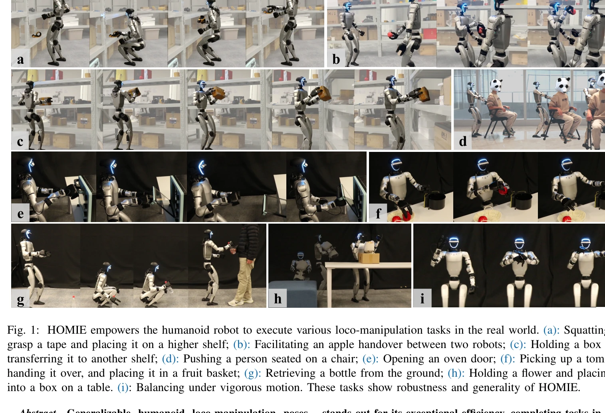
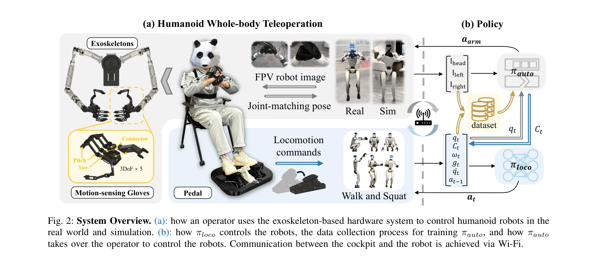

# HOMIE: Humanoid Loco-Manipulation with Isomorphic Exoskeleton Cockpit

> **저자**: Qingwei Ben, Feiyu Jia, Jia Zeng, Junting Dong, Dahua Lin, Jiangmiao Pang | **날짜**: 2025-02-18 | **URL**: [https://arxiv.org/abs/2502.13013](https://arxiv.org/abs/2502.13013)

---

## Essence

*Fig. 1: HOMIE empowers the humanoid robot to execute various loco-manipulation tasks in the real world. (a): Squatting t*

HOMIE는 강화학습 기반 신체 제어, 동형 외골격 팔, 모션 감지 장갑을 통합한 반자율 텔레로봇 조종 시스템으로, 휴머노이드 로봇의 전신 이동 조작을 효율적으로 제어한다.

## Motivation

- **Known**: 텔레로봇 조종 시스템은 실제 데이터 수집을 통해 모방학습을 가능하게 하며, 동형 외골격을 사용한 조종은 정확성과 비용 효율성을 제공한다. 그러나 기존 시스템들은 이동(loco-manipulation) 능력과 정밀한 조작 사이에서 절충이 필요했다.
- **Gap**: RL 기반 이동 정책은 환경 적응에 강하지만 실시간 텔레로봇 인터페이스가 부족하고, 기존 텔레로봇 시스템은 상반신 제어에만 집중하여 로봇의 작업 공간을 심각하게 제한한다. 또한 MoCap 없이 동적 스쿼팅을 포함한 휴머노이드 이동 조작 텔레로봇 구현이 부재했다.
- **Why**: 휴머노이드 로봇을 일상생활에 통합하고 노동 집약적 작업을 처리하려면 조정된 전신 제어와 정밀한 물체 조작이 모두 필요하며, 현장의 데이터 파이프라인을 구축하는 것이 중요하다.
- **Approach**: RL 정책(pedal 기반 신체 제어), 동형 외골격 팔(역동역학 제거), 모션 감지 장갑(15+ DoF)을 통합한 통합 조종석을 설계했다. RL 프레임워크는 상반신 자세 커리큘럼, 높이 추적 리워드, 대칭성 활용을 포함한다.

## Achievement

*Fig. 1: HOMIE empowers the humanoid robot to execute various loco-manipulation tasks in the real world. (a): Squatting t*

- **전신 이동 조작 텔레로봇 최초 구현**: MoCap 데이터 사전학습 없이 동적 스쿼팅을 포함한 휴머노이드 로봇의 협응된 이동 조작 제어 실현
- **우수한 효율성**: 기존 VR 방식 대비 작업 완료 시간을 절반으로 단축 및 기존 방식 대비 200% 빠른 자세 획득
- **확장된 작업 범위**: 자유로운 높이/저도 영역 접근 및 임의의 물체와 상호작용 가능
- **비용 효율성**: 총 $0.5k의 저비용 하드웨어(MoCap 대비 매우 저렴)
- **범용 적응성**: 다양한 로봇 모델에 배포 가능하며, 수집된 데이터가 imitation learning 알고리즘에 효과적으로 활용 가능
- **완전 오픈소스**: 코드와 데모 공개로 재현성 보장

## How

*Fig. 2: System Overview. (a): how an operator uses the exoskeleton-based hardware system to control humanoid robots in t*

- **RL 훈련 프레임워크**: 상반신 자세 커리큘럼(동적 균형 적응), 높이 추적 리워드(정밀한 스쿼팅), 대칭성 활용(행동 정규화 및 데이터 증강)
- **Pedal 기반 신체 제어**: 로봇 이동 명령을 위한 효과적인 인터페이스로 상반신을 해방
- **동형 외골격 팔**: 역동역학 의존성 제거로 정확한 joint-matching 기반 자세 설정 가능
- **모션 감지 장갑**: Hall 센서 기반으로 15+ DoF 달성, servo 불필요로 다양한 손 모델 적응 가능
- **직접 joint 위치 설정**: IK와 pose estimation 부정확성 제거로 더 빠르고 정확한 텔레로봇 실현
- **실시간 제어**: 동시 상반신 자세 획득 및 연속 보행 동기화 불필요

## Originality

- 동형 외골격과 motion-sensing 장갑을 결합한 최초의 완전한 텔레로봇 조종 시스템 설계
- MoCap 사전학습 없이 RL만으로 이동 조작 제어를 학습하는 새로운 파이프라인 제시
- Pedal 기반 신체 제어 인터페이스가 상반신 정밀 조작과 이동을 동시에 가능하게 하는 혁신적 아키텍처
- Hall 센서 기반 저비용 고자유도 장갑 설계로 기존 MoCap 및 VR 기반 방식의 대안 제시
- 상반신 자세 커리큘럼과 높이 추적 리워드 등 이동 조작 특화 RL 기법 개발

## Limitation & Further Study

- **시스템 복잡성**: 다중 하드웨어 모듈(외골격, 장갑, pedal)의 동기화 및 사용자 학습곡선이 높을 가능성
- **로봇 특정성**: 동형 외골격이 특정 로봇 모델에 맞춰 설계되어야 하므로 새로운 로봇에 대한 하드웨어 재설계 필요
- **대역폭 제약**: 실시간 무선 통신 환경에서의 안정성 및 지연 시간에 대한 상세한 평가 부재
- **자율 성능 한계**: 수집된 데이터 기반 imitation learning 성능의 정량적 평가 부족
- **후속연구**: (1) 모듈식 외골격 설계로 여러 로봇 모델 호환성 향상, (2) 더 복잡한 제약 조건이 있는 환경에서의 RL 안정성 강화, (3) 수집 데이터의 자율 학습 전환율 최적화

## Evaluation

- Novelty: 4/5
- Technical Soundness: 3/5
- Significance: 4/5
- Clarity: 4/5
- Overall: 4/5

**총평**: HOMIE는 이동 조작 텔레로봇 분야에서 처음으로 RL, 동형 외골격, motion-sensing 장갑을 통합하여 비용 효율적이면서도 정확하고 빠른 휴머노이드 전신 제어를 실현했다. 실제 물리적 환경에서의 다양한 작업 성공 사례와 오픈소스 공개로 인해 높은 실용적 가치를 가진다.

## Related Papers

- 🔄 다른 접근: [[papers/1441_Heavy_lifting_tasks_via_haptic_teleoperation_of_a_wheeled_hu/review]] — 둘 다 외골격 기반 텔레오퍼레이션이지만 HOMIE는 이족보행에, Heavy lifting은 바퀴형 플랫폼에 특화되어 있다
- 🔗 후속 연구: [[papers/1479_HumanoidExo_Scalable_Whole-Body_Humanoid_Manipulation_via_We/review]] — HumanoidExo의 외골격 데이터 수집을 실시간 제어 시스템으로 확장했다
- 🏛 기반 연구: [[papers/1586_NuExo_A_Wearable_Exoskeleton_Covering_all_Upper_Limb_ROM_for/review]] — NuExo의 상체 외골격 기술이 HOMIE의 전신 외골격 시스템의 기반이 된다
- 🏛 기반 연구: [[papers/1548_Robotic_Skill_Acquisition_via_Instruction_Augmentation_with/review]] — 자연어 지도학습의 기본 원리를 로봇 조작 데이터에 자동으로 언어 명령을 생성하는 방법으로 확장한다.
- 🔄 다른 접근: [[papers/1441_Heavy_lifting_tasks_via_haptic_teleoperation_of_a_wheeled_hu/review]] — 둘 다 외골격/haptic 기반 텔레오퍼레이션이지만 Heavy lifting은 바퀴형 플랫폼에, HOMIE는 이족보행에 초점을 둔다
- 🏛 기반 연구: [[papers/1479_HumanoidExo_Scalable_Whole-Body_Humanoid_Manipulation_via_We/review]] — 외골격 기반 데이터 수집이 HOMIE의 실시간 제어 시스템의 기반이 된다
- 🔗 후속 연구: [[papers/1586_NuExo_A_Wearable_Exoskeleton_Covering_all_Upper_Limb_ROM_for/review]] — NuExo의 웨어러블 외골격 기술이 동형사상 외골격을 활용한 HOMIE 휴머노이드 조작 시스템으로 확장되었다.
