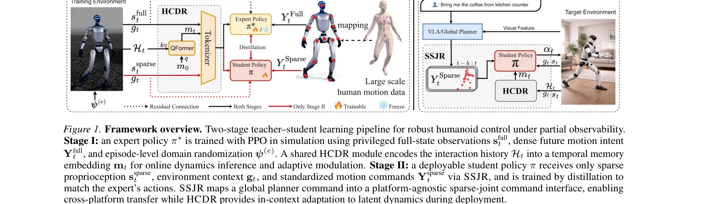

# HoRD: Robust Humanoid Control via History-Conditioned Reinforcement Learning and Online Distillation

> **저자**: Puyue Wang, Jiawei Hu, Yan Gao, Junyan Wang, Yu Zhang, Gillian Dobbie, Tao Gu, Wafa Johal, Ting Dang, Hong Jia | **날짜**: 2026-02-04 | **URL**: [https://arxiv.org/abs/2602.04412](https://arxiv.org/abs/2602.04412)

---

## Essence

*Figure 1. Framework overview. Two-stage teacher–student learning pipeline for robust humanoid control under partial obse*

HoRD는 history-conditioned reinforcement learning과 online distillation을 결합하여 휴머노이드 로봇의 도메인 시프트에 대한 견고한 제어를 실현하는 두 단계 학습 프레임워크이다. 이를 통해 단일 정책으로 재훈련 없이 보이지 않은 도메인에 zero-shot 적응이 가능하다.

## Motivation

- **Known**: 기존 physics-based control 정책들은 고정된 동역학 파라미터를 가진 단일 시뮬레이터에서 학습되며, 도메인 시프트 시 큰 성능 저하를 겪는다. Domain randomization이나 target-domain adaptation은 각각의 한계가 있어 완전한 해결책이 되지 못한다.
- **Gap**: 현재 방법들은 sparse motion command로부터 torque-level control에 이르는 통일된 견고한 표현이 부족하며, 특히 서로 다른 skeleton definition을 가진 fragmented motion 데이터를 처리하고 테스트 시간의 동역학 변화에 online으로 적응하는 능력이 제한적이다.
- **Why**: 휴머노이드 로봇이 실제 환경에 배포되려면 작은 동역학 변화에도 견고해야 하며, 데이터 단편화 문제를 해결하고 실제 배포에서 sparse keypoint command를 직접 처리할 수 있어야 하기 때문에 중요하다.
- **Approach**: HoRD는 두 단계로 구성된다: (1) HCDR 모듈을 통해 최근 state-action trajectory로부터 잠재 동역학 컨텍스트를 추론하는 high-performance teacher policy를 RL로 훈련, (2) SSJR 표준화된 sparse-joint 표현을 사용하여 transformer 기반 student policy로 distill한다.

## Achievement

*Figure 2. Results of HoRD on six representative motions, while red markers indicate ground-truth skeleton joints. Qualit*

- **Zero-shot transfer 능력**: 재훈련 없이 IsaacLab에서 Genesis 등 보이지 않은 physics engine으로의 안정적 전환 실현
- **우수한 도메인 시프트 견고성**: 기존 baseline 대비 최대 14.2% 높은 success rate 달성, 특히 unseen domain과 external perturbation 조건에서 우월
- **Data fragmentation 해결**: SSJR을 통한 heterogeneous motion source의 통일된 처리로 sparse keypoint command 직접 지원
- **대규모 dataset 기여**: 7,000+ diverse humanoid motions (100+ hours)의 trajectory dataset 공개로 커뮤니티 지원

## How

*Figure 1. Framework overview. Two-stage teacher–student learning pipeline for robust humanoid control under partial obse*

- HCDR(History-Conditioned Dynamics Response) 모듈: 최근 상호작용 히스토리 H_t로부터 temporal memory embedding m_t을 인코딩하여 온라인 동역학 추론과 adaptive modulation 수행
- SSJR(Standardized Sparse-Joint Representation): root-relative 3D joint keypoint trajectory를 platform-agnostic sparse-joint command interface로 변환하여 cross-platform transfer 가능하게 함
- Teacher-Student framework: privileged full-state observations와 dense future motion intent를 사용해 expert policy π*를 PPO로 훈련한 후, sparse proprioception과 standardized commands만으로 동작하는 student policy π로 distill
- Episode-level domain randomization: 훈련 시 diverse randomized dynamics ψ(e)에 노출시켜 일반화 능력 향상

## Originality

- History-conditioned 접근으로 test-time dynamics shift에 대한 online adaptation을 novel하게 구현하여 기존 domain randomization의 한계 극복
- Sparse joint representation(SSJR)을 통해 data fragmentation 문제를 체계적으로 해결하는 새로운 관점 제시
- 두 단계 teacher-student framework에서 history-conditioned module을 양쪽에 통합하는 설계로 robust feature 추출과 efficient deployment의 trade-off 해결
- IsaacLab에서 Genesis 등 다양한 physics engine으로의 zero-shot transfer 검증으로 실질적 cross-domain generalization 입증

## Limitation & Further Study

- Online adaptation의 정도가 제한적일 수 있으며, 극단적인 동역학 변화에 대한 성능 한계 미지수
- Sparse keypoint command 기반이므로 fine-grained manipulation task에서의 적용성 불명확
- Teacher policy 훈련에 대규모 diverse dynamics randomization이 필요하여 계산 비용이 높을 가능성
- **후속 연구**: (1) meta-learning과의 결합으로 더 빠른 online adaptation 달성, (2) real robot에서의 검증, (3) vision-based command input 통합, (4) manipulation task로의 확장

## Evaluation

- Novelty: 4/5
- Technical Soundness: 3/5
- Significance: 4/5
- Clarity: 4/5
- Overall: 4/5

**총평**: HoRD는 history-conditioned adaptation과 sparse command representation을 결합하여 휴머노이드 제어의 도메인 시프트 문제를 효과적으로 해결한 우수한 논문이다. 실질적인 zero-shot transfer 능력과 공개된 대규모 dataset으로 커뮤니티에 의미 있는 기여를 하고 있다.

## Related Papers

- 🔄 다른 접근: [[papers/1416_Generalizable_Geometric_Prior_and_Recurrent_Spiking_Feature/review]] — 둘 다 robust humanoid control이지만 HoRD는 history conditioning에, RGMP-S는 geometric prior에 기반한 다른 접근법입니다.
- 🔗 후속 연구: [[papers/1534_Learning_Sim-to-Real_Humanoid_Locomotion_in_15_Minutes/review]] — 15분 학습의 빠른 sim-to-real을 history conditioning과 결합하여 더 robust하고 효율적인 humanoid control을 달성합니다.
- 🏛 기반 연구: [[papers/1526_Learning_Human-to-Humanoid_Real-Time_Whole-Body_Teleoperatio/review]] — 실제 humanoid locomotion의 기반 기술을 history-conditioned RL로 더 robust하게 발전시킨 형태입니다.
- 🔄 다른 접근: [[papers/1416_Generalizable_Geometric_Prior_and_Recurrent_Spiking_Feature/review]] — 둘 다 로봇의 robust control을 추구하지만 RGMP-S는 geometric prior에, HoRD는 history conditioning에 기반한 다른 접근법입니다.
