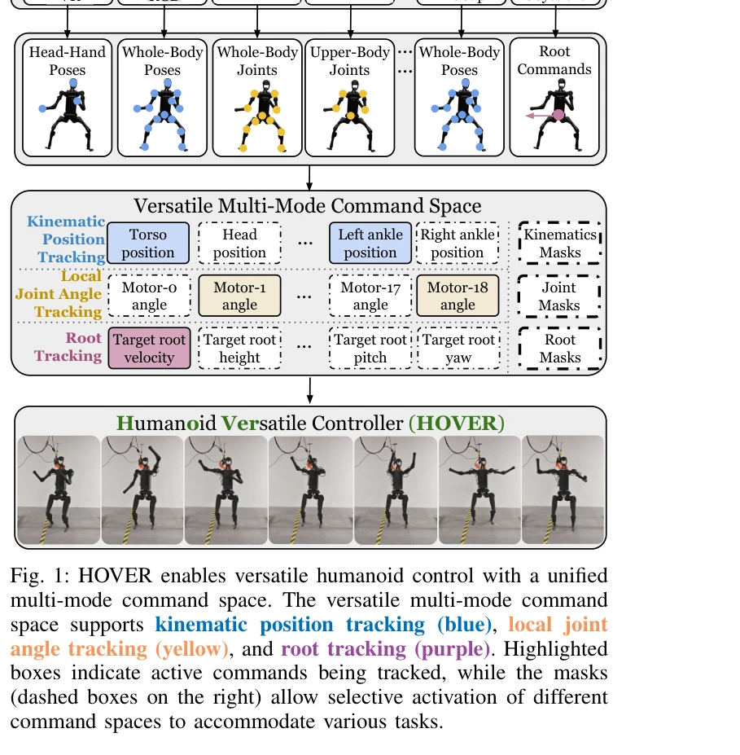
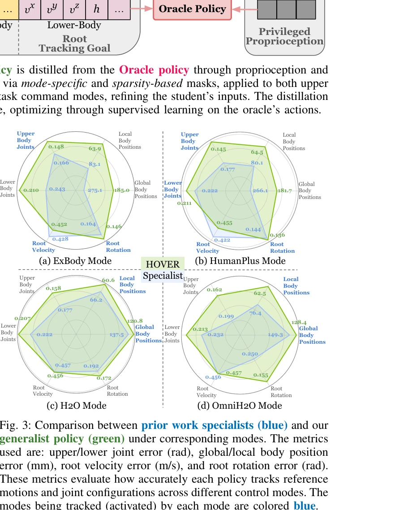
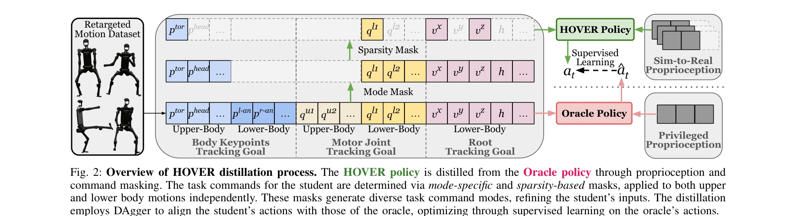

# HOVER: Versatile Neural Whole-Body Controller for Humanoid Robots

> **저자**: Tairan He, Wenli Xiao, Toru Lin, Zhengyi Luo, Zhenjia Xu, Zhenyu Jiang, Jan Kautz, Changliu Liu, Guanya Shi, Xiaolong Wang, Linxi Fan, Yuke Zhu | **날짜**: 2024-10-28 | **URL**: [https://arxiv.org/abs/2410.21229](https://arxiv.org/abs/2410.21229)

---

## Essence

*Fig. 1: HOVER enables versatile humanoid control with a unified*

HOVER는 인간의 움직임 모방을 공통 추상화로 사용하여 네비게이션, 로코-조작, 탁상 조작 등 다양한 제어 모드를 지원하는 통합 휴머노이드 전신 제어기를 제시한다. Policy distillation을 통해 여러 제어 모드를 단일 정책으로 통합하면서 각 모드의 장점을 보존한다.

## Motivation

- **Known**: 기존 휴머노이드 제어 방식들(ExBody, H2O, HumanPlus 등)은 각각 특정 작업에 최적화된 별도의 정책을 학습하며, 일부는 root velocity tracking, 다른 것들은 joint angle tracking 또는 kinematic position tracking을 사용한다. 이러한 접근법은 각 모드에 대해 독립적인 정책 학습과 보상 설계가 필요하다.
- **Gap**: 기존 접근법들은 제어 모드 간 전환이 불가능하고 타겟 작업이 변하면 처음부터 재학습해야 하며, 단일 제어기로 모든 모드를 지원하기 위한 통합 프레임워크가 부족하다. 각 모드별 개발 반복으로 인한 비효율성과 확장성 제한이 문제다.
- **Why**: 통합된 다중 모드 제어기는 개발 효율성을 높이고, 제어 모드 간의 seamless transition을 가능하게 하며, 여러 모드에서 공유되는 물리적 지식을 활용하여 일반화 성능을 향상시킬 수 있다. 이는 실제 로봇 응용에서 시스템의 다용성과 실용성을 크게 향상시킨다.
- **Approach**: 대규모 MoCap 데이터로부터 전신 키네매틱 모션 모방을 학습하는 oracle policy를 먼저 학습한 후, mode mask와 sparsity mask를 활용한 policy distillation을 통해 oracle의 운동 기술을 단일 HOVER 정책으로 전이시킨다. DAgger 알고리즘을 사용하여 학생 정책이 oracle의 행동에 정렬되도록 감독 학습한다.

## Achievement

*Fig. 3: Comparison between prior work specialists (blue) and our*

- **통합 제어 프레임워크**: 15개 이상의 유용한 제어 모드를 지원하는 통합 명령 공간 설계로 기존 단일 모드 정책들의 모든 기능을 포함
- **성능 우수성**: HOVER 정책이 각 모드별로 개별 학습된 specialist 정책들을 능가하며, 상한과 하한 joint error, body position error, root tracking error 모두에서 개선 달성
- **Seamless 모드 전환**: 제어 모드 간 실시간 전환이 가능하여 로봇이 네비게이션에서 조작으로 자연스럽게 전환 가능
- **실제 로봇 검증**: 시뮬레이션과 실제 휴머노이드 로봇에서 모두 검증되어 실용성 입증
- **개발 효율성**: 각 제어 모드마다 정책을 재학습할 필요가 없어 향후 휴머노이드 애플리케이션의 효율성과 유연성 향상

## How

*Fig. 2: Overview of HOVER distillation process. The HOVER policy is distilled from the Oracle policy through propriocept*

- Oracle policy는 인간 MoCap 데이터로부터 전신 키네매틱 모션 모방을 goal-conditioned RL로 학습
- 명령 공간은 upper-body와 lower-body에 대해 kinematic position tracking, joint angle tracking, root tracking을 포함하도록 설계
- Mode mask와 sparsity mask를 적용하여 다양한 제어 모드 조합 생성
- DAgger를 기반한 policy distillation으로 HOVER 정책이 oracle의 행동을 모방하도록 감독 학습
- Proprioception과 command masking을 통해 student 정책의 입력 정제
- 시뮬레이션 환경에서 여러 제어 모드로 학습하고 sim-to-real transfer로 실제 로봇에 적용

## Originality

- 전신 키네매틱 모션 모방을 다양한 제어 모드의 공통 추상화로 활용하는 혁신적 통찰
- 기존 연구들의 모든 제어 모드(ExBody, H2O, HumanPlus 등)를 통합하는 포괄적 명령 공간 설계
- Mode mask와 sparsity mask 기반 policy distillation으로 단일 정책에서 다중 모드를 효율적으로 지원하는 방법론
- 다중 모드 정책이 개별 학습 정책보다 성능이 우수함을 실증적으로 보여주며, 공유 물리적 지식의 우수성 입증
- 실제 휴머노이드 로봇에서의 seamless 모드 전환 구현으로 실용성 강화

## Limitation & Further Study

- 현재 19-DOF 휴머노이드에서만 평가되었으며, 다양한 형태의 휴머노이드나 사족 로봇 등 다른 플랫폼으로의 확장성 미검증
- MoCap 데이터의 품질과 다양성에 크게 의존하며, 특정 환경(불규칙한 지형, 극한 조건)의 제한된 데이터 처리 가능성
- Policy distillation 과정에서 oracle policy의 성능이 상한선이 되므로, oracle의 한계가 HOVER의 한계가 될 수 있음
- 명령 공간의 포괄성이 높을수록 학습 복잡도 증가로 인한 수렴 시간 및 계산 비용에 대한 분석 부재
- 후속 연구: (1) 더 다양한 로봇 형태와 환경에 대한 확장, (2) online learning이나 continual learning으로 새로운 모드 추가 능력 개발, (3) 다양한 신체 형태의 휴머노이드에 대한 일반화 방법론 연구

## Evaluation

- Novelty: 4/5
- Technical Soundness: 3/5
- Significance: 4/5
- Clarity: 4/5
- Overall: 4/5

**총평**: HOVER는 휴머노이드 제어의 오랜 과제인 다중 모드 통합을 전신 키네매틱 모방이라는 우아한 공통 추상화로 해결한 의미 있는 연구이다. Policy distillation을 통해 달성한 성능 개선과 실제 로봇에서의 검증은 높은 실용성과 신뢰성을 제시한다.

## Related Papers

- 🔄 다른 접근: [[papers/1425_GMT_General_Motion_Tracking_for_Humanoid_Whole-Body_Control/review]] — 두 논문 모두 통합 제어기를 제안하지만, HOVER는 policy distillation을, GMT는 Mixture-of-Experts를 사용한다.
- 🔗 후속 연구: [[papers/1466_Humanoid_Hanoi_Investigating_Shared_Whole-Body_Control_for_S/review]] — HOVER의 다중 제어 모드 통합은 Humanoid Hanoi의 스킬 기반 제어 아키텍처로 확장될 수 있다.
- 🏛 기반 연구: [[papers/1404_From_Experts_to_a_Generalist_Toward_General_Whole-Body_Contr/review]] — HOVER의 통합 전신 제어기는 experts에서 generalist로의 발전 과정에서 중요한 기반이 된다.
- 🔄 다른 접근: [[papers/1425_GMT_General_Motion_Tracking_for_Humanoid_Whole-Body_Control/review]] — 두 논문 모두 통합된 전신 제어기를 제안하지만 GMT는 Mixture-of-Experts를, HOVER는 policy distillation을 사용하는 차이가 있다.
- 🏛 기반 연구: [[papers/1446_Hierarchical_visuomotor_control_of_humanoids/review]] — 계층적 visuomotor control의 저수준/고수준 분리 개념은 HOVER의 다중 제어 모드 통합에 기반이 된다.
- 🏛 기반 연구: [[papers/1466_Humanoid_Hanoi_Investigating_Shared_Whole-Body_Control_for_S/review]] — Humanoid Hanoi의 스킬 기반 제어는 HOVER의 다중 제어 모드 통합 개념에서 발전한다.
- 🔗 후속 연구: [[papers/1575_Mobile-TeleVision_Predictive_Motion_Priors_for_Humanoid_Whol/review]] — CVAE 기반 motion prior가 신경망 기반 전신 제어기의 예측 성능을 향상시킬 수 있는 확장 가능성을 보여줍니다.
- 🏛 기반 연구: [[papers/1332_CLIP-Fields_Weakly_Supervised_Semantic_Fields_for_Robotic_Me/review]] — LERF는 CLIP-Fields의 언어 임베딩 신경 필드에 대한 이론적 토대를 제공한다
