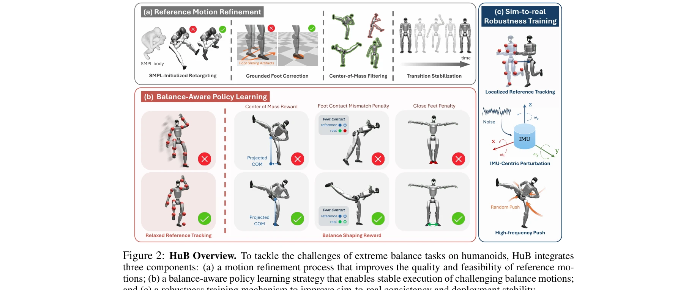
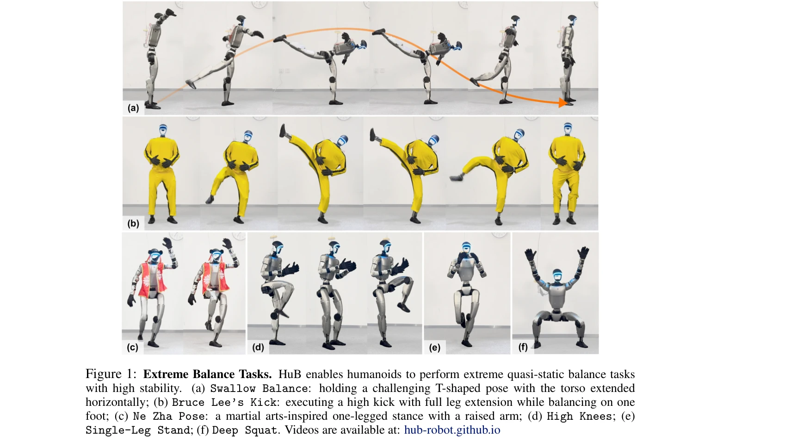

# HuB: Learning Extreme Humanoid Balance

> **저자**: Tong Zhang, Boyuan Zheng, Ruiqian Nai, Yingdong Hu, Yen-Jen Wang, Geng Chen, Fanqi Lin, Jiongye Li, Chuye Hong, Koushil Sreenath, Yang Gao | **날짜**: 2025-05-12 | **URL**: [https://arxiv.org/abs/2505.07294](https://arxiv.org/abs/2505.07294)

---

## Essence

*Figure 2: HuB Overview. To tackle the challenges of extreme balance tasks on humanoids, HuB integrates*

HuB는 휴머노이드 로봇이 제스벨런스, 브루스리 킥 등 극단적인 준정적 균형 작업을 수행하도록 하기 위해 참조 동작 개선, 균형 인식 정책 학습, sim-to-real 강건성 훈련을 통합한 통합 프레임워크다.

## Motivation

- **Known**: 최근 휴머노이드 제어 연구는 reinforcement learning을 사용하여 인간 동작 추적을 통해 기술 습득을 진행하고 있다. 그러나 균형 집약적 작업에 이 패러다임을 적용하는 것은 여전히 도전적이다.
- **Gap**: 기존의 tracking 기반 방법들은 참조 동작 오류로 인한 불안정성, 형태 불일치로 인한 학습 어려움, 센서 노이즈와 미모델링 동역학으로 인한 sim-to-real 갭에 직면한다.
- **Why**: 휴머노이드가 극단적인 단일 다리 균형 작업을 수행할 수 있는 능력은 인간과 유사한 민첩성과 견고성을 갖춘 로봇 개발의 핵심이며, 이는 복잡한 미구조 환경에서의 활용을 가능하게 한다.
- **Approach**: HuB는 세 가지 문제 각각에 대응하는 구성 요소로 이루어진다: (1) SMPL 초기화와 후처리를 통한 참조 동작 정제, (2) COM 기반 보상과 형태 불일치를 수용하는 완화된 tracking 목표를 포함한 균형 인식 정책 학습, (3) IMU 중심 perturbation과 고주파 랜덤 푸시를 통한 sim-to-real 강건성 훈련.

## Achievement

*Figure 1: Extreme Balance Tasks. HuB enables humanoids to perform extreme quasi-static balance tasks*

- **극단적 균형 작업 수행**: Unitree G1 휴머노이드 로봇에서 제스벨런스, 브루스리 킥, Ne Zha 포즈 등의 극단적 준정적 균형 작업을 성공적으로 수행
- **외부 교란에 대한 강건성**: 강력한 축구공 타격 같은 강한 물리적 방해에도 안정성 유지, baseline 방법들은 실패
- **연속 실행 성공**: 개입 없이 단일 연속 rollout에서 10회 연속 실행 성공
- **Ablation 검증**: 각 구성 요소의 필요성을 ablation study를 통해 검증

## How

*Figure 2: HuB Overview. To tackle the challenges of extreme balance tasks on humanoids, HuB integrates*

- SMPL 기반 초기화를 통한 retargeting 수렴 가속화 및 발 슬라이딩 artifact 제거를 위한 post-processing
- COM 투영 기반 보상과 발 접촉 불일치 페널티, 근처 중심 추적을 통한 균형 인식 정책 학습
- 로컬라이즈된 reference tracking으로 VIO 의존성 제거
- IMU 중심 observation perturbation을 통한 센서 노이즈 모델링
- 고주파 external push를 통한 실제 jitter 효과 근사

## Originality

- 극단적 준정적 균형에 특화된 통합 프레임워크로, 기존 연구들과 달리 동역학 안정화보다 지속적 균형 유지에 초점
- 형태 불일치를 수용하기 위해 strict tracking을 이완하는 균형 인식 정책 설계 접근법
- 균형 작업에 특화된 IMU 중심 perturbation과 localized reference tracking을 통한 새로운 sim-to-real 전략
- SMPL 기반 초기화와 post-processing을 결합한 실제적 참조 동작 정제 파이프라인

## Limitation & Further Study

- Unitree G1 단일 로봇 플랫폼에서만 검증되어, 다양한 형태의 휴머노이드에 대한 일반화 정도 미지
- 환경 요인(바닥 재질, 온도 변화 등)에 따른 강건성 평가 부재
- 참조 동작 수집 단계에서 marker-based motion capture에 의존하거나 video 기반 방식의 한계 극복 방법 미흡
- 동적 균형 작업(예: 움직이는 물체 위에서의 균형)으로의 확장 가능성 미제시
- 후속 연구: 다중 로봇 플랫폼 검증, 극한 환경 조건에서의 적응, 온라인 learning을 통한 실시간 적응 능력 강화

## Evaluation

- Novelty: 4/5
- Technical Soundness: 3/5
- Significance: 4/5
- Clarity: 4/5
- Overall: 4/5

**총평**: HuB는 극단적 휴머노이드 균형 작업이라는 도전적인 문제에 대해 참조 동작 오류, 형태 불일치, sim-to-real 갭의 세 가지 핵심 문제를 체계적으로 해결하는 잘 설계된 통합 프레임워크로, 실제 로봇에서의 강건한 성능 달성과 외부 교란에 대한 탁월한 저항성을 통해 높은 실제적 가치를 입증한다.

## Related Papers

- 🔗 후속 연구: [[papers/1470_Humanoid_Parkour_Learning/review]] — Humanoid Parkour Learning의 동적 기술을 극단적 균형 제어로 확장했다
- 🏛 기반 연구: [[papers/1330_CLAM_Continuous_Latent_Action_Models_for_Robot_Learning_from/review]] — DeepMimic의 physics-based 모방 학습이 HuB의 극단적 균형 학습의 기반이 된다
- 🔄 다른 접근: [[papers/1301_Chasing_Stability_Humanoid_Running_via_Control_Lyapunov_Func/review]] — 둘 다 휴머노이드 균형과 안정성을 다루지만 HuB는 극단적 균형에, Control Lyapunov는 수학적 안정성에 집중한다
- 🔄 다른 접근: [[papers/1374_Embedding_Classical_Balance_Control_Principles_in_Reinforcem/review]] — 둘 다 극한 균형 상황을 다루지만 전자는 고전 이론 기반, 후자는 순수 학습 기반 접근을 사용한다.
- 🏛 기반 연구: [[papers/1470_Humanoid_Parkour_Learning/review]] — 파쿠르의 동적 기술들이 HuB의 극단적 균형 제어의 기반이 된다
