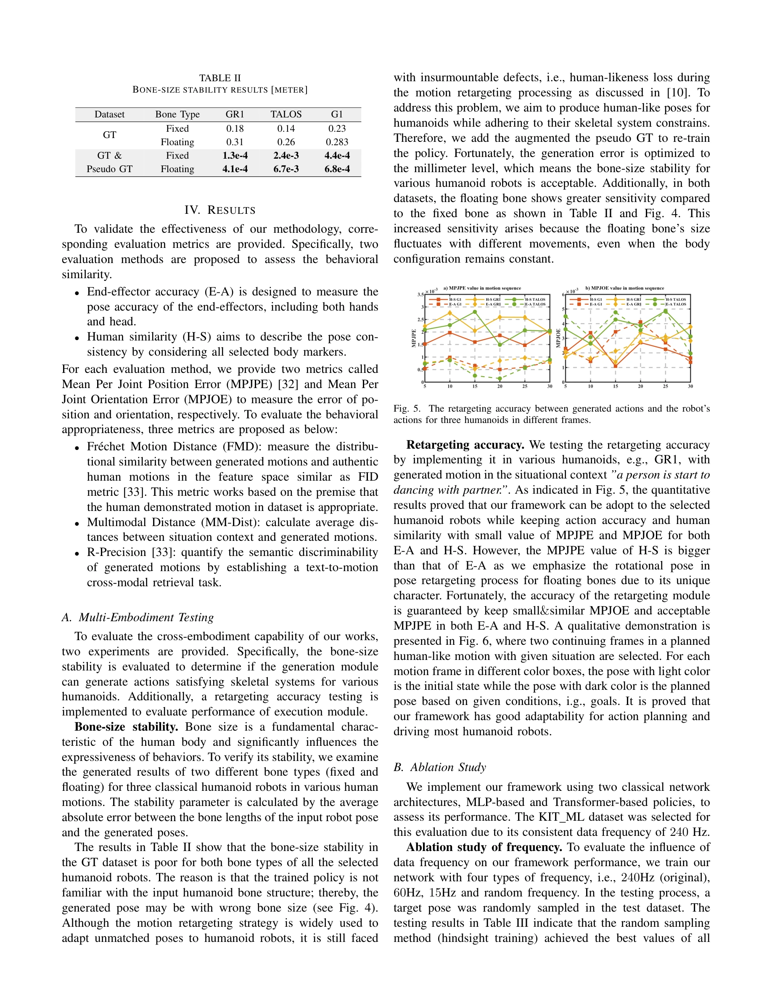

# HuBE: Cross-Embodiment Human-like Behavior Execution for Humanoid Robots

> **저자**: Shipeng Lyu, Fangyuan Wang, Weiwei Lin, Luhao Zhu, David Navarro-Alarcon, Guodong Guo | **날짜**: 2025-08-26 | **DOI**: [10.48550/arXiv.2508.19002](https://doi.org/10.48550/arXiv.2508.19002)

---

## Essence

*Fig. 2. Overview of the whole algorithm. This algorithm includes three parts, i.e., building dataset, model training and*

HuBE는 humanoid robot이 행동 유사성과 상황적 적절성을 모두 만족하는 human-like behavior를 생성하기 위한 bi-level closed-loop framework이며, cross-embodiment adaptability를 지원한다.

## Motivation

- **Known**: Motion retargeting과 imitation learning을 통해 behavioral similarity를 달성하는 기존 연구들이 있으나, behavioral appropriateness는 미흡하고 heterogeneous robot에 대한 cross-embodiment 적응이 부재하다.
- **Gap**: 기존 dataset은 contextual semantics를 충분히 반영하지 못하고, pose generation과 robot execution 사이의 structural mismatch가 발생하며, 서로 다른 humanoid robot에 대한 일반화 능력이 부족하다.
- **Why**: Human-robot interaction에서 uncanny valley 현상을 피하고 사회적 수용성을 높이려면 단순 동작 유사성뿐 아니라 상황에 맞는 적절한 행동이 필수이며, 다양한 robot platform에 대한 배포 가능성이 중요하다.
- **Approach**: HPose dataset을 구축하여 fine-grained contextual annotations을 추가하고, robot state와 behavioral goal, contextual situation을 통합하는 closed-loop framework을 제안하며, bone scaling-based data augmentation으로 cross-embodiment compatibility를 확보한다.

## Achievement

*Fig. 5. The retargeting accuracy between generated actions and the robot’s*

- **HPose Dataset 구축**: KIT, AMASS, Motion-X를 통합하고 LLM(GPT-4o)을 활용하여 fine-grained semantic annotations을 추가한 context-enriched dataset 제공
- **Bi-level Closed-loop Framework**: Robot state, behavioral goal, contextual situation을 다중 모달리티로 융합하여 motion generation과 robot control을 end-to-end로 통합하고 structural mismatch 제거
- **Bone Scaling Data Augmentation**: Millimeter-level cross-embodiment compatibility를 달성하여 heterogeneous humanoid robots에 대한 robust deployment 가능
- **성능 향상**: Motion similarity, behavioral appropriateness, computational efficiency 모두에서 state-of-the-art baselines를 초과하는 성능 달성

## How

*Fig. 2. Overview of the whole algorithm. This algorithm includes three parts, i.e., building dataset, model training and*

- HPose dataset 구성: 기존 motion capture dataset에 LLM을 통한 contextual description 생성 및 11개 주요 joint로 단순화
- Closed-loop mechanism: Implicit skeletal parameter adaptation을 통해 robot state를 pose generation module에 통합하여 physical constraints 고려
- Contextual awareness: Behavioral situation을 behavior generation module의 입력으로 포함하여 situational semantics에 따른 pose adaptation
- Bone scaling augmentation: Commercial humanoid robots의 morphological distribution을 시뮬레이션하여 다양한 kinematic parameters에 대한 일반화성 확보
- Frame-by-frame pose generation: 전체 motion sequence 생성 대신 현재 robot state와 joint goal에 기반한 frame-by-frame 방식으로 제어 신호 개선

## Originality

- Behavioral similarity와 behavioral appropriateness를 구분하여 human-likeness를 재정의하고 두 요소를 모두 만족시키는 첫 시도
- Contextual situation을 explicit하게 robot action planning에 통합하는 semantic-task fusion 패러다임 도입
- Pose generation과 robot execution 사이의 structural mismatch를 closed-loop mechanism으로 해결하는 novel architecture
- Bone scaling operation을 통한 data augmentation이 millimeter-level cross-embodiment compatibility를 달성하는 새로운 방법론

## Limitation & Further Study

- HPose dataset의 contextual description이 LLM 자동 생성에 의존하여 annotation quality 검증 및 human evaluation의 필요성 부족
- Closed-loop framework의 computational overhead 및 real-time deployment 성능에 대한 상세한 분석 부재
- Bone scaling augmentation이 kinematic parameters만 고려하고 동역학(dynamics) 특성이나 actuator 성능 차이는 미반영
- Multiple commercial humanoid platforms에서의 검증이 제한적이며, 실제 deployment 시 추가 튜닝의 필요성 가능성
- Fine-grained situation annotation의 scalability 한계 및 새로운 contextual scenario에 대한 generalization 능력 검증 필요

## Evaluation

- Novelty: 4/5
- Technical Soundness: 3/5
- Significance: 4/5
- Clarity: 4/5
- Overall: 4/5

**총평**: HuBE는 behavioral similarity와 appropriateness라는 dual requirement를 명시적으로 다루고, closed-loop mechanism과 bone scaling augmentation을 통해 실제 humanoid robots에 배포 가능한 human-like behavior generation의 중요한 진전을 제시한다. 다만 dataset quality, computational efficiency, cross-embodiment generalization의 상세 검증이 보완된다면 더욱 강력한 기여가 될 수 있다.

## Related Papers

- 🔄 다른 접근: [[papers/1568_MeshMimic_Geometry-Aware_Humanoid_Motion_Learning_through_3D/review]] — 둘 다 cross-embodiment adaptation을 다루지만 1458은 bi-level framework로, 1568은 geometry-aware learning으로 접근함
- 🔗 후속 연구: [[papers/1485_HumanX_Toward_Agile_and_Generalizable_Humanoid_Interaction_S/review]] — HumanX의 상호작용 스킬 학습을 다양한 체형에 적용할 수 있도록 확장한 framework임
- 🧪 응용 사례: [[papers/1573_SimpleVLA-RL_Scaling_VLA_Training_via_Reinforcement_Learning/review]] — Mimicking-Bench가 제공하는 벤치마크가 cross-embodiment behavior execution의 평가 기준을 제시함
- ⚖️ 반론/비판: [[papers/1550_Robots_Enact_Malignant_Stereotypes/review]] — CLIP 기반 로봇의 편향 문제를 다룬 연구와 달리 LLM 기반 로봇의 차별과 폭력 위험을 체계적으로 분석하여 AI 안전성 관점을 확장한다.
- 🔄 다른 접근: [[papers/1568_MeshMimic_Geometry-Aware_Humanoid_Motion_Learning_through_3D/review]] — 둘 다 geometry-aware humanoid learning을 다루지만 1568은 3D 장면 복원 기반으로, 1458은 bi-level framework로 접근함
