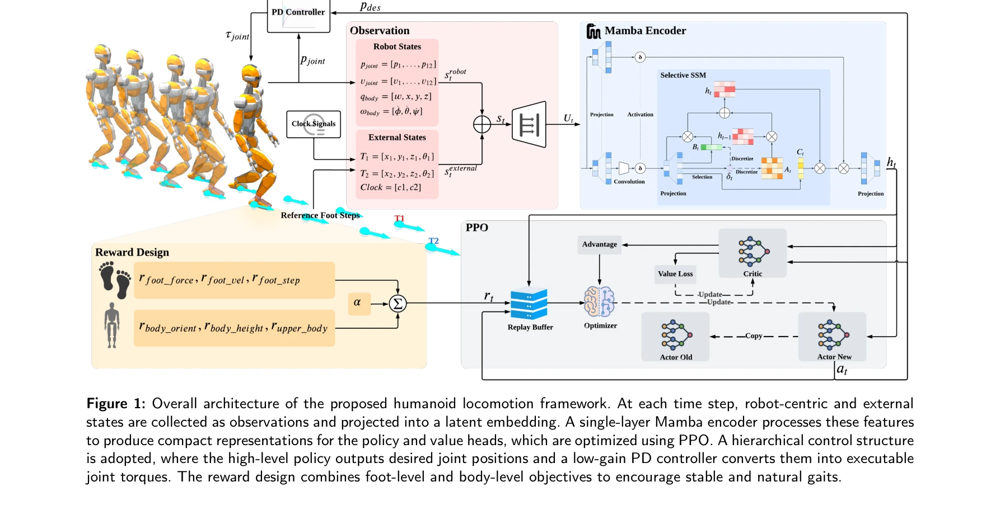
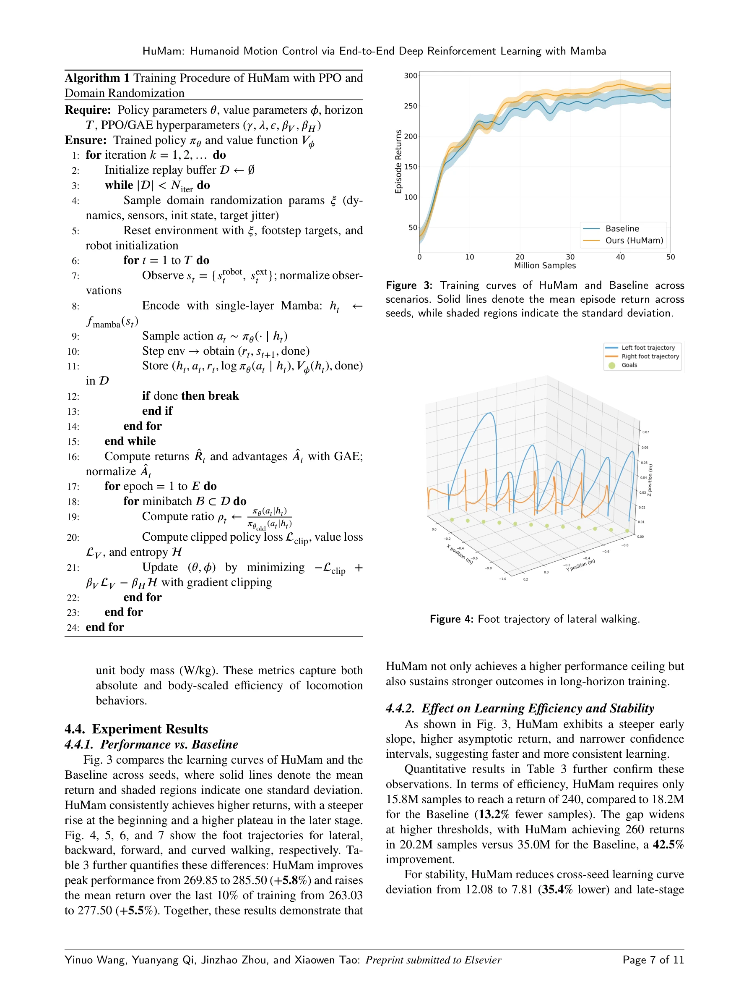

# HuMam: Humanoid Motion Control via End-to-End Deep Reinforcement Learning with Mamba

> **저자**: Yinuo Wang, Yuanyang Qi, Jinzhao Zhou, Pengxiang Meng, Xiaowen Tao | **날짜**: 2025-09-22 | **URL**: [https://arxiv.org/abs/2509.18046](https://arxiv.org/abs/2509.18046)

---

## Essence

*Figure 1: Overall architecture of the proposed humanoid locomotion framework. At each time step, robot-centric and exter*

HuMam은 Mamba 인코더를 기반으로 한 end-to-end 강화학습 프레임워크로, 로봇 중심 상태와 발걸음 목표를 효율적으로 융합하여 인형 로봇의 안정적이고 에너지 효율적인 보행을 실현한다.

## Motivation

- **Known**: End-to-end RL은 감지-행동 매핑이 간결하지만 훈련 불안정성과 비효율적인 특성 융합 문제가 있으며, 기존 feedforward 백본은 관찰의 구조를 충분히 활용하지 못한다.
- **Gap**: 인형 로봇 보행 제어에 Mamba와 같은 경량 시퀀스 모델을 적용한 end-to-end RL 접근법이 부재하였고, 훈련 효율성과 안정성을 동시에 개선하는 방법이 미흡했다.
- **Why**: 인형 로봇은 높은 무게 중심과 복잡한 동역학으로 인해 안정적이고 에너지 효율적인 보행 제어가 중요하며, 실시간 임베디드 환경에서 계산 비용 효율적인 솔루션이 필수적이다.
- **Approach**: 단일 층 Mamba 인코더를 사용하여 robot-centric 상태와 oriented 발걸음 목표, phase clock을 융합하고, 6-term 보상 함수로 접촉 품질, 스윙 부드러움, 발 배치, 자세, 안정성을 균형있게 조절하며 PPO로 최적화한다.

## Achievement

*Figure 3: Training curves of HuMam and Baseline across*

- **첫 Mamba 기반 인형 로봇 end-to-end RL 제어기**: Mamba를 인형 로봇 보행의 경량 융합 백본으로 도입하여 순수 state-centric 설정에서 강력한 성능 달성
- **학습 효율성과 안정성 개선**: Feedforward baseline 대비 더 빠른 학습, 향상된 샘플 효율성, 낮은 크로스-시드 변동성으로 동일한 훈련 예산 하에서 높은 최종 수익 달성
- **에너지 절감 보상 설계**: 6-term PPO 보상으로 접촉력, 스윙 속도, 스텝 정확도, 신체 방향, 몸통 높이, 상체 흔들림을 조절하여 부드러운 작동, 감소된 토크 사용, 낮은 전력 소비 실현
- **광범위한 경험적 검증**: JVRC-1 인형 로봇에서 전진, 후진, 곡선, 측면, 서 있기 작업 전반에서 mc-mujoco 환경에서 일관적인 성능 향상 확인

## How

*Figure 1: Overall architecture of the proposed humanoid locomotion framework. At each time step, robot-centric and exter*

- 관찰 공간: robot-centric 상태(관절 위치·속도, 베이스 태도·각속도)와 외부 상태(2개 oriented 발걸음, 루트 헤딩, 연속 phase clock)로 구성
- 행동 공간: 정책이 관절 위치 목표값을 출력하고 저수준 PD 제어기가 추적
- Mamba 인코더: 단일 층으로 구성된 경량 state-space 모델이 이질적 특성들을 효율적으로 융합
- 보상 함수: 접촉 품질, 스윙 부드러움, 발 배치 정확도, 자세, 신체 높이, 안정성의 6개 항 가중합
- 최적화: PPO 알고리즘으로 학습하여 안정성 확보
- 실행: 저이득 PD 제어기가 정책 출력을 추적하여 부드러운 토크와 잘 조정된 학습 보장

## Originality

- 인형 로봇 end-to-end RL 제어에 Mamba를 처음으로 적용한 혁신적 시도
- State-centric 설정에서 단일 층 Mamba만으로도 충분한 성능을 달성하여 경량 설계의 효과 입증
- Oriented 발걸음 목표와 continuous phase clock을 결합한 특별한 관찰 공간 설계로 구조적 정보 활용
- 6개 항으로 구성된 균형잡힌 보상 함수가 안정성, 정확도, 에너지 효율성을 동시에 추구하는 명확한 가치 체계 제시

## Limitation & Further Study

- 시뮬레이션(mc-mujoco)에서만 검증되었으며 실제 JVRC-1 하드웨어에 대한 sim-to-real 전이 검증 부재
- 단일 인형 로봇 모델(JVRC-1)에 대해서만 평가되어 다른 인형 로봇 플랫폼에서의 일반화 능력 미지수
- Mamba의 이점을 더 깊이 분석하기 위해 다른 state-space 모델(S4, HiPPO 등)과의 비교 실험 부재
- 복잡한 불규칙한 지형이나 장애물 회피 같은 고급 작업에 대한 성능 평가 없음
- 후속 연구: (1) 실제 로봇 하드웨어 플랫폼에서의 검증, (2) 다양한 인형 로봇 플랫폼으로의 확장, (3) 시각 입력 통합을 통한 exteroceptive 능력 추가, (4) 동적 장애물 회피 능력 개발

## Evaluation

- Novelty: 4/5
- Technical Soundness: 3/5
- Significance: 4/5
- Clarity: 4/5
- Overall: 4/5

**총평**: HuMam은 Mamba를 인형 로봇 제어에 처음 적용하여 학습 효율성, 안정성, 에너지 효율성을 동시에 개선한 견고한 contribution을 제시하며, 명확한 방법론과 광범위한 실험을 통해 실질적 가치를 입증했다.

## Related Papers

- 🔗 후속 연구: [[papers/1495_InEKFormer_A_Hybrid_State_Estimator_for_Humanoid_Robots/review]] — HuMam의 Mamba 기반 인코더는 InEKFormer의 하이브리드 상태 추정과 결합하여 더욱 정확한 보행 제어를 달성할 수 있다.
- 🔄 다른 접근: [[papers/1276_AutoOdom_Learning_Auto-regressive_Proprioceptive_Odometry_fo/review]] — 두 논문 모두 proprioceptive information을 활용하지만, HuMam은 Mamba 인코더에, AutoOdom은 auto-regressive odometry에 초점을 둔다.
- 🏛 기반 연구: [[papers/1526_Real-World_Humanoid_Locomotion_with_Reinforcement_Learning/review]] — HuMam의 end-to-end RL 프레임워크는 real-world humanoid locomotion의 실용적 구현에 필요한 기반 기술을 제공한다.
- 🏛 기반 연구: [[papers/1495_InEKFormer_A_Hybrid_State_Estimator_for_Humanoid_Robots/review]] — InEKFormer의 정확한 상태 추정은 HuMam의 Mamba 기반 제어에서 더욱 신뢰할 수 있는 입력을 제공한다.
