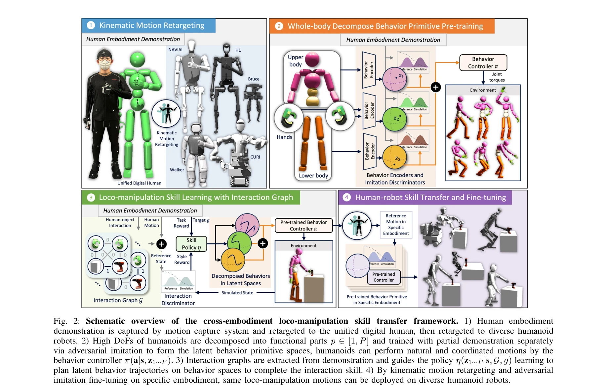

# Human-Humanoid Robots Cross-Embodiment Behavior-Skill Transfer Using Decomposed Adversarial Learning from Demonstration

> **저자**: Junjia Liu, Zhuo Li, Minghao Yu, Zhipeng Dong, Sylvain Calinon, Darwin Caldwell, Fei Chen | **날짜**: 2024-12-19 | **URL**: [https://arxiv.org/abs/2412.15166](https://arxiv.org/abs/2412.15166)

---

## Essence

*Fig. 2: Schematic overview of the cross-embodiment loco-manipulation skill transfer framework. 1) Human embodiment*

Unified Digital Human (UDH) 모델을 공통 프로토타입으로 사용하여 인간 시연에서 학습한 행동 원시를 humanoid 로봇 간에 전이하는 cross-embodiment 프레임워크를 제안한다. Adversarial imitation learning과 functional decomposition을 결합하여 높은 자유도 문제를 해결하고 다양한 로봇 플랫폼 간 효율적인 스킬 전이를 실현한다.

## Motivation

- **Known**: Humanoid 로봇이 복잡한 loco-manipulation 태스크를 수행해야 하지만 높은 자유도와 데이터 수집의 어려움이 주요 과제이다. Adversarial imitation learning과 cross-embodiment 스킬 전이 연구들이 존재하지만 대부분 단순한 조작 태스크나 시각 표현 전이에 한정되어 있다.
- **Gap**: 기존 방법들은 humanoid 로봇의 고유한 도전점인 고차원 조정, 동적 균형, 전신 협응을 충분히 다루지 못하며, 새로운 로봇 플랫폼마다 재학습이 필요한 문제가 있다.
- **Why**: Humanoid 로봇 플랫폼의 급속한 증가로 인해 각 플랫폼마다 재학습 없이 스킬을 효율적으로 전이할 수 있는 일반화 가능한 프레임워크가 필수적이며, 이를 통해 데이터 병목 문제를 해결하고 개발 효율성을 크게 향상시킬 수 있다.
- **Approach**: UDH 모델을 중심 프로토타입으로 하여 인간 시연으로부터 embodiment-independent 행동 원시를 학습하고, humanoid의 복잡한 구조를 functional components로 분해하여 각각 독립적으로 adversarial imitation으로 학습한다. Human-object interaction graph를 통해 태스크 일반화를 달성하고, kinematic motion retargeting과 embodiment-specific dynamic fine-tuning으로 다양한 로봇에 전이한다.

## Achievement

*Fig. 2: Schematic overview of the cross-embodiment loco-manipulation skill transfer framework. 1) Human embodiment*

- **Cross-embodiment 스킬 전이 프레임워크**: UDH를 공통 프로토타입으로 사용하여 5개의 서로 다른 configuration을 가진 humanoid 로봇에 동일한 loco-manipulation 스킬을 성공적으로 배포
- **Functional decomposition 기반 고차원 조정**: 로봇의 높은 자유도를 neck, torso, shoulder, elbow, wrist, finger, hip, knee, ankle 등의 functional parts로 분해하여 각각 독립적으로 학습하고 동적으로 조정
- **데이터 효율성 증대**: 인간 시연을 활용하고 새로운 플랫폼에 대해 full retraining 없이 kinematic motion retargeting과 fine-tuning만으로 스킬 적응 가능
- **Interaction graph 기반 태스크 일반화**: Human-object interaction graph를 활용하여 정책이 behavior primitive 공간에서 latent 행동 궤적을 동적으로 계획하도록 학습

## How

*Fig. 2: Schematic overview of the cross-embodiment loco-manipulation skill transfer framework. 1) Human embodiment*

- Human motion capture 데이터를 UDH로 retarget한 후 5개의 humanoid 로봇으로 재 retarget
- High DoF를 functional parts p ∈ [1, P]로 분해하고 각 부분에 대해 partial demonstration을 사용하여 adversarial imitation 학습
- Latent behavior primitive 공간 z₁∼P를 학습하고 behavior controller π(a|s, z₁∼P)를 통해 자연스럽고 조정된 모션 생성
- Interaction graph G와 goal g를 입력으로 하는 policy η(z₁∼P|s, G, g)를 학습하여 behavior 공간에서 latent 행동 궤적 계획
- 각 humanoid embodiment에 대해 grouping된 DoF의 부분 역기구학(partial inverse kinematics)을 통한 kinematic motion retargeting
- Embodiment-specific adversarial imitation fine-tuning으로 kinematic retargeting 후 동역학적 안정성 확보

## Originality

- **UDH 기반 통합 접근**: 인간을 모든 humanoid 로봇의 공통 프로토타입으로 사용하는 새로운 관점으로, 기존의 직접적인 로봇 간 전이와 구별됨
- **Functional decomposition + Adversarial imitation 결합**: High-DoF 로봇의 조정 문제를 분해적 학습으로 해결하면서 동시에 adversarial learning의 강점 활용
- **Interaction graph 기반 동적 조정**: Human-object interaction을 명시적으로 모델링하여 behavior primitive를 계획적으로 조합하는 방식의 창신성
- **광범위한 실증**: 5개의 heterogeneous humanoid 로봇(다양한 DoF와 configuration 보유)에서 검증하여 일반화 능력 입증

## Limitation & Further Study

- Kinematic motion retargeting 단계에서 실제 동역학을 고려하지 않으며, 관절 각도와 속도만 시뮬레이션하므로 embodiment-specific fine-tuning에 의존해야 함
- Interaction graph 추출이 manual annotation에 의존하거나 특정 태스크에 대해 미리 정의되어야 할 가능성이 있어 다양한 태스크로의 확장성 제한
- 5개 로봇으로 검증했지만 더욱 이질적인 구조의 로봇(예: 다리 개수가 다른 로봇)에 대한 적용 가능성 미명확
- Human demonstration data의 품질과 다양성이 최종 성능에 미치는 영향에 대한 상세한 분석 부재
- **후속 연구 방향**: (1) Interaction graph를 자동으로 추출하는 기법 개발, (2) 더욱 다양한 embodiment 간 전이 검증, (3) 동역학 고려를 반영한 retargeting 개선, (4) Few-shot fine-tuning 가능성 탐색

## Evaluation

- Novelty: 4/5
- Technical Soundness: 3/5
- Significance: 4/5
- Clarity: 4/5
- Overall: 4/5

**총평**: 본 논문은 humanoid 로봇의 cross-embodiment 스킬 전이에 대한 포괄적이고 실용적인 솔루션을 제시하며, UDH 기반 통합 학습과 functional decomposition을 통해 높은 자유도 문제를 효과적으로 해결한다. 5개 로봇에 대한 광범위한 실증 검증과 체계적인 설계로 높은 기여도를 보이나, kinematic retargeting의 동역학 미반영과 interaction graph의 수동 정의는 개선의 여지가 있다.

## Related Papers

- 🔄 다른 접근: [[papers/1425_Human2Robot_Learning_Robot_Actions_from_Paired_Human-Robot_V/review]] — 둘 다 human-robot transfer이지만 Cross-Embodiment는 UDH 기반 adversarial learning에, Human2Robot은 paired video learning에 중점을 둡니다.
- 🏛 기반 연구: [[papers/1522_RDT-1B_a_Diffusion_Foundation_Model_for_Bimanual_Manipulatio/review]] — massive human video learning의 기반 방법론을 cross-embodiment transfer에 특화하여 적용한 구체적 구현입니다.
- 🔗 후속 연구: [[papers/1546_Learning_to_Walk_in_Costume_Adversarial_Motion_Priors_for_Ae/review]] — Robot Utility Models의 zero-shot deployment 개념을 human-humanoid cross-embodiment로 확장한 specialized application입니다.
- 🔄 다른 접근: [[papers/1513_Parallels_Between_VLA_Model_Post-Training_and_Human_Motor_Le/review]] — Human-humanoid behavior-skill transfer와 VLA post-training의 인간 운동 학습 관점이 서로 다른 접근 방식을 보여준다.
