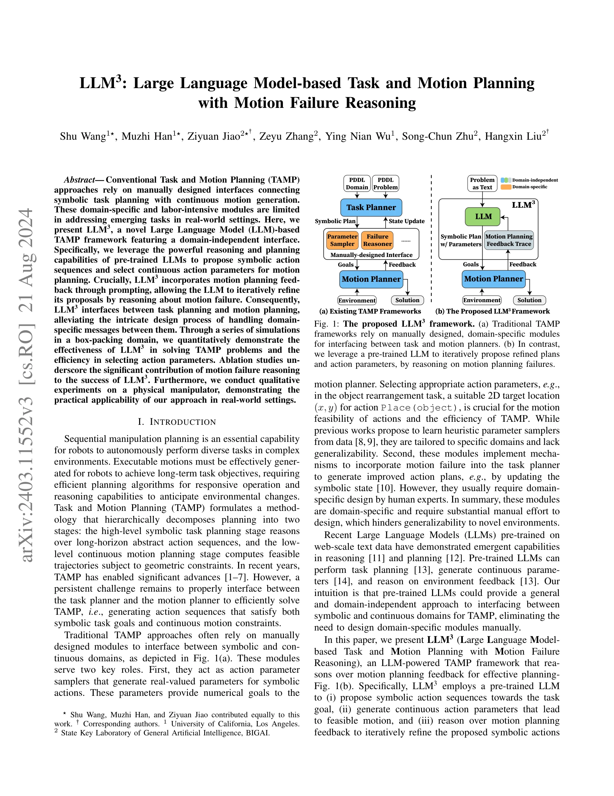
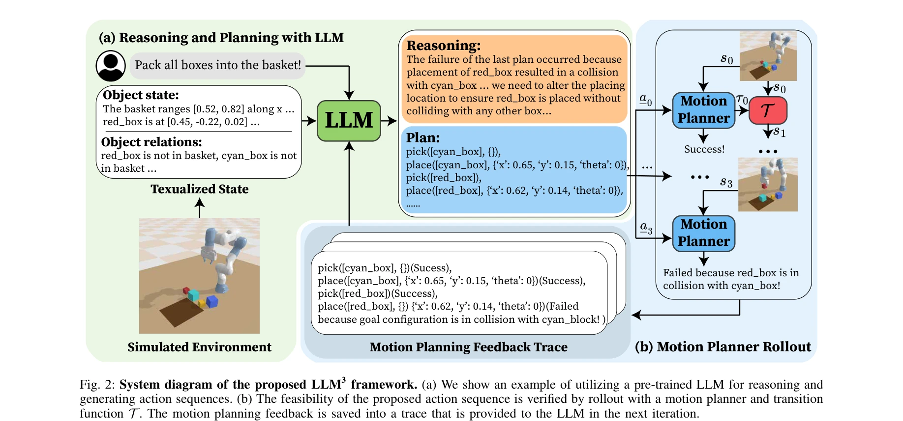

# LLM3:Large Language Model-based Task and Motion Planning with Motion Failure Reasoning

> **저자**: Shu Wang, Muzhi Han, Ziyuan Jiao, Zeyu Zhang, Ying Nian Wu, Song-Chun Zhu, Hangxin Liu | **날짜**: 2024-03-18 | **URL**: [https://arxiv.org/abs/2403.11552](https://arxiv.org/abs/2403.11552)

---

## Essence

*Fig. 1: The proposed LLM3 framework. (a) Traditional TAMP*

LLM3는 대규모 언어모델(LLM)을 기반으로 한 Task and Motion Planning 프레임워크로, 모션 계획 실패에 대한 추론을 통해 기호적 계획과 연속 모션 생성을 통합한다. 도메인 특화 인터페이스 대신 LLM의 추론 능력을 활용하여 작업 계획과 행동 매개변수를 제안하고 반복적으로 개선한다.

## Motivation

- **Known**: 기존 TAMP 방식은 기호적 작업 계획과 연속 모션 계획 사이의 인터페이스를 위해 수작업으로 설계된 도메인 특화 모듈에 의존한다. 최근 LLM은 추론과 계획 능력에서 강력한 성능을 보여주고 있다.
- **Gap**: 기존 TAMP의 도메인 특화 모듈은 노동집약적이며 새로운 작업에 대한 일반화가 제한된다. LLM의 추론 능력을 TAMP의 핵심 컴포넌트로 통합하되 모션 계획 실패를 체계적으로 추론하는 접근이 부족하다.
- **Why**: 자동화된 로봇 조작을 위해서는 복잡한 환경에서 장시간 작업 목표를 달성하면서 동시에 기하학적 제약을 만족하는 실행 가능한 모션을 생성해야 하므로 효율적이고 일반화 가능한 TAMP 방식이 필수적이다.
- **Approach**: pre-trained LLM을 도메인 독립적 task planner, informed action parameter sampler, 그리고 motion failure reasoner로 활용하며, 모션 계획 피드백(충돌, 도달 불가능)을 체계적으로 분류하여 LLM이 제안을 반복적으로 개선하도록 prompting한다.

## Achievement

*Fig. 2: System diagram of the proposed LLM3 framework. (a) We show an example of utilizing a pre-trained LLM for reasoni*

- **도메인 독립적 TAMP 프레임워크**: pre-trained LLM을 기반으로 수작업으로 설계된 모듈 없이 기호적 계획과 연속 매개변수 선택을 통합
- **모션 실패 추론 메커니즘**: collision과 unreachability 두 가지 주요 실패 모드를 체계화하여 targeted refinement 실현
- **효율적 파라미터 샘플링**: LLM 기반 informed sampler가 random sampler 대비 현저히 향상된 샘플 효율성 입증
- **실증적 검증**: 상자 포장 도메인에서 정량적 평가와 ablation study를 통해 모션 피드백 추론의 중요성 확인, 실제 로봇에서의 적용 가능성 입증

## How

*Fig. 2: System diagram of the proposed LLM3 framework. (a) We show an example of utilizing a pre-trained LLM for reasoni*

- pre-trained LLM에 자연언어로 환경 상태, 작업 목표, 이전 실패를 포함한 prompt 제공
- LLM이 기호적 action sequence와 연속 action parameters(예: 객체 배치 위치)를 동시에 생성
- 생성된 action을 motion planner에 전달하여 실행 가능성 검증
- motion planner의 실패 피드백(collision 또는 unreachability)을 분류하여 structured prompt로 LLM에 반환
- LLM이 피드백을 기반으로 action sequence와 parameters를 반복적으로 개선
- 목표 달성 또는 성공 threshold 도달 시 계획 완료

## Originality

- LLM을 TAMP의 core component로 활용하는 첫 번째 holistic framework 제시
- motion planner의 피드백을 체계적으로 분류하고 구조화하여 LLM의 추론 기반 개선을 가능하게 함
- 도메인 특화 PDDL 파일이나 수작업 설계 모듈 없이 LLM의 implicit knowledge를 활용하는 범용적 접근
- motion failure reasoning을 iterative refinement 루프에 통합하여 planning efficiency 향상

## Limitation & Further Study

- 평가가 단일 도메인(box-packing task)에 국한되어 있으며 다양한 로봇 작업에 대한 일반화 능력 미검증
- real-robot 실험이 qualitative에 그쳐 정량적 평가 부족
- LLM의 성능이 특정 모델 아키텍처와 training data에 의존하므로 모델 의존성 문제 존재
- motion planning feedback의 분류가 collision과 unreachability로 제한되어 다른 형태의 실패(예: 안정성, 힘 제약)는 미처리
- 후속 연구로 다중 도메인에 대한 광범위한 평가, 더 정교한 failure mode 분류, 그리고 실제 환경의 불확실성 처리 필요

## Evaluation

- Novelty: 4/5
- Technical Soundness: 3/5
- Significance: 4/5
- Clarity: 4/5
- Overall: 4/5

**총평**: LLM3는 domain-independent interface를 통해 TAMP의 오래된 문제를 창의적으로 해결하며, motion failure reasoning을 LLM 기반 planning에 통합한 점에서 새로운 방향을 제시한다. 다만 평가의 범위가 제한적이고 real-robot 실험의 깊이가 더 필요하지만, 앞으로의 로봇 자율화에 중요한 기초를 제공한다.

## Related Papers

- 🔄 다른 접근: [[papers/1459_LLM-State_Open_World_State_Representation_for_Long-horizon_T/review]] — 두 논문 모두 LLM 기반 장기 계획을 다루지만, 하나는 모션 계획 실패 추론에, 다른 하나는 상태 표현에 집중합니다.
- 🏛 기반 연구: [[papers/1341_CoPAL_Corrective_Planning_of_Robot_Actions_with_Large_Langua/review]] — 대화형 계획과 언어 모델의 결합이 작업과 모션 계획의 통합적 접근법의 기초를 제공합니다.
- 🧪 응용 사례: [[papers/1444_Hierarchical_Planning_and_Control_for_Box_Loco-Manipulation/review]] — 계층적 계획과 제어 방법론이 LLM 기반 작업-모션 계획을 실제 로봇 시스템에 적용하는 데 필요합니다.
- 🔗 후속 연구: [[papers/1561_SayPlan_Grounding_Large_Language_Models_using_3D_Scene_Graph/review]] — 3D 장면 그래프와 언어 그라운딩을 통해 작업 계획의 공간적 추론 능력을 더욱 향상시킬 수 있습니다.
- 🔄 다른 접근: [[papers/1434_Inner_Monologue_Embodied_Reasoning_through_Planning_with_Lan/review]] — 두 논문 모두 LLM을 사용한 작업 계획을 다루지만, 하나는 언어 피드백 기반이고 다른 하나는 모션 계획 실패 추론에 집중합니다.
- 🔗 후속 연구: [[papers/1459_LLM-State_Open_World_State_Representation_for_Long-horizon_T/review]] — 객체 중심 상태 표현을 task and motion planning과 결합하여 더욱 체계적인 장기 작업 수행을 달성할 수 있습니다.
- 🧪 응용 사례: [[papers/1601_UniSkill_Imitating_Human_Videos_via_Cross-Embodiment_Skill_R/review]] — UniSkill의 cross-embodiment transfer가 Human-Humanoid Cross-Embodiment 연구의 실제 구현체로서 humanoid 로봇 정책 학습에 직접 활용 가능
