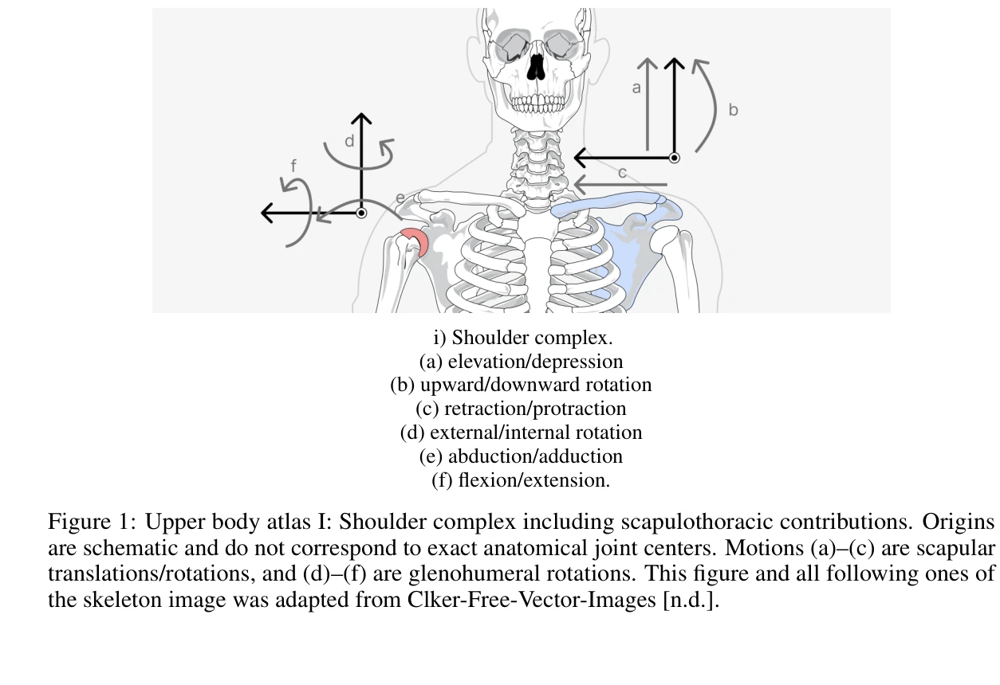

# Human-Level Actuation for Humanoids

> **저자**: MD-Nazmus Sunbeam | **날짜**: 2025-11-10 | **URL**: [https://arxiv.org/abs/2511.06796](https://arxiv.org/abs/2511.06796)

---

## Essence

인간 수준의 구동(actuation)을 정량적으로 정의하고 측정하는 포괄적 프레임워크를 제시하며, DoF atlas, Human-Equivalence Envelopes (HEE), Human-Level Actuation Score (HLAS)의 세 가지 구성 요소로 휴머노이드 로봇의 구동 성능을 표준화된 방식으로 평가한다.

## Motivation

- **Known**: 휴머노이드 로봇이 '인간 수준' 구동을 달성한다는 주장이 많지만, 이러한 주장은 피크 토크와 속도 사양에만 의존하여 실제 작업 환경에서의 토크, 파워, 지구력의 조합을 정량화하지 못한다.
- **Gap**: 현존하는 로봇 구동 평가는 작업 관련 자세와 속도에서 인간 수준의 성능 요구를 명확히 정의하지 않으며, 다양한 시스템 간 비교 가능한 벤치마크가 부재하다.
- **Why**: 휴머노이드 로봇의 실용성과 안전성은 단순 피크 사양이 아닌 지속 가능한 토크, 효율성, 열 안정성을 포함한 종합적인 구동 능력에 좌우되므로, 표준화된 평가 프레임워크는 설계와 벤치마킹에 필수적이다.
- **Approach**: ISB 기반 좌표계를 이용한 DoF atlas로 인간과 로봇 관절을 동일 기준으로 표준화하고, 작업별 생체역학 데이터를 추출하여 Human-Equivalence Envelopes를 정의한 후, 이를 포함한 6가지 물리적 요소를 종합하여 HLAS 점수를 계산한다.

## Achievement

- **Kinematic DoF atlas**: ISB 규약에 기반한 전신 관절의 표준화된 좌표계와 가동 범위(ROM)를 정의하여 인간과 로봇 관절 사양의 직접적 비교 가능성 확보
- **Human-Equivalence Envelopes (HEE)**: 걷기, 계단 오르기, 들기, 도달 작업, 손 동작 등 작업별로 관절각도(q)와 각속도(ω)에서 토크와 파워를 동시에 만족하는 요구사항을 정의
- **Human-Level Actuation Score (HLAS)**: 작업 공간 커버리지(ROM, DoF), HEE 커버리지, 토크 모드 대역폭, 효율성, 열 안정성 등 6가지 물리적 요소를 통합한 단일 해석 가능한 점수 도출
- **측정 프로토콜**: Dynamometry, 전력 모니터링, 열 테스트를 포함한 재현 가능한 실험 절차 제시로 HLAS의 모든 입력 값을 객관적으로 산출
- **설계 명시 및 벤치마킹**: 프레임워크가 기어비, 대역폭, 효율성 간의 기술적 트레이드오프를 노출하여 휴머노이드 개발의 설계 사양 및 비교 표준으로 활용 가능

## How

*Figure 1: Upper body atlas I: Shoulder complex including scapulothoracic contributions. Origins*

- 75 kg, 1.75 m 표준 성인 남성을 기준 체형으로 설정하고, de Leva 인체 계측 모델을 통해 정규화된 생체역학 데이터(Nm/kg, W/kg)를 절대값으로 변환
- ISB 기반 하지, 척추, 상지 관절 좌표계 규약을 적용하여 축 방향, 부호, 기능적 ROM을 표준화한 DoF atlas 구성
- canonical gait, activity, manipulation 연구에서 추출한 관절각도, 모멘트, 파워, 각속도 궤적을 이용하여 작업별 operating bands를 정의(예: 발목 push-off 밴드는 plantar flexion 0-25°, 8-12 rad/s)
- 각 관절에서 양의 기계적 일(positive mechanical work)이 집중된 작업 관련 자세-속도 조합에서만 요구사항을 평가
- Dynamometry로 토크-각도-속도 맵 측정, DC-bus 전력 계산으로 효율성 평가, 폐루프 임피던스 제어 실험으로 토크 모드 대역폭 측정, 열 측정으로 지속 가능 duty cycle 파악
- 온난화 사이클 후 안정 상태에서, 전류 포화 없이, 온도 상승 < 0.5°C/s 제약 하에서 continuous-safe performance maps 작성

## Originality

- 단순 피크 사양이 아닌 작업 관련 생체역학 데이터(인간 관절 모멘트, 파워, 가동 범위)를 직접 로봇 요구사항으로 변환하는 방식은 기존 로봇 설계 관행과 구별됨
- ISB 표준 기반의 통일된 DoF atlas를 제시하여 인간-로봇 관절 비교의 모호성 제거
- 작업별 operating bands를 명시적으로 정의하여 로봇이 인간이 실제로 사용하지 않는 자세에서의 과도한 성능으로 점수를 게임하는 것을 방지
- 기어비, 대역폭, 효율성, 열 안정성 간의 구동 트레이드오프를 노출하는 통합 메트릭으로, 단순 토크 최적화의 한계를 지적
- Series elastic actuator, quasi-direct-drive, 직접구동 등 다양한 구동 방식의 장단점을 물리적으로 분석하는 프레임워크 제공

## Limitation & Further Study

- 단일 기준 체형(75 kg, 1.75 m)을 설정하였으나, 인간 집단의 체형 변이를 완전히 반영하지 못함 (논문에서 재스케일링 가능성은 언급하지만 실증 부족)
- 손과 손가락의 세밀한 조작(manipulation) 작업 분석이 제한적일 수 있으며, 복합 멀티태스크 시나리오에서의 요구사항 통합 방안 미흡
- 열 안정성과 지속 가능한 duty cycle은 환경 온도, 냉각 설계, 제어 알고리즘에 매우 의존적이므로, 표준화된 측정 환경 정의 필요
- 로봇의 segment anthropometry와 질량 분포 특성이 인간과 크게 다를 때 역동역학 기반 스케일링의 타당성 재검토 필요
- 후속 연구: (1) 다양한 체형(5백분위수, 95백분위수), 성별, 연령대를 포함한 인간 모집단 기준 수립, (2) 실제 휴머노이드 플랫폼 다수에 대한 HLAS 적용 및 작업 성능과의 상관관계 실증, (3) 멀티모달 상호작용(보행+조작) 시나리오에서의 trade-off 분석

## Evaluation

- Novelty: 4/5
- Technical Soundness: 3/5
- Significance: 4/5
- Clarity: 4/5
- Overall: 4/5

**총평**: 본 논문은 휴머노이드 로봇의 구동 성능을 정량화하고 표준화하기 위한 종합적이고 물리적으로 근거 있는 프레임워크를 제시함으로써, 모호한 '인간 수준' 주장을 객관적 벤치마킹으로 전환한다. 생체역학 데이터의 체계적 통합, ISB 기준의 적용, 작업별 operating bands의 명시적 정의 등이 강점이며, 기술적 트레이드오프를 노출하는 HLAS 메트릭은 로봇 설계 및 비교에 실질적 가치를 제공한다.

## Related Papers

- 🏛 기반 연구: [[papers/1293_Biomechanical_Comparisons_Reveal_Divergence_of_Human_and_Hum/review]] — Human-Level Actuation Score가 인간-휴머노이드 보행 차이 정량화의 구동 성능 평가 기준을 제공합니다.
- 🧪 응용 사례: [[papers/1241_A_Framework_for_Optimal_Ankle_Design_of_Humanoid_Robots/review]] — Human-Equivalence Envelopes가 발목 설계 최적화에서 인간 수준 성능 검증 기준으로 적용됩니다.
- 🔗 후속 연구: [[papers/1601_Optimizing_Bipedal_Locomotion_for_The_100m_Dash_With_Compari/review]] — 구동 성능 표준화가 달리기 최적화에서 인간과 로봇의 구동 능력 비교로 확장됩니다.
- 🔗 후속 연구: [[papers/1293_Biomechanical_Comparisons_Reveal_Divergence_of_Human_and_Hum/review]] — 인간-휴머노이드 보행 차이 정량화가 인간 수준 구동 성능 평가 프레임워크로 확장될 수 있습니다.
- 🏛 기반 연구: [[papers/1601_Optimizing_Bipedal_Locomotion_for_The_100m_Dash_With_Compari/review]] — 100m 대시 달성이 Human-Level Actuation 평가 프레임워크의 실증적 검증 사례를 제공합니다.
- 🧪 응용 사례: [[papers/1303_Advances_in_Embodied_Navigation_Using_Large_Language_Models/review]] — 대규모 pre-trained model을 로봇 navigation에 적용하는 구체적 사례를 LLM 기반 접근법으로 제시한다
- ⚖️ 반론/비판: [[papers/1607_PDF-HR_Pose_Distance_Fields_for_Humanoid_Robots/review]] — Human-Level Actuation이 하드웨어 개선을, PDF-HR이 소프트웨어 최적화를 통한 humanoid 성능 향상의 대조적 접근을 보여준다
