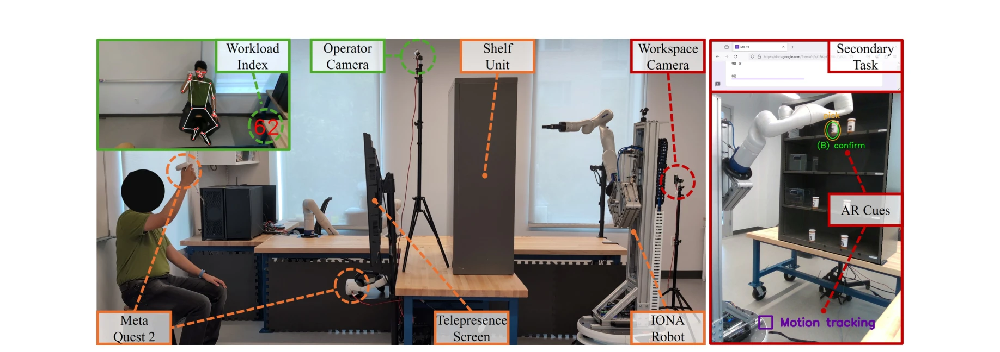
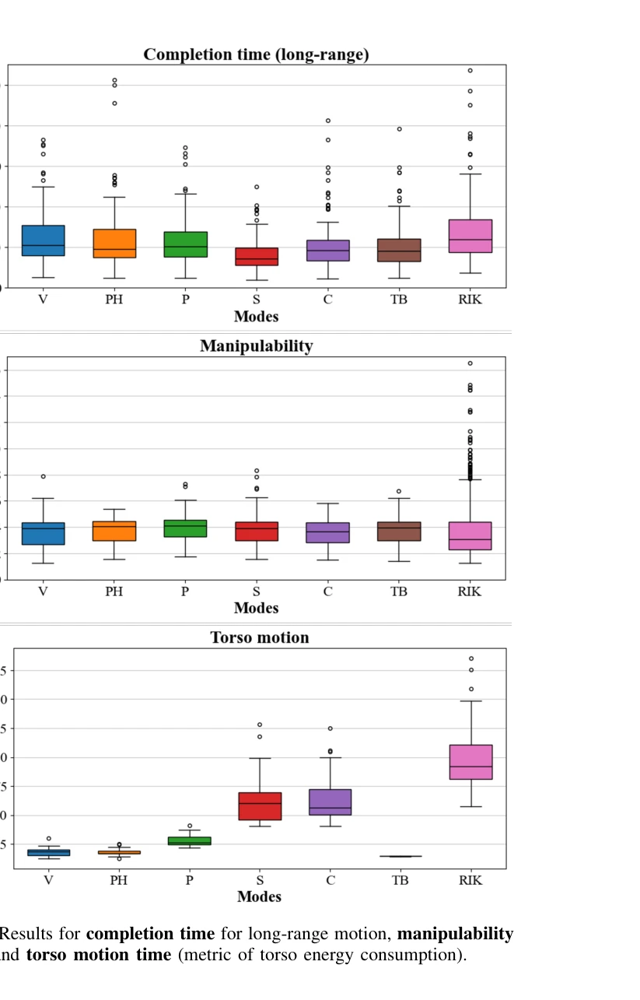

# Human-Robot Collaboration for the Remote Control of Mobile Humanoid Robots with Torso-Arm Coordination

> **저자**: Nikita Boguslavskii, Lorena Maria Genua, Zhi Li | **날짜**: 2025-05-09 | **URL**: [https://arxiv.org/abs/2505.05773](https://arxiv.org/abs/2505.05773)

---

## Essence

*Fig. 1: The experimental setup consists of two workspaces. The robotic workspace features a shelf unit with four shelves*

본 논문은 원격 제어되는 모바일 휴머노이드 로봇의 동체-팔 협응을 위한 다양한 인간-로봇 협력(HRC) 방법을 제안하고, 사용자 연구를 통해 자율성과 인간 입력의 균형을 평가한다.

## Motivation

- **Known**: 기존 공유 자율성 연구는 주로 로봇의 말단 이펙터 제어에 초점을 맞추었으며, 동작 계획에서 동체-팔 협응은 일반적인 운동학적 중복성 해결 방법을 통해 다루어져 왔다.
- **Gap**: 실시간 운영 중 인간이 문맥적이고 다층적인 고려사항을 반영한 동체-팔 협응에 개입할 수 있는 방법이 부족하며, 특히 비용 함수로 인코딩하기 어려운 인간 요소가 고려되지 않았다.
- **Why**: 휴머노이드 로봇의 증가된 배치와 원격 제어 필요성으로 인해 직관적이고 효율적인 협력 제어 방법이 필수적이며, 동체 중복성을 활용하면서도 인간 작업자의 인지 부하를 줄이는 것이 중요하다.
- **Approach**: 본 논문은 사용자가 동체를 수동으로 제어하는 인간-주도형 방식(Velocity Torso Control, Preset Heights)과 도달성, 조작성, 에너지 효율, 인간 의도 추론을 기반으로 자동 협응하는 로봇-주도형 방식(Proximity, Scaling, Chasing)을 제안하고 비교한다.

## Achievement

*Fig. 2: Results for completion time for long-range motion, manipulability*

- **다양한 HRC 협응 방법 제안**: 인간-주도형 2가지(V, PH)와 로봇-주도형 3가지(P, S, C) 방법을 설계하여 서로 다른 사용자 경험 수준과 작업 요구사항에 대응
- **포괄적인 사용자 연구**: N=17 참여자를 대상으로 작업 성능, 조작성, 에너지 효율성, 사용자 선호도를 평가하여 각 방법의 효과성을 실증적으로 검증
- **사용자 중심 설계 고려**: 시각적 폐색 회피, 작업 일관성, 예측 가능성, 인지 부하 감소 등 인간 요소를 명시적으로 반영한 협응 전략 개발
- **RelaxedIK와의 비교**: 최신 Inverse Kinematics 솔버와의 성능 비교를 통해 제안된 방법의 상대적 장점 도출

## How

*Fig. 1: The experimental setup consists of two workspaces. The robotic workspace features a shelf unit with four shelves*

- Velocity Torso Control (V): 조이스틱을 이용한 연속적인 동체 높이 조절로 최대 세밀한 제어 제공
- Preset Heights (PH): 작업 공간을 미리 정의된 영역(상/중/하)으로 분할하여 선택 시간 단축
- Proximity (P): 팔의 말단이 수직 운동 범위 한계에 접근할 때만 동체 이동, 에너지 절감 목표
- Scaling (S): 사용자 팔 작업 공간을 동체-팔 결합 수직 공간으로 매핑하여 빠른 조작 가능
- Chasing (C): 로봇 팔의 수직 운동을 추적하는 연속 동체 운동으로 최적 조작성 유지
- 보상 메커니즘: Proximity 모드에서 동체 이동 시 말단 이펙터 높이를 동일한 거리만큼 조정하여 사용자의 제어 방향 유지

## Originality

- 원격 제어 휴매노이드 로봇의 동체-팔 협응에 특화된 HRC 방법론은 기존 공유 자율성 연구의 공백을 직접적으로 해결
- 인간-주도형과 로봇-주도형 방식을 체계적으로 분류하고 비교하는 프레임워크는 새로운 설계 패러다임 제시
- 보상 메커니즘을 통해 자동 동체 조절이 사용자의 제어 직관성을 방해하지 않도록 한 설계는 기술적 혁신
- 사용자 경험 수준에 따른 방법 선택 가이드라인 제공으로 실용성 향상

## Limitation & Further Study

- 제한된 표본 크기(N=17)로 인해 통계적 일반화 가능성이 제한적이며, 다양한 배경의 사용자 집단에 대한 평가 필요
- IONA 로봇과 메타퀘스트 2 컨트롤러 특정 하드웨어에 한정된 실험으로 다른 로봇 플랫폼으로의 일반화 검증 필요
- task 유형이 선반 정렬 작업으로 제한되어 있어, 다양한 조작 작업(assembly, disassembly, precise placement 등)에서의 성능 평가 부족
- Chasing 모드에서 인간 의도 추론 알고리즘의 구체적 설명 부족으로 재현성 저하
- 장기 운영 피로도, 햅틱 피드백의 영향, 다중 선택 충돌 상황 등 실제 운영 환경 요소 미검토
- **후속 연구**: 더 큰 규모의 다문화 사용자 연구, 다양한 로봇 플랫폼 적용, 복잡한 조작 작업 확대, 머신러닝 기반 인간 의도 추론 고도화 필요

## Evaluation

- Novelty: 4/5
- Technical Soundness: 3/5
- Significance: 4/5
- Clarity: 4/5
- Overall: 4/5

**총평**: 본 논문은 원격 제어 휴머노이드 로봇의 동체-팔 협응을 위한 체계적인 HRC 방법론을 제안하고 사용자 연구로 검증함으로써 인간-로봇 협력 분야에 실질적 기여를 한다. 다만 표본 크기, 작업 다양성, 하드웨어 특이성 면에서 일반화 가능성 향상이 필요하다.

## Related Papers

- 🧪 응용 사례: [[papers/1482_Humanoids_in_Hospitals_A_Technical_Study_of_Humanoid_Robot_S/review]] — 인간-로봇 협력의 개념을 의료용 휴머노이드 로봇에 구체적으로 적용한 사례이다
- 🏛 기반 연구: [[papers/1334_Development_of_an_Intuitive_GUI_for_Non-Expert_Teleoperation/review]] — 비전문가를 위한 직관적 GUI 개념이 원격 제어에서의 인간-로봇 협력의 기반이 된다
- 🔗 후속 연구: [[papers/1341_Dexterous_Teleoperation_of_20-DoF_ByteDexter_Hand_via_Human/review]] — ExtremControl의 저지연 텔레오퍼레이션을 인간-로봇 협력 관점에서 확장했다
- 🔗 후속 연구: [[papers/1334_Development_of_an_Intuitive_GUI_for_Non-Expert_Teleoperation/review]] — 원격 제어 인터페이스에서 직관적 GUI가 인간-로봇 협력으로 확장된다
- 🏛 기반 연구: [[papers/1482_Humanoids_in_Hospitals_A_Technical_Study_of_Humanoid_Robot_S/review]] — 인간-로봇 협력의 개념이 의료용 휴머노이드 시스템의 기반이 된다
- 🧪 응용 사례: [[papers/1576_MobileH2R_Learning_Generalizable_Human_to_Mobile_Robot_Hando/review]] — 모바일 로봇 핸드오버 기술이 인간-로봇 협업을 위한 원격 제어 시스템에서 직접 활용될 수 있다.
