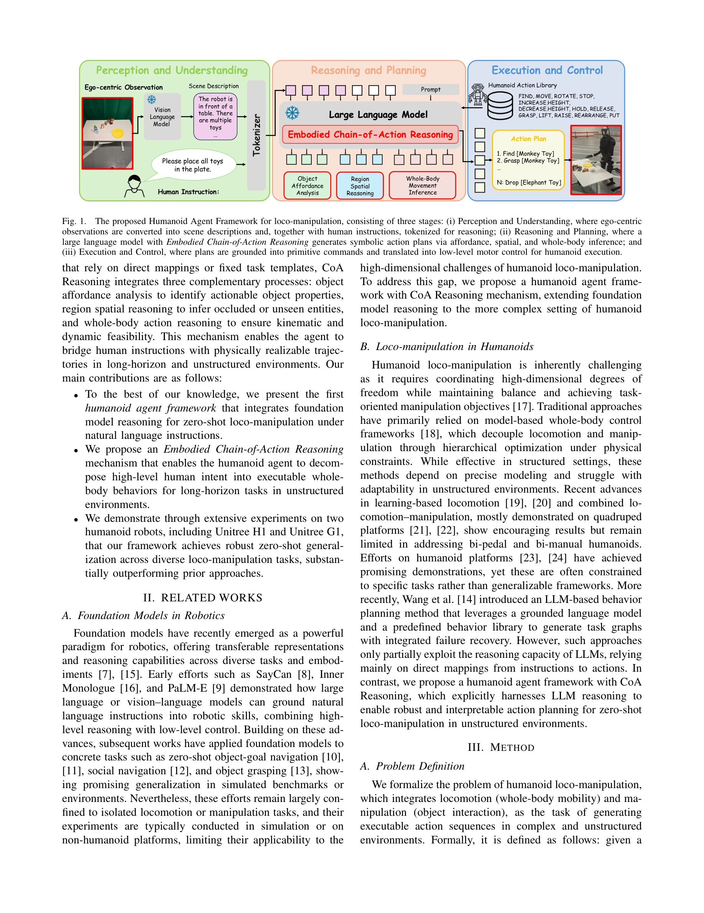

# Humanoid Agent via Embodied Chain-of-Action Reasoning with Multimodal Foundation Models for Zero-Shot Loco-Manipulation

> **저자**: Congcong Wen, Geeta Chandra Raju Bethala, Yu Hao, Niraj Pudasaini, Hao Huang, Shuaihang Yuan, Baoru Huang, Anh Nguyen, Mengyu Wang, Anthony Tzes, Yi Fang | **날짜**: 2025-04-13 | **URL**: [https://arxiv.org/abs/2504.09532](https://arxiv.org/abs/2504.09532)

---

## Essence

*Fig. 1.*

이 논문은 멀티모달 기초 모델과 Embodied Chain-of-Action(CoA) 추론 메커니즘을 통합한 Humanoid-COA 프레임워크를 제안하여, 휴머노이드 로봇이 자연어 명령을 이해하고 복합적인 전신 이동-조작 작업을 제로샷으로 수행할 수 있도록 한다.

## Motivation

- **Known**: 기초 모델(foundation model)은 로봇에 전이 가능한 멀티모달 표현과 추론 능력을 제공하며, SayCan, PaLM-E 등의 선행 연구가 자연어 지시를 로봇 affordance로 변환하는 방법을 보였다. 그러나 기존 방법들은 이동(locomotion) 또는 조작(manipulation)을 개별적으로만 다루거나 시뮬레이션 환경에서만 검증되었다.
- **Gap**: 휴머노이드 로봇의 고차원 자유도와 전신 조화, 동적 균형을 동시에 요구하는 이동-조작 통합 작업에서 자연어 명령을 실행 가능한 행동 시퀀스로 변환하는 방법이 부족하며, 실제 로봇 플랫폼에서 검증된 제로샷 생성화 방법이 제한적이다.
- **Why**: 휴머노이드 로봇의 이동-조작 능력은 현실 세계에서 인간 수준의 작업 자동화를 달성하기 위한 핵심 기술이며, 자연어 기반 지시 이행 능력은 로봇의 실용성과 접근성을 크게 향상시킨다.
- **Approach**: 인식-추론-행동 패러다임 내에서 large language model을 활용한 CoA 메커니즘을 제안하여, 고수준 명령을 affordance 분석, 공간 추론, 전신 행동 추론을 통해 구조화된 이동-조작 프리미티브 시퀀스로 점진적으로 분해한다.

## Achievement

*Fig. 1.*

- **첫 휴머노이드 이동-조작 에이전트 프레임워크**: 기초 모델 추론을 휴머노이드 이동-조작에 통합한 첫 프레임워크로, 자연언어 지시를 실행 가능한 전신 행동으로 변환
- **Embodied Chain-of-Action 추론 메커니즘**: 객체 affordance 분석, 영역 공간 추론, 전신 움직임 추론을 통합하여 장시간 작업과 비정형 환경에서 로봇이 물리적으로 실현 가능한 행동 계획을 생성
- **실제 로봇 검증 및 강건한 일반화**: Unitree H1-2와 G1 두 휴머노이드 로봇에서 개방 테스트 영역과 아파트 환경에서 광범위한 실험을 통해 기존 방법들을 크게 능가하고 장시간 비정형 시나리오에서 강건한 일반화 달성

## How

*Fig. 1.*

- **지각 단계**: 자아 중심 시각 관찰을 Vision Language Model을 통해 장면 설명으로 변환하고, 인간 지시문과 함께 tokenization
- **추론 단계**: Large Language Model에 객체 affordance 분석(actionable 객체 특성 식별), 영역 공간 추론(가려지거나 보이지 않는 객체 추론), 전신 행동 추론(운동학 및 동역학적 실현 가능성 확보)을 통해 상징적 행동 계획 생성
- **실행 단계**: 생성된 행동 계획을 Humanoid Action Library의 프리미티브 명령(FIND, MOVE, ROTATE, GRASP, LIFT, PUT 등)으로 변환하고 저수준 모터 제어로 변환하여 휴머노이드가 실행
- **Chain-of-Action 메커니즘**: 직접 매핑이나 고정 템플릿 대신 LLM의 추론 능력을 활용하여 복잡한 작업을 단계적으로 분해하고 실현 가능성을 보장

## Originality

- **최초성**: 기초 모델 추론을 휴머노이드 전신 이동-조작에 통합한 첫 프레임워크로, 기존 연구의 이동/조작 분리 한계를 극복
- **Embodied CoA 메커니즘의 혁신**: 단순 매핑 기반이 아닌 affordance-spatial-kinematic 추론의 삼중 통합으로 LLM의 추론 능력을 실제 로봇 제약에 기반한 구조화된 방식으로 활용
- **실제 플랫폼 검증**: 시뮬레이션이 아닌 실제 휴머노이드 로봇(Unitree H1-2, G1)에서 비정형 환경(개방 공간, 아파트)에서 광범위하게 검증
- **설계 단순성과 확장성**: 사전 학습된 모델과 프리미티브 라이브러리를 활용하여 특정 작업 재학습 없이 다양한 새로운 작업에 적용 가능

## Limitation & Further Study

- **실패 복구 메커니즘의 부족**: 제안 방법이 실패 감지 및 복구 능력이 제한적이며, 비정형 환경에서의 재계획 능력에 대한 상세한 분석 부족
- **LLM의 환각(hallucination) 문제**: 자연언어 기반 추론 단계에서 존재하지 않는 객체나 불가능한 행동을 생성할 가능성에 대한 논의 및 해결책 미흡
- **계산 효율성**: 매 단계마다 LLM 호출이 필요하여 실시간성이 요구되는 동적 환경에서의 응용 제한 가능성
- **프리미티브 라이브러리의 의존성**: 사전 정의된 Humanoid Action Library에 의존하므로, 새로운 유형의 동작이 필요한 경우 확장 방법이 명확하지 않음
- **후속연구**: 강화학습 기반 실패 복구, 시각적 피드백을 통한 실시간 계획 재조정, 더욱 큰 규모의 LLM 및 최적화된 토크나이저 적용 등이 필요

## Evaluation

- Novelty: 4/5
- Technical Soundness: 3/5
- Significance: 4/5
- Clarity: 4/5
- Overall: 4/5

**총평**: 이 논문은 기초 모델과 embodied 추론을 휴머노이드 이동-조작에 처음 통합하여 자연언어 지시의 제로샷 이행을 실현한 의미 있는 연구이며, 실제 로봇 플랫폼에서의 광범위한 검증과 강건한 일반화를 보여준다. 다만 실패 복구와 계산 효율성 측면의 한계가 존재한다.

## Related Papers

- 🔄 다른 접근: [[papers/1445_Hierarchical_Vision-Language_Planning_for_Multi-Step_Humanoi/review]] — 둘 다 VLM 기반 휴머노이드 계획이지만 Humanoid-COA는 Chain-of-Action에, Hierarchical Planning은 3계층 구조에 집중한다
- 🔗 후속 연구: [[papers/1480_HumanoidGen_Data_Generation_for_Bimanual_Dexterous_Manipulat/review]] — HumanoidGen의 LLM 기반 데이터 생성을 실시간 추론 시스템으로 확장했다
- 🏛 기반 연구: [[papers/1312_ARNOLD_A_Benchmark_for_Language-Grounded_Task_Learning_With/review]] — CoT 추론의 기본 개념이 Embodied Chain-of-Action 메커니즘의 이론적 기반이 된다
- 🔄 다른 접근: [[papers/1445_Hierarchical_Vision-Language_Planning_for_Multi-Step_Humanoi/review]] — 둘 다 VLM 기반 휴머노이드 계획을 다루지만 Hierarchical Planning은 3계층 구조에, Humanoid-COA는 Chain-of-Action 추론에 집중한다
- 🏛 기반 연구: [[papers/1480_HumanoidGen_Data_Generation_for_Bimanual_Dexterous_Manipulat/review]] — LLM 기반 데이터 생성이 Humanoid-COA의 추론 메커니즘의 기반이 된다
