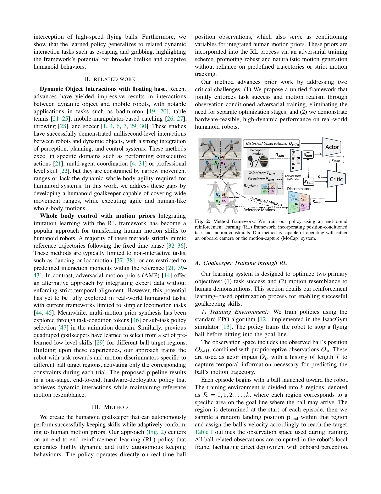
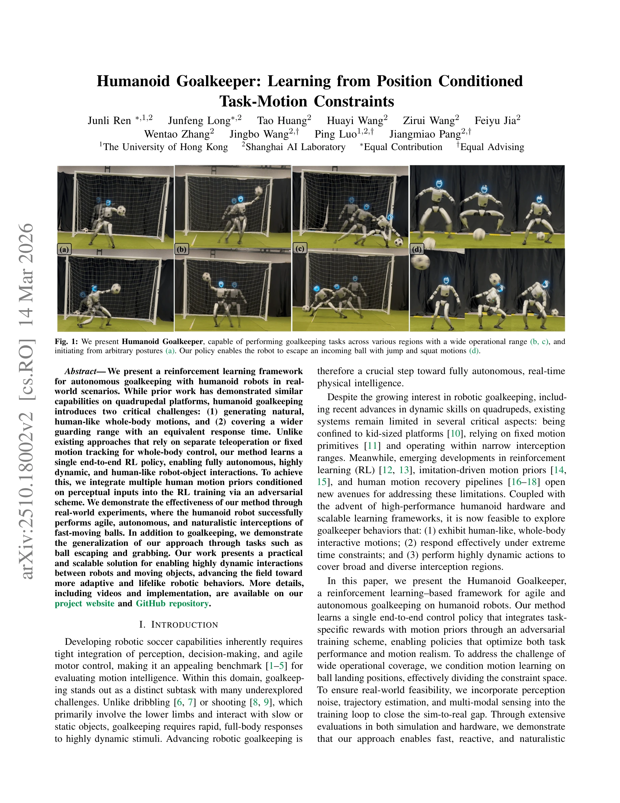

# Humanoid Goalkeeper: Learning from Position Conditioned Task-Motion Constraints

> **저자**: Junli Ren, Junfeng Long, Tao Huang, Huayi Wang, Zirui Wang, Feiyu Jia, Wentao Zhang, Jingbo Wang, Ping Luo, Jiangmiao Pang | **날짜**: 2026-03-14 | **DOI**: [10.48550/arXiv.2510.18002](https://doi.org/10.48550/arXiv.2510.18002)

---

## Essence

*Fig. 2: Method framework: We train our policy using an end-to-end*

인간형 로봇의 골키퍼 작업을 위해 위치 조건부 태스크-모션 제약을 학습하는 end-to-end RL 프레임워크를 제시하며, 인간의 모션 프라이어를 adversarial 학습으로 통합하여 자율적이고 인간다운 전신 운동을 생성한다.

## Motivation

- **Known**: 사족 로봇의 동적 객체 상호작용과 인간 모션 프라이어를 활용한 모방 학습은 이미 존재하지만, 인간형 로봇의 골키핑에서 광범위한 수비 범위와 인간다운 전신 운동을 동시에 달성한 연구는 부족하다.
- **Gap**: 기존 연구는 (1) 고정된 모션 트래킹이나 별도의 텔레오퍼레이션에 의존하며, (2) 좁은 상호작용 범위로 제한되어 있고, (3) 인간형 로봇의 광범위한 수비 범위 문제를 미해결한 상태이다.
- **Why**: 로봇 축구, 특히 골키핑은 인지-의사결정-동적 제어의 통합이 필요한 벤치마크이며, 인간형 로봇의 동적 전신 대응 능력은 더 적응적이고 자연스러운 로봇 행동으로의 발전을 위해 중요하다.
- **Approach**: PPO 알고리즘으로 IsaacGym에서 학습하되, 볼 착지 위치에 따라 k개 영역으로 나눈 position-conditioned 태스크 리워드와 각 영역별 모션 discriminator를 adversarial 방식으로 통합하여 task 성공과 모션 사실성을 동시에 최적화한다.

## Achievement

*Fig. 1: We present Humanoid Goalkeeper, capable of performing goalkeeping tasks across various regions with a wide opera*

- **실시간 고속 볼 차단**: 인간형 로봇이 빠르게 움직이는 볼을 민첩하고 자율적으로 차단할 수 있음을 실세계 실험으로 입증
- **광범위 수비 커버리지**: 위치 조건부 학습으로 골 라인의 다양한 영역(좌/우/중앙 등)에 대응 가능한 단일 정책 달성
- **인간다운 전신 운동**: 텔레오퍼레이션이나 고정 모션 트래킹 없이 adversarial motion prior를 통해 자연스러운 점프, 스쿼트, 펀칭 등 생성
- **일반화 능력**: 볼 회피(escaping), 물체 잡기(grabbing) 등 관련 동적 상호작용 작업으로 정책의 확장성 입증

## How

*Fig. 2: Method framework: We train our policy using an end-to-end*

- IsaacGym 시뮬레이터에서 PPO 알고리즘으로 정책 학습
- 관측 공간: 볼의 위치(로봇 로컬 프레임), 고유 감각 정보(joint position/velocity, base velocity/angular velocity), 과거 동작 이력
- 위치 조건부 태스크 리워드 설계: 착지점 예측(먼 거리) → 동적 목표 추적(근거리) → 정적 위치 유지(차단 후)의 3단계로 구성
- Sigmoid 함수 기반 거리 리워드: 엔드-이펙터와 타겟 위치 간 거리를 부드럽게 감소시키며, 영역 R에 따라 좌/우 손 선택
- Motion discriminator를 영역별로 조건화하여 해당 영역의 인간 모션 프라이어를 adversarial 손실로 통합
- Sim-to-real gap 해소: 지각 노이즈, 궤적 추정, 멀티-모달 센싱을 학습 루프에 포함

## Originality

- **Position-conditioned adversarial motion prior**: 기존 AMP의 단순 모션 흉내에서 나아가 볼 착지 위치별로 조건화된 motion discriminator를 도입하여 영역별 다양한 인간 모션을 통합
- **End-to-end unified framework**: 별도의 teleoperation이나 고정 모션 트래킹 없이 task reward와 motion prior를 단일 정책에서 동시 최적화
- **Dynamic target formulation**: 거리에 따라 예측된 착지점과 실제 볼 위치를 동적으로 전환하는 타겟 설계로 예측과 정밀 제어의 균형
- **Humanoid-specific challenge addressing**: 사족 로봇과 달리 인간형 로봇의 광범위 수비 범위 문제를 영역 분할 및 조건부 학습으로 해결

## Limitation & Further Study

- 학습 영역 수 k의 선택과 각 영역 경계 정의에 대한 명확한 기준이 부재
- 실세계 실험 데이터(시행 횟수, 성공률 분포, 실패 사례)가 발췌된 본문에 제시되지 않음
- 다양한 볼 속도, 궤도(곡선, 회전 등), 환경 변화(조명, 배경) 등에 대한 강건성 평가 부족
- 후속 연구: (1) 동적 영역 경계 학습, (2) 멀티-모달 모션 프라이어 확장, (3) 다중 에이전트 협력 골키핑, (4) 실세계 온보드 센싱 기반 강건성 강화

## Evaluation

- Novelty: 4/5
- Technical Soundness: 3/5
- Significance: 4/5
- Clarity: 4/5
- Overall: 4/5

**총평**: 인간형 로봇의 동적 골키핑을 위해 위치 조건부 adversarial motion prior를 통합한 새로운 접근으로, 광범위 수비 범위와 자연스러운 전신 운동을 동시에 달성한 강력한 연구이다. 실세계 검증과 일반화 능력은 우수하나, 학습 영역 설계와 실세계 강건성 평가에서 더 상세한 분석이 필요하다.

## Related Papers

- 🔄 다른 접근: [[papers/1518_Learning_Agile_Striker_Skills_for_Humanoid_Soccer_Robots_fro/review]] — 두 논문 모두 축구 관련 기술을 다루지만, 하나는 골키퍼에, 다른 하나는 일반적인 striker skills에 특화되어 있다.
- 🏛 기반 연구: [[papers/1505_Keep_on_Going_Learning_Robust_Humanoid_Motion_Skills_via_Sel/review]] — 골키퍼 동작의 adversarial learning은 SA2RT의 적대적 훈련을 통해 더욱 강건한 정책을 학습할 수 있다.
- 🔗 후속 연구: [[papers/1439_Harmon_Whole-Body_Motion_Generation_of_Humanoid_Robots_from/review]] — Humanoid Goalkeeper의 whole-body motion은 Harmon의 언어 기반 motion generation으로 확장될 수 있다.
- 🔗 후속 연구: [[papers/1505_Keep_on_Going_Learning_Robust_Humanoid_Motion_Skills_via_Sel/review]] — SA2RT의 적대적 훈련 방법은 골키퍼와 같은 특정 태스크의 robust policy 학습에 적용될 수 있다.
