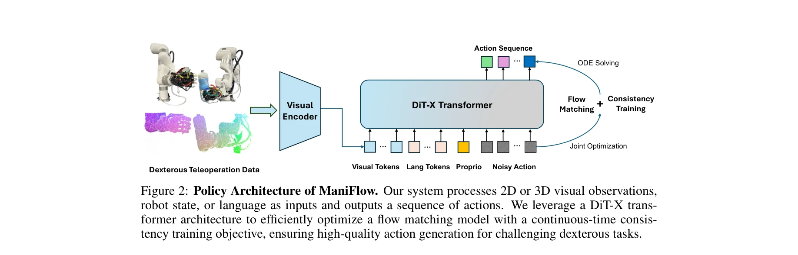
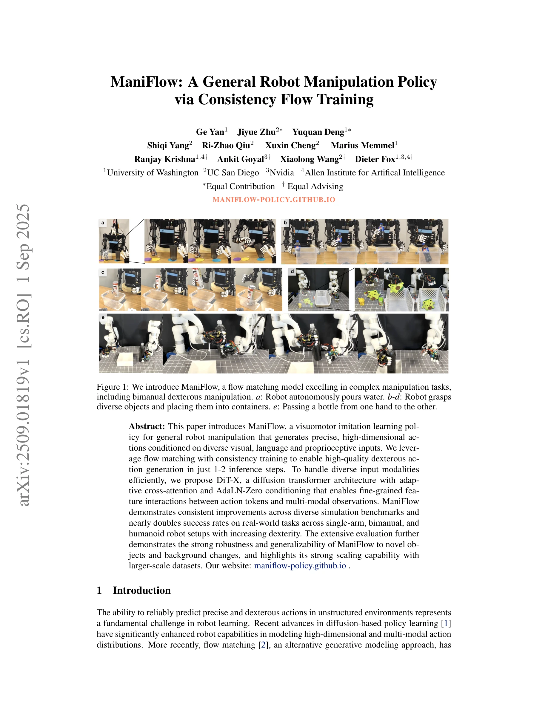
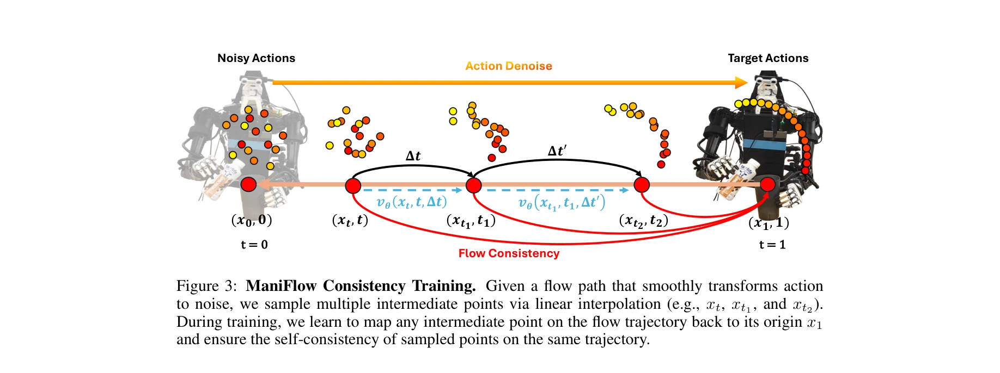

# ManiFlow: A General Robot Manipulation Policy via Consistency Flow Training

> **저자**: Ge Yan, Jiyue Zhu, Yuquan Deng, Shiqi Yang, Ri-Zhao Qiu, Xuxin Cheng, Marius Memmel, Ranjay Krishna, Ankit Goyal, Xiaolong Wang, Dieter Fox | **날짜**: 2025-09-01 | **URL**: [https://arxiv.org/abs/2509.01819](https://arxiv.org/abs/2509.01819)

---

## Essence

*Figure 2: Policy Architecture of ManiFlow. Our system processes 2D or 3D visual observations,*

ManiFlow는 flow matching과 consistency training을 결합하여 1-2 inference step으로 고품질의 dexterous action을 생성하는 visuomotor imitation learning policy이다. DiT-X 아키텍처를 통해 visual, language, proprioceptive 입력을 효율적으로 조건화하며 실제 로봇 환경에서 우수한 성능을 보인다.

## Motivation

- **Known**: 최근 diffusion-based 및 flow matching 기반 정책 학습이 robot manipulation에서 성과를 보였으나, 기존 flow matching 정책들은 inference 효율성, robustness, 그리고 복잡한 dexterous task에서의 일반화 능력이 제한적이다.
- **Gap**: 기존 flow matching 정책들은 multi-fingered interaction의 복잡성 포착, 시간적 coherence 유지, 미학습 시나리오로의 일반화, 그리고 다중 모달 입력(visual, language, proprioception)을 충분히 모델링하지 못하는 아키텍처 제약이 있다.
- **Why**: 정밀하고 dexterous한 action 생성은 실제 로봇 조작 작업의 핵심이며, inference 효율성과 일반화 능력의 향상은 실무 적용 가능성을 높이고 복잡한 multi-robot 작업의 자동화를 가능하게 한다.
- **Approach**: ManiFlow는 flow matching loss에 continuous-time consistency training objective를 추가하여 flow path를 straighten하고, DiT-X 아키텍처에서 adaptive cross-attention과 AdaLN-Zero conditioning을 통해 다중 모달 입력을 선택적으로 조건화한다.

## Achievement

*Figure 1: We introduce ManiFlow, a flow matching model excelling in complex manipulation tasks,*

- **고효율 action 생성**: 1-2 inference step으로 고품질 dexterous action 생성, pretrained teacher model 불필요
- **시뮬레이션 성능 향상**: 12개 dexterous task에서 image 기준 45.6%, pointcloud 기준 11.0%, 48개 multi-task 설정에서 31.4% 개선
- **실제 로봇 성능**: single-arm, bimanual, humanoid 로봇 설정에서 3D Diffusion Policy 대비 58% 이상의 성공률 개선
- **강건성 및 일반화**: novel object와 background 변화에 대한 우수한 robustness, 4개 robustness test task에서 π0 모델 대비 58% 개선
- **확장성**: 대규모 데이터셋에 대한 우수한 scaling capability 입증

## How

*Figure 3: ManiFlow Consistency Training. Given a flow path that smoothly transforms action*

- **Continuous-time Consistency Training**: flow model에 Δt 인자 추가, 이웃한 trajectory 점들의 일관성을 enforcing하여 flow path straightening
- **Time Space Sampling Strategy**: Uniform, logit-normal, mode, CosMap 등 5가지 timestep sampling 전략 비교 및 beta/continuous-time sampling의 우수성 입증
- **DiT-X 아키텍처**: DiT 기반으로 high-dimensional input에는 cross-attention, low-dimensional input에는 AdaLN-Zero conditioning 적용
- **Multi-modal Conditioning**: visual tokens, language tokens, proprioceptive input을 selective feature modulation을 통해 효율적으로 통합
- **EMA Model**: consistency training 안정화를 위해 exponential moving average 기반 teacher model 활용
- **Joint Optimization**: flow matching loss와 consistency training loss를 동시에 최적화하여 효율성과 품질 동시 달성

## Originality

- Flow matching에 continuous-time consistency training을 처음으로 통합하여 few-step generation 달성
- Timestep sampling 전략에 대한 체계적인 ablation study로 flow matching의 설계 원리 규명
- DiT-X 아키텍처의 adaptive cross-attention + AdaLN-Zero 조합으로 multi-modal 조건화의 새로운 접근
- Teacher model 없이 consistency training을 구현하여 training efficiency 향상
- Single-arm, bimanual, humanoid 로봇을 아우르는 포괄적인 실제 환경 평가

## Limitation & Further Study

- Continuous-time consistency training의 theoretical justification 및 convergence 분석 부족
- EMA model의 update frequency와 decay rate에 대한 hyperparameter sensitivity 미분석
- 시간 예측(temporal consistency) 명시적 메커니즘 부재 - sequence level coherence 검증 필요
- 계산 복잡도 분석 미흡 - real-time 성능 요구사항 확인 필요
- **후속 연구**: (1) consistency training의 수렴 이론 및 최적 step size 선택 방법 연구, (2) temporal consistency를 명시적으로 enforcing하는 손실함수 개발, (3) 더 복잡한 long-horizon task에서의 성능 평가, (4) 다양한 로봇 형태에 대한 transfer learning 성능 분석

## Evaluation

- Novelty: 4/5
- Technical Soundness: 4/5
- Significance: 4/5
- Clarity: 4/5
- Overall: 4/5

**총평**: ManiFlow는 flow matching과 consistency training의 효과적인 결합, 체계적인 ablation 분석, 그리고 포괄적인 실제 환경 검증을 통해 robot manipulation 분야에서 상당한 진전을 이루었다. 특히 inference 효율성과 실제 성능의 동시 향상은 실무 적용 가능성을 높이는 중요한 기여이다.

## Related Papers

- 🔄 다른 접근: [[papers/1438_InternVLA-M1_A_Spatially_Guided_Vision-Language-Action_Frame/review]] — 두 논문 모두 시각-언어-행동 통합을 다루지만, 하나는 flow matching 기반 생성에, 다른 하나는 공간 그라운딩에 집중합니다.
- 🏛 기반 연구: [[papers/1362_Diffusion_Policy_Visuomotor_Policy_Learning_via_Action_Diffu/review]] — Diffusion Policy의 기본 개념이 flow matching을 활용한 조작 정책의 이론적 기반을 제공합니다.
- 🔗 후속 연구: [[papers/1522_Learning_from_Massive_Human_Videos_for_Universal_Humanoid_Po/review]] — RDT의 diffusion 기반 양팔 조작을 flow matching과 consistency training으로 더욱 효율화한 발전된 형태입니다.
- 🧪 응용 사례: [[papers/1595_TRAVEL_Training-Free_Retrieval_and_Alignment_for_Vision-and-/review]] — flow-based 정책 개선 방법론이 일관성 훈련을 통한 고품질 행동 생성에 적용될 수 있습니다.
- 🔄 다른 접근: [[papers/1438_InternVLA-M1_A_Spatially_Guided_Vision-Language-Action_Frame/review]] — 두 논문 모두 시각-언어-행동 통합을 다루지만, 하나는 공간 그라운딩에, 다른 하나는 flow matching 기반 행동 생성에 집중합니다.
