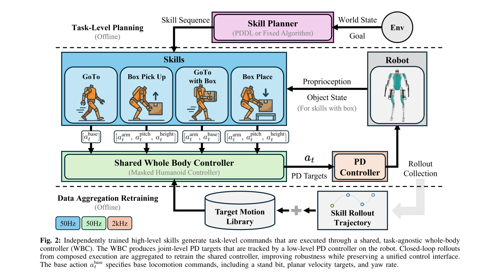
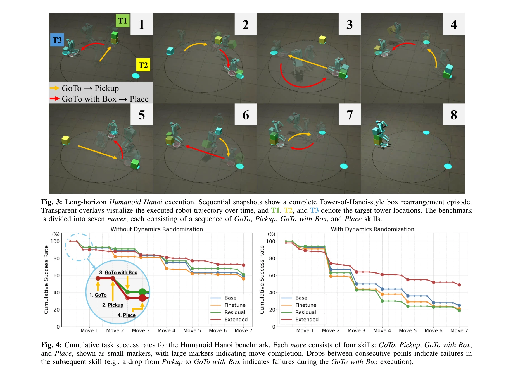

# Humanoid Hanoi: Investigating Shared Whole-Body Control for Skill-Based Box Rearrangement

> **저자**: Minku Kim, Kuan-Chia Chen, Aayam Shrestha, Li Fuxin, Stefan Lee, Alan Fern | **날짜**: 2026-02-23 | **DOI**: [10.48550/arXiv.2602.13850](https://doi.org/10.48550/arXiv.2602.13850)

---

## Essence

*Fig. 2: Independently trained high-level skills generate task-level commands that are executed through a shared, task-ag*

본 논문은 휴머노이드 로봇의 장시간 박스 재배열 작업을 위해 모든 스킬이 공유된 task-agnostic whole-body controller (WBC)를 통해 실행되는 스킬 기반 제어 아키텍처를 제시한다. 분포 이동으로 인한 robustness 저하를 해결하기 위해 data aggregation 기법을 적용하고, Tower-of-Hanoi 스타일의 Humanoid Hanoi 벤치마크를 도입하여 검증한다.

## Motivation

- **Known**: 학습 기반 휴머노이드 시스템은 teleoperation과 reinforcement learning으로 다양한 조작 행동을 학습하고 있으나, 대부분 특정 작업 정의에 종속되며 독립적으로 학습된 스킬을 장시간 임의로 재구성하는 데 어려움을 겪고 있다.
- **Gap**: 기존 연구에서는 십수 개의 스킬 호출을 통해 수 분 이상 지속되는 장시간 로코-조작 작업에서 독립 학습된 스킬들의 robust한 시퀀싱을 입증하지 못했으며, 스킬 경계에서의 제어 불연속성 문제가 해결되지 않았다.
- **Why**: 장시간 작업 실행 시 누적된 오류가 스킬 구성의 state와 command 분포를 변화시켜 robustness를 저하시키는데, 이를 체계적으로 해결하는 것은 실제 휴머노이드 로봇의 실용적 자율성 확보에 필수적이다.
- **Approach**: 모든 스킬이 단일 공유 WBC를 통해 실행되도록 아키텍처를 설계하여 스킬 경계에서의 제어 불연속성을 제거하고, domain randomization 하에서의 closed-loop 실행 데이터를 수집하여 shared WBC를 재학습하는 data aggregation 기법으로 분포 이동에 대응한다.

## Achievement

*Fig. 4: Cumulative task success rates for the Humanoid Hanoi benchmark. Each move consists of four skills: GoTo, Pickup,*

- **Shared-WBC 아키텍처**: 모든 스킬이 task-agnostic인 단일 WBC를 통해 실행되어 스킬 구성이 고수준 command 변화만을 유발하도록 하여 확장성 있는 스킬 재사용 가능
- **Data aggregation 기법**: Closed-loop 실행 rollout을 통합하여 학습하는 간단하면서도 효과적인 방법으로 per-skill residual이나 fine-tuning 대비 우수한 성능 달성
- **Humanoid Hanoi 벤치마크**: Tower-of-Hanoi 스타일의 long-horizon 상자 재배열 작업으로 정확한 배치와 constraint 만족을 요구하며, 실제 실행 오류로 인한 off-nominal 상태를 자연스럽게 노출
- **Hardware 검증**: Digit V3 휴머노이드 로봇에서 5분 이상 지속되는 완전 자율 재배열 작업 실행 성공 및 simulation 결과 보고

## How

*Fig. 2: Independently trained high-level skills generate task-level commands that are executed through a shared, task-ag*

- 독립적으로 학습된 GoTo, GoTo-with-box, Pickup, Place 스킬들을 high-level policy로 구현
- 모든 스킬의 output (base action, manipulation command)을 공유 task-agnostic WBC에 라우팅
- WBC는 proprioceptive state와 스킬 command를 받아 joint-level PD setpoint 생성
- Domain randomization과 closed-loop 실행을 통해 수집한 데이터로 shared WBC를 재학습하여 분포 이동에 대응
- Tower-of-Hanoi 구조 (3개 tower, 제약 조건 있는 박스 이동)로 repeated skill reuse와 precision placement 요구
- Simulation과 hardware에서 cumulative task success rate 및 failure mode 분석 수행

## Originality

- Long-horizon humanoid loco-manipulation 작업에서 shared task-agnostic WBC 아키텍처의 체계적 탐구 및 검증
- Skill-induced distribution shift 문제를 maintenance 문제로 재정의하고 data aggregation으로 해결하는 접근
- Humanoid Hanoi 벤치마크의 도입으로 stacking constraint와 precise placement가 있는 long-horizon 평가 체계 제시
- 10분 이상 지속되는 실제 로봇 하드웨어 실행을 통한 검증 (기존 연구 대비 길이와 스킬 복잡도 상향)

## Limitation & Further Study

- Skill 선택 및 시퀀싱은 간단한 symbolic planner에 의존하며, 동적 의사결정 능력이 없음
- Benchmark가 Tower-of-Hanoi 구조에 제한되어 다른 형태의 long-horizon 조작 작업으로의 일반화 가능성 미검증
- Shared WBC의 generalization 한계: 매우 새로운 스킬 추가 시 추가 재학습 필요 가능성
- Domain randomization 범위와 data aggregation 전략의 최적성에 대한 이론적 분석 부족
- 후속 연구: 학습 기반 skill sequencing, 다양한 manipulation task에서의 generalization, adversarial 환경에서의 robustness 강화

## Evaluation

- Novelty: 4/5
- Technical Soundness: 3/5
- Significance: 4/5
- Clarity: 4/5
- Overall: 4/5

**총평**: 본 논문은 shared whole-body controller를 통한 modular skill composition의 실질적 가치를 명확히 입증하고, data aggregation으로 long-horizon robustness 문제를 효과적으로 해결하며, 공개 벤치마크 도입과 hardware 검증으로 높은 실용성을 제시한다. 휴머노이드 로봇의 자율적 long-horizon 작업 수행 능력 확보에 중요한 기여를 한다.

## Related Papers

- 🏛 기반 연구: [[papers/1456_HOVER_Versatile_Neural_Whole-Body_Controller_for_Humanoid_Ro/review]] — Humanoid Hanoi의 스킬 기반 제어는 HOVER의 다중 제어 모드 통합 개념에서 발전한다.
- 🔗 후속 연구: [[papers/1321_Coordinated_Humanoid_Robot_Locomotion_with_Symmetry_Equivari/review]] — Humanoid Hanoi의 장시간 box rearrangement는 Bootstrap Your Own Skills의 새로운 태스크 해결 능력으로 확장될 수 있다.
- 🔄 다른 접근: [[papers/1444_Language_to_Rewards_for_Robotic_Skill_Synthesis/review]] — 두 논문 모두 complex task를 다루지만, 하나는 스킬 기반 제어에, 다른 하나는 언어 기반 보상 설계에 초점을 둔다.
- 🔗 후속 연구: [[papers/1456_HOVER_Versatile_Neural_Whole-Body_Controller_for_Humanoid_Ro/review]] — HOVER의 다중 제어 모드 통합은 Humanoid Hanoi의 스킬 기반 제어 아키텍처로 확장될 수 있다.
