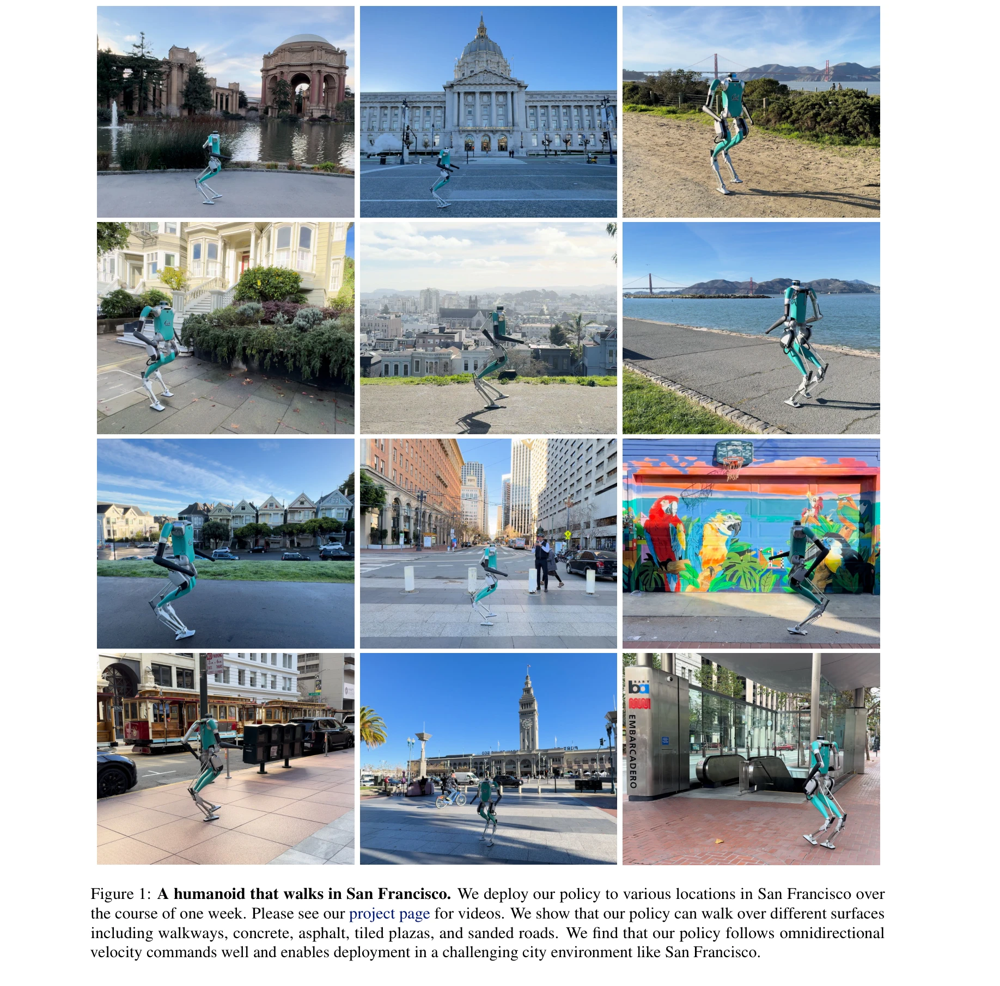

# Humanoid Locomotion as Next Token Prediction

> **저자**: Ilija Radosavovic, Bike Zhang, Baifeng Shi, Jathushan Rajasegaran, Sarthak Kamat, Trevor Darrell, Koushil Sreenath, Jitendra Malik | **날짜**: 2024-02-29 | **URL**: [https://arxiv.org/abs/2402.19469](https://arxiv.org/abs/2402.19469)

---

## Essence

*Figure 2: Humanoid locomotion as next token prediction. We collect a dataset on trajectories from various sources, such*

휴머노이드 로봇 제어를 언어 모델의 다음 토큰 예측 문제로 재구성하여, causal transformer를 이용한 자동회귀 방식의 감각-운동 궤적 예측으로 실제 로봇의 보행을 학습한다.

## Motivation

- **Known**: Transformer 모델은 언어, 시각 데이터 등 다양한 모달리티에서 우수한 성능을 보여주고 있으며, 강화학습 기반 접근법으로 휴머노이드 로봇의 실세계 제어가 가능함이 입증되었다.
- **Gap**: 로봇 제어 분야에서 generative modeling을 통한 대규모 감각-운동 궤적 학습은 충분히 탐구되지 않았으며, 불완전한 모달리티를 가진 데이터(예: 액션 정보 없는 인간 비디오)를 활용한 통합 학습 프레임워크가 부재하다.
- **Why**: 언어 모델의 성공을 로봇 제어로 확장하면 대규모 다양한 데이터로부터 효율적으로 학습할 수 있으며, 인터넷 규모의 데이터(YouTube 등)를 활용하여 실세계 로봇 제어의 학습 데이터 수집 비용을 획기적으로 줄일 수 있다.
- **Approach**: Sensorimotor 궤적을 토큰화하여 causal transformer에서 자동회귀 방식으로 예측하되, 모달리티-정렬 예측을 통해 각 입력 토큰으로부터 동일 모달리티의 다음 토큰을 예측하고, 누락된 모달리티는 mask 토큰으로 처리하여 불완전한 데이터도 학습할 수 있도록 구성한다.

## Achievement

*Figure 1: A humanoid that walks in San Francisco. We deploy our policy to various locations in San Francisco over*

- **San Francisco 실외 환경 배포**: 27시간의 보행 데이터만으로 훈련된 모델이 실제 Digit 휴머노이드 로봇을 San Francisco의 다양한 지형(포장도로, 콘크리트, 아스팔트, 타일 광장, 모래길)에서 zero-shot으로 보행하도록 성공
- **불완전 모달리티 활용**: Motion capture와 YouTube 인간 비디오 등 액션 정보가 없는 데이터도 mask 토큰 메커니즘을 통해 효과적으로 학습에 활용 가능함을 입증
- **명령 일반화**: 훈련 중 보지 못한 후진 보행 등의 명령에 대한 일반화 능력 확보
- **강화학습 대비 경쟁성**: 오프라인 데이터만으로 훈련된 자동회귀 정책이 강화학습 기반 최신 방법과 비교할 수 있는 성능 달성

## How

*Figure 2: Humanoid locomotion as next token prediction. We collect a dataset on trajectories from various sources, such*

- Sensorimotor 궤적 T = (o₁, a₁, o₂, a₂, ..., oₜ, aₜ)를 K개 토큰으로 토큰화
- Causal transformer를 이용하여 자동회귀 밀도 모델 p(t) = ∏ p(tₖ|tₖ₋₁,...,t₁) 학습
- MSE 손실함수 L = 1/K Σ(t̂ₖ - tₖ)² 최소화로 가우시안 분포 가정 하에 훈련
- 누락된 모달리티의 경우 mask 토큰 [M]을 삽입하여 T = (o₁, [M], o₂, [M], ..., oₜ, [M]) 형태로 변환 후 정규 궤적과 동일하게 처리
- 다양한 데이터 소스 결합: 신경망 정책 (RL), 모델예측제어 (MPC), 모션캡처, YouTube 인간 비디오
- 역운동학(inverse kinematics)을 이용하여 모션캡처 및 YouTube 궤적을 humanoid 로봇 구조로 재타겟팅
- 테스트 시 자동회귀 실행으로 액션 예측값만 활용하고 감각 예측은 무시

## Originality

- 로봇 제어를 순수 생성 모델링 문제로 재구성한 혁신적 관점 제시 - 조건부 액션 분포가 아닌 결합 감각-운동 분포 모델링
- 모달리티-정렬 예측 메커니즘으로 불완전한 데이터를 통합 처리하는 우아한 솔루션 제안
- 인터넷 규모의 인간 비디오 데이터를 로봇 학습에 직접 활용하는 경로 개척
- 감각-운동 궤적 학습의 scaling properties 탐구로 대규모 데이터의 효과성 입증

## Limitation & Further Study

- 회귀 방식 토큰화로 인한 양자화 오류 누적 가능성 - 벡터 양자화(vector quantization)나 이산화 방식의 심층 비교 부족
- 상수 분산 가우시안 가정의 제한성 - 다양한 불확실성 수준을 갖는 상황에서의 확장성 미검토
- San Francisco 배포가 주로 정상 보행 시나리오에 국한 - 계단, 장애물 회피, 동적 환경 대응 등의 복잡한 시나리오 평가 부재
- 모션캡처와 YouTube 데이터의 정확한 재타겟팅 프로세스와 그로 인한 오류의 정량적 분석 부족
- 다른 휴머노이드 로봇 플랫폼(예: Boston Dynamics Atlas)으로의 전이 학습 가능성 미검토
- **후속 연구 방향**: 이산 토큰 기반 양자화 방식 도입, 상황-의존적 분산 모델링, 시뮬레이션-실제 갭 최소화 기법, 계층적 정책(high-level planner + low-level controller) 구조 탐색

## Evaluation

- Novelty: 4/5
- Technical Soundness: 3/5
- Significance: 4/5
- Clarity: 4/5
- Overall: 4/5

**총평**: 이 논문은 로봇 제어를 generative modeling 프레임워크로 재해석하여 언어 모델의 성공을 물리 세계로 확장하는 창의적이고 실용적인 접근법을 제시하며, San Francisco의 실제 환경에서 zero-shot 보행 성능을 달성함으로써 대규모 불균형 데이터로부터의 로봇 학습 가능성을 강력하게 입증한다.

## Related Papers

- 🔄 다른 접근: [[papers/1484_HumanPlus_Humanoid_Shadowing_and_Imitation_from_Humans/review]] — 둘 다 인간 데이터로부터 휴머노이드 학습을 다루지만 Next Token Prediction은 transformer 기반에, HumanPlus는 모방학습에 집중한다
- 🔗 후속 연구: [[papers/1554_LeVERB_Humanoid_Whole-Body_Control_with_Latent_Vision-Langua/review]] — RT-1의 robotics transformer 개념을 휴머노이드 보행 제어에 특화하여 적용했다
- 🏛 기반 연구: [[papers/1328_Chain-of-Action_Trajectory_Autoregressive_Modeling_for_Robot/review]] — Chain-of-Action의 autoregressive 모델링이 Next Token Prediction 접근법의 기반이 된다
- 🔄 다른 접근: [[papers/1484_HumanPlus_Humanoid_Shadowing_and_Imitation_from_Humans/review]] — 둘 다 인간 데이터로부터 휴머노이드 학습을 다루지만 HumanPlus는 모방학습에, Next Token은 transformer 기반에 집중한다
- 🔄 다른 접근: [[papers/1382_EMP_Executable_Motion_Prior_for_Humanoid_Robot_Standing_Uppe/review]] — 둘 다 상체 동작을 다루지만 EMP는 안정성 중심의 모방학습, Humanoid Locomotion은 next token prediction 방식을 사용한다.
