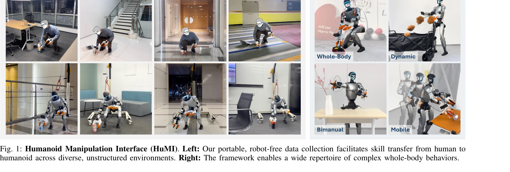
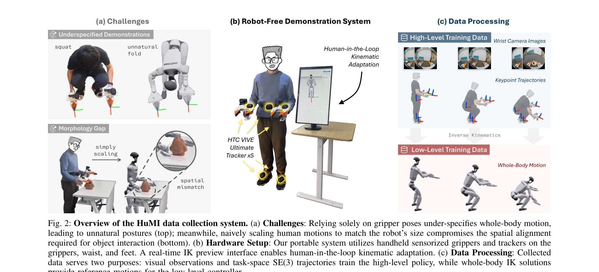

# Humanoid Manipulation Interface: Humanoid Whole-Body Manipulation from Robot-Free Demonstrations

> **저자**: Ruiqian Nai, Boyuan Zheng, Junming Zhao, Haodong Zhu, Sicong Dai, Zunhao Chen, Yihang Hu, Yingdong Hu, Tong Zhang, Chuan Wen, Yang Gao | **날짜**: 2026-02-12 | **DOI**: [10.48550/arXiv.2602.06643](https://doi.org/10.48550/arXiv.2602.06643)

---

## Essence

*Fig. 1: Humanoid Manipulation Interface (HuMI). Left: Our portable, robot-free data collection facilitates skill transfe*

HuMI는 휴대용 로봇 없는 데이터 수집 시스템과 계층적 학습 파이프라인을 통해 인간의 전신 조작 동작을 휴머노이드 로봇이 수행 가능한 기술로 변환하는 프레임워크이다.

## Motivation

- **Known**: 휴머노이드 로봇의 전신 조작은 원격조종이나 시뮬레이션 강화학습에 의존해왔으며, 이들 방식은 하드웨어 로직과 복잡한 보상 엔지니어링으로 인해 제한된 환경에서의 자율 기술만 달성 가능했다.
- **Gap**: 기존 로봇 없는 데이터 수집 시스템은 말단 집기기 궤적만 기록하므로 전신 조작 작업에서 필수적인 허리, 다리, 발의 움직임을 포착할 수 없으며, 인간과 로봇의 형태 차이로 인한 실행 가능성 격차와 추적 오차 문제를 해결하지 못한다.
- **Why**: 휴머노이드 로봇이 스쿼트, 무릎 꿇기, 던지기 등 다양한 전신 조작 작업을 미지의 환경에서 자율적으로 수행할 수 있다면 로봇의 실용적 가치가 크게 증대되며, 로봇 없는 효율적 데이터 수집은 개발 비용과 시간을 획기적으로 단축할 수 있다.
- **Approach**: HuMI는 HTC Vive 추적기를 이용한 5점 전신 추적 하드웨어, 실시간 IK 미리보기로 데모를 실행 가능하게 적응시키는 인간 루프 시스템, 그리고 Diffusion Policy 고수준 정책과 조작 중심 전신 컨트롤러로 구성된 계층적 학습 파이프라인을 통합한다.

## Achievement

*Fig. 2: Overview of the HuMI data collection system. (a) Challenges: Relying solely on gripper poses under-specifies who*

- **3배 높은 데이터 수집 효율성**: 원격조종 대비 3배 향상된 데이터 수집 처리량을 달성
- **미지 환경에서 70% 성공률**: 미학습 객체와 환경에서 5개 전신 작업(결혼 청혼, 스쿼트, 던지기, 칼 빼기, 테이블 청소)에서 70% 성공률 달성
- **휴대성과 효율성**: 전체 시스템이 백팩 하나에 들어가는 로봇 없는 휴대용 설계로 다양한 환경에서의 데이터 수집 가능
- **전신 협응 동작 지원**: 정밀한 양손 조작, 동적 움직임, 이동 기반의 다양한 조작 작업을 단일 프레임워크로 지원

## How

*Fig. 2: Overview of the HuMI data collection system. (a) Challenges: Relying solely on gripper poses under-specifies who*

- HTC Vive Ultimate Tracker 5개를 손목, 허리, 발에 부착하고 GoPro 카메라를 탑재한 그리퍼로 골반, 손, 발의 5개 주요 프레임 추적
- 실시간 IK 미리보기 인터페이스를 통해 데모 수집 중 인간 동작이 로봇에서 운동학적으로 실행 가능한지 시각화하고 조정
- Inverse Kinematics를 적용하여 그리퍼와 베이스, 발의 궤적을 전체 로봇 자유도로 확장
- Diffusion Policy를 사용한 고수준 정책이 카메라 관찰에서 목표 키포인트 궤적을 생성
- 조작 중심의 전신 컨트롤러가 고수준 정책의 목표 궤적을 로봇 관절각으로 추적하며, 액션 청킹 경계에서의 불연속성 완화를 위해 정책 인터페이스 재설계

## Originality

- 로봇 없는 전신 조작 시스템의 첫 구현: 기존의 말단 집기기 궤적만 기록하는 방식을 확장하여 골반과 발의 움직임까지 포착하는 5점 추적 구성
- 실시간 IK 미리보기 인터페이스를 통한 인간 루프 운동학적 적응: 데모 수집 단계에서 실행 가능성을 보장하는 혁신적 접근
- 조작 중심 전신 컨트롤러 설계: 기존의 일반적 궤적 추적 컨트롤러와 달리 조작 정밀도를 극대화하면서 안정성을 유지하도록 설계
- 계층적 제어와 정책 인터페이스 재설계: 액션 청킹 기반 정책에서 추적 오차로 인한 불연속성을 명시적으로 해결

## Limitation & Further Study

- 평가가 5개의 제한된 작업으로만 수행되었으며, 더 복잡하거나 정밀도가 높은 조작 작업으로의 확장 필요
- 70% 성공률은 미지 환경에서 여전히 30%의 실패율을 의미하며, 로봇의 실제 배포 단계까지는 추가 개선 필요
- HTC Vive 추적기의 오클루전 감도와 장시간 드리프트 문제에 대한 구체적 해결책이 제한적
- 인간 데모와 로봇 실행 간의 형태 차이 보정이 여전히 IK와 컨트롤러 오차에 의존하며, 더 강건한 적응 메커니즘 개발 필요
- 후속 연구로 다양한 로봇 플랫폼으로의 일반화, 더 정교한 동작 적응 방법, 시각-운동 통합을 위한 end-to-end 학습 방식 검토 필요

## Evaluation

- Novelty: 4/5
- Technical Soundness: 3/5
- Significance: 4/5
- Clarity: 4/5
- Overall: 4/5

**총평**: HuMI는 로봇 없는 효율적 데이터 수집과 계층적 학습을 결합하여 휴머노이드 로봇의 전신 조작을 현실적으로 구현한 혁신적 시스템이며, 3배의 수집 효율성과 70% 미지 환경 성공률은 실용적 가치를 입증한다.

## Related Papers

- 🔄 다른 접근: [[papers/1479_HumanoidExo_Scalable_Whole-Body_Humanoid_Manipulation_via_We/review]] — 둘 다 휴머노이드 조작 데이터 수집을 다루지만 HuMI는 로봇 없는 수집에, HumanoidExo는 외골격 기반 수집에 집중한다
- 🏛 기반 연구: [[papers/1336_DexHub_and_DART_Towards_Internet_Scale_Robot_Data_Collection/review]] — DexHub의 대규모 데이터 수집 개념이 HuMI의 휴대용 데이터 수집 시스템의 기반이 된다
- 🔗 후속 연구: [[papers/1484_HumanPlus_Humanoid_Shadowing_and_Imitation_from_Humans/review]] — HumanPlus의 인간 동작 학습을 로봇 없는 데이터 수집으로 확장했다
- 🔄 다른 접근: [[papers/1479_HumanoidExo_Scalable_Whole-Body_Humanoid_Manipulation_via_We/review]] — 둘 다 휴머노이드 조작 데이터 수집을 다루지만 HumanoidExo는 외골격 기반에, HuMI는 로봇 없는 수집에 집중한다
