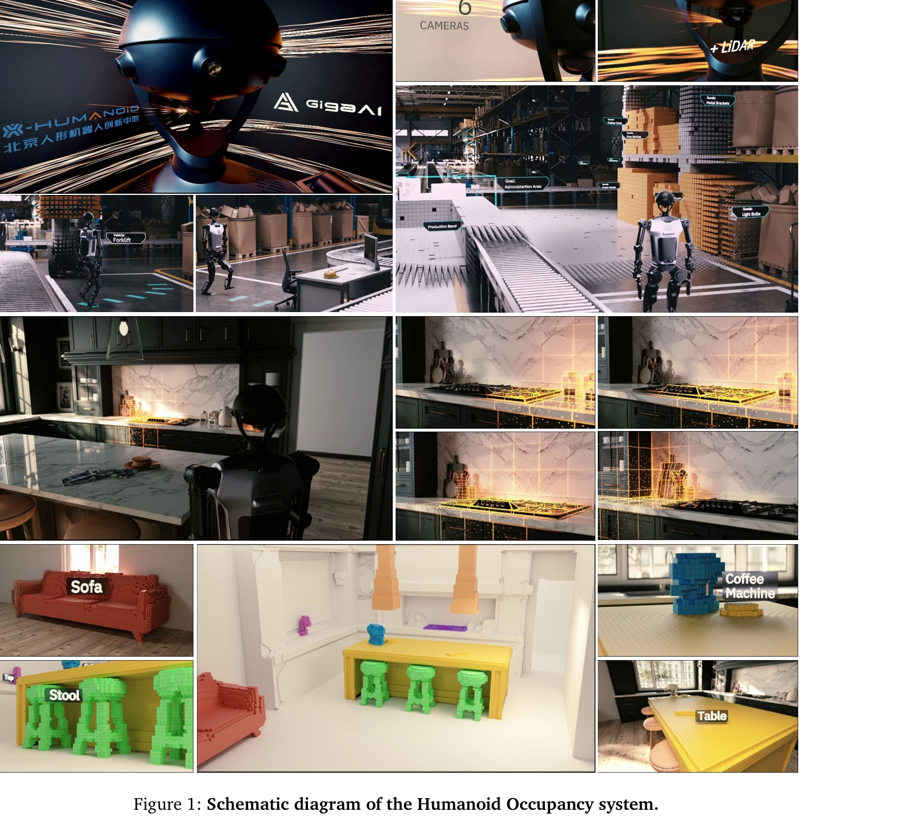
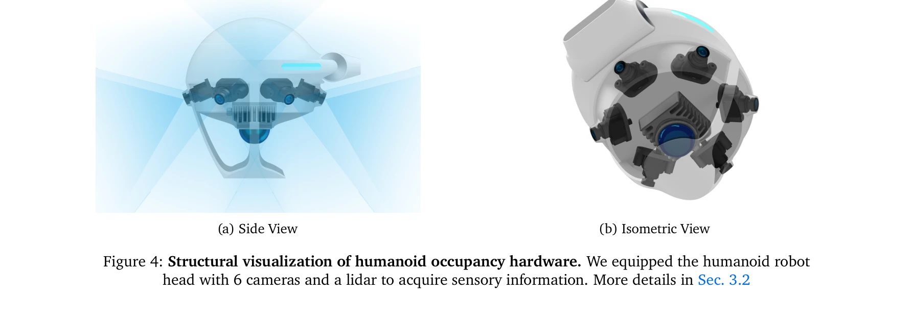
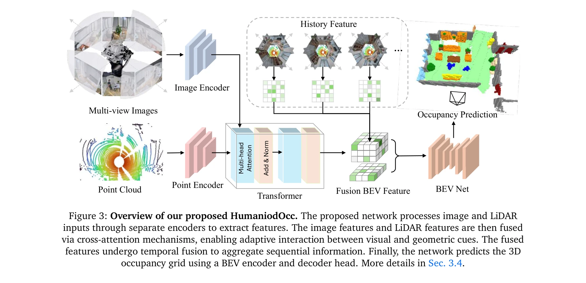

# Humanoid Occupancy: Enabling A Generalized Multimodal Occupancy Perception System on Humanoid Robots

> **저자**: Wei Cui, Haoyu Wang, Wenkang Qin, Yijie Guo, Gang Han, Wen Zhao, Jiahang Cao, Zhang Zhang, Jiaru Zhong, Jingkai Sun, Pihai Sun, Shuai Shi, Botuo Jiang, Jiahao Ma, Jiaxu Wang, Hao Cheng, Zhichao Liu, Yang Wang, Zheng Zhu, Guan Huang, Jian Tang, Qiang Zhang | **날짜**: 2025-07-27 | **URL**: [https://arxiv.org/abs/2507.20217](https://arxiv.org/abs/2507.20217)

---

## Essence

*Figure 1: Schematic diagram of the Humanoid Occupancy system.*

휴머노이드 로봇을 위한 일반화된 멀티모달 occupancy 인식 시스템을 제시하며, RGB, 깊이, LiDAR 등 다중 센서를 fusion하여 grid 기반의 점유 상태와 semantic 정보를 통합으로 제공한다.

## Motivation

- **Known**: 휴머노이드 로봇에는 조작, 보행, 네비게이션 등 다양한 작업이 요구되며, 기존의 단일 센서 또는 기본적인 vision 시스템으로는 복잡한 환경 인식에 부족하다는 것이 알려져 있다.
- **Gap**: 휴머노이드 로봇의 특수한 구조로 인한 kinematic interference와 occlusion 문제 해결, 대규모 다양한 데이터셋 수집 및 annotation, 그리고 visual system 설계의 일반화 및 표준화가 아직 미흡하다.
- **Why**: 효과적인 환경 인식은 복잡한 작업 수행의 기초이며, occupancy 기반 표현은 3D 기하 정보와 semantic 정보를 동시에 제공하여 navigation, task planning, obstacle avoidance 등 다양한 downstream task를 지원하기 때문에 중요하다.
- **Approach**: Hardware 설계, dataset 구성, multimodal fusion network로 구성된 표준 3단계 visual system 아키텍처를 채택하며, 휴머노이드 로봇 특화 센서 배치 전략을 제안하고 최초의 panoramic occupancy dataset을 구축한다.

## Achievement

*Figure 4: Structural visualization of humanoid occupancy hardware. We equipped the humanoid robot*

- **Humanoid Occupancy 시스템**: RGB, depth, LiDAR 등 다중 모달 센서를 통합하는 일반화된 occupancy 인식 시스템으로, grid 기반으로 점유 상태와 semantic 레이블을 동시에 인코딩
- **Panoramic occupancy dataset**: 휴머노이드 로봇을 위한 최초의 panoramic occupancy dataset 구축으로, 향후 연구의 벤치마크 및 자원 제공
- **Sensor layout strategy**: 휴머노이드 로봇의 kinematic interference와 occlusion 문제를 해결하는 혁신적인 센서 배치 전략 개발
- **Multi-modal fusion network**: Temporal information integration을 포함한 network 아키텍처로 robust perception 보장
- **실제 배포 검증**: Tienkung humanoid robot 플랫폼에 통합 및 테스트로 복잡한 환경에서의 superior perception과 navigation 성능 입증

## How

*Figure 3: Overview of our proposed HumaniodOcc. The proposed network processes image and LiDAR*

- Hardware 설계 단계: 휴머노이드 로봇의 구조적 특성을 고려한 multimodal 센서 배치 최적화
- Dataset 구성: Kinematic interference와 occlusion 문제를 반영한 대규모 panoramic occupancy dataset 수집 및 annotation
- Network architecture: Multi-modal feature fusion과 temporal information을 통합하는 deep learning 기반 fusion network 구축
- Occupancy 표현: Voxel 또는 grid 형식으로 점유 상태와 semantic 정보를 동시에 인코딩
- Downstream task 지원: Path planning, obstacle avoidance, manipulation 등 다양한 로봇 작업에 직접 활용 가능하도록 설계

## Originality

- 휴머노이드 로봇 특화 occupancy 시스템으로, 기존 자율주행이나 드론 분야의 방법을 휴머노이드 로봇의 unique한 structural characteristics에 맞게 재설계
- Kinematic interference와 occlusion 문제를 체계적으로 해결하는 센서 배치 전략 제시
- 최초의 panoramic occupancy dataset 구축으로 휴머노이드 로봇 인식 분야의 벤치마크 제공
- Occupancy를 core representation으로 선택하여 Bird's Eye View보다 superior한 3D 기하 및 semantic 정보 동시 제공

## Limitation & Further Study

- 논문은 주로 perception 성능에 초점을 맞추고 있으나, 실제 navigation과 manipulation task에서의 end-to-end 성능 평가 결과가 상세히 기술되지 않음
- Dataset의 규모, 환경 다양성, annotation consistency 등에 대한 정량적 분석 및 비교 부족
- 다른 perception 방법론(예: NeRF, 3DGS)과의 정량적 성능 비교 실험 미제시
- Real-time processing capability와 computational resource requirement에 대한 분석 필요
- 후속 연구: 다양한 휴머노이드 로봇 플랫폼에 대한 generalization 성능 검증, end-to-end navigation 성능 평가, dynamic obstacle 인식 능력 강화

## Evaluation

- Novelty: 4/5
- Technical Soundness: 3/5
- Significance: 4/5
- Clarity: 4/5
- Overall: 4/5

**총평**: 휴머노이드 로봇의 환경 인식을 위한 종합적이고 체계적인 system을 제시하며, 최초의 panoramic occupancy dataset 구축과 로봇 특화 센서 배치 전략을 통해 실질적인 기여를 한다. 다만 성능 평가의 구체성과 다양한 기준선과의 비교 실험이 보강될 필요가 있다.

## Related Papers

- 🏛 기반 연구: [[papers/1463_LOVON_Legged_Open-Vocabulary_Object_Navigator/review]] — 멀티모달 occupancy 인식이 legged 로봇의 객체 네비게이션에 필요한 기본적인 환경 이해 능력을 제공합니다.
- 🔗 후속 연구: [[papers/1319_BeliefMapNav_3D_Voxel-Based_Belief_Map_for_Zero-Shot_Object/review]] — 3D voxel 기반 belief map을 휴머노이드 로봇을 위한 일반화된 멀티모달 인식으로 확장한 발전된 형태입니다.
- 🧪 응용 사례: [[papers/1340_Context-Aware_Entity_Grounding_with_Open-Vocabulary_3D_Scene/review]] — 오픈 어휘 3D 장면 그래프가 멀티모달 occupancy 인식에서 의미론적 정보를 통합하는 데 활용됩니다.
- 🏛 기반 연구: [[papers/1485_Multimodal_Fusion_and_Vision-Language_Models_A_Survey_for_Ro/review]] — 로봇 비전을 위한 멀티모달 융합 기법이 occupancy 인식 시스템의 다중 센서 통합 방법론의 토대가 됩니다.
- 🏛 기반 연구: [[papers/1463_LOVON_Legged_Open-Vocabulary_Object_Navigator/review]] — 멀티모달 점유 인식 시스템이 legged 로봇의 환경 이해와 네비게이션을 위한 기본적인 인식 능력을 제공합니다.
- 🧪 응용 사례: [[papers/1485_Multimodal_Fusion_and_Vision-Language_Models_A_Survey_for_Ro/review]] — 로봇 비전을 위한 멀티모달 융합 기법의 체계적 분석이 휴머노이드 occupancy 인식 시스템 설계에 적용됩니다.
- 🔄 다른 접근: [[papers/1531_RLBench_The_Robot_Learning_Benchmark__Learning_Environment/review]] — ManiSkill3의 GPU 병렬화 시뮬레이션과 RLBench의 로봇 학습 환경은 모두 로봇 학습을 위한 서로 다른 시뮬레이션 플랫폼이다.
- 🧪 응용 사례: [[papers/1557_LiPS_Large-Scale_Humanoid_Robot_Reinforcement_Learning_with/review]] — LiPS의 병렬 시뮬레이션 최적화 기법이 대규모 로봇 시뮬레이션 ManiSkill3에서 실제 활용될 수 있다.
